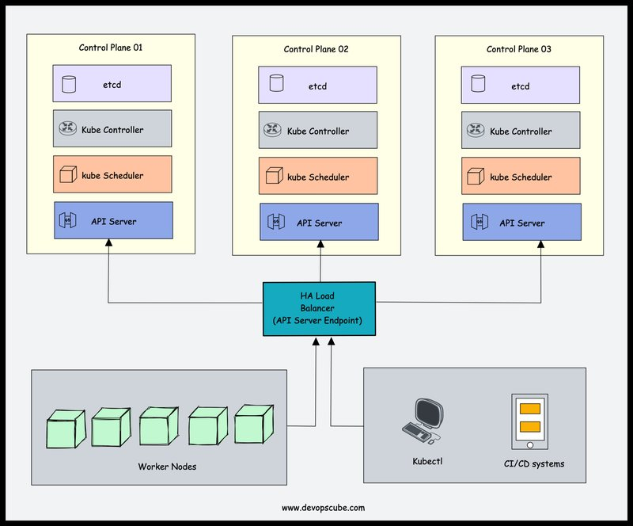

<small>【运维干货分享】如何学习kubernetes(附完整路线图及资源)</small>

学习kubernets或许在初学者看来是一件很难的事，它是一整套的容器编排系统，学习路线陡峭，但如果你脑海中有正确的学习线路以及基本概念，那不管是开发还是运维都可以学习。

本文介绍的kubernetes学习线路图，会有一些先决条件，然后是完整的学习路径，基本涵盖了从入门到初高级的kubernetes的概念。

# 学习kubernetes的先决条件

在开始学习kubernetes之前，有一些底层的技术和概念你需要有一定的了解

- 1.分布式系统：你需要了解分布式系统的基础知识，需要了解在现今IT领域的实际使用情况。如果能对CAP理论有一定的了解更好
- 2.身份验证及授权：这是在IT概念中非常基础的，初入门者需要了解
- 3.键值存储：这是一种nosql数据库，你需要了解足够的基础知识及使用情况
- 4.API：因为kubernetes是一个API驱动的系统，所以你需要了解restful API，另外对grpc api有一定的了解最好
- 5.yaml：这是一种数据序列化的语言，可以用于数据存储和配置文件，从kubernetes角度出发，整个体系的配置文件均为yaml格式，所以你需要掌握
- 6.container：容器是kubernetes最基础的一环，kubernetes就是一个容器的编排系统，所以需要学习kubernetes基础知识，有使用docker 的经验，最好去阅读了解下有关 Open container initiative 和容器运行时接口(CRI)
- 7.服务发现：它是kubernetes的关键领域之一，需要了解客户端和服务端服务发现的基础知识
- 8.网络基础：网络是kubernetes的关键，要了解kubernetes网络，需要了解如下关键点：
  - 1.CIDR表示法和IP地址类型
  - 2.OSI的L2、L3、L4、L7层
  - 3.SSL/TLS：单向和双向的TLS
  - 4.代理（proxy）
  - 5.DNS
  - 6.IPtables/IPVS
  - 7.SDN
  - 8.虚拟接口
  - 9.Overlay networking

# 学习kubernetes架构

深入了解kubernetes架构不是一件容易的事，在学习过程中，你会遇到很多前面聊到的基础概念。

kubernetes是一套复杂的系统，建议循序渐进，在实践中逐步掌握理解架构

对此，可以去参考之前的一篇文章：

但总结来讲，需要掌握如下几点内容:

- 1.了解控制平面组件：API server、etcd、kube-scheduler、kube-controller-manager
- 2.了解工作节点：kube proxy、kubelet、Container runtime
- 3.插件组件：coredns、网络插件
- 4.集群高可用
- 5.网络设计

# kubernetes集群设置

对于devops工程师来讲，了解集群的每个组件很重要，部署一套集群有很多方式，但还是建议从头开始学习部署多节点集群。

通过这样的实践，可以更充分的了解集群在安全、高可用性、扩展、网络等概念

如果你要部署一套集群，可以有如下几种方式：

- 1.艰难模式：可以更好的了解一些基础组件及所有配置，可以参考：github.com/kelseyhightower/kubernetes-the-hard-way
- 2.Kubeadm 集群设置：学习 kubeadm 集群设置可以帮助您准备 Kubernetes 认证。此外，它还可以帮助您通过最佳实践自动化 Kubernetes 集群设置。
- 3.Minikube：如果想要最小的开发集群设置，minikube 是最好的选择。
- 4.Kind：Kind 是另一个本地开发 Kubernetes 集群设置。

# 了解集群配置

如果你已经有了一套正常运行的集群，那么你可以去了解集群的关键配置了，在自托管的集群中，这些配置非常重要

即使你用的是托管集群，部分配置也是需要自行修改的

例如：如果你的集群是在混合网络中，可能需要为其配置本地私有 DNS 服务器以进行私有 DNS 解析。这可以通过 CoreDNS 配置来完成。

# 了解kubeconfig文件

kubeconfig是一个yaml文件，其实包含所有集群信息和连接到集群的凭据

作为 DevOps 工程师，您应该学习使用 Kubeconfig 文件以不同方式连接到 Kubernetes 集群。因为您将负责为 CI/CD 系统设置集群身份验证、为开发人员提供集群访问权限等。

因此，花一些时间，了解 Kubeconfig 文件结构和相关参数。

在后面的文章中，将会**更新关于kubeconfig的文件结构及相关参数**

# 了解kubernetes对象及资源

在kubernetes中会经常接触到Kubernetes Object 和 Kubernetes Resource

首先，您需要了解 Kubernetes 中对象和资源之间的区别。

简而言之，用户在 Kubernetes 中创建并保留的任何内容都是对象。例如，命名空间、Pod、部署配置映射、Secret 等。

在创建对象之前，您可以使用 YAML 或 JSON 格式表示它。它称为对象规范 (Spec)。您可以在对象规范上声明对象所需的状态。创建对象后，您可以使用 Kubectl 或客户端库从 Kubernetes API 检索其详细信息。

正如我们前面在先决条件部分中讨论的那样，Kubernetes 中的一切都是 API。为了创建不同的对象类型，Kubernetes API 服务器提供了 API 端点。这些特定于对象的 api 端点称为资源。例如，创建 Pod 的端点称为 Pod 资源。

因此，当您尝试使用 Kubectl 创建 Kubernetes 对象时，它会将 YAML 规范转换为 JSON 格式并将其发送到 Pod 资源（Pod API 端点）。

在后面的文章中，将会**更新关于Kubernetes 对象与资源指南详解**

# 了解pod及相关资源

了解 Kubernetes 对象和资源后，您可以从称为 Pod 的本机 Kubernetes 对象开始。 Pod 是 Kubernetes 的基本构建块。

您应该了解所有 Pod 概念及其关联对象，例如 Service、Ingress、Persistent Volume、Configmap 和 Secret。一旦了解了 Pod 的所有内容，就很容易学习其他依赖于 Pod 的对象，例如部署、Daemonset 等。

首先，了解 Pod 资源定义 (YAML)。典型的 Pod YAML 包含以下高级构造。

- Kind 种类
- Metadata 元数据
- Annotations 注释
- Labels 标签
- Selectors 选择器

后面的文章中，将会对pod进行详细介绍

以下是了解 Pod 及其关联对象的实践任务。

- 部署一个pod
- 在特定工作节点上部署pod
- 将服务添加到pod
- 使用nodeport公开pod服务
- 使用Ingress公开pod服务
- 设置pod资源和限制
- 使用startup, liveness, and readiness探针
- 将持久卷添加到 Pod
- 将 configmap 附加到 pod
- 将 Secret 添加到 Pod
- 多容器 Pod（边车容器模式）
- 初始化容器
- 临时容器
- 静态pod
- 了解 Pod 故障排除

关于pod调度概念

- Pod 抢占和优先级
- Pod 中断预算
- 使用节点选择器放置 Pod
- Pod 亲和性和反亲和性
- 容器生命周期挂钩

# 学习pod相关对象

现在您对Pod和独立的kubernetes资源有了更好的了解，您可以开始学习依赖于Pod对象的对象了。在学习这一点时，您将遇到 HPA（Horizo​​ntal Pod Autoscaling）和 VPA（Verification Pod Autoscaling）等概念

- Replicaset 复制集
- Deployment 部署
- Daemonsets 守护进程
- Statefulset 有状态集
- Jobs & Cronjobs  作业和定时作业

# 学习Ingress和Ingress控制器

为了向外界或最终用户公开应用程序，kubernetes 有一个名为 ingress 的本机对象。

由于对 Ingress 控制器了解较少，许多工程师对 Ingress 感到困惑。确保您了解 Ingress 和 Ingress 控制器的概念并正确理解。因为它是向外界公开应用程序的基础。

- Kubernetes Ingress 解释
- 设置 Nginx Ingress 入口控制器

后面会针对上述内容具体介绍

# 了解 Kubernetes 上的端到端微服务应用程序部署

一旦了解了这些对象的基础知识，您就可以尝试在 Kubernetes 上部署端到端微服务应用程序。从简单的用例开始，逐渐增加复杂性。

我建议您获取一个域名并尝试从头开始设置微服务应用程序并将其托管在您的域上。

您不需要为此开发应用程序。选择任何基于开源微服务的应用程序并进行部署。

以下是高级别任务。

- 为所有服务构建 Docker 镜像。确保优化 Dockerfile 以减小 Docker 映像大小。
- 为所有服务创建清单。 （Deployment, Statefulset, Services, Configmaps, Secrets 等）。尝试为每种对象类型添加所有支持的参数。
- 使用服务类型 ClusterIp 公开前端
- 部署 Nginx Ingress 控制器并使用服务类型 Loadbalancer 公开它。
- 创建一个Ingress对象，以前端作为后端服务。
- 将负载均衡器IP映射到域名。
- 创建一个入口对象，其名称为 DNS 名称，后端为前端服务名称。
- 验证应用程序。

# 了解如何保护kubernetes集群

安全性是 Kubernetes 的一个关键方面。从构建安全的容器镜像开始，可以通过多种方法在 Kubernetes 中实施安全最佳实践。

遵循在 Kubernetes 中实现安全性的本机方法。

- Service account 
- 安全上下文
- eccomp 和 AppArmor
- 基于角色的访问控制 (RBAC)
- 基于属性的访问控制 (ABAC)
- 网络政策

# 了解 Kubernetes 配置管理工具
现在您已经很好地了解了所有 Kubernetes 对象以及在 Kubernetes 上部署应用程序，您可以开始学习 Kubernetes 配置管理工具了。

当您开始在组织中处理实时项目时，您将看到使用配置管理工具在 Kubernetes 上部署应用程序。

因为在组织中，有不同的环境，如开发、阶段、预生产和生产。您无法为每个环境创建单独的 YAML 文件并手动管理它们。因此，您需要一个系统来有效管理 Kubernetes YAML 配置。

以下是流行且广泛采用的 Kubernetes 工具来管理 YAML。

- helm
- Kuztomize

# 了解 Kubernetes Operator

要了解Operator，首先需要了解以下 Kubernetes 概念。

- 自定义资源定义
- 准入控制器
- 验证和修改 Webhook

要开始使用operator，您可以尝试在 Kubernetes 上设置以下operator。

- Prometheus Operator 
- MySQL Operator 

如果您是 Go 开发人员或者您想学习扩展/定制 Kubernetes，我建议您使用 Golang 创建自己的operator。

# 了解重要的 Kubernetes 配置

在学习 Kubernetes 时，您可能会在开放网络连接中使用集群。
所以大多数任务都可以毫无问题地执行。然而，在企业网络上设置的集群则并非如此。
因此，以下是您应该注意的一些自定义集群配置

- 自定义 DNS 服务器
- 自定义镜像注册表
- 将日志发送到外部日志系统
- Kubernetes OpenID 连接
- 隔离和保护 PCI 和 PII 工作负载的节点

# 学习 Kubernetes 最佳实践

以下资源可能会在最佳实践方面为 Kubernetes 学习过程提供帮助并为其增加价值。

12 Factor Apps：这是一种讨论如何编码、部署和维护基于微服务的现代应用程序的方法。由于 Kubernetes 是一个云原生的微服务平台，因此它是 DevOps 工程师必须了解的概念。因此，当您从事实时 kubernetes 项目时，您可以实施这些 12 要素原则。

Kubernetes Failure Stories：Kubernetes Failure Stories是一个网站，其中包含讨论 Kubernetes 实施中的失败的文章列表。如果您阅读这些故事，您就可以在 Kubernetes 实现中避免这些错误。

来自组织的案例研究：花时间研究组织发布的有关 Kubernetes 使用和扩展的用例。你可以从他们身上学到很多东西。以下是一些值得一读的案例研究。
    - 每天在生产中调度 300,000 个 Kubernetes Pod
    - 将 Kubernetes 扩展到 7,500 个节点

# 在线学习 Kubernetes 的最佳资源

## 官方 Kubernetes 基础教程

Kubernetes 官方网站提供了由 Katacoda 场景支持的基于浏览器的 kubernetes 实践基础教程。它涵盖以下内容。

- Kubernetes 基础知识

- Kubernetes 配置

- 无状态应用部署

- 有状态应用程序部署
- Kubernetes services 
- Kubernetes Security 

您还可以查看官方 Kubernetes 任务来学习实际实现 Kubernetes 概念。它还将帮助您准备 Kubernetes 认证。

## DevOpsCube Kubernetes 教程

DevOpsCube 为初学者和高级用户提供了超过 35 个全面的 Kubernetes 实践教程。您将从 Kubernetes 架构、集群设置、部署、最佳实践、包管理、秘密管理、监控、日志记录等学习所有内容。

## KillerCoda互动教程

如果您想通过浏览器舒适地学习 Kubernetes，Killercoda 是一个不错的选择。它在浏览器上提供基于场景的学习游乐场。

# Kubernetes 学习 GitHub 存储库

>github.com/techiescamp/kubernetes-learning-path

# 学习 Kubernetes 的最佳方式是什么？

- 自学：如果您是自学者，您可以从路线图开始，针对每个主题进行进一步的研究，并从博客、官方文档、免费视频中学习。
- 指导学习（文本）：如果您喜欢阅读指导材料，那么学习 kubernetes 的最佳位置就是从一本 kubernetes 初学者书籍开始。我的建议是“Kubernetes 启动并运行”，然后是“Kubernetes 实践”。您还可以尝试 Kubernetes 教育课程。

# 真实生产案例

当我与 DevOps 社区交谈时，我发现一个常见问题是缺乏 Kubernetes 的实际经验。如果您的组织中没有活跃的 Kubernetes 项目，您可以参考使用 Kubernetes 的组织发布的案例研究和学习材料。这也会对你在 Kubernetes 面试中有所帮助。

以下是一些很好的现实世界 Kubernetes 案例研究，可以增强您的 Kubernetes 知识：

- k8s用户案例研究列表（kubernetes.io/case-studies/）
- OpenAI 如何将 Kubernetes 扩展到 7,500 个节点（openai.com/blog/scaling-kubernetes-to-7500-nodes/）
- 每个节点测试 500 个 Pod （cloud.redhat.com/blog/500_pods_per_node）
- Airbnb 的动态 Kubernetes 集群扩展（medium.com/airbnb-engineering/dynamic-kubernetes-cluster-scaling-at-airbnb-d79ae3afa132）
- 在 Amazon EKS 上将 100 个 Pod 扩展到 10,000 个 （aws.amazon.com/blogs/containers/scale-from-100-to-10000-pods-on-amazon-eks）

# 最新 Kubernetes 版本的新增功能

在学习 Kubernetes 时，最好跟踪最新的 Kubernetes 版本和新功能。

