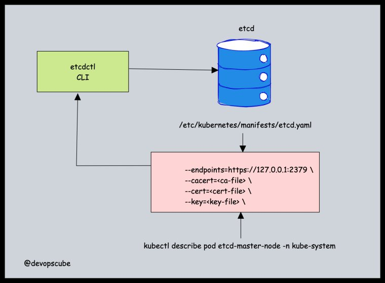
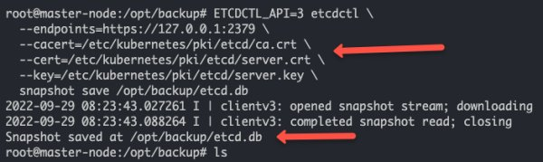

<small>【运维干货分享】Kubernetes 集群上的 etcd 备份和恢复</small>


本篇文章中，主要介绍使用 etcd 快照在 Kubernetes 集群上进行 etcd 备份和恢复。

在 Kubernetes 架构中，etcd 是集群不可或缺的一部分。所有集群对象及其状态都存储在 etcd 中。从 Kubernetes 的角度来看，你应该了解的关于 etcd 的几件事。

- 1. 它是一个一致的、分布式的、安全的键值存储。
- 2. 它使用 raft 协议。
- 3. 支持具有堆栈 etcd 的高可用性架构。
- 4. 它存储 kubernetes 集群配置、所有 API 对象、对象状态和服务发现详细信息。

如果你想了解更多关于 etcd 以及 kubernetes 如何使用它的信息，可以去看下之前介绍的k8s架构文章[1.Kubernetes 架构解释](https://mp.weixin.qq.com/s?__biz=MzU4MjY3Mzc3OQ==&mid=2247492422&idx=1&sn=8ab08e5567a649ce5942048a9749160b&chksm=fdb6175acac19e4c5973482203c39f88afb9dd0eb21e3c5f43607c024f6a573d1cb80ba2f52f&token=316445105&lang=zh_CN#rd)
。

此外，如果您考虑 Kubernetes 设计最佳实践，Kubernetes etcd 备份和恢复是备份策略下的重要方面之一。

## Kubernetes etcd 使用 etcdctl 进行备份

以下是应该了解的有关 etcd 备份的信息。

- 1. etcd 具有内置的快照机制。

- 2. etcdctl是与 etcd 交互以获取快照的命令行实用程序。



按照下面给出的步骤获取etcd 快照。

步骤1：登录控制平面。

步骤2：如果您的集群控制平面中没有 etcdctl，请使用以下命令进行安装。

```
sudo apt install etcd-client
```

步骤3：我们需要将以下三条信息传递给 etcd 快照。etcdctl

- 1. etcd 端点 （–端点）
- 2. CA 证书 （–CACERT）
- 3. 服务器证书 （–cert）
- 4. 服务器密钥 （–key）

可以通过两种方式获取上述详细信息。

从位于该位置的 etcd 静态 pod 清单文件。/etc/kubernetes/manifests/etcd.yaml


也可以通过描述在命名空间中运行的 etcd pod 来获取上述详细信息。在描述 pod 时，请替换为您的 etcd pod 名称。kube-systemetcd-master-node

kubectl get po -n kube-system

kubectl describe pod etcd-master-node -n kube-system

步骤4： 使用以下命令进行 etcd 快照备份。

```
ETCDCTL_API=3 etcdctl \
  --endpoints=https://127.0.0.1:2379 \
  --cacert=<ca-file> \
  --cert=<cert-file> \
  --key=<key-file> \
  snapshot save <backup-file-location>
```

添加实际位置和参数时，该命令如下所示。执行命令以执行备份。可以替换为您选择的位置和名称。 /opt/backup/etcd.db

```
ETCDCTL_API=3 etcdctl \
  --endpoints=https://127.0.0.1:2379 \
  --cacert=/etc/kubernetes/pki/etcd/ca.crt \
  --cert=/etc/kubernetes/pki/etcd/server.crt \
  --key=/etc/kubernetes/pki/etcd/server.key \
  snapshot save /opt/backup/etcd.db
```

成功执行后，您将收到“Snapshot saved at /opt/backup/etcd.db”消息，如下所示。




此外，您还可以使用以下命令验证快照。
```
ETCDCTL_API=3 etcdctl --write-out=table snapshot status /opt/backup/etcd.db
```

下面是一个示例输出。


|   HASH   | REVISION | TOTAL KEYS | TOTAL SIZE |
|----------|----------|------------|------------|
| b7147656 |    51465 |       1099 |     5.1 MB |


## Kubernetes etcd 使用 Snapshot Backup 进行还原

现在，我们在该位置有了备份。我们将使用快照备份来恢复 etcd。

/opt/backup/etcd.db

这是恢复 etcd 的命令。

```
ETCDCTL_API=3 etcdctl snapshot restore <backup-file-location>
```

让我们执行 etcd restore 命令。


```
ETCDCTL_API=3 etcdctl snapshot restore /opt/backup/etcd.db
```

如果要使用特定数据目录进行还原，可以使用如下所示的标志添加位置。--data-dir

```
ETCDCTL_API=3 etcdctl --data-dir /opt/etcd snapshot restore /opt/backup/etcd.db
```
## etcd 备份常见问题

###  如何在 Kubernetes 中进行 etcd 备份？

要进行 etcd 备份，您需要使用 etcdctl 命令行实用程序。您需要使用 etcdctl snapshot 命令和 etcd 证书来执行备份操作。

## 结论
在这篇博客中，我们学习了使用命令行工具进行 Kubernetes etcd 备份和恢复。

etcd 备份和恢复是 Kubernetes 集群管理中的基本任务。此外，它是 CKA 认证考试中的一个重要主题。