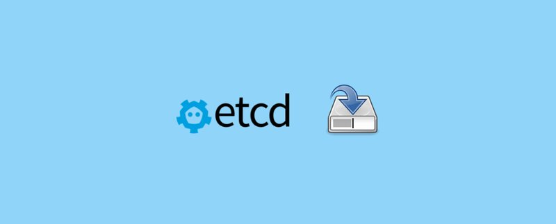

<small>Kubernetes 高可用性</small>

在本篇文章中，我们聊下Kubernetes高可用性。

主要讨论每个 Kubernetes 组件的弹性和容错能力。

## 对 Kubernetes 高可用性的需求

Kubernetes 是一个分布式系统，它容易受到多种故障的影响。

对于组织来说，拥有高可用性的 Kubernetes 以提供良好的客户体验至关重要。

在发生意外中断的情况下，如果您的集群在一个或多个组件发生故障后仍无法继续运行，则停机时间可能会导致收入损失、声誉问题等。

通过在 Kubernetes 中实施 HA，可以降低停机风险，在集群上运行的应用程序和服务保持可用且可供用户访问，并且系统可以在无需人工干预的情况下快速从故障中恢复。

概括地说，这可以通过部署控制平面组件的多个副本来实现，这些副本具有跨多个可用性区域或区域的网络拓扑。

## Kubernetes 控制平面的高可用性

Kubernetes 控制平面包含以下核心组件。

- 1. API 服务器
- 2. Kube 控制器管理器
- 3. Kube 调度器

运行单个节点控制平面可能会导致所有控制平面组件的单点故障。要拥有高可用性的 Kubernetes 控制平面，您至少应有三个 quoram 控制平面节点，并在所有三个节点之间复制控制平面组件。

现在，了解每个控制平面组件在跨节点部署为多个副本时的性质非常重要。因为在部署为多个副本时，很少有组件使用 leader-election。

让我们看一下每个控制平面组件的高可用性。

## etcd

当涉及到 etcd HA 架构时，有两种模式。

堆叠 etcd：etcd 与控制平面节点一起部署

外部 etcd 集群：运行专用节点的 etcd 集群。此模型的优点是管理良好的备份和还原选项。

为了具有容错能力，您至少应该有一个三个节点的 etcd 集群。etcd 集群的容错能力如下表所示。

|集群大小 |大多数|容错|
|-----|----|----|
|1|	1|	0
|2|	2|	0
|3|	2|	1
|4|	3|	1
|5|	3|	2
|6|	4|	2
|7|	4|	3

### etcd 容错

当涉及到生产部署时，定期备份etcd是必不可少的

## Api 服务器

API 服务器是一个无状态应用程序，主要与 etcd 集互以存储和检索数据。这意味着 API 服务器的多个实例可以在不同的控制平面节点上运行。

为确保集群 API 始终可用，应将负载均衡器放置在 API 服务器副本的前面。工作器节点、最终用户和外部系统使用此负载均衡器端点与集群进行交互。

## Kube 调度器

当你运行 kube 调度器的多个实例时，它遵循 leader-election 方法。这是因为，schedler 组件涉及 pod 调度活动，一次只有一个实例可以做出决策。因此，当您运行调度程序的多个副本时，一个实例将被选为领导者，而其他实例将被标记为追随者。

这确保了始终有一个活动的调度程序，用于做出调度决策，并避免冲突和不一致。如果是领导者，则追随者将被选为领导者并接管所有调度决策。这样，您就拥有了一个具有一致计时的高可用性调度程序。

## Kube 控制器管理器

Kube 控制器管理器也遵循相同的领导者选举方法。在许多副本中，将选出一个控制器经理，并将领导者和其他控制器标记为追随者。主控制器负责控制集群的状态。

## 工作器节点的高可用性

为了实现工作节点的高可用性，您需要运行应用程序所需的多个工作节点。当发生 Pod 缩放活动或节点故障时，其他工作节点上应该有足够的容量来调度 Pod。

在云平台上，您可以使用自动缩放来扩展工作器节点。因此，当存在扩展活动或资源需求时，工作节点可以扩展到所需的容量。

## Kubernetes 集群可用性测量

假设没有计划内停机时间，以下表格来自 Google SRE 书籍，显示了根据不同的可用性级别计算允许的停机时间

每个组织都有用于群集可用性的 SLO。如果您使用管理服务，则服务提供商将具有与 SLO 一致的 SLA

## Kubernetes 可用性常见问题解答

### 控制平面故障期间会发生什么情况？

即使在控制平面发生故障的情况下，工作器节点上的现有工作负载也会继续为请求提供服务器服务。但是，如果出现节点故障，则不会发生 Pod 调度活动或任何类型的更新活动

### 如果 Kubernetes 集群中的 DNS 服务失败，会发生什么情况？

如果像核心DNS这样的DNS服务失败，它可能会对集群中运行的应用程序的可用性和功能产生重大影响。它可能会中断服务发现、外部访问、负载均衡、监控和日志记录以及滚动更新，从而导致应用程序故障、错误和中断。

>翻译自：https://devopscube.com/kubernetes-high-availability/