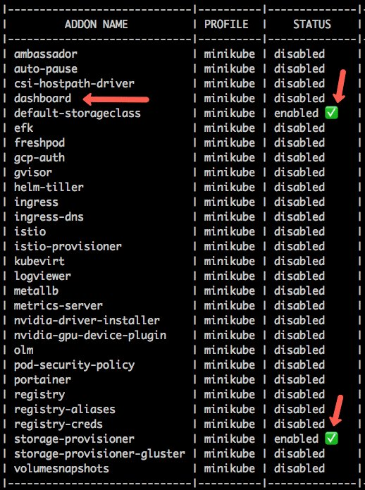

<small>【运维干货分享】如何安装minikube之初学者教程</small>

在这个 Kubernetes Minikube 教程中，将介绍初学者安装 minikube 并开始所有涉及的配置所需的步骤。

我们已经转换了从安装和配置到部署本地开发集群的所有内容，其中包含部署和测试应用程序所需的每个配置。

关于Minikube
Minikube 是一个轻量级的 kubernetes 集群设置，可用于在 Kubernetes 上开发和测试应用程序。您可以使用 Minikube 创建单节点和多节点集群。


## 关于Minikube

Minikube 是一个轻量级的 kubernetes 集群设置，可用于在 Kubernetes 上开发和测试应用程序。您可以使用 Minikube 创建单节点和多节点集群。

如果您想在工作站中设置 Kubernetes 集群，Mikube 是最简单的方法之一。此外，使用附加组件，您可以扩展它以获得高级功能。


## Minikube 先决条件

以下是 Minikube 正常工作的先决条件。

2 个或更多 CPU

2GB 可用内存

20GB 可用磁盘空间

良好的互联网连接

容器或虚拟机管理器，例如 Docker、Hyperkit、Hyper-V、KVM、Parallels、Podman、VirtualBox 或 VMWare。在开始安装 Minikube 之前，请确保先安装任何工具。

注意：我建议安装 Virtualbox 作为后端 minikube 驱动程序。它可以正常工作。

MAC M1/M2 用户可以使用 qemu 模拟器，因为 ARM64 处理器有问题。

## 安装 MiniKube

Minikube 的安装非常简单。您只需要下载该包。它是一个可执行的二进制文件，这就是您所需要的全部。

首先，转到 https://minikube.sigs.k8s.io/docs/start/ 并选择适当的操作系统和其他特定于操作系统的参数。您将获得特定操作系统的安装命令，如下所示。


minikube 安装
例如，如果您选择了MAC二进制下载，那么Minikube的安装就非常简单。

```
curl -LO https://storage.googleapis.com/minikube/releases/latest/minikube-darwin-amd64
sudo install minikube-darwin-amd64 /usr/local/bin/minikube
```

通过检查 minikube 版本来验证安装。

```
minikube version
```

使用 virtualbox/qemu/docker 启动 minikube

我个人更喜欢 Virtualbox，因为我使用 Vagrant 将其用于其他测试目的。

如果您使用 Docker 驱动程序，Nodeport 将无法正常工作。

您可以安装 Virtualbox 并使用 Virtualbox 驱动程序启动 minikube。如果您使用 Virtualbox 驱动程序，NodePort 服务不会有任何问题。

```
minikube start --driver=virtualbox
```

对于Docker用户，

```
minikube start -p dev --container-runtime=docker --vm=true
```

对于Qemu用户。

```
minikube start --driver=qemu
```

在这里，我们特别提到 –driver=virtualbox，因为默认情况下，如果您的系统上安装了 Docker，它会选择 Docker 驱动程序。如果您没有 Docker 而只有 Virtualbox，minikube 默认会选择 Virtualbox 驱动程序。

如果要安装特定的 kubernetes 版本，请使用如下所示的版本标志。

```
minikube start --kubernetes-version=1.28.0 --driver=virtualbox
```

如果您是第一次运行，Minikube 将下载基础 VM 镜像以在 Virtualbox 上部署 kubernetes。minikube 需要几分钟才能启动。成功执行后，您将看到以下消息。


使用 VirtualBox 驱动程序启动 Minikube

要进行验证，请执行以下状态命令。

```
minikube status
```

您应看到以下输出。

```
minikube
type: Control Plane
host: Running
kubelet: Running
apiserver: Running
kubeconfig: Configured
```

您可以使用配置文件拥有多个 minikube 集群。我已经在文章末尾介绍了配置文件。

## Minikube 引用清单

本指南中使用的所有 Kubernetes 清单都托管在 Github 上。您可以克隆存储库并使用它，也可以直接使用下面指南中给出的 URL 进行部署。

git clone https://github.com/techiescamp/minikube

## 在 Minikube 上部署应用程序

首先，让我们部署一个示例 Nginx 应用。以下是该清单包含的内容。

带有自定义 nginx html 的 configmap

### Nginx 部署

具有 32000 节点端口的服务

注意：请确保已安装 kubectl。如果没有，请按照 Kubectl 安装指南进行操作

让我们使用直接 git 原始 URL 部署清单。它部署在默认命名空间中。

```
kubectl apply -f https://raw.githubusercontent.com/scriptcamp/minikube/main/nginx.yaml
```

### 获取部署状态

```
kubectl get deployments
```

获取服务。您应该能够看到nginx-service

```
kubectl get service
```

### 获取 Minikube IP 和服务端点

要获取 minikube 的节点 IP，请执行以下命令。您可以使用 IP 访问 nodePorts。

```
minikube ip
```

例如

http://192.168.99.100:32000

您也可以直接使用以下 minikube 命令获取服务端点。

```
minikube service list
```

要获取特定服务的 URL，请执行以下操作：

```
minikube service --url <service-name>
```

### 在 Minikube 上访问 Nodeport

使用 minikube，您可以直接使用服务名称通过 NodePort 获取服务端点。执行以下命令以获取具有分配的 NodePort 的全方位服务 URL。这里nginx-service是nginx的服务名称

```
minikube service nginx-service --url
```

## 在 Minikube 上创建持久卷

您可以在 minikube 集群中创建持久卷。如果任何应用程序需要持久卷，则可以使用主机路径类型。

下面是一个示例。

```
apiVersion: v1
kind: PersistentVolume
metadata:
  name: pv0001
spec:
  accessModes:
    - ReadWriteOnce
  capacity:
    storage: 5Gi
  hostPath:
    path: /data/pv0001/
```
您可以尝试直接使用 GitHub 清单创建持久性卷。

```
kubectl apply -f https://github.com/scriptcamp/minikube/edit/main/pv.yaml
kubectl get pv
```

## 在 Minikube 上创建动态卷

安装 Minikube 时，会为动态配置创建一个名为 standard 的默认存储类。在部署 Statefulset 应用程序时，主要需要动态卷配置。

Minikube 使用 provisioner：k8s.io/minikube-hostpath provisioner 来存储动态持久卷。这实际上在hostpath下创建了一个挂载。

这是一个 PVC 清单示例，您可以将其与 minikube 一起使用。

```
kind: PersistentVolumeClaim
apiVersion: v1
metadata:
  name: dynamic-volume
spec:
  accessModes:
    - ReadWriteOnce
  resources:
    requests:
      storage: 1Gi
```

让我们尝试直接从 Github 文件使用清单创建 PVC。

```
kubectl apply -f https://raw.githubusercontent.com/scriptcamp/minikube/main/pvc.yaml
```

列出 pvc

```
kubectl get pvc
```

您可以查看 kubernetes postgreSQL statefulset 指南，在 Minikube 上部署 Statefulset。

## Minikube 插件

有一些高级 Kubernetes 功能可以作为 minikube 插件使用。例如，Kubernetes 仪表板和指标服务器不是 Minikube 安装的默认设置。但它可以作为 minikube 插件使用。另外，如果你想把一个自定义的docker注册表添加到minikube，你必须安装插件并配置它。registry-creds

默认情况下，仅安装存储类附加组件。

您可以使用以下命令列出所有可用的附加组件。

```
minikube addons list
```


您可以使用启用标志从列表中启用插件。

例如，我将启用两个附加组件。Kubernetes 仪表板和 kubernetes 指标服务器。
```
minikube addons enable dashboard
minikube addons enable metrics-server
```
访问 Minikube Kubernetes 仪表板
启用仪表板插件后，您可以使用 minikube 命令访问 Kubernetes 仪表板。

以下命令将直接在浏览器中打开 Kubernetes 仪表板。

```
minikube dashboard
```

如果您只需要仪表板 URL，请执行以下命令。它将启动代理并在输出中显示 Kubernetes 仪表板 URL。
```
minikube dashboard --url
minikube dashboard url output
```
您可以从浏览器访问仪表板，如下所示。
```
minikube kubernetes dashboard
```
## Minikube 自定义 CPU 和内存

默认情况下，Minukube 分配 2 个 vCPU 和 2048 个内存。通常，我们需要比 minikube 设置的默认值额外的 CPU 和内存。要覆盖默认的 CPU 和内存限制，您可以明确指定自定义 CPU 和内存限制，如下所示。
```
minikube start --driver=virtualbox --memory 3000 --cpus 2
```
如果要更改现有 minikube 的 CPU 和内存，请使用自定义 CPU 和内存值执行以下命令。
```
minikube stop
minikube config set memory 2500
minikube config set cpus 2
minikube start
```
注意：它不适用于所有驱动程序。很少有像 Virturalbox 这样的驱动程序需要在增加 CPU 和内存之前删除。

## 使用配置文件运行多个 Minikube 集群

您可以使用 minikube 配置文件在工作站中拥有多个 minikube 集群实例。例如，您可能希望在工作站中运行两个不同版本的 Kubernetes 集群。

要创建具有配置文件的集群，您只需创建带有配置文件标志和配置文件名称的集群。

例如，以下命令创建一个具有配置文件名称的 minikube 集群。dev


```
minikube start -p dev
```

您可以使用 list 命令列出所有配置文件。
```
minikube profile list
```
您应该得到一个包含所有 minikube 配置文件的输出，其中包含节点 IP、驱动程序、运行时、状态等信息。


您可以使用以下命令删除 minikube 配置文件。它将删除与配置文件相关的所有配置。

```
minikube delete -p stage
```

## 在 Minikube 配置文件之间切换
如果您有多个活动的 minikube 配置文件，则可以在配置文件之间切换或使用 minikube 命令设置默认配置文件。

例如，要切换到 dev 配置文件，请执行以下命令。它自动将 kubectl 上下文切换到 dev 集群。
```
minikube profile dev

```
要确定当前配置文件，只需运行以下命令。
```
minikube profile
```
如果未设置配置文件，可能会收到以下错误。
```
Profile "minikube" not found. Run "minikube profile list" to view all profiles
```
您可以设置配置文件或将配置文件标志与所有 minikube 命令一起传递。

例如
```
minikube service list -p dev
```
## 运行多节点 Minikube 集群
您可以使用 Minkube 运行多节点集群。您所要做的就是传递一个具有所需节点数的标志。--nodes

例如，要启动一个 2 节点的 minikube 集群，
```
minikube start --nodes 2 
```
您可以使用以下命令检查节点状态。
```
minikube status
```
## 访问 Minikube 节点 （SSH）
如果您想访问 minikube 节点以检查 Kubernetes 配置或进行拒绝，您可以使用以下命令通过 ssh 连接到该节点。
```
minikube ssh 
```
要打开节点内的任何文件，请使用 。

sudo

如果你有多个 minikube 节点，可以使用特定的节点来 ssh。首先，您需要使用 kubectl 列出可用节点。
```
kubectl get nodes

```
然后使用节点名称，如下所示。
```
minikube ssh -n worker-01
```
## 在 Minikube 中启用功能门
如果您想尝试添加到新 Kubernetes 版本中的 alpha 和 beta 功能，您可以在 MInikube 中使用功能门选项。

例如，有一个名为 SidecarContainers 的功能门控，要启用它，请在安装 minikube 时启用它
```
minikube start -p test --kubernetes-version=v1.28.0 --feature-gates=SidecarContainers=true
```

您可以在此处查看所有可用的功能门的列表。

## Minikube 备择方案
以下是一些用于设置本地 Kubernetes 的开源 minikube 替代方案。一定要试一试。
```
kind：https://kind.sigs.k8s.io/
K3S：https://github.com/k3s-io/k3s
Autok3s：https://github.com/cnrancher/autok3s
K0s：https://github.com/k0sproject/k0s
MicroK8s：https://github.com/ubuntu/microk8s
```

但只有 Minkube 支持与 Hyperkit、Hyper-V、KVM、Parallels、Podman、VirtualBox 或 VMWare 一起使用的选项。

## Minikube 常见问题

### minikube是做什么用的？
Minikube 是一个本地 kubernetes 设置，主要用于开发和测试目的。它是一种轻量级设置，可与 Docker、Virtualbox 等工具配合使用。

### 如何查看 minikube 仪表板？
要访问 minikube 仪表板，您需要启用 minikube 仪表板插件。然后，您可以使用 minikube 命令从浏览器访问仪表板。

### 如何在 minikube 中部署应用程序？
您可以使用 kubectl 在 minikube 中部署应用程序，就像在任何 Kubernetes 集群中部署应用程序一样。

### Minikube 可以在一个工作站中有多个集群吗？
是的。使用 minikube 配置文件，您可以在单个工作站中运行 minikube 集群实例的多个实例。

### 如何在 Minikube 中使用自定义 Docker 注册表？
如果您在公司网络上，则可能需要使用带有 minikube 的私有 docker 注册表。要使用自定义私有 docker 注册表，您应该安装 registry-creds Minikube 插件并配置注册表详细信息。

## 结论
在这个 kubernetes minikube 教程中，我介绍了 minikube 安装和配置设置步骤，以部署和访问应用程序。

>翻译自：https://devopscube.com/kubernetes-minikube-tutorial/