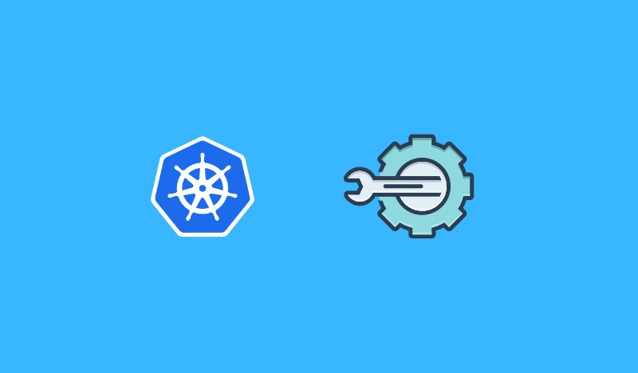

<small>【运维干货分享】Kubeconfig配置文件详解</small>

在这篇博客中，将学习如何使用不同的方法使用 Kubeconfig 文件连接到 kubernetes 集群。此外，您还将学习如何生成自定义 Kubeconfig 文件。


## 什么是 Kubeconfig 文件？

Kubeconfig 是一个 YAML 文件，其中包含所有 Kubernetes 集群详细信息、证书和秘密令牌，用于对集群进行身份验证。

如果使用的是托管的 Kubernetes 集群，则可以直接从集群管理员处获取此配置文件，也可以从云平台获取此配置文件。

当使用时，它会使用 kubeconfig 文件中的信息连接到 kubernetes 集群 API。Kubeconfig 文件的默认位置是kubectl$HOME/.kube/config

此外，控制器管理器、调度器和 kubelet 等 kubernetes 集群组件使用 kubeconfig 文件与 API 服务器进行交互。



## Kubeconfig 文件示例

下面是一个 Kubeconfig 示例。它需要以下关键信息才能连接到 Kubernetes 集群。

- certificate-authority-data：集群 CA
- server：集群端点（主节点的 IP/DNS）
- name：集群名称
- user：用户/服务帐户的名称。
- token：用户/服务帐户的秘密令牌。

```
apiVersion: v1
clusters:
- cluster:
    certificate-authority-data: <ca-data-here>
    server: https://your-k8s-cluster.com
  name: <cluster-name>
contexts:
- context:
    cluster:  <cluster-name>
    user:  <cluster-name-user>
  name:  <cluster-name>
current-context:  <cluster-name>
kind: Config
preferences: {}
users:
- name:  <cluster-name-user>
  user:
    token: <secret-token-here>
```

## 将 Kubernetes 集群与 kubeconfig 文件连接的不同方法

可以通过不同的方式使用 Kubeconfig，每种方式都有自己的优先级。以下是顺序。

- Kubectl 上下文：带有 kubectl 的 Kubeconfig 会覆盖所有其他配置。它具有最高的优先级。
- 环境变量：KUBECONFIG 环境变量会覆盖当前上下文。
- 命令行参考： 当前上下文的优先级最少，低于内联配置引用和 env 变量。

现在，让我们看一下使用 Kubeconfig 文件的所有三种方法。

### 方法一：使用 kubeconfig kubectl context 连接到 Kubernetes 集群

要连接到 Kubernetes 集群，基本先决条件是 Kubectl CLI 插件。如果您尚未安装 CLI，请按照此处给出的说明进行操作。

现在，按照下面给出的步骤使用 kubeconfig 文件与集群进行交互。

第 1 步：将 kubeconfig 移动到 .kube 目录。

Kubectl 使用 Kubeconfig 文件中提供的详细信息与 kubernetes 集群进行交互。默认情况下，kubectl 会在该位置查找配置文件。/.kube

让我们将 kubeconfig 文件移动到 .kube 目录。替换为您的 kubeconfig 当前路径。/path/to/kubeconfig

mv /path/to/kubeconfig ~/.kube

步骤 2：列出所有集群上下文

目录中可以有任意数量的 kubeconfig。每个配置都有一个唯一的上下文名称（即集群的名称）。您可以通过列出上下文来验证 Kubeconfig 文件。您可以使用以下命令列出所有上下文。它将列出上下文名称作为集群的名称。.kube

kubectl config get-contexts -o=name

步骤 3：设置当前上下文

现在，您需要将当前上下文设置为您的 kubeconfig 文件。您可以使用以下命令进行设置。替换为列出的上下文名称。<cluster-name>

kubectl config use-context <cluster-name>  
例如
```
kubectl config use-context my-dev-cluster
```

步骤 4：验证 Kubernetes 集群连接

要验证集群连通性，您可以执行以下 kubectl 命令来列出集群节点。

kubectl get nodes

### 方法二：连接KUBECONFIG环境变量

您可以设置环境变量与文件路径以连接到集群。因此，无论您在终端中使用 kubectl 命令的哪个位置，env 变量都应该可用。如果设置此变量，它将覆盖当前集群上下文。KUBECONFIGkubeconfigKUBECONFIG

您可以使用以下命令设置变量。文件名在哪里。dev_cluster_config kubeconfig
```
export KUBECONFIG=$HOME/.kube/dev_cluster_config
```

### 方法 3：在 kubectl 中使用 kubeconfig 文件

可以使用 Kubectl 命令传递 Kubeconfig 文件，以覆盖当前上下文和 KUBECONFIG 环境变量。

下面是一个获取节点的示例。
```
kubectl get nodes --kubeconfig=$HOME/.kube/dev_cluster_config
```

此外，您可以使用，

KUBECONFIG=$HOME/.kube/dev_cluster_config kubectl get nodes

## 合并多个 kubeconfig 文件

通常，当您使用 GKE 等 Kubernetes 服务时，所有集群上下文都会作为单个文件添加。但是，在某些情况下，您将获得一个 Kubeconfig 文件，该文件具有有限的访问权限，无法连接到 prod 或非 prod 服务器。

要使用单个配置有效地管理所有集群，您可以使用支持的 kubectl 命令将其他 Kubeconfig 文件合并到默认文件。$HOME/.kube/config

假设目录中有三个 Kubeconfig 文件。$HOME/.kube/

- config（默认 kubeconfig）
- dev_config
- test_config

可以使用以下命令将所有三个配置合并到一个文件中。确保从 $HOME/.kube 目录运行该命令
```
KUBECONFIG=config:dev_config:test_config kubectl config view --merge --flatten > config.new
```
上述命令创建了一个名为 的合并配置。config.new

现在重命名旧文件。$HOME.kube/config
```
 mv $HOME/.kube/config $HOME/.kube/config.old
```
重命名 to config。config.new
```
mv $HOME/.kube/config.new $HOME/.kube/config
```
要验证配置，请尝试列出配置中的上下文。
```
kubectl config get-contexts -o name
```
如果您想以压缩格式查看 kubeconfig 文件以分析所有配置，您可以使用以下 minify 命令。
```
kubectl config view --minify
```
## 从 kubeconfig 中删除集群上下文

在某些情况下，您可能已将上下文添加到 kubeconfig 文件，然后集群被删除。

在这种情况下，您可能希望从 Kubeconfig 文件中删除上下文。这是你如何做到的。

首先，列出上下文。
```
kubectl config get-contexts -o=name
```
使用以下命令获取上下文名称并将其删除。将 <context-name> 替换为您的上下文名称。
```
kubectl config delete-context <context-name>
```
您可以使用以下方法设置现有集群的新上下文：
```
kubectl config use-context <context-name>
```
## 如何生成Kubeconfig文件？

在实时项目环境中，有些场景需要向开发人员或其他团队提供 Kubeconfig 文件，以便连接到特定用例的集群。它可以是用户访问权限，也可以是应用程序。

现在，我们将了解如何使用 serviceaccount 方法创建 Kubeconfig 文件。serviceaccount 是 Kubernetes API 管理的默认用户类型。

kubeconfig 需要以下重要详细信息。

- 集群终端节点（集群的 IP 或 DNS 名称）
- 集群 CA 证书
- 集群名称
- 服务帐户用户名
- 服务帐户令牌

注意：要生成 Kubeconfig 文件，您需要在集群中拥有管理员权限才能创建服务账户和角色。

在此演示中，我将创建一个服务帐户，该帐户对集群范围的资源具有有限的访问权限。您还可以创建普通角色和 Rolebinding，以限制用户对特定命名空间的访问。clusterRole

### 第 1 步：创建服务帐户

服务帐户名称将是 Kubeconfig 中的用户名。在这里，我正在创建服务帐户，因为我正在创建一个clusterRole。如果要创建配置以授予命名空间级别的有限访问权限，请在所需的命名空间中创建服务帐户。kube-system
```
kubectl -n kube-system create serviceaccount devops-cluster-admin
```
### 步骤 2：为服务帐户创建机密对象

从 Kubernetes 版本 1.24 开始，必须使用注释和类型单独创建服务帐户的密钥kubernetes.io/service-account.namekubernetes.io/service-account-token

让我们创建一个名为 devops-cluster-admin-secret 的密钥，其中包含注释和类型。
```
cat << EOF | kubectl apply -f -
apiVersion: v1
kind: Secret
metadata:
  name: devops-cluster-admin-secret
  namespace: kube-system
  annotations:
    kubernetes.io/service-account.name: devops-cluster-admin
type: kubernetes.io/service-account-token
EOF
```
### 步骤 3：创建 ClusterRole

让我们创建一个具有有限权限的集群对象。您可以根据需要添加所需的对象访问权限。有关详细信息，请参阅s ervice account with clusterRole 访问博客。clusterRole

如果要创建命名空间范围的角色，请参阅创建具有角色的服务帐户。

执行以下命令以创建 clusterRole。
```
cat << EOF | kubectl apply -f -
apiVersion: rbac.authorization.k8s.io/v1
kind: ClusterRole
metadata:
  name: devops-cluster-admin
rules:
- apiGroups: [""]
  resources:
  - nodes
  - nodes/proxy
  - services
  - endpoints
  - pods
  verbs: ["get", "list", "watch"]
- apiGroups:
  - extensions
  resources:
  - ingresses
  verbs: ["get", "list", "watch"]
EOF
```
### 步骤 4：创建 ClusterRoleBinding

以下 YAML 是一个 ClusterRoleBinding，用于将服务帐户与 clusterRole 绑定。devops-cluster-admindevops-cluster-admin
```
cat << EOF | kubectl apply -f -
apiVersion: rbac.authorization.k8s.io/v1
kind: ClusterRoleBinding
metadata:
  name: devops-cluster-admin
roleRef:
  apiGroup: rbac.authorization.k8s.io
  kind: ClusterRole
  name: devops-cluster-admin
subjects:
- kind: ServiceAccount
  name: devops-cluster-admin
  namespace: kube-system
EOF
```
### 第 5 步：获取所有集群详细信息和机密

我们将检索所有必需的 kubeconfig 详细信息，并将它们保存在变量中。然后，最后，我们将直接用 Kubeconfig YAML 替换它。

如果您使用了不同的密钥名称，请将 devops-cluster-admin-secret 替换为您的密钥名称，
```
export SA_SECRET_TOKEN=$(kubectl -n kube-system get secret/devops-cluster-admin-secret -o=go-template='{{.data.token}}' | base64 --decode)

export CLUSTER_NAME=$(kubectl config current-context)

export CURRENT_CLUSTER=$(kubectl config view --raw -o=go-template='{{range .contexts}}{{if eq .name "'''${CLUSTER_NAME}'''"}}{{ index .context "cluster" }}{{end}}{{end}}')

export CLUSTER_CA_CERT=$(kubectl config view --raw -o=go-template='{{range .clusters}}{{if eq .name "'''${CURRENT_CLUSTER}'''"}}"{{with index .cluster "certificate-authority-data" }}{{.}}{{end}}"{{ end }}{{ end }}')

export CLUSTER_ENDPOINT=$(kubectl config view --raw -o=go-template='{{range .clusters}}{{if eq .name "'''${CURRENT_CLUSTER}'''"}}{{ .cluster.server }}{{end}}{{ end }}')
```
### 第 6 步：使用变量生成 Kubeconfig。

如果执行以下 YAML，则将替换所有变量，并生成名为 config 的配置。devops-cluster-admin-config
```
cat << EOF > devops-cluster-admin-config
apiVersion: v1
kind: Config
current-context: ${CLUSTER_NAME}
contexts:
- name: ${CLUSTER_NAME}
  context:
    cluster: ${CLUSTER_NAME}
    user: devops-cluster-admin
clusters:
- name: ${CLUSTER_NAME}
  cluster:
    certificate-authority-data: ${CLUSTER_CA_CERT}
    server: ${CLUSTER_ENDPOINT}
users:
- name: devops-cluster-admin
  user:
    token: ${SA_SECRET_TOKEN}
EOF
```
### 第 7 步：验证生成的 Kubeconfig

要验证 Kubeconfig，请使用 kubectl 命令执行它，以查看集群是否正在进行身份验证。
```
kubectl get nodes --kubeconfig=devops-cluster-admin-config 
```

注意：在云环境中，集群 RBAC（基于角色的访问控制）可以与普通的 IAM（身份和访问管理）用户进行映射。这使组织可以根据 IAM 策略控制对集群的访问，这些策略可用于创建限制性 kubeconfig 文件。此外，OIDC （OpenID Connect） 等其他服务可用于管理用户和创建 kubeconfig 文件，以根据特定的安全要求限制对集群的访问。

## Kubeconfig 文件常见问题

让我们看一下一些常见的 Kubeconfig 文件问题。

### 我应该把 Kubeconfig 文件放在哪里？

默认的 Kubeconfig 文件位置是主目录中的文件夹。Kubectl 使用 中的上下文名称查找 kubeconfig 文件。文件夹。但是，如果您正在使用环境变量，则可以将 kubeconfig 文件放在首选文件夹中，并引用环境变量中的路径。$HOME/.kube/kubeKUBECONFIGKUBECONFIG

### Kubeconfig 文件位于何处？

所有 kubeconfig 文件都位于用户主目录的 .kube 目录中。那是$HOME/.kube/config

### 如何管理多个 Kubeconfig 文件？

您可以将所有 kubeconfig 文件存储在目录中。您需要更改集群上下文以连接到特定集群。$HOME/.kube

### 如何创建 Kubeconfig 文件？

要创建 Kubeconfig 文件，您需要具有集群端点详细信息、集群 CA 证书和身份验证令牌。然后，您需要创建一个 config 类型的 Kubernetes YAML 对象，其中包含所有集群详细信息。

### 如何在 Kubeconfig 中使用 Proxy
如果你在公司代理后面，你可以在 Kubeconfig 文件中使用它来连接到集群。proxy-url: https://proxy.host:port

## 结论

在这篇博客中，我们学习了使用自定义 Kubeconfig 文件连接到 Kubernetes 集群的不同方法。

>翻译自：https://devopscube.com/kubernetes-kubeconfig-file/