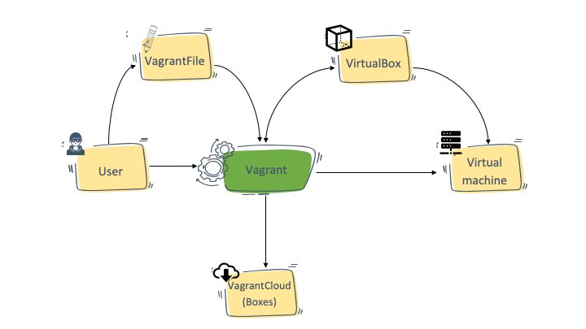

<small>【运维干货分享】vagrant初学者入门学习指南</small>

后面我们会介绍如何使用vargant启动一个k8s集群，在这之前，先来简单介绍下vargant


在这个 Vagrant 教程中，将介绍在工作站上设置 Vagrant，以便为在开发环境创建和管理虚拟机。

我一直是vagrant的忠实粉丝，现在已经使用了 10 多年了。每当我想测试与DevOps相关的实用程序或工具时，它都使设置环境变得如此简单。


## 什么是vagrant？

Vagrant 是由 Hashicorp 的人创建的开源实用程序。

它是一个包装工具，适用于虚拟机解决方案，如 Virtualbox、HyperV、VMware 和 Docker。它通过 VM 解决方案抽象出管理 VM 所涉及的所有复杂活动，并且可以自动执行大部分任务。

## vagrant架构



## vagrantfile

使用 Vagrant，您可以轻松地从现有的 VM 镜像创建虚拟开发环境，并将所有 VM 配置保存在名为 Vagrantfile 的配置文件中。简单地说，您在 Vagrantfile 中定义 VM 中所需的一切，Vagrant 将负责在 VM 中配置这些内容。

下面是一个示例 Vagrantfile

Vagrantfile的语法是Ruby，但修改Vagrantfile并不需要了解Ruby编程语言，因为它主要是简单的变量赋值。

# -*- mode: ruby -*-
# vi: set ft=ruby :

Vagrant.configure("2") do |config|

    config.vm.box = "ubuntu/trusty64"
  
    config.vm.network "private_network", ip: "192.168.33.10"
  
    config.vm.provider "virtualbox" do |vb|
      vb.memory = "1024"
    end
end

如果有人在他们的系统上安装了 Vagrant，您可以与他们共享 Vagrantfile，他们可以构建您创建的类似 VM。类似于 Docker 工作原理的工作流

## vagrant boxes

在示例中，您可以看到一个名为“Vagrantfileconfig.vm.box”的参数。

Vagrant Box == 虚拟机镜像（类似于您与虚拟盒子一起使用以从头开始创建虚拟机的 ISO 镜像）

vagrant boxes是一个预准备的虚拟机镜像（Ubuntu、Centos 等）。此框格式可以与任何使用 Vagrant 的人共享。

可以从 Vagrantcloud 下载现成的社区盒子。

还可以向 Vagrantfile 添加 shell 脚本或使用 chef 说明书、puppet 模块或 Ansible playbook 来自动执行 VM 配置过程。然后，可以将盒子与所有配置一起打包，并与其他团队成员共享。

## vagrant用例

以下是 Vagrant 的真实用例

- 开发环境：假设希望团队中的所有开发人员都使用相同的开发环境。在这种情况下，您可以创建一个通用的 Vagrantfile，其中包含使用开发环境依赖项（软件）预配 VM 所需的所有配置。然后与所有开发人员共享 Vagrantfile。这样，所使用的底层软件或配置不会有任何变化。一些公司将 Vagrant 盒子托管在不同的批准软件的公共位置，以便组织中的每个人都可以使用它。
- 沙盒环境：如果您想要一个沙盒环境进行测试，您可以使用 Vagrant 在几分钟内启动并销毁虚拟机。

### 先决条件

- 应该安装一个虚拟盒子。您可以从此处下载最新的 Virtualbox 设置 https://www.virtualbox.org/wiki/Downloads

- 应该具有root访问权限才能在工作站上安装该软件。

- 打开 Internet 访问以下载一些软件和 VM 映像。

- 您的工作站应具有超过 4 GB 的 RAM。

### 安装 Vagrant

- 步骤1：从 https://www.vagrantup.com/downloads 下载 vagrant 安装文件

- 步骤2： 根据您的操作系统从下载的文件安装 Vagrant。vagrant 可执行文件将自动添加到您的系统路径中，您可以开始使用 vagrant 命令。

- 步骤3： 要验证 vagrant 的安装，请执行以下 vagrant 命令以查看它是否输出版本。

```
vagrant --version
```

## Vagrant入门（使用Vagrant创建开发环境）

在本节中，我将引导您完成以下 4 个过程，以基本了解流浪者的工作原理以及如何将其用于开发目的。

- 使用 Vagrant 创建基于 Ubuntu 的 VM。我们的名字是apache-vm
- 通过 SSH 连接到新创建的 Vagrant VM。
- 在 VM 上安装 Apache Web 服务器Install an Apache web server on the VM
- 通过浏览器访问 Web 服务器页面。

让我们开始设置。

### 使用 Vagrant 创建虚拟机

在本节中，您将学习如何使用 vagrant 创建虚拟机。

- 步骤1：选择一个文件夹以保存所有与流浪者相关的文件，然后创建 VM 项目目录。
```
mkdir apache-vm && cd apache-vm
```
- 步骤2： 使用 Ubuntu 镜像初始化一个。此文件将包含所有必要的配置供您参考。在这里，我们将使用vagrant cloud中可用的通用 Ubuntu 镜像。Vagrantfile

注意：在 Vagrant 中，我们使用预准备的虚拟机映像创建 VM。所有这些图像都可以在 Vagrant 云目录中找到。它是完全免费的。

执行以下命令以初始化 Vagrantfile

```
vagrant init bento/ubuntu-22.04 
```

如果您现在检查，您将在当前文件夹中看到一个。如果打开该文件，您将看到大部分行已被注释掉。现在，我们不用担心。让我们来看看 ubuntu VM。Vagrantfile

-  步骤3：使用以下命令启动 Vagrant VM。
```
vagrant up
```

注意：如果您没有安装虚拟盒子，您将收到“找不到适用于您的系统的可用默认提供商”错误。

上述命令将首先从 vagrant 云下载 VM 镜像，然后启动 VM。ubuntu/trusty64

此外，在此过程中，它将生成一个 SSH 密钥对，并将公钥添加到 VM。这样，一旦机器启动并运行，我们就可以通过SSH连接到机器中。

- 步骤4：可以使用以下命令检查 VM 的状态。
```
vagrant status
```

它应将输出显示为running (virtualbox)

通过 SSH 连接到 Vagrant 虚拟机

要了解流浪者机器的 ssh 详细信息，请执行以下命令。
```
vagrant ssh-config
```

上述命令将显示所有 ssh 详细信息，如用户名、密钥文件位置等，如下所示。

```
$ vagrant ssh-config
Host lab
  HostName 127.0.0.1
  User vagrant
  Port 2222
  UserKnownHostsFile /dev/null
  StrictHostKeyChecking no
  PasswordAuthentication no
  IdentityFile /Users/bibinwilson/Documents/GitHub/vagrant/ubuntu-20/lab/.vagrant/machines/lab/virtualbox/private_key
  IdentitiesOnly yes
  LogLevel FATA
```

现在，让我们看看如何通过 SSH 连接到由 Vagrant 启动的 VM。

确保您正在执行文件夹中的命令。apache-vm

您可以使用以下命令通过 SSH 连接到 Vagrant。
```
vagrant ssh
```
当您运行 ssh 命令时，vagrant 会从该命令创建的隐藏文件夹中获取私钥。该文件夹包含 ssh 私钥。.vagrantvagrant up
```
/apache-vm/.vagrant/machines/default/virtualbox/private_key
```
下图显示了树结构。


### 安装 Apache Web 服务器
现在让我们安装一个 apache 服务器，看看我们是否可以通过我们的 Web 浏览器访问它。

- 步骤1：使用以下命令安装 apache。
```
sudo apt-get install apache2 -y
```
- 步骤2：启动 Apache 服务器。
```
sudo service apache2 start
```
- 第 3 步：检查服务器的状态。您将看到输出正在运行。
```
sudo service apache2 status
```
- 步骤4：让我们使用 curl，看看我们是否能够访问该网页。它应该输出 apache 2 HTML 欢迎页面。
```
curl localhost
```
- 步骤5：让我们使用以下命令获取 VM 的 IP 地址。
```
ip route get 1.2.3.4 | awk '{print $7}'
```
上述命令应输出 IP 地址。

- 步骤5：尝试使用 IP 地址进行 curl。您应看到与步骤 4 相同的输出。将 IP 地址替换为您在输出中看到的 IP 地址。
```
curl 10.0.2.15
```
- 步骤6：现在，尝试从系统的 Web 浏览器访问 IP 地址。您将无法访问它。原因是VM的当前网络现在不是专用网络。这意味着，存在从外部世界到 VM 的连接。

让我们对 Vagrant 文件进行一些更改，以便从浏览器访问 VM。

- 步骤7：使用以下命令销毁 VM。
```
vagrant destroy
```
- 步骤8：现在，打开 Vagrantfile 并取消注释以下行。
```
config.vm.network "private_network", ip: "192.168.33.10"
```

这意味着，我们正在启用专用网络并将 VM 的 IP 地址设置为 192.168.33.10。

如果要启用从 Wi-Fi 网络上的另一台计算机访问 VM，请启用以下选项。
```
config.vm.network "public_network"
```

当您启动 VM 时，它将要求桥接接口，如下所示。


还可以配置从主机到 Vagrant VM 的端口转发。例如，如果在 VM 上的 80 上运行 apache 服务器，则可以配置主机端口 8080 以将请求转发到 VM 端口 80。
```
config.vm.network "forwarded_port", guest: 80, host: 8080
```

这样，您可以从主机 Web 浏览器访问 apache 服务器http://localhost:8080

- 步骤9： 再次启动 VM 并通过 ssh 连接到其中。
```
vagrant up
vagrant ssh
```
- 步骤10：现在安装 apache 服务器并使用步骤 1 和 2 启动它

- 步骤11：现在，如果您尝试使用192.168.33.10访问apache欢迎页面，您将能够访问它。
```
http://192.168.33.10
```
### Vagrant 共享文件夹

如果您想知道如何与 Vagrant VM 共享主机文件夹，那么这就是文件夹发挥作用的地方 /vagrant

#### Vagrant 默认共享文件夹

每个 Vagrant VM 都会有一个文件夹。此文件夹将装载到您拥有 Vagrantfile 的主机文件夹中。这意味着，您创建的用于包含 Vagrantfile 的项目文件夹将挂载到 VM 内的某个位置。/vagrant/vagrant

因此，在 vagrant VM 中，如果您访问该文件夹，您可以看到 vagrantfile。/vagrant

这是使用共享文件夹的真实用例。

如果您在主机上处理代码，则可以将 vagrant 项目文件夹设置为代码的根文件夹，以便 VM 中运行的 Web 服务器可以访问您的代码并直接测试它。

#### Vagrant 自定义共享文件夹位置

如果您希望使用自定义主机文件夹与 Vagrant VM 共享，您可以通过添加参数来实现。config.vm.synced_folder

例如
```
config.vm.synced_folder "/host/code/", "/vm/code"
```

在上面的配置中，是主机中存在的文件夹，也是 Vagrant VM 内部的位置。 /host/code//vm/code

如果您使用公共文件夹将所有代码和配置存储在主机中，则此功能会派上用场。

### 自定义CPU和内存

可以为流浪者虚拟机定义自定义 CPU 和内存。

根据系统中的可用资源设置 CPU 和内存值。

下面是配置语法。
```
config.vm.provider "virtualbox" do |vb|
    vb.memory = 2048
    vb.cpus = 1
end
```

## Vagrant Provisioner

关于 Vagrant 的最大好处是您可以向 Vagrantfile 添加配置脚本。

下面是一个将 shell 脚本作为配置器的示例。
```
config.vm.provision "shell", inline: <<-SHELL
    apt-get update
    apt-get install -y apache2
    service apache2 start
  SHELL
```

您还可以使用 Ansible、Chef 或 puppet 作为供应器。

## 示例 Vagrantfiles

从单个 Vagrantfile 中，您可以创建单个或多个 VM。让我们看一下单个和多个 VM 配置的示例。

### 单虚拟机 Vagrantfile

以下 Vagrantfile 包含我上面解释的所有概念。

- 使用 ubuntu/trusty64 框创建 VM
- 在主机端口 8080 上启用专用网络、public_network和端口转发
- 自定义共享文件夹
- 自定义 CPU 和内存
- 用于安装 apache2 的 Shell provisioner
```
# -*- mode: ruby -*-
# vi: set ft=ruby :

Vagrant.configure("2") do |config|

  config.vm.box = "bento/ubuntu-22.04"

  config.vm.network "private_network", ip: "192.168.33.10"
  config.vm.network "public_network"
  config.vm.network "forwarded_port", guest: 80, host: 8080

  config.vm.synced_folder "code/", "/app/code"

  config.vm.provider "virtualbox" do |vb|
    vb.memory = 2048
    vb.cpus = 1
  end

  config.vm.provision "shell", inline: <<-SHELL
    apt-get update
    apt-get install -y apache2
    service apache2 start
  SHELL
end
```
### 多虚拟机 Vagrantfile

以下 Vagrantfile 具有用于创建名为 web 和 db 的两个 VM 的配置，这些 VM 具有自己的配置。
```
Vagrant.configure("2") do |config|
  config.vm.provision "shell", inline: "echo Hello"

  config.vm.define "web" do |web|
    web.vm.box = "bento/ubuntu-22.04"
    web.vm.network "private_network", ip: "192.168.33.20"
    web.vm.synced_folder "code/", "/app/code"
    web.vm.provider "virtualbox" do |vb|
        vb.memory = 1048
        vb.cpus = 1
    end
  end

  config.vm.define "db" do |db|
    db.vm.box = "ubuntu/trusty64"
    db.vm.network "private_network", ip: "192.168.33.30"
    db.vm.synced_folder "data/", "/db/data"
    db.vm.provider "virtualbox" do |vb|
        vb.memory = 2048
        vb.cpus = 1
    end
  end
end
```

若要通过 ssh 连接到 VM，需要使用名称 web 和 db

```
vagrant ssh web
vagrant ssh db
```

可以使用其名称单独管理 VM。

### 带循环的多虚拟机 vagrantfile

假设您想要创建 3 个相同类型的 Vms。

在这种情况下，可以使用循环创建具有派生专用 IP 的多个 VM。

下面是一个示例。
```
Vagrant.configure("2") do |config|

  (2..4).each do |i|
    config.vm.define "vm-#{i}" do |web|
      web.vm.box = "bento/ubuntu-22.04"
      web.vm.network "private_network", ip: "192.168.33.#{i}", auto_config: false
      web.vm.provision "shell", inline: "echo hello #{i}"
      web.vm.synced_folder "code/", "/app/code"
    end
  end
end
```

### vagrant与Docker

Vagrant 只是一个包装工具，可以使用 Virtualbox 或 Docker 等后端提供商配置 VM 或容器。相比之下，Docker 是一种轻量级容器解决方案，具有自己的一套工具来管理容器。

如果使用 Virtualbox 或 Vmware 作为 Vagrant 的提供商，它可以根据 中的配置启动虚拟机。Vagrantfile

如果使用 Docker 作为 Vagrant 的提供者，那么它将根据 Vagrantfile 中的配置启动 docker 容器。

## 结论
在本 Vagrant 教程中，学习了如何为开发环境设置基本的 Vagrant 虚拟机。

它是为工作站设置开发环境的绝佳工具。

可以使用 docker-compose 等工具实现这些目标，但大多数时候我更喜欢使用 Vagrant 和普通 VM 来测试目的。

如果有任何适用于vagrant的酷炫技巧，请在评论部分告诉我。

