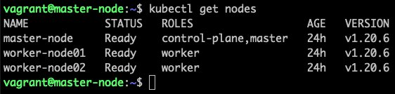
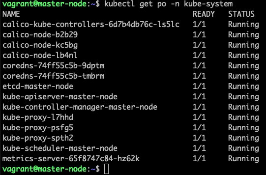
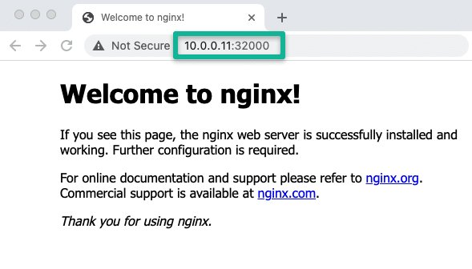

<small>【运维干货分享】如何在 Vagrant VM 上启动 Kubernetes 集群</small>

在这个 Kubernetes 教程中，我介绍了在 Vagrant 上设置 Kubernetes 集群的分步指南。它是使用 kubeadm 的多节点 kubernetes 设置。

Vagrant 是一个很棒的工具，可以在您的本地工作站上设置虚拟机。我几乎使用 Vagrant 来完成我的大部分测试和学习目的。如果您是 Vagrant 的新手，可以查看Vagrant初学者文档

本指南主要介绍使用 Vagrantfile 和 shell 脚本的 Kubernetes 自动化设置。

## 在 Vagrant 上自动设置 Kubernetes 集群

我已经编写了一个基本的Vagrantfile和脚本，以便任何人都可以理解并根据他们的要求进行更改。

以下是设置的摘要。

- 1.单个 vagrant up 命令将创建三个 VM，并使用 Kubeadm 配置所有必要的 kubernetes 组件和配置。
- 2.Calico Network Plugin、Metrics 服务器和 Kubernetes 仪表板作为设置的一部分进行安装。
- 3.kubeconfig 文件将添加到集群中的所有节点，以便您可以从任何节点执行 kubectl 命令。
- 4.kubeconfig 文件和 kubernetes 仪表板访问令牌将添加到您拥有 Vagrantfile 的 configs 文件夹中。您可以使用 kubeconfig 文件从工作站连接集群。
- 5.可以在不使用时关闭 VM，并在需要时重新启动它们。所有集群配置都保持不变，没有任何问题。在启动过程中，节点会自动连接到主节点。
- 6.可以在一个命令中删除所有 VM，并在需要时使用命令重新创建设置。vagrant up

以下是设置的高级概述。


## Kubernetes-Kubeadm Vagrant Github 仓库

Kubeadm Vagrantfile 和脚本托管在 Vagrant Kubernetes Github 仓库上。

克隆存储库以按照指南进行操作。
```
git clone https://github.com/techiescamp/vagrant-kubeadm-kubernetes
```

### MAC 用户的先决条件

如果您已将 MAC 升级到 OS Monterey，则可能会在创建专用网络时遇到 Vagrant 问题。这意味着 Vagrant 将无法创建 198 系列以外的网络。

要解决此问题，请添加以下内容。/etc/vbox/networks.conf

```
* 0.0.0.0/0 ::/0
```

## 在 Vagrant 上设置 Kubernetes 集群

注意： 您至少需要 16 Gig RAM 工作站才能运行此设置而不会出现任何问题。

按照下面给出的步骤启动集群并验证所有 Kubernetes 集群配置。

- 步骤1： 要创建集群，首先 cd 到克隆的目录中。
```
cd vagrant-kubeadm-kubernetes
```
- 步骤2：执行 vagrant 命令。它将启动三个节点。一个控制平面（主节点）和两个工作节点。Kubernetes 的安装和配置是通过 scripts 文件夹中的 shell 脚本进行的。
```
vagrant up
```
注意：如果您是第一次运行它，Vagrant 将首先下载 Vagrantfile 中提到的 ubuntu box。这是一次性下载。

- 第 3 步：登录到主节点以验证集群配置。
```
vagrant ssh master
```
- 步骤4：列出所有群集节点，以确保工作节点已连接到主节点并处于就绪状态。
```
kubectl top nodes
```
您应该看到如下所示的输出。



- 步骤5： 列出命名空间中的所有 pod，并确保它处于运行状态。kube-system
```
kubectl get po -n kube-system
```


- 步骤6： 部署一个示例 Nginx 应用，看看你是否可以通过 nodePort 访问它。


```
kubectl apply -f https://raw.githubusercontent.com/scriptcamp/kubeadm-scripts/main/manifests/sample-app.yaml

```

您应该能够在端口上的任何节点 IP 上访问 Nginx。例如32000http://10.0.0.11:32000

NodePort 上的 kubeadm vagrant 访问应用程序。



就是这样！您可以开始部署和测试其他应用程序。

要关闭 Kubernetes VM，请执行 halt 命令。
```
vagrant halt
```
每当您需要集群时，只需执行以下操作即可。
```
vagrant up
```
要销毁 VM，请执行以下操作：
```
vagrant destroy
```
注意：如果您希望应用程序在每次集群或 Pod 重启时保留数据，请确保使用附加到 nodeSelector 的持久卷类型“local”。

## 从工作站终端访问 Kubernetes 集群

一旦 Vagrant 执行成功，您将在克隆的仓库中看到一个 configs 文件夹，其中包含一些文件（config、join.sh 和 token）。这些是在运行时生成的。

如果您想从工作站终端与集群进行交互，请将配置文件复制到您的文件夹中。您应该在工作站上安装了 kubectl。 $HOME/.kube

例如，我在 Mac 上执行了以下操作，将文件夹保留为当前目录。vagrant-kubeadm-kubernetes
```
mkdir -p $HOME/.kube
cp configs/config $HOME/.kube
```
或者，您可以设置 Kubeconfig 环境变量，如下所示。请确保从包含 的文件夹中执行命令。 
```
vagrant-kubeadm-kubernetesVagrantfile
export KUBECONFIG=$(PWD)/configs/config
```
将 kubeconfig （config） 文件复制到本地目录后，您可以对集群运行 kubectl 命令$HOME/.kube

通过列出群集节点来验证配置。
```
kubectl get nodes
```
要访问 kubernetes 仪表板，请运行 kubectl proxy 以访问 Kubernetes 仪表板。
```
kubectl proxy
```
configs 文件夹中的文件包含 kubernetes 仪表板的登录令牌。如果要使用 kubernetes 仪表板，请使用令牌并从以下 URL 登录token
```
http://localhost:8001/api/v1/namespaces/kubernetes-dashboard/services/https:kubernetes-dashboard:/proxy/#/login
```


## Kubeadm 流浪文件和脚本解释

这是 Vagrant 仓库的文件树。
```
├── Vagrantfile
├── configs
│   ├── config
│   ├── join.sh
│   └── token
└── scripts
    ├── common.sh
    ├── master.sh
    └── node.sh
```
configs 文件夹和文件仅在首次运行后生成。

正如我之前解释的，配置文件包含配置、令牌和 join.sh 文件。

在上一节中，我已经解释了 和 。该文件具有工作节点加入命令，其中包含在 kubeadm 主节点初始化期间创建的令牌。configtokenjoin.sh

由于所有节点共享包含 Vagrantfile 的文件夹，因此工作节点可以在第一次运行期间自动读取文件并加入主节点。这是一项一次性任务。join.sh

如果您登录到任何节点并访问该文件夹，您将看到 Vagrantfile 和脚本，因为它在 VM 之间共享。/vagrant

让我们来看看流浪者文件
```
NUM_WORKER_NODES=2
IP_NW="10.0.0."
IP_START=10

Vagrant.configure("2") do |config|
  config.vm.provision "shell", env: {"IP_NW" => IP_NW, "IP_START" => IP_START}, inline: <<-SHELL
      apt-get update -y
      echo "$IP_NW$((IP_START)) master-node" >> /etc/hosts
      echo "$IP_NW$((IP_START+1)) worker-node01" >> /etc/hosts
      echo "$IP_NW$((IP_START+2)) worker-node02" >> /etc/hosts
  SHELL

  config.vm.box = "bento/ubuntu-22.04"
  config.vm.box_check_update = true

  config.vm.define "master" do |master|
    # master.vm.box = "bento/ubuntu-18.04"
    master.vm.hostname = "master-node"
    master.vm.network "private_network", ip: IP_NW + "#{IP_START}"
    master.vm.provider "virtualbox" do |vb|
        vb.memory = 4048
        vb.cpus = 2
    end
    master.vm.provision "shell", path: "scripts/common.sh"
    master.vm.provision "shell", path: "scripts/master.sh"
  end

  (1..NUM_WORKER_NODES).each do |i|

  config.vm.define "node0#{i}" do |node|
    node.vm.hostname = "worker-node0#{i}"
    node.vm.network "private_network", ip: IP_NW + "#{IP_START + i}"
    node.vm.provider "virtualbox" do |vb|
        vb.memory = 2048
        vb.cpus = 1
    end
    node.vm.provision "shell", path: "scripts/common.sh"
    node.vm.provision "shell", path: "scripts/node.sh"
  end

  end
end 
```

如您所见，我为节点添加了以下 IP，并将其添加到所有节点的主机文件条目中，其主机名带有一个在所有 VM 上执行的通用 shell 块。
```
10.0.0.10（master）
10.0.0.11 （node01）
10.0.0.11 （node02）
```
此外，工作节点块处于循环中。因此，如果您需要两个以上的工作节点或只有一个工作节点，则需要在变量的循环声明中替换为所需的数字。如果添加更多节点，请确保将 IP 添加到主机的文件条目中。2NUM_WORKER_NODES

例如，对于 3 个工作节点，您需要具有
```
NUM_WORKER_NODES=3
```
## master.sh、node.sh 和 common.sh 脚本

在 Vagrant 运行期间，将调用这三个 shell 脚本来配置集群。provisioners

common.sh： – 一个不言自明的命令列表，用于在所有节点上配置和安装特定版本的 cri-o 运行时、kubeadm、kubectl 和 kubelet。此外，禁用交换。

master.sh： – 包含用于初始化 Master、安装 Calico 插件、指标服务器和 Kubernetes 仪表板的命令。此外，将 kube-config、join.sh 和 token 文件复制到 configs 目录。

node.sh：- 从 configs 共享文件夹中读取 join.sh 命令并加入主节点。此外，将 kubeconfig 文件复制到该位置以执行 kubectl 命令。 /home/vagrant/.kube

common.sh安装 kubernetes 版本以具有相同的集群版本，用于 CKA/CKAD 和 CKS 准备。如果需要最新版本，请从命令中删除版本号。1.20.6-00


## 结论
最好有一个本地 kubernetes 集群设置，您可以在需要时启动和关闭，而无需花费太多时间。

要在 Vagrant 上设置 kubernetes 集群，您所要做的就是克隆存储库并运行命令。
```
vagrant up
```