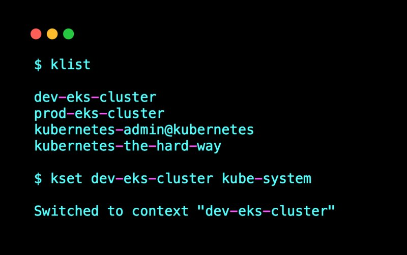

<small>【运维干货分享】kubectl设置及使用context教程</small>

在本指南中，我们将了解如何使用 kubectl set context 来管理多个 Kubernetes 集群context

## kubectl context

当你处理 Kubernetes 项目时，你必须在工作站中一次处理多个 kubernetes 集群。它可以是属于相同环境的集群，也可以是属于不同环境的集群。即使在学习时，你可能也必须处理多个集群。

这就是 kubectl config set context 命令派上用场的地方。

context是 kubeconfig 文件中存在的一组参数（集群、命名空间、用户），这些参数是连接到 Kubernetes 集群所必需的。单个 kubeconfig 文件可以包含多个context。

下面是一个来自 kubeconfig 文件的示例context块，其中包含三个集群context。

```
contexts:
- context:
    cluster: dev-cluster
    user: dev-user
  name: dev

- context:
    cluster: stage-cluster
    user: stage-user
  name: stage

- context:
    cluster: prod-cluster
    user: prod-user
  name: prod

current-context: dev
```

你可以使用以下 kubectl 命令查看所有context
```
kubectl config view
```

现在我们已经理解了什么是context，让我们看一下不同的实际示例来详细了解 kubectl set context。

## 列出群集context

要列出工作站中的所有可用context，可以使用以下 kubectl 命令。-o=name 标志仅列出context名称。
```
kubectl config get-contexts -o=name
```

你将获得如下所示的context列表。
```
arn:aws:eks:us-west-2:814200988517:cluster/custom-cluster
do-sfo3-k8s-1-28-2-do-0-sfo3-1699501871578
kubernetes-admin@kubernetes
kubernetes-the-hard-way
```
## 什么是kubectl配置设置context？

Kubectl set context 用于修改现有context或创建新的集群context（如果不存在）。此外，你无法使用 set context 命令切换到其他context。

你可以使用帮助标志了解其他设置context选项，如下所示。
```
kubectl config set-context --help
```

这是输出。选项部分包含所有受支持的选项。

```
$ kubectl config set-context --help

Set a context entry in kubeconfig.

 Specifying a name that already exists will merge new fields on top of existing values for those fields.

Examples:
  # Set the user field on the gce context entry without touching other values
  kubectl config set-context gce --user=cluster-admin

Options:
    --cluster='':
        cluster for the context entry in kubeconfig

    --current=false:
        Modify the current context

    --namespace='':
        namespace for the context entry in kubeconfig

    --user='':
        user for the context entry in kubeconfig

Usage:
  kubectl config set-context [NAME | --current] [--cluster=cluster_nickname] [--user=user_nickname] [--namespace=namespace] [options]

Use "kubectl options" for a list of global command-line options (applies to all commands).
```

## 使用 set context 设置默认命名空间

默认情况下，如果你不使用 -n 标志指定命名空间，则所有命令都将在默认命名空间中执行。你可以通过使用 set-context 命令设置当前命名空间来更改该行为。

例如，如果要设置为默认命名空间，可以使用以下命令 systax。kube-system
```
kubectl config set-context --current --namespace [namespace-name]
```

例如
```
kubectl config set-context --current --namespace kube-system
```

设置当前命名空间后，就不必在 kubectl 命令中使用 -n 标志。所有 kubectl 命令都在 set-context 命令设置的当前命名空间中执行。

## 创建新context

假设我使用一个具有两个不同命名空间的集群。示例、应用和监控命名空间。

我不想指定命名空间加班，我使用特定的命名空间，因为我只能将一个命名空间设置为默认值。

因此，我能做的是，为相同的集群设置应用程序和监控命名空间创建单独的context作为默认设置。

context将使用相同的配置进行集群身份验证。

## 什么是 kubectl config use context？


kubectl config use context 命令主要用于切换到不同的集群context。


例如，这是我的 Kubeconfig 文件中可用的context列表。
```
$ kubectl config get-contexts -o=name

arn:aws:eks:us-west-2:814200988517:cluster/custom-cluster
do-sfo3-k8s-1-28-2-do-0-sfo3-1699501871578
kubernetes-admin@kubernetes
kubernetes-the-hard-way
```
以下是设置当前context的语法。
```
kubectl config use-context [context-name]
```

例如
```
kubectl config use-context kubernetes-admin@kubernetes
```

当你使用新context时，该值也会在 Kubeconfig 文件中设置。你可以在 Kubeconfig 文件中找到一个名为 current-context： 的参数。

你可以使用以下命令验证context是否设置为当前。
```
kubectl config current-context
```
kubectl 删除context

你可以使用 delete-context 命令删除 kubectl 创建的context。

下面是命令语法。
```
kubectl config delete-context [context-name]
```
例如
```
kubectl config delete-context stage-k8s-cluster
```
## kubectl context别名

如果你定期在context之间切换以在不同的集群上工作，则可以创建别名以列出和设置context。

下面是用于列出context的别名。
```
alias klist='kubectl config get-contexts -o=name'
```
你可以将以下行添加到你的 or 文件中，具体取决于你使用的 shell：.bashrc.zshrc

创建以下别名以使用自定义命名空间设置context。
```
kset() {
    local context="$1"
    local namespace="$2"
    kubectl config use-context "$context" --namespace "$namespace"
}
```
以下是别名在 bashrc 或文件中的外观。zshrc
```
alias k=kubectl

alias klist='kubectl config get-contexts -o=name'

kset() {
    local context="$1"
    local namespace="$2"
    kubectl config use-context "$context" --namespace "$namespace"
}

kdel() {
    kubectl config delete-context "$1"
}
``` 
以下是如何使用这些别名

- 使用 klist 命令列出context。
- 使用 kset 命令设置context和命名空间
  
下面是一个示例。



## 设置context常见问题解答

### 如何在kubectl中设置当前context？

你可以使用带有context名称的 kubectl config use-context 命令来设置当前context。

例如，kubectl config use-context dev-cluster

其中 dev-cluster 是context名称。

### 如何在 Kubernetes 中为特定命名空间设置context？

你可以将 --namespace 标志与 kubectl config use-context 命令一起使用，以在context中设置当前命名空间。

### kubectl set 和 kubectl use context 有什么区别？

set-context 参数用于修改集群context或创建一个新context（如果不存在）。use context 参数用于切换到不同的context。

## kubectl 设置context的替代方案

如果你不想使用原生命令来设置 kubectl contexs，你可以使用以下替代的开源工具。

- kubie
- K9s
- Kubectx 
- KubeContext 