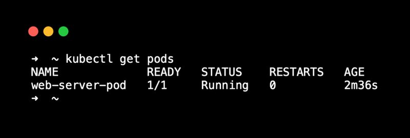
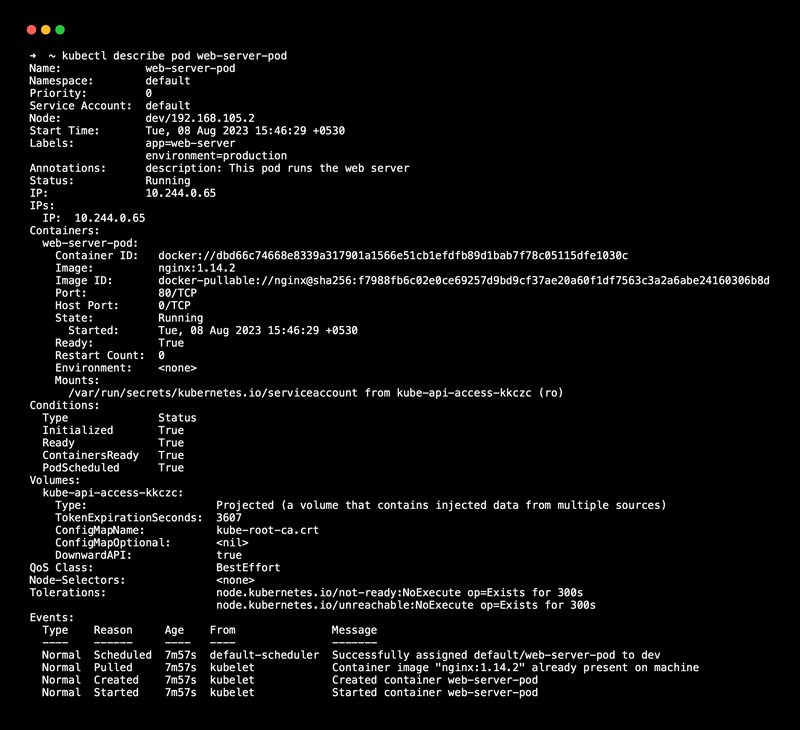
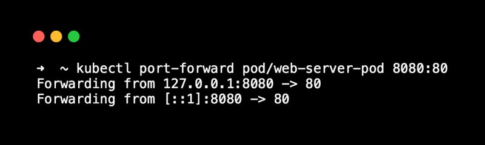
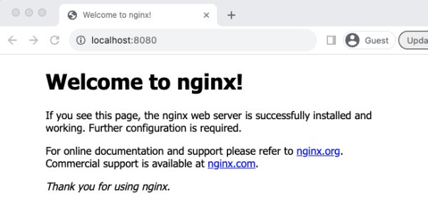
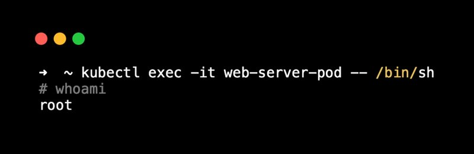
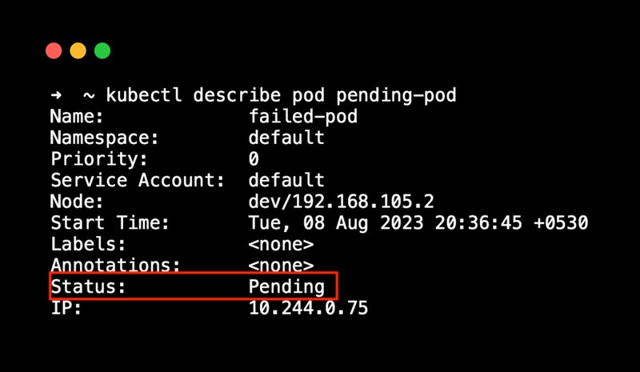

<small><small>【运维干货分享】实际例子来解释什么是kubernetes中的pod</small></small>


在本文章中，我通过实际示例和用例详细介绍了 Kubernetes pod 概念。

所以如果你想了解，

- Pod 核心概念
- 如何创建 pod
- 访问 Pod
- Pod 关联对象

那么本文章适合你。


本文章的目的是让你理解 pod 的构建块，并实际实现部署 pod 并访问在其上运行的应用程序。

此外，还有许多与 Pod 对象相关的概念。因此，我已经提供了与 Pod 相关的所有信息和概念，以进一步构建你学到的基础知识。

注意：在开始探索 Kubernetes Pod 之前，请确保你对[Linux 容器](https://mp.weixin.qq.com/s?__biz=MzU4MjY3Mzc3OQ==&mid=2247492606&idx=2&sn=bc5bafdc590ac9655457c78d3128bf57&chksm=fdb617e2cac19ef4911ad08b09bcffaf59f8073418f5cb1bc61385fe9995ecd3470a578528c5&token=1304546276&lang=zh_CN#rd)概念有深入的理解。


## 什么是 Kubernetes Pod？

在深入了解 Kubernetes Pod 概念之前，让我们先了解一下容器。

众所周知，容器是一个独立的环境，我们在其中打包应用程序及其依赖项。通常，容器运行单个进程（尽管有一些方法可以运行多个进程）。每个容器都有一个 IP 地址，并且可以附加卷并控制 CPU 和内存资源等。所有这些都是通过命名空间和控制组的概念实现的。

Kubernetes 是一个容器编排系统，用于部署、扩展和管理容器化应用程序，它有自己的容器运行方式。我们称它为豆荚。Pod 是 Kubernetes 中最小的可部署单元，代表应用程序的单个实例。

例如，如果要运行 Nginx 应用程序，则可以在 pod 中运行它。

那么它与容器有何不同呢？

容器是一个单独的单元。但是，一个 Pod 可以包含多个容器。你可以将 Pod 视为一个可以将一个或多个容器放在一起的盒子。

Pod 提供了更高级别的抽象，允许你将多个容器作为一个单元进行管理。在这里，Pod 获得的不是每个容器都有一个 IP 地址，而是获得一个唯一的 IP 地址，并且在 Pod 内部运行的容器使用 localhost 在不同的端口上相互连接。


这意味着 Kubernetes Pod 内的容器共享以下内容

- 网络命名空间 – Pod 内的所有容器都通过 localhost 进行通信。
- IPC 命名空间：所有容器都使用共享的进程间通信命名空间。
- UTS命名空间：所有容器共享相同的主机名。
- 
Pod 内的容器之间不共享哪些内容？

- 默认情况下，PID 命名空间不会共享，但是 kubernetes 提供了使用 Option 在 pod 内的容器之间启用进程共享的选项。shareProcessNamespace
- 挂载命名空间不会在容器之间共享。每个容器都有自己的私有文件系统和目录。但是，Pod 挂载卷在容器之间共享。

简而言之，以下是你应该了解的有关 pod 的信息：

- Pod 是 Kubernetes 中最小的可部署单元。
- pod本质上是短暂的;可以创建、删除和更新它们。
- 一个 Pod 可以有多个容器;你可以在 Pod 内运行的容器数量没有限制。
- 每个 pod 都有一个唯一的 IP 地址。
- Pod 使用 IP 地址相互通信。
- Pod 内的容器在不同的端口上使用 localhost 进行连接。
- 在 Pod 内运行的容器应该有不同的端口号，以避免端口冲突。
- 你可以为 Pod 内部运行的每个容器设置 CPU 和内存资源。
- Pod 内的容器共享相同的卷挂载。
- Pod 内的所有容器都调度在同一节点上;它不能跨越多个节点。
- 如果有多个容器，则在 Pod 启动期间，所有主容器将并行启动。而 pod 内的 init 容器是按顺序运行的。

## Pod YAML（对象定义）

现在我们已经对 Pod 有了基本的了解，让我们来看看我们如何定义 Pod。Pod 是原生的 Kubernetes 对象，如果要创建 Pod，需要以 YAML 格式声明 Pod 需求。你还可以使用 kubectl 命令式命令创建 pod。我们将在后面的主题中看到这一点。

下面是一个创建 Nginx Web 服务器 pod 的 Pod YAML 示例。此 YAML 只不过是 Pod 的声明性期望状态。

```
apiVersion: v1
kind: Pod
metadata:
  name: web-server-pod
  labels:
    app: web-server
    environment: production
  annotations:
    description: This pod runs the web server
spec:
  containers:
  - name: web-server
    image: nginx:latest
    ports:
    - containerPort: 80
```

让我们了解一下这个 pod YAML。一旦你理解了基本的 YAML，你就会更容易地使用 pod 和关联的对象，如部署、守护进程集、有状态副本集等。

正如我们在 Kubernetes 对象博客中所讨论的，每个 Kubernetes 对象都有一些通用的参数集。这些值会根据我们正在创建的对象类型而变化。

让我们看一下 Kubernetes pod 对象。

|参数|	描述|
|--|--|
|apiVersion	|pod 的 API 版本。在我们的例子中，它是v1|
|kind|	对象的种类。它是pod|
|metadata|	元数据用于唯一标识和描述 Pod 
||lables（用于表示 Pod 的键值对集）。这类似于云环境中的标记。每个物体都必须用标准标签标记。它有助于对对象进行分组。
||– name （pod 的名称）
||– namespace （pod 的命名空间）
||– annotations （键值格式的附加数据）
|spec|	在 'spec' 部分下，我们声明了 pod 的所需状态。这些是我们想要在 pod 内运行的容器的规格。
|containers|	在容器下，我们声明 pod 内容器的所需状态。集装箱图像、暴露的端口等。

现在，我们已经查看了一个基本的 Pod YAML 清单。请务必注意，此清单支持许多参数。我们将通过动手实践的方法逐步探索这些额外的参数。

现在我们已经对 Pod 有了基本的了解，让我们创建一个 Pod。

## 创建 Pod（实际示例）

你可以通过两种方式创建 Pod

使用 kubectl 命令式命令： 主要用于学习和测试目的。命令式命令有其自身的局限性。
声明式方法：使用 YAML 清单。在处理项目时，YAML 清单用于部署 Pod。
让我们看看这两个选项。我们将使用以下内容创建一个 NGINX pod

- pod 的名称是 web-server-pod
- 它应该有标签 app： web-server 和环境： production
- 添加注释以描述 pod。
- 使用 nginx：1.14.2 容器镜像。
- 暴露容器端口 80。
- 方法一：使用 kubectl 命令创建 pod
- 注意：当你参加 Kubernetes 认证时，Kubectl 命令式命令非常重要。

对于讨论的 pod 要求，这里是 kubectl 命令。

```
kubectl run web-server-pod \
  --image=nginx:1.14.2 \
  --restart=Never \
  --port=80 \
  --labels=app=web-server,environment=production \
  --annotations description="This pod runs the web server"
```

在这里，pod 部署在默认命名空间中。你可以获取已部署的 pod kubectl 的状态。

```
kubectl get pods
```
部署 Pod 后，你将看到 Pod 正在运行的状态，如下所示。在我们的示例中，pod 内部只有一个容器。所以它显示 1/1 准备好并正在运行。



### 描述 Pod

如果你想了解正在运行的 pod 的所有细节，你可以使用 kubectl 来描述 pod。
```
kubectl describe pod web-server-pod

```
在以下输出中，你可以看到有关 Pod 的所有详细信息。其 IP 地址、命名空间、容器详细信息、QoS 类等。



以下是 describe 命令显示的所有重要 pod 信息的图形视图。


现在，让我们使用以下命令删除 pod。
```
kubectl delete pod web-server-pod
```

方法二：使用声明式 YAML 创建 Pod

在处理实际项目时，你将不得不主要通过声明式方法创建 pod。

让我们看看如何使用 YAML 清单创建 pod。

使用以下内容创建名为 nginx.yaml 的文件。

```
apiVersion: v1
kind: Pod
metadata:
  name: web-server-pod
  labels:
    app: web-server
    environment: production
  annotations:
    description: This pod runs the web server
spec:
  containers:
  - name: web-server
    image: nginx:1.14.2
    ports:
    - containerPort: 80

```

现在，要部署清单，你需要使用文件名执行以下 kubectl 命令。

```
kubectl create -f nginx.yaml
```

我们是否应该记住每个参数来创建 YAML？不。可以使用 –dry-run 标志创建 YAML 文件。

下面是一个示例。
```
kubectl run nginx-pod --image=nginx:1.14.2 --dry-run=client -o yaml
```

你可以通过将试运行输出重定向到文件来保存 YAML 输出。

```
kubectl run nginx-pod --image=nginx:1.14.2 --dry-run=client -o yaml > nginx-pod.yaml
```

### 访问在 Pod 中运行的应用程序

现在我们有一个带有 Nginx Web 服务器的正在运行的 pod。整个想法是部署和访问在 pod 内部运行的应用程序。

Kubectl 提供了一个 port-forward 命令，用于从本地工作站访问 Kubernetes 集群中正在运行的 pod。

我们有一个名为 web-server-pod 的正在运行的 pod。让我们通过 port-forward 命令访问它。
```
kubectl port-forward pod/web-server-pod 8080:80
```
你应该看到如下所示的输出。



kubectl 端口转发以访问本地系统中的 pod
现在，如果你转到浏览器并访问 http://localhost:8080，你应该会看到 Nginx 主页，如下所示。该网页由我们的 Nginx Web 服务器 pod 提供服务。


现在，你可以通过按 CTRL+C 来断开端口转发。

以下是运行 kubectl port-forward 时发生的情况

Kubectl 绑定了本地系统中的指定端口。在我们的例子中，它是 8080。

然后，它与 Kubernetes 集群 API 通信，以建立到所需节点的隧道（单个 HTTP 连接），然后到指定的 pod 和容器端口，即 80。

注意：kubectl 端口转发更像是一个调试工具。你需要使用 Kubernetes Service 对象来公开在 Pod 中运行的应用程序。我们将在另一篇博客中实际了解 Kubernetes 服务概念

## 访问 Pod Shell

我们已经学习了如何访问在 pod 内部运行的应用程序。

现在，如果你想访问 pod shell，该怎么办？

在许多用例中，你需要对 pod 进行终端访问。一个主要用例是调试和故障排除。

这就是 kubectl exec 命令派上用场的地方。

你可以使用以下命令访问 web-server-pod 的 shell。
```
kubectl exec -it web-server-pod -- /bin/sh
```
在以下输出中，我正在 pod 内执行 whoami 命令。



注意： 容器镜像通常设计得非常小，因此你可能会发现无法执行在普通 Linux 系统上执行的所有命令。此限制取决于映像的生成方式以及容器映像中包含的实用程序

## Pod 生命周期

你应该了解的有关 Pod 的另一个重要概念是其生命周期。

Pod 通常由 ReplicaSet 控制器、部署控制器等控制器管理。使用 YAML 创建单个 pod 时，它不受任何控制器的管理。在这两种情况下，Pod 都会经历不同的生命周期阶段。

以下是 Pod 生命周期阶段。

- Pending：表示 Pod 创建请求成功，但是，计划正在进行中。例如，它正在下载容器映像。
- Running：Pod 已成功运行并按预期运行。例如，pod 是服务客户端请求。
- Succeeded：Pod 内的所有容器都已成功终止。例如，成功完成 CronJob 对象。
- Failed：所有 Pod 都已终止，但至少有一个容器因失败而终止。例如，由于配置问题，在 Pod 内部运行的应用程序无法启动，并且容器以非零退出代码退出。
- Unknown：Pod 的状态未知。例如，集群无法监控 Pod 的状态。

如果描述 Pod，则可以查看 Pod 的阶段。下面是一个示例。


如果你想了解更多信息，请查看有关 pod 生命周期的详细博客。

## Pod 特性

我们已经部署了一个简单的 Nginx pod，只需非常少的配置。但是，Pod 有很多资源管理、配置、机密、可用性、安全性等功能。

如果你是初学者，一次性学习所有这些概念将是矫枉过正的。在实际用例中使用与 pod 相关的对象（如部署）时，学习所有这些概念更有意义。

此外，你需要通过实际用例详细了解每个功能。

以下是与 pod 相关的主要功能。

- 资源请求和限制：Pod CPU/内存分配
- 标签：附加到 Pod 的键值对，用于对资源进行分类。
- Selectors： 根据标签对资源进行分组。
- Liveness, Readiness, and Startup Probes： 容器运行状况检查
- ConfigMaps：用于配置管理
- Secrets：用于机密管理
- Volumes：持久性数据存储
- Init Containers：在主容器之前运行的容器。
- 临时容器：添加到 Pod 的临时容器，用于调试或故障排除。
- 服务帐户： 限制对 Kubernetes 对象和资源的访问。
- SecurityContext：主机权限和特权。
- 关联性和反关联性规则：跨节点的 Pod 放置控制
- Pod 抢占和优先级：设置 pod 调度和逐出的优先级。
- Pod 中断预算：在自愿中断期间需要运行的 Pod 副本的最小数量。
- 集装箱生命周期钩子：根据 Pod 的生命周期阶段更改执行自定义脚本。

全面的 Pod YAML 配置

注意：我给出了以下示例仅供参考。不要被所有参数所淹没。它并不像看起来那么复杂。一旦你了解了基础知识，这将很容易。

如果添加我上面列出的 Pod 功能，你将获得一个全面的 Pod YAML 配置，如下所示。此外，这些选项将与 Deployment、Statefulset 等对象一起使用。

```
apiVersion: v1
kind: Pod
metadata:
  name: web-server-pod
spec:
  initContainers:
  - name: init-myservice
    image: busybox:1.28
    command: ['sh', '-c', 'echo "Init container started!"']
  containers:
  - name: web-server
    image: nginx:latest
    ports:
    - containerPort: 80
    volumeMounts:
    - name: shared-data
      mountPath: /usr/share/nginx/html
    - name: secret-volume
      mountPath: /etc/my-secret
    - name: configmap-volume
      mountPath: /etc/config
    securityContext:
      capabilities:
        add: ["NET_ADMIN", "SYS_TIME"]
    resources:
      requests:
        memory: "64Mi"
        cpu: "250m"
      limits:
        memory: "128Mi"
        cpu: "500m"
    readinessProbe:
      httpGet:
        path: /index.html
        port: 80
      initialDelaySeconds: 5
      periodSeconds: 5
    livenessProbe:
      httpGet:
        path: /index.html
        port: 80
      initialDelaySeconds: 15
      periodSeconds: 20
    startupProbe:
      httpGet:
        path: /index.html
        port: 80
      failureThreshold: 30
      periodSeconds: 10
    lifecycle:
      postStart:
        exec:
          command: ["/bin/sh", "-c", "echo 'PostStart'"]
      preStop:
        exec:
          command: ["/bin/sh", "-c", "echo 'PreStop'"]
  serviceAccountName: nginx-service-account   
  securityContext:                        
    runAsUser: 1000
    runAsGroup: 3000
    fsGroup: 2000
  shareProcessNamespace: true
  volumes:
  - name: shared-data
    emptyDir: {}
  - name: secret-volume
    secret:
      secretName: nginx-secret
  - name: configmap-volume
    configMap:
      name: nginx-configmap
```

## Pod 关联对象

在 Kubernetes 上运行应用程序时，我们不会运行单个 pod。因为 Kubernetes 是关于扩展和维护 Pod 可用性的。

因此，如果你运行单个 pod，它将是单点故障。因为 Pod 本身是不能直接缩放的。

正如我们在 Kubernetes 架构中所讨论的，我们需要像 Replicaset 这样的控制器来确保所需数量的 pod 始终处于运行状态。

Kubernetes 具有与不同用例的 Pod 关联的不同类型的对象。


以下是与 Pod 关联的重要对象。

- Replicaset：维护一组稳定的 Pods 副本在任何给定时间运行。
- Deployment：运行无状态应用程序，如 Web 服务器、API 等
- StatefulSets：运行分布式数据库等有状态应用程序。
- Daemonsets： 在所有 Kubernetes 节点上运行代理。
- Jobs：用于批处理
- CronJobs的：计划作业

## 结论

在本文章中，我们了解了 Kubernetes Pod 的所有核心概念。正如我在介绍中提到的，当涉及到 kubernetes 生产级实现时，pod 有很多特性。

在接下来的系列博客中，我们将详细介绍每个 Pod 功能和关联的对象。