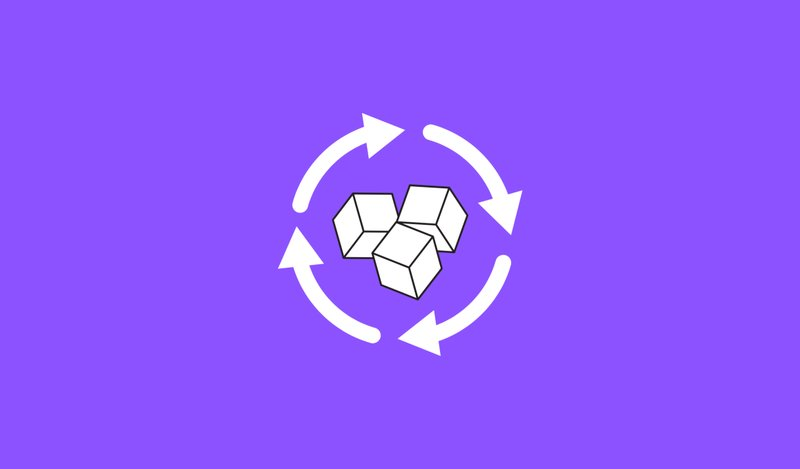
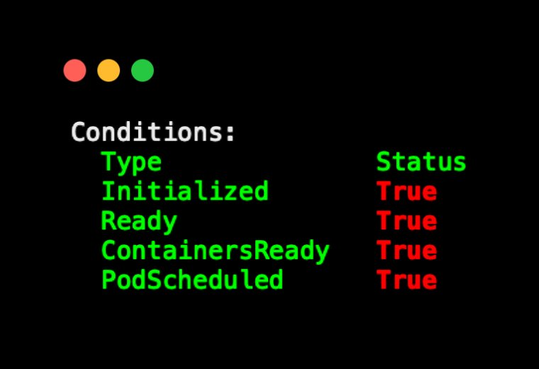

<small>【运维干货分享】实际例子来解释kubernetes中的pod的生命周期</small>

在这篇博客中，我们将通过示例和插图来了解 Kubernetes Pod 的生命周期。

如果你不熟悉 Pod 的概念，请阅读 Kubernetes Pod 博客以了解所有基础知识，并亲身实践创建和管理 Pod。

为了理解 pod 的生命周期，我们将查看以下内容

- Pod 阶段
- Pod 条件
- 容器状态

为了更好地理解这些概念，我们假设一个包含以下内容的多容器 pod

- 一个 init 容器，用于在运行时获取 API 密钥。
- container-01 （java-api） 运行 Java 应用程序
- container-02 （log-reader） 获取应用程序日志并将其发送到日志转发器。

我们将通过了解在部署具有上述要求的 Pod 时会发生什么来了解 Pod 生命周期。

## Pod 阶段

部署 Pod 时，它通常可能属于以下任何一个阶段。

|Pod阶段	|描述|
|-|-|
|Pending|	Pod 已创建，但尚未运行。
|Running|	至少有一个容器正在运行，或者正在启动或重新启动。
|Succeeded|	所有集装箱均已成功完成。
|Failed|	至少有一个容器出现故障。
|Unknown|	API 服务器无法获取 Pod 状态。

现在，让我们通过使用我们的应用程序 pod 的实时示例来了解这些阶段。我们将我们的 pod 称为 java-api-pod

以下是部署 Pod 多容器 Pod 时 Pod 阶段的工作方式。

### 1. Pending阶段
当你部署 api-pod 时，它将处于Pending阶段。在 Pod 进入 “Running” 阶段之前，init 容器将在任何其他容器启动之前运行完成。

以下是 Pod 继续处于挂起阶段的一些常见情况。

- 缺乏 pod 的 CPU 和内存资源。
- 如果 Pod 具有卷定义，但卷不可用。
- 如果 Kubernetes 无法拉取容器镜像。
- 如果 init 容器无法启动
- 如果 init 容器失败并出现非零退出代码，并且 restartPolicy 设置为 Never，则 Pod 将直接进入失败阶段。

### 2. Running阶段

在 init 容器完成获取密钥后，Pod 将进入“正在运行”阶段。container-01 和 container-02 都将启动。因为我们的 Java 应用程序是一个需要运行的 API，所以只要 Java API 应用程序启动，Pod 就会保持在“运行中”阶段。出于某种原因，如果任何容器无法启动，Pod 将进入失败阶段。

### 3. Succeeded阶段：
此阶段不适用于我们的 Java 应用程序，因为“成功”适用于完成任务然后退出的容器。

我们的 java-api-pod 旨在继续运行，因此除非你手动停止它，否则它不会到达此阶段。

成功阶段适用于属于 Kubernetes Job/Cronjob 对象的 Pod。

### 4. Failed阶段
如果你的 init 容器、Java 应用程序容器或日志读取器容器由于某种原因崩溃或退出，Pod 将进入 “Failed” 阶段。

在以下情况下，Pod 将进入失败阶段

- 如果 init 容器或主容器以非零退出代码退出，并且 restartPolicy 设置为 Never。
- 如果一个节点发生故障，或者 Pod 被逐出一个节点并且无法移动到另一个节点，它将进入失败状态。
- 如果 pod 启用了 activeDeadlineSeconds（通常在 Jobs 和 Cronjobs 上）字段并且超过了时间限制，则Pod 将被终止并标记为 Failed。

如果你手动删除了 Pod，但它无法正常终止，则 Pod 将进入失败状态。
### 5.Unknown阶段
这种情况很少见，但如果 api-server 由于某种原因无法获取 Pod 的状态，它将被标记为 “Unknown”。

## Pod 条件

Pod 的阶段提供了 Pod 当前状态的简要更新，因为 Pod 条件为你提供了与计划、就绪和初始化相关的详细信息。

如果你描述一个 pod，你将看到如下所示的条件部分。这些条件是 PodStatus 对象的一部分。

