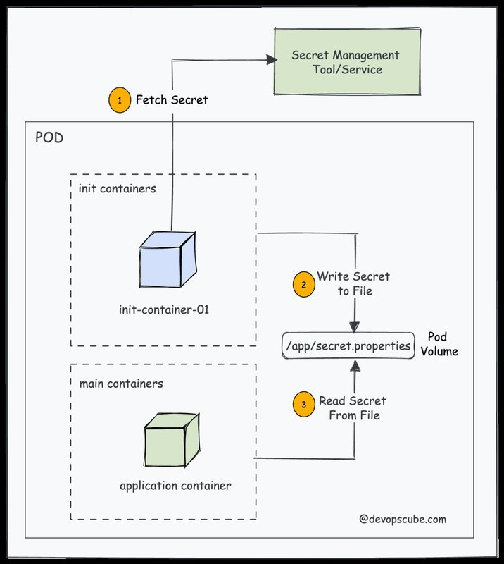

<small>【运维干货分享】Kubernetes Init 容器：完整指南</small>


在这篇博文中，我们将深入探讨 Kubernetes Init Containers。我们将探讨它们是什么、它们如何工作以及它们为容器化应用程序带来什么好处。

这是 Init Container 的完整指南。

在容器编排领域，Kubernetes 已成为管理和扩展容器化应用程序的解决方案。它提供了一个强大的框架，用于跨节点集群自动部署、扩展和管理容器。Kubernetes 的最佳功能之一是 Init Containers。

## 什么是 Init 容器？

Kubernetes Pod 可以有多个容器。Pod 中的这些容器协同工作以实现一个共同的目标。

Init 容器是在启动 Pod 中的主容器之前启动并运行完成的容器。它充当准备步骤，允许我们在主容器中执行初始化任务、配置先决条件或配置应用程序所需的依赖项。


让我们通过一个例子来理解这一点。

假设我们有一个应用程序，它需要一个密钥来连接到 API。由于合规性原因，你无法将此密钥硬编码到应用程序中或使用 Kubernetes 密钥。在这种情况下，你可以使用 init 容器从 Vault 或 AWS Secrets Manager 等秘密管理服务获取密钥，并将其写入 Pod 中应用程序容器可以访问它的位置。



这样，当应用程序 Pod 启动时，它将可以访问 secret 以连接到 API。

简而言之，init 容器可以确保你的应用程序在启动之前始终得到正确配置和初始化。

## Init 容器如何工作？

在深入研究 Init 容器之前，我们先了解一下它们的工作原理。

- kubelet按照 Init 容器在 Pod 的 spec 中出现的顺序运行它们，确保每个容器在开始下一个容器之前完成其任务。这意味着一次只运行一个 init 容器。
- Init Containers 在主应用程序容器启动之前运行。
- 如果 Pod 重启，则其所有 init 容器将再次运行。
- 在 Pod 生命周期中，init 容器在 pending 阶段运行完成。
- 虽然 init 容器具有相同的容器规范，但它们不支持 lifecycle、livenessProbe、readinessProbe 和 startupProbe 字段。（本机 sidecar Alpha 功能除外）

这是显示 init 容器工作原理的动画图像。


## Init 容器使用案例

init 容器的实际用例可能会因应用程序的特定需求而异。以下是一些常见的使用案例：

- 加载和配置依赖项：：Init 容器可以在主应用程序容器开始运行之前加载和配置主应用程序容器所需的依赖项。
- 创建数据库架构：你可以使用 init 容器创建数据库架构。
- 预热缓存：你可以使用 init 容器预热缓存。例如，将一些常用数据预加载到 Redis 缓存中。
- 网络配置：Init 容器可以处理建立网络配置或建立与外部服务的连接等任务。
- Git 克隆：Init 容器可以克隆 Git 存储库或将文件写入附加的 Pod 卷。
- 安全检查：Init 容器可以在启动主应用程序容器之前执行安全检查，例如漏洞扫描或 TLS 证书验证。
- 访问 Secrets：Init 容器可以访问应用程序容器无法访问的 Secret，例如从文件库中检索 Secret。
- 环境设置：：Init 容器可以处理创建目录、应用权限或运行自定义脚本等任务，以为主应用程序设置环境。
- Wait for Services：： Init 容器可以等待服务启动后再启动主应用程序。

### Init 容器实例

Init 容器在 Pod 的 manifest 字段中定义。这类似于常规定义。我们可以在 section 下定义尽可能多的容器。spec.initContainersspec.containersinitContainers

让我们看一个实际示例。这是我们的用户案例。我们需要一个在索引页面上显示 Pod IP 的 Nginx Web 服务器 pod。

以下是我们如何利用 init 容器来部署显示其 IP 地址的 pod。

- 一个名为 write-ip 的 init 容器使用从 Pod 自身状态填充的 MY_POD_IP env 变量获取 Pod IP。并写入附加到 Pod 的 /web-content 卷内的 ip.txt 文件。
- 名为 create-html 的第二个 Init 容器从 /web-content/ip.txt 文件中读取 Pod IP，该文件包含第一个 Init 容器创建的 Pod IP，并将其写入 /web-content/index.html 文件。
- 现在，主 nginx 容器 （web-container） 将默认的 /usr/share/nginx/html 挂载到我们拥有 index.html 文件的 /web-content 卷中。
- 这是我们用例的完整 Pod YAML 文件。另存为 init-container.yaml

```
apiVersion: v1
kind: Pod
metadata:
  name: web-server-pod
spec:
  initContainers:
  - name: write-ip
    image: busybox
    command: ["sh", "-c", "echo $MY_POD_IP > /web-content/ip.txt; echo 'Wrote the Pod IP to ip.txt'"]
    env:
    - name: MY_POD_IP
      valueFrom:
        fieldRef:
          fieldPath: status.podIP
    volumeMounts:
    - name: web-content
      mountPath: /web-content
  - name: create-html
    image: busybox
    command: ["sh", "-c", "echo 'Hello, World! Your Pod IP is: ' > /web-content/index.html; cat /web-content/ip.txt >> /web-content/index.html; echo 'Created index.html with the Pod IP'"]
    volumeMounts:
    - name: web-content
      mountPath: /web-content
  containers:
  - name: web-container
    image: nginx
    volumeMounts:
    - name: web-content
      mountPath: /usr/share/nginx/html
  volumes:
  - name: web-content
    emptyDir: {}
```

我们来部署这个 pod。

```
kubectl apply -f init-container.yaml
```

现在，如果你获得 Pod 状态，你将看到 1/1 容器正在运行

```
$ kubectl get pods
NAME             READY   STATUS    RESTARTS   AGE
web-server-pod   1/1     Running   0          22s
```

我们在 Pod 中有三个容器，但只有一个处于运行状态。这是因为正如我们之前讨论的，init contianers 运行到完成。在这种情况下，两个 init 容器创建了 nginx 索引 HTML 页面并以非零退出代码退出，然后主 nginx 容器开始与自定义 html 页面一起运行。

即使 init 容器没有运行，我们也可以检查已完成的容器日志。我们向两个 init 容器添加了一个简单的 echo 命令。让我们检查 init 容器日志，看看它是否成功执行。

如你所见，两个 init 容器都已成功执行，并在日志中显示回显消息。

```
$ kubectl logs web-server-pod -c write-ip   
Wrote the Pod IP to ip.txt

$ kubectl logs web-server-pod -c create-html
Created index.html with the Pod IP
```

现在，为了验证 Nginx Pod 是否正在使用自定义 HTML，让我们使用端口转发来访问 Nginx Pod

```
kubectl port-forward pod/web-server-pod 8080:80
```

现在，如果你尝试从工作站访问 localhost：8080 上的 Nginx 应用程序，则可以看到 Nginx 索引页面显示一条带有 Pod IP 地址的消息，如下图所示。


### 添加 CPU/内存资源

Init 容器需要运行 CPU 和内存资源才能完成特定任务。可以根据任务的严重程度设置限制和请求。

如果有多个 init 容器，则为任何 init 容器设置的最大值称为有效 init 请求/限制。这意味着，如果你有一个没有设置 CPU/内存限制的 init 容器，它可以使用有效 init 请求/限制的最大值。

我们可以使用 Kubernetes 资源规范来指定 CPU 和内存资源限制以及 Init 容器的请求，如下所示：

```
spec:
  initContainers:
    - name: init-container
      image: init-container-image
      resources:
        requests:
          cpu: 50m
          memory: 64Mi
        limits:
          cpu: 100m
          memory: 128Mi
```

根据 Init 容器的实际使用模式监控和调整资源限制是优化集群资源分配的一种很好的做法。但是，我们必须确保 Init 容器和主容器请求的资源之和不超过集群节点上的可用资源。

### 添加卷

Init Containers 中的卷在主应用程序容器开始运行之前执行数据设置、初始化和准备任务方面发挥着至关重要的作用。我们可以用同样的方式在 Init 容器中挂载卷。

例如，有时应用程序可能需要访问由于大小限制而我们不想捆绑在容器映像中的数据集或文件。在这种情况下，可以使用 Init Container 将这些数据集提取并加载到共享卷中，此外，主容器可以使用此卷。下面是示例 YAML 文件：

```
apiVersion: v1
kind: Pod
metadata:
  name: volume-example-pod
spec:
  initContainers:
    - name: download-dataset
      image: busybox
      command: ["wget", "-O", "/data/dataset.zip", "https://example.com/dataset.zip"]
      volumeMounts:
        - name: data-volume
          mountPath: /data
    - name: unzip-dataset
      image: busybox
      command: ["unzip", "/data/dataset.zip", "-d", "/data"]
      volumeMounts:
        - name: data-volume
          mountPath: /data
  containers:
    - name: main-app
      image: main-app-image
      volumeMounts:
        - name: data-volume
          mountPath: /app-data
  volumes:
    - name: data-volume
      emptyDir: {}
```

### 使用 Init 容器的原生 Sidecar

在 Kubernetes 版本 1.28 中，引入了一个新字段，该字段的值设置为 。.在撰写本文时，它是一个 Alpha 功能。restartPolicyAlways

此功能依赖于 “持久 init 容器” 的概念，其中初始化过程从 init 容器开始，并利用 来增强 sidecar 容器的功能。它在主容器之前启动，并在 Pod 的整个生命周期内保持运行。restartPolicy

所以简单地说，要使 init 容器成为 sidecar，我们需要将 attribute 添加到其 spec 中。它是一个可选字段，如果不存在，容器将充当常规的 init 容器。"restartPolicy: Always"restartPolicy

请注意，当集群中启用特性门控时，init 容器中的字段可用。目前，它是一个 Alpha 功能。如果你想测试原生的 sidecar 功能，我们有一个指南，展示了如何使用最新的 kubernetes 版本在 Kubeadm 中启用功能门控。
restartPolicySidecarContainers

现在让我们看一个带有用例的实际示例。

让我们假设以下场景

- 一个 nginx Web 服务器 Pod，带有一个 nginx 主容器，用于将日志写入 /var/log/nginx 卷挂载。
- 我们需要一个原生 sidecar fluentd 日志代理容器，用于从 /var/log/nginx 读取所有 nginx 日志。

以下是上述用例的 Pod YAML。nginx-logs 卷挂载对于 logging-agent sidecar 容器和 nginx 主容器很常见。将 restartPolicy： Always 添加到 logging-agent init 容器中，使其行为类似于 sidecar 容器。
```
apiVersion: v1
kind: Pod
metadata:
  name: webserver-pod
spec:
  initContainers:
  - name: logging-agent
    image: fluentd:latest
    restartPolicy: Always
    volumeMounts:
    - name: nginx-logs
      mountPath: /var/log/nginx
  containers:
  - name: nginx
    image: nginx:1.14.2
    ports:
    - containerPort: 80
    volumeMounts:
    - name: nginx-logs
      mountPath: /var/log/nginx
  volumes:
  - name: nginx-logs
    emptyDir: {}
```    

要测试它，请将其另存为 sidecar.yaml 并使用 kubectl 进行部署。

```
kubectl apply -f sidecar.yaml
```

现在，如果你检查 Pod 状态，则可以使用 2/2 的容器处于运行状态。一个是原生 sidecar init 容器，另一个是主 Nginx 容器。


总体而言，原生 sidecar 容器具有以下关键属性：

- 专用生命周期：原生 Sidecar 容器具有专用的生命周期，独立于 Pod 中主要容器的生命周期
- 它不会像非原生 sidecar 那样阻止 Pod 的终止。
- 生命周期处理程序和探测：我们可以添加PostStart和PreStop生命周期处理程序和探测（启动、准备、活跃）以确保边车准备和pod准备。

### 全面的 Init Container YAML

让我们看看如果我们添加所有支持的参数，Init Container 对象 YAML 文件会是什么样子。要获取有关所有受支持字段的信息，你可以使用以下 kubectl 命令。

```
kubectl explain pod.spec.initContainers
```

下面是全面的 Init Container YAML。
```
spec:
  initContainers:
  - name: init-container
    image: busybox:latest
    command:
    - "sh"
    - "-c"
    - "echo Initializing... && sleep 5"
    imagePullPolicy: IfNotPresent
    env:
    - name: INIT_ENV_VAR
      value: "init-value"
    resources:
      limits:
        memory: "128Mi"
        cpu: "500m"
      requests:
        memory: "64Mi"
        cpu: "250m"
    volumeMounts:
    - name: init-container-volume
      mountPath: /init-data
    ports:
    - containerPort: 80
    securityContext:
      runAsUser: 1000
      runAsGroup: 1000
      capabilities:
        add: ["NET_ADMIN"]
    readinessProbe:
      httpGet:
        path: /
        port: 80
      initialDelaySeconds: 5
      periodSeconds: 10
    livenessProbe:
      httpGet:
        path: /
        port: 80
      initialDelaySeconds: 15
      periodSeconds: 20
    startupProbe:
      httpGet:
        path: /
        port: 80
      initialDelaySeconds: 5
      periodSeconds: 5
    lifecycle:
       postStart:
         exec:
           command: ["/bin/sh", "-c", "echo 'PostStart'"]
       preStop:
         exec:
           command: ["/bin/sh", "-c", "echo 'PreStop'"]
    restartPolicy: Always
  volumes:
  - name: init-container-volume
    emptyDir: {}
```

还有其他字段，如 workingDir、volumeDevices、resizePolicy 与 init 容器卷相关。

## Init 容器最佳实践

以下是一些要遵循的最佳实践：

- 确保 Init 容器设计为快速执行特定任务，而不会使用太多资源。
- 如果你有多个初始化任务，请为每个任务使用单独的 init 容器。这有助于单独管理和排查它们。
- Init 容器可能会失败，因此请做好计划。实施重试、回退策略和清除错误消息，以有效地诊断和解决问题。
- 利用 Kubernetes 提供的运行前和运行后钩子，在容器生命周期的特定阶段运行自定义脚本或命令。
- 保护初始化期间使用的敏感信息并避免泄露。
- 确保 init 容器分配了足够的资源。缺少资源可能会导致初始化任务失败或延迟。
  
## Init 容器与 Sidecar 容器

- Init Container 执行需要在主容器启动之前完成的任务，而 Sidecar Container 则为主容器提供补充功能。
- Init Container 不与主容器共享相同的网络和存储资源，而 Sidecar Container 共享相同的网络和存储资源。
- Init Container 按顺序执行，并在主容器启动之前完成。另一方面，Sidecar Container 与主容器一起启动、运行和终止。
- Init Container 确保主容器从必要的先决条件开始，而 Sidecar Container 直接影响主容器的行为和功能。
- Init Containers 可用于为主应用程序设置环境，例如下载配置文件或初始化共享卷。Sidecar Containers 可用于将数据记录到外部系统、收集指标或处理与安全相关的功能等任务。

## Init Containers 常见问题

我们来看一些基于 Init Containers 的常见问题。

## Init 容器和普通容器有什么区别？

Init 容器和常规容器之间的主要区别在于它们的用途和生命周期。Init Containers 专注于初始化任务和确保就绪状态，而 Regular Containers 处理核心应用程序逻辑和功能。

## 我可以在一个 Pod 中拥有多个 init 容器吗？

是的，你可以在 Pod 中拥有多个 init 容器。它们按顺序执行，每个 init 容器在下一个 init 容器开始之前完成。

## Init Containers 和 Sidecar Containers 有什么区别？

Init Containers 专注于为主容器准备环境的初始化任务，而 Sidecar Containers 则提供与主容器配合使用的其他功能和服务，以增强其整个生命周期的功能。

## 结论

在本教程中，我们了解了 init 容器及其在 Kubernetes Cluster 节点中的用法。我们讨论了功能和优势。此外，我们还讨论了它的工作和用例。