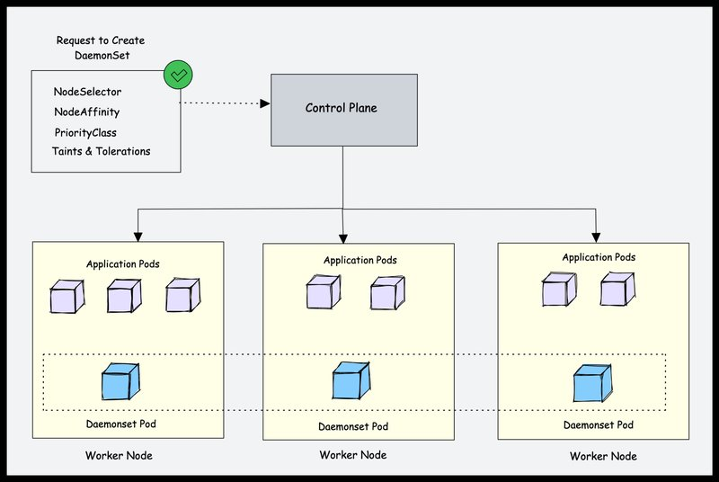
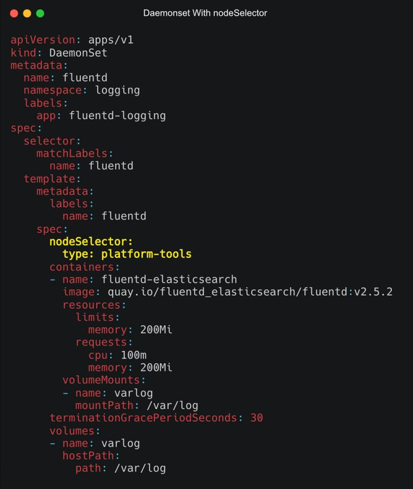

<small>【运维干货分享】面向初学者kubernetes-Daemonset学习指南</small>


如果你是 Kubernetes Daemonsets 的新手并想了解更多信息，那么这份完整的初学者指南非常适合你。

你将了解

- Daemonset 的工作原理
- 部署和管理 Daemonsets
- Daemonset 使用案例
- Daemonset 最佳实践。

因此，如果你想实际学习和实施 Daemonset，你会喜欢本指南。

## Kubernetes 中的 DaemonSet 是什么？

Kubernetes 是一个分布式系统，Kubernetes 平台管理员应该有一些功能可以在所有节点上运行特定于平台的应用程序。例如，在所有 Kubernetes 节点上运行日志记录代理。

这就是 Daemonset 的用武之地。

Daemonset 是一个原生 Kubernetes 对象。顾名思义，它旨在运行系统守护程序。

DaemonSet 对象旨在确保每个 worker 节点上运行单个 pod。这意味着你无法扩展节点中的 daemonset pod。出于某种原因，如果 daemonset pod 从节点中删除，daemonset 控制器会再次创建它。

让我们看一个例子。如果有 500 个 worker 节点并且你部署了一个 daemonset，则默认情况下，daemonset 控制器将为每个 worker 节点运行一个 pod。总共有 500 个 pod。但是，使用 nodeSelector、nodeAffinity、Taints 和 Tolerations，你可以将 daemonset 限制为在特定节点上运行。

例如，在包含 100 个 worker 节点的集群中，可能有 20 个标记为 GPU enabled 的工作节点来运行批处理工作负载。你应该在这 20 个 worker 节点上运行一个 pod。在这种情况下，你可以使用节点选择器将 Pod 部署为 Daemonset。我们将在本指南的后面部分实际介绍它。

另一个例子是，你有特定数量的专用于平台工具（入口、监控、日志记录等）的工作节点，并且希望仅在标记为平台工具的节点上运行与平台工具相关的 Daemonset。在这种情况下，你可以使用 nodeSelector 仅在专用于平台工具的工作节点上运行 daemonset pod。



## Kubernetes DaemonSet 使用案例

DaemonSet 的最基本用例是集群本身。如果你看一下 Kubernetes 架构，kube-proxy 组件会运行一个 daemonset。

以下是 Daemonset 的实际用例。

- 集群日志采集：在每个节点上运行日志收集器以集中 Kubernetes 日志记录数据。例如：fluentd 、 logstash、 fluentbit
- 集群监控：在集群中的每个节点上部署监控代理，例如 Prometheus Node Exporter，以收集和公开节点级指标。这样，prometheus 就可以获得所有必需的 worker 节点指标。
- 安全性与合规性：使用 kube-bench 等工具在每个节点上运行 CIS 基准测试。此外，在需要额外安全措施的特定节点上部署安全代理，例如入侵检测系统或漏洞扫描程序。例如，处理 PCI 和 PII 合规数据的节点。
- 存储预置： 在每个节点上运行存储插件，为整个集群提供共享存储系统。
- 网络管理：在每个节点上运行网络插件或防火墙，以确保一致的网络策略实施。例如，Calico CNI 插件在所有节点上作为 Daemonset 运行。

根据需求，我们可以为一种守护进程部署多个守护进程，使用各种标志或针对各种硬件类型的内存和 CPU 请求DaemonSet

### DaemonSet 示例

与其他 Kubernetes 对象一样，也可以使用 YAML 文件进行配置。我们需要创建一个清单文件，其中包含 .DaemonSetDaemonSet

假设我们想在所有集群 worker 节点上将 fluentd logging agent 作为 Deamonset 部署。

下面是部署在 logging 命名空间中的示例文件。daemonset.yaml

你还可以从 Kubernetes 课程 Github 存储库获取 daemonset YAML 示例

```
apiVersion: apps/v1
kind: DaemonSet
metadata:
  name: fluentd
  namespace: logging
  labels:
    app: fluentd-logging
spec:
  selector:
    matchLabels:
      name: fluentd
  template:
    metadata:
      labels:
        name: fluentd
    spec:
      containers:
      - name: fluentd-elasticsearch
        image: quay.io/fluentd_elasticsearch/fluentd:v2.5.2
        resources:
          limits:
            memory: 200Mi
          requests:
            cpu: 100m
            memory: 200Mi
        volumeMounts:
        - name: varlog
          mountPath: /var/log
      terminationGracePeriodSeconds: 30
      volumes:
      - name: varlog
        hostPath:
          path: /var/log
```

让我们了解一下清单文件。

- apiVersion：用于apps/v1DaemonSet
- kind：例如 Pod、Deployment 和 ServiceDaemonSet
- metadata:输入 、mention 命名空间、注释和标签的名称。在我们的例子中，name 是 fluentd。DaemonSetDaemonSet's
- spec.selector:Pod 的选择器由 .此值必须是 Pod 模板中指定的标签。此值是不可变的。DaemonSet
- spec.template 中：这是一个必填字段，用于指定要使用的 Pod 模板。以及容器的所有必填字段。它具有 Pod 架构的所有内容，除了 和 之外。DaemonSetapiVersionkind

template.metadata将包含有关 Pod 的详细信息，并将包含 Pod 的 Schema。template.spec

在 Pod 模板中，我们使用的映像将在 Kubernetes 集群中的每个节点上运行。然后，每个 Pod 都会收集日志并将数据发送到 ElasticSearch。添加了 Pod 的资源限制和请求，并相应地添加了 volume 和 volumeMount。quay.io/fluentd_elasticsearch/fluentd:v2.5.2

我们不提供任何副本计数，这是因为 DaemonSet 的副本计数本质上是动态的，因为它取决于集群的节点计数。

让我们使用以下命令部署此清单。首先，我们必须创建一个命名空间并在该命名空间中部署 daemonset。

```
kubectl create ns logging
kubectl apply -f daemonset.yaml
```
检查状态和 Pod 的状态。DaemonSet
```
kubectl get daemonset -n logging
kubectl get pods -n logging -o wide
```


你可以看到 fluentd pod 正在两个可用的 worker 节点上运行。

以下是一些其他有用的命令，用于描述、编辑和获取 .DaemonSet
```
kubectl describe daemonset -n logging
kubectl edit daemonset -n logging
#shortcut for daemonset is ds
kubectl get ds
```
### 为 Daemonset 应用 Taint 和 Tolerations

Taints并且是 Kubernetes 功能，允许你确保 Pod 不会放置在不适当的节点上。我们在 Pod 架构中污染节点并添加容忍度。Tolerations

kubectl taint nodes node1 key1=value1:<Effect>
有 3 种效果：

- NoSchedule：Kubernetes 调度器将只允许调度对受污染节点有容忍度的 Pod。
- PreferNoSchedule:Kubernetes 调度器将尝试避免调度对受污染节点没有容忍度的 Pod。
- NoExecute:如果 Pod 对受污染的节点没有容忍度，Kubernetes 将从节点中驱逐正在运行的 Pod。

下面，我对其中一个节点进行了关键的 app 和 value 监控，效果是 。我们不想在这个特定的节点上运行 pod。NoExecuteDaemonSet

```
kubectl taint node k8s-worker-2 app=fluentd-logging:NoExecute
```
现在，在我们的daemonset.yaml
```
spec:
  tolerations:
  - key: app
    value: fluentd-logging
    operator: Equal
    effect: NoExecute
  containers:
  -----
  -----
```

在更新 时，你将看到一个 Pod 已被删除，该 Pod 正在节点上运行。 现在不会在此节点上调度任何 Pod。DaemonSetk8s-worker-2DaemonSet


### 将 Nodeselector 用于 Daemonset Pod

我们可以用来在某些特定节点上运行 pod。 controller 将在匹配节点选择器的 key 和 value 的节点上创建 PodnodeSelectorDaemonSet

首先，你需要向节点添加标签。
```
kubectl label node <node-name> key=value
```
例如，假设你要将节点标记为 ，则可以使用以下命令。type=platform-tools
```
kubectl label node k8s-worker-1 type=platform-tools
```
现在，要将 nodeSelector 应用于 Daemonset，请在 spec 部分下添加带有键和值的 nodeSelector，如下所示。
```
spec:
  nodeSelector:
    <key>: <value>
```
下图显示了 Daemonset YAML，其中 nodeSelector 规范荧光笔为黄色。



### Daemonset 节点关联性

我们还可以使用 实现对节点选择方式的更精细控制。 controller 将在匹配的节点上创建 Pod。Node affinityDaemonSetNode affinity

Node affinity在概念上类似于 ，允许你根据节点标签限制 Pod 可以调度到哪些节点。有两种类型的节点关联：nodeSelector

- requiredDuringSchedulingIgnoredDuringExecution：除非满足规则，否则调度器无法调度 Pod。此功能类似于 ，但语法更具表现力。nodeSelector
- preferredDuringSchedulingIgnoredDuringExecution：调度器尝试查找满足规则的节点。如果没有匹配的节点，调度器仍然会调度 Pod。

我们可以将这样的 affinity 添加到我们的清单中

```
spec:
  affinity:
    nodeAffinity:
      requiredDuringSchedulingIgnoredDuringExecution:
        nodeSelectorTerms:
        - matchFields:
          - key: key-name
            operator: In
            values:
            - value-name
```

Pod 只允许在具有本节中提到的 key 和 values 的节点上运行。matchFields

以下 Daemonset YAML 使用以粗体突出显示的两种 Affinity 规则。节点标签的必需规则和选择实例标签实例类型 t2.large 的节点的首选规则

```
apiVersion: apps/v1
kind: DaemonSet
metadata:
  name: fluentd
  namespace: logging
  labels:
    app: fluentd-logging
spec:
  selector:
    matchLabels:
      name: fluentd
  template:
    metadata:
      labels:
        name: fluentd
    spec:
      affinity:
        nodeAffinity:
          requiredDuringSchedulingIgnoredDuringExecution:
            nodeSelectorTerms:
            - matchExpressions:
              - key: type
                operator: In
                values:
                - platform-tools
          preferredDuringSchedulingIgnoredDuringExecution:
          - weight: 1
            preference:
              matchExpressions:
              - key: instance-type
                operator: In
                values:
                - t2.large
      containers:
      - name: fluentd-elasticsearch
        image: quay.io/fluentd_elasticsearch/fluentd:v2.5.2
        resources:
          limits:
            memory: 200Mi
          requests:
            cpu: 100m
            memory: 200Mi
        volumeMounts:
        - name: varlog
          mountPath: /var/log
      terminationGracePeriodSeconds: 30
      volumes:
      - name: varlog
        hostPath:
          path: /var/log
```

### Daemonset 特权访问

在某些用例中，你需要从 Deamonset pod 对主机进行特权访问。例如，calico CNI daemoset 需要主机级访问权限来满足其网络要求，因为它需要修改 IPtables。

另一个例子是 Kube-proxy daemonset。它还需要特权访问。

你可以在 Pod Spec 中使用 securityContext 来允许或拒绝特权访问。安全上下文定义了 Pod 或 Container 的权限和访问控制设置。要指定 Pod 的安全设置，你需要在 Pod 清单中包含该字段。securityContext

```
spec:
  securityContext:
    runAsNonRoot: true
  containers:
  - name: fluentd-elasticsearch
    image: quay.io/fluentd_elasticsearch/fluentd:v2.5.2
    securityContext:
      allowPrivilegeEscalation: false
    -------
```

第一个是由对象定义的 Pod 级安全上下文，第二个是由单个容器定义的 SecurityContext。

- allowPrivilegeEscalation：AllowPrivilegeEscalation 控制进程是否可以获得比其父进程更多的权限。
- privileged：在特权模式下运行容器。特权容器中的进程本质上等同于主机上的 root。
- runAsNonRoot：指示容器必须以非 root 用户身份运行。
- runAsUser：用于运行容器进程入口点的 UID。
- runAsGroup：用于运行容器进程入口点的 GID。

### 滚动更新、回滚和删除 Daemonset

让我们看看更新、删除和回滚 Daemonset 部署的概念。

#### 滚动更新

DaemonSet有两种更新策略类型：

- OnDelete：使用该策略，只有在我们手动删除任何 Pod 时，才会创建 Pod。OnDeleteDaemonSet
- RollingUpdate：这是默认更新策略。使用该策略，每当更新模板时，旧 Pod 都会被杀死，并自动创建新 Pod。最多有一个 Pod 将运行。RollingUpdateDaemonSetDaemonSet

```
spec:
  updateStrategy:
    type: RollingUpdate
    rollingUpdate:
      maxUnavailable: 1
```

### 反转

我们可以使用以下命令回滚 ：DaemonSet

```
kubectl rollout undo daemonset <daemonset-name>
```

要检查 ： 的所有修订版DaemonSet
```
kubectl rollout history daemonset <daemonset-name>
```

如果要回滚到特定修订版，请使用：
```
kubectl rollout undo daemonset <daemonset-name> --to-revision=<revision>
```
#### 删除

kubectl delete daemonset <daemonset-name>

如果你希望 Pod 在节点上运行，请使用 Pod。--cascade=false

### DaemonSet Pod 优先级

Kubernetes Pod 优先级 确定一个 Pod 相对于另一个 Pod 的重要性。

我们可以设置一个更高的 pod，以防你作为 Deamonset 运行关键的系统组件。这可确保 daemonset Pod 不会被优先级较低或不太关键的 Pod 抢占。PriorityClassDaemonSet

PriorityClass用于定义 Pod 的优先级。 对象可以具有任何小于或等于 10 亿的 32 位整数值。值越高，优先级越高。PriorityClass

创建一个优先级类，并将其添加到 DaemonSet pod 规范
```
apiVersion: scheduling.k8s.io/v1
kind: PriorityClass
metadata:
  name: high-priority
value: 100000
globalDefault: false
description: "daemonset priority class"
```
通过运行此命令进行检查

```
kubectl get priorityClass
```

我们需要在priorityClassdaemonset.yaml

```
spec:
  priorityClassName: high-priority
  containers:
  ------
  ------
  terminationGracePeriodSeconds: 30
  volumes:
  ------
```

如果你看一下Kube-Proxy和Cluser CNI （Calico） Daemonsets，它的优先级类被设置为最高优先级的系统节点关键。它是 Kubernetes 中内置的 PriorityClass，适用于在任何情况下都不应驱逐的 Pod。

### Daemonset 故障排除

当节点上未运行任何 Pod 时，A 称为 unhealthy。造成这种情况的一般原因是 Pod 状态为 ，Pod 处于状态或处于状态。我们可以通过以下方式解决这个问题：DaemonSetcrashloopbackoffpendingerror

- Pod 可能资源不足。我们可以降低请求的 CPU 和内存。DaemonSet
- 我们可以将一些 Pod 从受影响的节点中移出以释放资源。使用 taint 和 tolerations 来防止 Pod 在某些节点上运行。
- 我们也可以扩展节点。

你可以执行常规的 Pod 故障排除步骤来找出问题。

### DaemonSet 最佳实践

以下是我们必须遵循的一些做法：

- DaemonSetPod 必须将 Restart Policy 设置为 或Alwaysunspecified
- 将每个命名空间单独分离，以确保明确隔离和更轻松的资源管理。DaemonSet
- 最好使用 而不是，因为如果新 Pod 所需的节点数大于可用节点数，则无法启动新的 Pod。preferredDuringSchedulingIgnoredDuringExecutionrequiredDuringSchedulingIgnoredDuringExecution
- DaemonSetpriority 应为 10000。不建议将 Pod 从集群节点中驱逐出去DaemonSet
- 我们必须指定一个与.spec.template.
- 我们可以在 pod 模式中使用。它告诉 Kubernetes 应该等待多长时间才能创建下一个 Pod。此属性可确保所有应用程序 Pod 在更新期间都处于就绪状态。minReadySeconds

## 结论

在本 kubernetes 教程中，我们了解了 Kubernetes 。 是在集群环境中管理和部署应用程序的好方法。DaemonSetsDaemonSet

我们已经看到了如何创建 along 及其用例。我们可以配置它们，使用容忍度和节点选择器在某些节点上创建 Pod，并以受控方式对它们执行滚动更新。DaemonSet