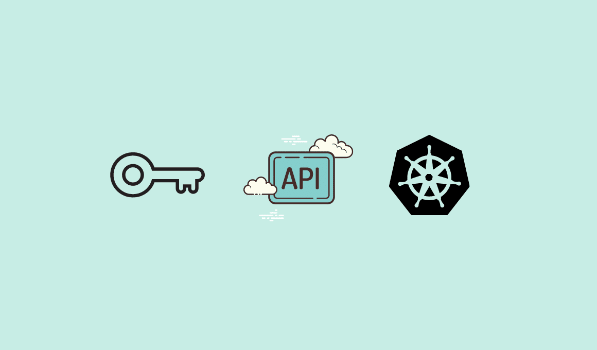

<small>【运维干货分享】如何为service Account创建kubernetes角色</small>



在此博客中，你将学习如何为服务账户创建 Kubernetes 角色，并将其与 pod、部署和 cronjobs 一起使用。

注意： 仅提供对命名空间中存在的资源的 API 访问。对于集群范围的 API 访问，你应该使用roleClusterRole

## 为服务帐户创建 Kubernetes 角色

让我们考虑以下场景

- 你在名为webapps 的命名空间中有 deployments/pod
- deployment/pod 需要 Kubernetes API 访问权限来管理命名空间中的资源。

上述场景的解决方案是拥有一个具有特定 API 访问权限的角色的服务账户。

- 创建绑定到命名空间 webapps 命名空间的服务帐户
- 使用对 Kubernetes 资源所需的 API 访问权限列表创建角色。
- 创建 Rolebinding 以将角色绑定到服务账户。
- 使用 pod/deployment 或 Kubernetes Cronjobs 中的服务帐户

让我们实现它。

### 创建 webapps Namespace

为了进行演示，我们将创建一个名为webapps

```
kubectl create namespace webapps
```

### 创建 Kubernetes 服务帐户

让我们创建一个名为app-service-account的服务帐户,并且绑定命名空间webapps

复制以下内容并直接在终端上执行。

```
cat <<EOF | kubectl apply -f -
apiVersion: v1
kind: ServiceAccount
metadata:
  name: app-service-account
  namespace: webapps
EOF
```

### 为 API 访问创建角色

在 kubernetes 角色中，我们指定 Kubernetes 资源所需的 API 访问列表。

注意：以下角色有权访问大多数 Kubernetes 资源，并具有所有读取、写入、列出、更新、修补和删除权限。在实际项目中实施它时，你应该只向角色添加所需的资源和操作。

让我们创建一个名为 app-role 的角色

复制以下内容并直接在终端上执行。

```
cat <<EOF | kubectl apply -f -
---
apiVersion: rbac.authorization.k8s.io/v1
kind: Role
metadata:
  name: app-role
  namespace: webapps
rules:
  - apiGroups:
        - ""
        - apps
        - autoscaling
        - batch
        - extensions
        - policy
        - rbac.authorization.k8s.io
    resources:
      - pods
      - componentstatuses
      - configmaps
      - daemonsets
      - deployments
      - events
      - endpoints
      - horizontalpodautoscalers
      - ingress
      - jobs
      - limitranges
      - namespaces
      - nodes
      - pods
      - persistentvolumes
      - persistentvolumeclaims
      - resourcequotas
      - replicasets
      - replicationcontrollers
      - serviceaccounts
      - services
    verbs: ["get", "list", "watch", "create", "update", "patch", "delete"]
EOF
```

让我们列出角色。

```
kubectl get roles -n webapps
```


### 创建角色绑定 [ 将角色附加到 ServiceAccount]

现在我们有一个服务账户和一个没有关系的角色。

使用 Rolebinding，我们将角色附加到服务账户。因此，使用 namespace 中的服务帐户的 Pod 将拥有webappsapp-role

复制以下内容并直接在终端上执行。

```

cat <<EOF | kubectl apply -f -
---
apiVersion: rbac.authorization.k8s.io/v1
kind: RoleBinding
metadata:
  name: app-rolebinding
  namespace: webapps 
roleRef:
  apiGroup: rbac.authorization.k8s.io
  kind: Role
  name: app-role 
subjects:
- namespace: webapps 
  kind: ServiceAccount
  name: app-service-account 
EOF
```

### 验证 Kubernetes 角色权限

我们将使用我通过 kubectl 实用程序创建的 Docker 镜像。bibinwilson/docker-kubectl

让我们部署一个名为debug的pod，使用 bibinwilson/docker-kubectl 镜像和我们的服务帐户app-service-account
```
cat <<EOF | kubectl apply -f -
---
apiVersion: v1
kind: Pod
metadata:
  name: debug
  namespace: webapps
spec:
  containers:
  - image: bibinwilson/docker-kubectl:latest
    name: kubectl
  serviceAccountName: app-service-account
EOF
```

让我们进入 pod 并查看是否具有我们在角色中提到的权限。

```
kubectl exec -it debug /bin/bash -n webapps
```

现在，你应该能够在 namespace 中列出 pod 和其他资源。你无法列出其他命名空间中的 Pod，因为此角色特定于 namespace。

如果你在没有服务帐户的情况下部署 Pod 并列出 Pod，你将收到以下错误。
```
Error from server (Forbidden): pods is forbidden: User "system:serviceaccount:webapps:default" cannot list resource "pods" in API group "" in the namespace "webapps"
```

附加到 Pod 的默认服务帐户对资源没有任何 API 访问权限。

### 将服务帐户与 Kubernetes Cronjob 结合使用

以下是使用服务账户的 Kubernetes Cronjob 示例。

```
apiVersion: batch/v1beta1
kind: CronJob
metadata:
    name: kubernetes-cron-job
spec:
  schedule: "0,15,30,45 * * * *"
  jobTemplate:
    spec:
      template:
        metadata:
          labels:
            app: cron-batch-job
        spec:
          restartPolicy: OnFailure
          serviceAccountName: app-service-account
          containers:
          - name: kube-cron-job
            image: devopscube/kubernetes-job-demo:latest
            args: ["100"]
```

### 在 Kubernetes 部署中使用服务帐户
以下是使用服务账户的 Kubernetes 部署示例。

```
apiVersion: apps/v1
kind: Deployment
metadata:
  name: nginx-deployment
  labels:
    app: nginx
spec:
  replicas: 3
  selector:
    matchLabels:
      app: nginx
  template:
    metadata:
      labels:
        app: nginx
    spec:
      serviceAccountName: app-service-account
      containers:
      - name: nginx
        image: nginx:1.14.2
        ports:
        - containerPort: 80
```

### 结论

在这篇博文中，我添加了创建 Kubernetes 角色并将其与 pod、部署和 Cronjonbs 一起使用所需的所有步骤。

需要特定于命名空间的角色的使用案例尤其不多。

一个主要用途是创建访问权限仅限于命名空间的用户。此外，创建服务帐户以从外部应用程序对命名空间进行 API 访问。