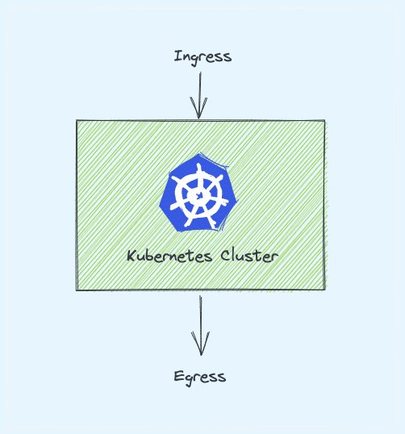
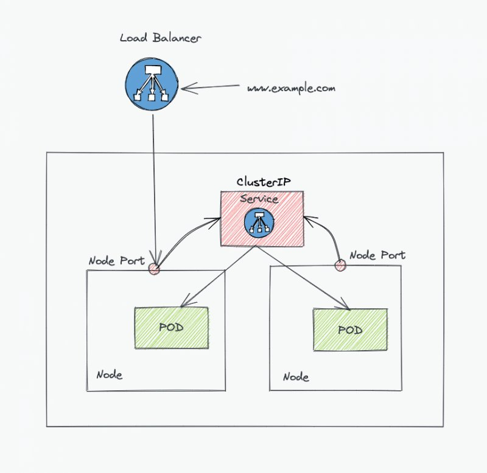
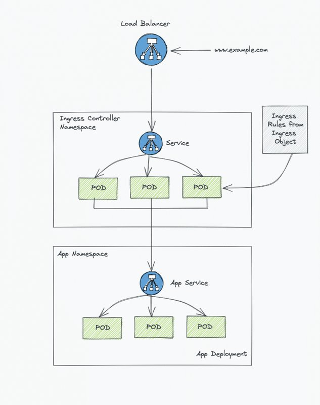
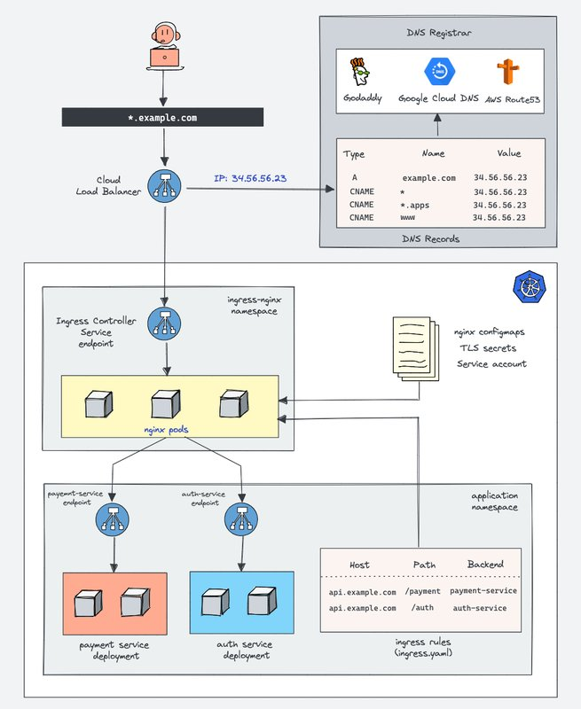

<small>【运维干货分享】面向初学者的kubernetes-ingress教程</small>

在此 Kubernetes Ingress 教程中，你将学习 Ingress 的基本概念、原生 Ingress 资源对象以及 Ingress controller中涉及的概念。

Kubernetes Ingress 是一种资源，用于添加规则以将流量从外部源路由到 kubernetes 集群中运行的应用程序。

以下是我将在本 Kubernetes Ingress 完整指南中介绍的主题：

```
什么是 Kubernetes Ingress？
在 Kubernetes Ingress 之前？
Kubernetes Ingress 是如何工作的？
Kubernetes Ingress资源
Kubernetes Ingresscontroller
Ingress controller如何工作？
Ingress和Ingresscontroller架构
Kubernetes Ingress Controller 列表
部署你的第一个 Ingress controller
Kubernetes Ingress 常见问题
```


## 什么是 Kubernetes Ingress？

字面意思是：Ingress 指的是进入的行为。

在 Kubernetes 世界中也是如此。Ingress 表示进入集群的流量，Egress 是离开集群的流量。



Ingress 是一种原生的 Kubernetes 资源，如 Pod、Deployment 等。使用Ingress，你可以维护 DNS 路由配置。Ingress controller通过从存储在 etcd 中的 Ingress 对象中读取路由规则来执行实际路由。

让我们通过一个高级示例来了解 Ingress。

如果没有 Kubernetes Ingress，要将应用程序暴露给外部世界，你需要将服务 Loadbalancer 添加到deployment中。这是它的外观。（我展示了 nodePort 只是为了显示流量）



在同一个实现中，使用 Ingress，负载均衡器和 kubernetes 服务端点之间有一个反向代理层（Ingress controller实现）。

这是 Ingress 实现的一个非常高级的视图。在后面的部分中，我们将看到涵盖所有关键概念的详细架构。



## 在 Kubernetes Ingress 之前？

在 Kubernetes Ingress 稳定之前，自定义 Nginx 或 HAproxy kubernetes 部署将作为 Loadbalancer 服务公开，用于将外部流量路由到内部集群服务。

路由规则作为 configmap 添加到 Nginx/HAProxy Pod 中。每当 dns 发生变化或需要添加新的路由条目时，它就会在 configmap 中更新，并且 Pod 配置会被重新加载，或者会被重新部署。

Kubernetes Ingress 也遵循类似的模式，将路由规则维护为原生 Kubernetes Ingress 对象，而不是 configmap。

而 Nginx/HAProxy 则用 Ingress controller、Nginx/HAProxy 的定制版本等来代替 Nginx/HAProxy，它们可以动态地获取路由规则。

此外，还有一些使用 consul 和其他服务发现工具的实现，在不停机的情况下将 DNS 更改更新到 Nginx 或 HAproxy，这带来了与Ingress完全相同的实现。

对于 openshift，路由器（HAproxy 实现）概念使在集群外部公开服务端点变得容易。你所要做的就是创建一个路由器配置（Openshift YAML 对象），openshift 路由器会处理所有事情。它类似于 Kubernetes Ingress。

## Kubernetes Ingress 是如何工作的？

如果你是初学者并试图了解 Ingress，则可能会对其工作原理感到困惑。

例如，你可能会问，嘿，我创建了入站规则，但我不确定如何将其映射到域名或将外部流量路由到内部部署。

你需要非常清楚两个关键概念才能理解这一点。

- Kubernetes Ingress资源：Kubernetes Ingress 资源负责将 DNS 路由规则存储在集群中。
- Kubernetes Ingress controller：Kubernetes Ingress controller（Nginx/HAProxy 等）负责通过访问通过Ingress资源应用的 DNS 规则进行路由。


让我们详细看看 Ingress 资源和 Ingress controller。

## Kubernetes Ingress资源

Kubernetes Ingress 资源是原生 kubernetes 资源，你可以在其中指定 DNS 路由规则。这意味着，你可以将外部 DNS 流量映射到内部 Kubernetes 服务终端节点。

它需要一个 Ingress controller来路由 Ingress 对象中指定的规则。让我们看一下一个非常基本的 Ingress 资源。

```
apiVersion: networking.k8s.io/v1
kind: Ingress
metadata:
  name: test-ingress
  namespace: dev
spec:
  rules:
  - host: test.apps.example.com
    http:
      paths:
      - backend:
          serviceName: hello-service
          servicePort: 80
```

上述声明意味着，所有对test.apps.example.com的调用都应该命中驻留在 dev 命名空间中的名为hello-service的服务。

如你所见，它所拥有的只是路由规则。你可以为基于路径的路由添加多个路由端点，也可以添加 TLS 配置等。

需要了解的有关 Ingress 对象的关键事项。

- Ingress 对象需要 Ingress controller来路由流量。
- 最重要的是，外部流量不会到达Ingress API，而是会到达直接使用负载均衡器配置的Ingress controller服务端点。

现在，让我们了解一下 Ingress controller。

## Kubernetes Ingress controller

Ingress controller不是原生 Kubernetes 实现。这意味着集群中不会默认有.

我们需要设置一个 Ingress controller，才能让 Ingress 规则正常工作。有几个开源和企业Ingress controller可用。

Ingress controller通常是集群中的反向 Web 代理服务器实现。在 kubernetes 术语中，它是一个反向代理服务器，部署为 kubernetes deployment，向服务类型 Loadbalancer 公开。

你可以在集群中将多个 Ingress Controller 映射到多个负载均衡器。每个 Ingress controller都应该有一个名为 ingress-class 的唯一标识符添加到注解中。

## Ingress controller如何工作？

Nginx 是广泛使用的 Ingress controller之一。

那么让我们以 Nginx Ingresscontroller实现为例来了解它是如何工作的。


- Nginx controller Pod 中的文件是一个 lua 模板，可以与 Kubernetes Ingress API 通信，并实时获取流量路由的最新值。
- Nginx controller与 Kubernetes Ingress API 通信，以检查是否为流量路由创建了任何规则。
- 如果找到任何Ingress规则，Nginx controller会在每个 nginx pod 内的 location 内生成路由配置。/etc/nginx/conf.d
- 对于你创建的每个 Ingress 资源，Nginx 都会在 location 中生成一个配置。/etc/nginx/conf.d
- 主文件包含来自/etc/nginx/nginx.confetc/nginx/conf.d.
- 如果使用新配置更新 Ingress 对象，则 Nginx 配置将再次更新并正常重新加载配置。
- 如果使用 exec 连接到 Nginx Ingress controller Pod 并检查文件，则可以看到在 conf 文件中应用的 Ingress 对象中指定的所有规则。/etc/nginx/nginx.conf

## Ingress和Ingresscontroller架构

这是解释kubernetes集群上的Ingress和Ingresscontroller设置的架构图。

它显示了将流量路由到两个和应用程序的Ingress规则paymentauth

现在，如果你看一下架构，它会更有意义，你可能能够理解每个 Ingress 工作流是如何工作的。



## Kubernetes Ingress Controller 列表

以下是可用于 Kubernetes 的常用 Ingress controller。

- Nginx Ingress controller（社区 & 来自 Nginx Inc)
- Traefik
- HAproxy
- Contour
- 适用于 GKE 的 GKE Ingress controller
- AWS ALB Ingress Controller Fro AKS
- Azure Application Gateway Ingress Controller

Learnk8s 创建了一个很棒的文档，比较了所有可用的Ingress controller。

## 部署你的第一个 Ingress controller

为了更好地理解 ingress 和 ingress controller，你应该熟悉 implementation 。

我已经发布了一个关于设置 Nginx Ingresscontroller的详细指南。

我还详细介绍了一些基本概念，例如 Ingress 准入controller。

此外，我还提供了分步的 manifest 部署和解释，以便深入了解。

查看 Nginx Ingresscontroller设置指南。(下面一篇文章具体介绍)

## Kubernetes Ingress 常见问题

### Ingress 是负载均衡器吗？

Ingress 不是负载均衡器。它包含所有路由规则、自定义标头和 TLS 配置。Ingress controller充当负载均衡器。

### 为什么我需要 Ingress controller？
Ingress controller负责将外部流量实际路由到 kubernetes 服务端点。如果没有 Ingress controller，添加到 Ingress 的路由规则将不起作用。

### ingress 和 Nginx 有什么区别？
Ingress 是一个 kubernetes 对象。Nginx 用作 Ingress controller（反向代理）。

### 我们可以使用 Ingress 将流量路由到多个路径吗？

是的。使用单个Ingress定义，你可以添加多个基于路径的路由配置。

### Ingress 是否支持 TLS 配置？

是的。你可以在Ingress对象定义中使用 TLS 配置。TLS 证书将添加为 Kubernetes 密钥，并在 Ingress 对象中引用。

## 结论
在本 Kubernetes Ingress 教程中，我们了解了 Ingress 在 Kubernetes 中的工作原理。及其相关组件。选择用于生产的 Ingress controller取决于各种因素和要求。

你可以使用 Ingress controller比较文档作为参考来选择 Ingress controller。

也许刚刚开始学习 ingress 或目前正在项目中使用 ingress。

无论哪种方式，请在下方发表评论，让我知道你的想法。