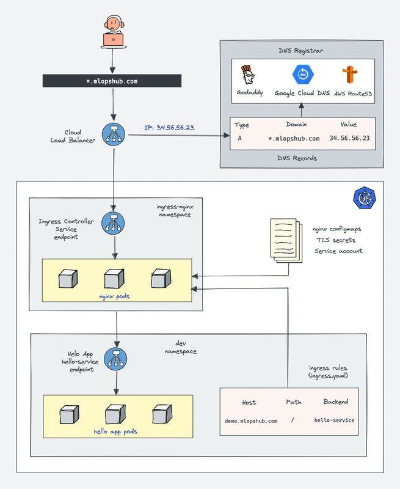
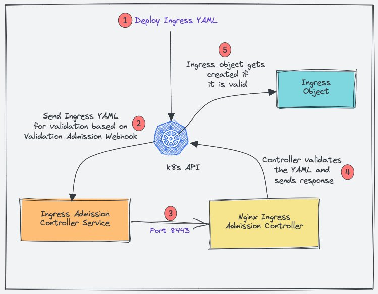
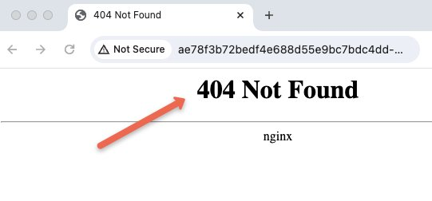
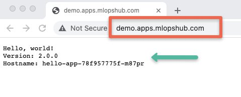
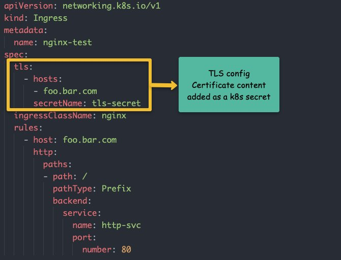

<small>【运维干货分享】如何在 Kubernetes 上设置 Nginx Ingress controller – 详细指南</small>


在本全面的 Ingress 指南中，你将学习如何在 Kubernetes 上设置 Nginx Ingress controller并使用 DNS 配置Ingress 。

如果你想了解 Kubernetes Ingress 是如何工作的，请阅读(我的上一篇文章) Kubernetes Ingress 教程。适合初学者。我已经解释了所有Ingress 核心概念，包括 Ingress 对象如何与 Ingress controller配合使用。

有两个 Nginx Ingress controller。

- Kubernetes 社区的 Nginx Ingress controller
- Nginx Inc 的 Nginx Ingress controller

我们将使用 Kubernetes 社区 Nginx controller。

## Ingress & Nginx Ingress controller架构

以下是使用 Nginx Ingress controller的 Kubernetes Ingress 的高级架构。在本指南中，我们将学习如何在架构中构建设置。

(注：点击图片以高分辨率查看）



## 先决条件
- 1.Kubernetes 集群
- 2.kubectl 实用程序并验证了 Kubernetes 集群。
- 3.对 kubernetes 集群的管理员访问权限。
- 4.指向Ingress controller负载均衡器 IP 的有效域。（可选)

如果你在 Google Cloud 上尝试此设置，请为你的账户分配管理员权限以启用集群角色。

```
ACCOUNT=$(gcloud info --format='value(config.account)')
kubectl create clusterrolebinding owner-cluster-admin-binding \
    --clusterrole cluster-admin \
    --user $ACCOUNT
```

## Nginx Ingress controller Kubernetes manifests

本教程中使用的所有 kubernetes 清单都托管在 Github 存储库中(github.com/techiescamp/nginx-ingress-controller)。

克隆它，然后你可以按照指南直接部署 YAML 文件。这些清单取自官方 Nginx 社区存储库。

```
git clone https://github.com/techiescamp/nginx-ingress-controller
```

首先，我们将通过使用 YAML 清单部署 Nginx controller来了解所有相关的 Kubernetes 对象。一旦我们了解了，我们将使用 Helm Chart 进行部署。

注意：如果你想了解所有的 Nginx Ingress controller对象以及它们之间的关系，我建议你从 repo 中单独创建对象。了解其工作原理后，可以使用单个清单或 helm 图表来部署它。

如果要一次性部署所有对象，请在 termal 中打开克隆的存储库。

cd  到 manifest 文件夹并执行以下命令。它将部署本博客中介绍的所有清单。

```
kubectl apply -f .
```

## 使用 manifest 部署 nginx Ingress Controller

我们需要部署以下 Kubernetes 对象才能拥有一个有效的 Nginx controller。

- ingress-nginx命名空间
- Nginx admission controller的 service account/Roles/ClusterRoles
- 验证 Webhook 配置
- 用于创建/更新 Webhook CA 捆绑包的作业
- Nginx Controller deployment的 Service account/Roles/ClusterRoles
- Nginx controller configmap
- nginx controller和admission controller的Service
- Ingress controller deployment
  
注意：你可以自己创建所有清单，也可以使用 Github 存储库。但是，我强烈建议你仔细阅读每个清单并了解你正在部署的内容。

### 需要admission controller和验证Webhook

Kubernetes admission controller是一小段代码，用于在创建 Kubernetes 对象之前对其进行验证或更新。在本例中，它是一个用于验证 Ingress 对象的admission controller。admission  Controller 代码是 Nginx controller的一部分，用于监听 8443 端口

为什么需要 admission  controller来 ingress？

如果没有admission controller，你可以部署可能包含错误配置的 Ingress 对象。错误的配置可能会破坏与 Ingress controller关联的所有 Ingress 规则。

使用admission controller后，如果部署配置错误的 Ingress 对象，它将引发错误。这样，你可以确保你创建的 Ingress 对象具有正确的配置并且不会违反路由规则。

以下是 Nginx 的admission controller是如何工作的。



- 1.当你部署Ingress  YAML 时，验证admission 会拦截请求。
- 2.然后，Kubernetes API 根据admission  Webhook 端点将Ingress 对象发送到验证admission controller服务端点。
- 3.Service 将请求发送到端口 8443 上的 Nginx deployment，以验证 Ingress 对象。
- 4.然后，admission controller向 k8s API 发送响应。
- 5.如果是有效响应，API 将创建 Ingress 对象。

现在让我们开始为 Ingress controller创建 Kubernetes 对象。

注意：在以下部分中，你不一定必须复制和创建 YAML 文件。你可以直接使用存储库中的文件并部署它。我在这里提供了完整的 YAML 以供参考。

### 创建 Namespace

我们将在命名空间中部署所有 Nginx controller对象。ingress-nginx

让我们创建命名空间。
```
kubectl create ns ingress-nginx
```
### 创建admission controller角色和服务账户

我们需要一个具有所需权限的 Role 和 ClusterRole 并绑定到 service account。ingress-nginx-admission 

创建一个名为admission-service-account.yaml的文件并复制以下内容。

```
---
apiVersion: v1
kind: ServiceAccount
metadata:
  labels:
    app.kubernetes.io/component: admission -webhook
    app.kubernetes.io/instance: ingress-nginx
    app.kubernetes.io/name: ingress-nginx
  name: ingress-nginx-admission 
  namespace: ingress-nginx

---
apiVersion: rbac.authorization.k8s.io/v1
kind: Role
metadata:
  annotations:
    app.kubernetes.io/component: admission -webhook
    app.kubernetes.io/instance: ingress-nginx
    app.kubernetes.io/name: ingress-nginx
  name: ingress-nginx-admission 
  namespace: ingress-nginx
rules:
- apiGroups:
  - ""
  resources:
  - secrets
  verbs:
  - get
  - create

---
apiVersion: rbac.authorization.k8s.io/v1
kind: RoleBinding
metadata:
  labels:
    app.kubernetes.io/component: admission -webhook
    app.kubernetes.io/instance: ingress-nginx
    app.kubernetes.io/name: ingress-nginx
  name: ingress-nginx-admission 
  namespace: ingress-nginx
roleRef:
  apiGroup: rbac.authorization.k8s.io
  kind: Role
  name: ingress-nginx-admission 
subjects:
- kind: ServiceAccount
  name: ingress-nginx-admission 
  namespace: ingress-nginx


---
apiVersion: rbac.authorization.k8s.io/v1
kind: ClusterRole
metadata:
  labels:
    app.kubernetes.io/component: admission -webhook
    app.kubernetes.io/instance: ingress-nginx
    app.kubernetes.io/name: ingress-nginx
  name: ingress-nginx-admission 
rules:
- apiGroups:
  - admission registration.k8s.io
  resources:
  - validatingwebhookconfigurations
  verbs:
  - get
  - update

---
apiVersion: rbac.authorization.k8s.io/v1
kind: ClusterRoleBinding
metadata:
  labels:
    app.kubernetes.io/component: admission -webhook
    app.kubernetes.io/instance: ingress-nginx
    app.kubernetes.io/name: ingress-nginx
  name: ingress-nginx-admission 
roleRef:
  apiGroup: rbac.authorization.k8s.io
  kind: ClusterRole
  name: ingress-nginx-admission 
subjects:
- kind: ServiceAccount
  name: ingress-nginx-admission 
  namespace: ingress-nginx
```

部署清单。
```
kubectl apply -f admission -service-account.yaml 
```
### 创建验证 Webhook 配置
创建一个名为validating-webhook.yaml的文件并复制以下内容。
```
---
apiVersion: admission registration.k8s.io/v1
kind: ValidatingWebhookConfiguration
metadata:
  labels:
    app.kubernetes.io/component: admission -webhook
    app.kubernetes.io/instance: ingress-nginx
    app.kubernetes.io/name: ingress-nginx
  name: ingress-nginx-admission 
webhooks:
- admission ReviewVersions:
  - v1
  clientConfig:
    service:
      name: ingress-nginx-controller-admission 
      namespace: ingress-nginx
      path: /networking/v1/ingresses
  failurePolicy: Fail
  matchPolicy: Equivalent
  name: validate.nginx.ingress.kubernetes.io
  rules:
  - apiGroups:
    - networking.k8s.io
    apiVersions:
    - v1
    operations:
    - CREATE
    - UPDATE
    resources:
    - ingresses
  sideEffects: None
```
创建ValidatingWebhookConfiguration
```
kubectl apply -f validating-webhook.yaml
```
### 部署作业以更新 Webhook 证书
只能通过 HTTPS 工作。因此，它需要一个 CA 捆绑包。ValidatingWebhookConfiguration

我们使用 kube-webhook-certgen 为第一个作业生成 CA 证书包。生成的 CA 证书存储在名为ingress-nginx-admission 

第二个任务使用 CA 捆绑包修补对象。ValidatingWebhookConfiguration

创建一个名为jobs.yaml的文件并复制以下内容。

```
---
apiVersion: batch/v1
kind: Job
metadata:
  labels:
    app.kubernetes.io/component: controller
    app.kubernetes.io/instance: ingress-nginx
    app.kubernetes.io/name: ingress-nginx
  name: ingress-nginx-admission -create
  namespace: ingress-nginx
spec:
  template:
    metadata:
      labels:
        app.kubernetes.io/component: controller
        app.kubernetes.io/instance: ingress-nginx
        app.kubernetes.io/name: ingress-nginx
      name: ingress-nginx-admission -create
    spec:
      containers:
      - args:
        - create
        - --host=ingress-nginx-controller-admission ,ingress-nginx-controller-admission .$(POD_NAMESPACE).svc
        - --namespace=$(POD_NAMESPACE)
        - --secret-name=ingress-nginx-admission 
        env:
        - name: POD_NAMESPACE
          valueFrom:
            fieldRef:
              fieldPath: metadata.namespace
        image: registry.k8s.io/ingress-nginx/kube-webhook-certgen:v20231011-8b53cabe0
        imagePullPolicy: IfNotPresent
        name: create
        securityContext:
          allowPrivilegeEscalation: false
      nodeSelector:
        kubernetes.io/os: linux
      restartPolicy: OnFailure
      securityContext:
        runAsNonRoot: true
        runAsUser: 2000
      serviceAccountName: ingress-nginx-admission 
---
apiVersion: batch/v1
kind: Job
metadata:
  labels:
    app.kubernetes.io/component: admission -webhook
    app.kubernetes.io/instance: ingress-nginx
    app.kubernetes.io/name: ingress-nginx
  name: ingress-nginx-admission -patch
  namespace: ingress-nginx
spec:
  template:
    metadata:
      labels:
        app.kubernetes.io/component: admission -webhook
        app.kubernetes.io/instance: ingress-nginx
        app.kubernetes.io/name: ingress-nginx
      name: ingress-nginx-admission -patch
    spec:
      containers:
      - args:
        - patch
        - --webhook-name=ingress-nginx-admission 
        - --namespace=$(POD_NAMESPACE)
        - --patch-mutating=false
        - --secret-name=ingress-nginx-admission 
        - --patch-failure-policy=Fail
        env:
        - name: POD_NAMESPACE
          valueFrom:
            fieldRef:
              fieldPath: metadata.namespace
        image: registry.k8s.io/ingress-nginx/kube-webhook-certgen:v20231011-8b53cabe0
        imagePullPolicy: IfNotPresent
        name: patch
        securityContext:
          allowPrivilegeEscalation: false
      nodeSelector:
        kubernetes.io/os: linux
      restartPolicy: OnFailure
      securityContext:
        runAsNonRoot: true
        runAsUser: 2000
      serviceAccountName: ingress-nginx-admission 
```

创建任务
```
kubectl apply -f jobs.yaml
```

使用以下命令验证作业完成情况。
```
kubectl get jobs -n ingress-nginx
```
执行作业后，你可以描述 ，你将看到修补的捆绑包。ValidatingWebhookConfigurationand
```
kubectl describe ValidatingWebhookConfiguration ingress-nginx-admission 
```
### 创建Ingress controller角色和服务账户

创建一个名为ingress-service-account.yaml的文件并复制以下内容。

```
---
apiVersion: v1
kind: ServiceAccount
metadata:
  labels:
    app.kubernetes.io/component: admission -webhook
    app.kubernetes.io/instance: ingress-nginx
    app.kubernetes.io/name: ingress-nginx
  name: ingress-nginx
  namespace: ingress-nginx

---
apiVersion: rbac.authorization.k8s.io/v1
kind: Role
metadata:
  labels:
    app.kubernetes.io/component: controller
    app.kubernetes.io/instance: ingress-nginx
    app.kubernetes.io/name: ingress-nginx
  name: ingress-nginx
  namespace: ingress-nginx
rules:
- apiGroups:
  - ""
  resources:
  - namespaces
  verbs:
  - get
- apiGroups:
  - ""
  resources:
  - configmaps
  - pods
  - secrets
  - endpoints
  verbs:
  - get
  - list
  - watch
- apiGroups:
  - ""
  resources:
  - services
  verbs:
  - get
  - list
  - watch
- apiGroups:
  - networking.k8s.io
  resources:
  - ingresses
  verbs:
  - get
  - list
  - watch
- apiGroups:
  - networking.k8s.io
  resources:
  - ingresses/status
  verbs:
  - update
- apiGroups:
  - networking.k8s.io
  resources:
  - ingressclasses
  verbs:
  - get
  - list
  - watch
- apiGroups:
  - ""
  resourceNames:
  - ingress-controller-leader
  resources:
  - configmaps
  verbs:
  - get
  - update
- apiGroups:
  - ""
  resources:
  - configmaps
  verbs:
  - create
- apiGroups:
  - ""
  resources:
  - events
  verbs:
  - create
  - patch

---
apiVersion: rbac.authorization.k8s.io/v1
kind: RoleBinding
metadata:
  labels:
    app.kubernetes.io/component: controller
    app.kubernetes.io/instance: ingress-nginx
    app.kubernetes.io/name: ingress-nginx
  name: ingress-nginx
  namespace: ingress-nginx
roleRef:
  apiGroup: rbac.authorization.k8s.io
  kind: Role
  name: ingress-nginx
subjects:
- kind: ServiceAccount
  name: ingress-nginx
  namespace: ingress-nginx

---
apiVersion: rbac.authorization.k8s.io/v1
kind: ClusterRole
metadata:
  labels:
    app.kubernetes.io/component: controller
    app.kubernetes.io/instance: ingress-nginx
    app.kubernetes.io/name: ingress-nginx
  name: ingress-nginx
rules:
- apiGroups:
  - ""
  resources:
  - configmaps
  - endpoints
  - nodes
  - pods
  - secrets
  - namespaces
  verbs:
  - list
  - watch
- apiGroups:
  - ""
  resources:
  - nodes
  verbs:
  - get
- apiGroups:
  - ""
  resources:
  - services
  verbs:
  - get
  - list
  - watch
- apiGroups:
  - networking.k8s.io
  resources:
  - ingresses
  verbs:
  - get
  - list
  - watch
- apiGroups:
  - ""
  resources:
  - events
  verbs:
  - create
  - patch
- apiGroups:
  - networking.k8s.io
  resources:
  - ingresses/status
  verbs:
  - update
- apiGroups:
  - networking.k8s.io
  resources:
  - ingressclasses
  verbs:
  - get
  - list
  - watch

---
apiVersion: rbac.authorization.k8s.io/v1
kind: ClusterRoleBinding
metadata:
  labels:
    app.kubernetes.io/component: controller
    app.kubernetes.io/instance: ingress-nginx
    app.kubernetes.io/name: ingress-nginx
  name: ingress-nginx
roleRef:
  apiGroup: rbac.authorization.k8s.io
  kind: ClusterRole
  name: ingress-nginx
subjects:
- kind: ServiceAccount
  name: ingress-nginx
  namespace: ingress-nginx
```

部署清单。
```
 kubectl apply -f ingress-service-account.yaml
```
### 创建 Configmap

使用此 configmap，你可以自定义 Nginx 设置。例如，你可以设置自定义标头和大多数 Nginx 设置。

请参阅官方社区文档，了解所有支持的配置。

创建一个名为configmap.yaml的文件并复制以下内容。

```
---
apiVersion: v1
data:
  allow-snippet-annotations: "true"
kind: ConfigMap
metadata:
  labels:
    app.kubernetes.io/component: controller
    app.kubernetes.io/instance: ingress-nginx
    app.kubernetes.io/name: ingress-nginx
  name: ingress-nginx-controller
  namespace: ingress-nginx
```
创建 configmap。
```
kubectl apply -f configmap.yaml
```
### 创建Ingress controller和admission controller服务

创建一个名为services.yaml的文件并复制以下内容。

```
---
apiVersion: v1
kind: Service
metadata:
  labels:
    app.kubernetes.io/component: controller
    app.kubernetes.io/instance: ingress-nginx
    app.kubernetes.io/name: ingress-nginx
  name: ingress-nginx-controller
  namespace: ingress-nginx
spec:
  externalTrafficPolicy: Local
  ipFamilies:
  - IPv4
  ipFamilyPolicy: SingleStack
  ports:
  - appProtocol: http
    name: http
    port: 80
    protocol: TCP
    targetPort: http
  - appProtocol: https
    name: https
    port: 443
    protocol: TCP
    targetPort: https
  selector:
    app.kubernetes.io/component: controller
    app.kubernetes.io/instance: ingress-nginx
    app.kubernetes.io/name: ingress-nginx
  type: LoadBalancer
---
apiVersion: v1
kind: Service
metadata:
  labels:
    app.kubernetes.io/component: controller
    app.kubernetes.io/instance: ingress-nginx
    app.kubernetes.io/name: ingress-nginx
  name: ingress-nginx-controller-admission 
  namespace: ingress-nginx
spec:
  ports:
  - appProtocol: https
    name: https-webhook
    port: 443
    targetPort: webhook
  selector:
    app.kubernetes.io/component: controller
    app.kubernetes.io/instance: ingress-nginx
    app.kubernetes.io/name: ingress-nginx
  type: ClusterIP
```

创建服务。
```
kubectl apply -f services.yaml
```

ingress-nginx-controller service 会在你正在部署的相应云平台中创建 Loadbalancer。

你可以使用以下命令获取负载均衡器 IP/DNS。

```
kubectl --namespace ingress-nginx get services -o wide -w ingress-nginx-controller
```

注意：对于每个云提供商，都有特定的注释可用于将静态 IP 地址和其他配置映射到 Loadbalancer。

### 创建 IngressClass

创建一个名为ingressclass.yaml的文件并复制以下内容。

---
apiVersion: networking.k8s.io/v1
kind: IngressClass
metadata:
  labels:
    app.kubernetes.io/component: admission -webhook
    app.kubernetes.io/instance: ingress-nginx
    app.kubernetes.io/name: ingress-nginx
  name: nginx
spec:
  controller: k8s.io/ingress-nginx
部署 ingress 类。
```
kubectl apply -f ingressclass.yaml
```

它将创建一个名为 nginx 的 Ingress 类。我们必须在我们创建的 Ingress 对象中使用这个 Ingress 类名。

### 创建 Ingress Controller 部署
创建一个名为deployment.yaml的文件并复制以下内容。

```
---
apiVersion: apps/v1
kind: Deployment
metadata:
  labels:
    app.kubernetes.io/component: controller
    app.kubernetes.io/instance: ingress-nginx
    app.kubernetes.io/name: ingress-nginx
  name: ingress-nginx-controller
  namespace: ingress-nginx
spec:
  minReadySeconds: 0
  revisionHistoryLimit: 10
  selector:
    matchLabels:
      app.kubernetes.io/component: controller
      app.kubernetes.io/instance: ingress-nginx
      app.kubernetes.io/name: ingress-nginx
  template:
    metadata:
      labels:
        app.kubernetes.io/component: controller
        app.kubernetes.io/instance: ingress-nginx
        app.kubernetes.io/name: ingress-nginx
    spec:
      containers:
      - args:
        - /nginx-ingress-controller
        - --publish-service=$(POD_NAMESPACE)/ingress-nginx-controller
        - --election-id=ingress-controller-leader
        - --controller-class=k8s.io/ingress-nginx
        - --configmap=$(POD_NAMESPACE)/ingress-nginx-controller
        - --validating-webhook=:8443
        - --validating-webhook-certificate=/usr/local/certificates/cert
        - --validating-webhook-key=/usr/local/certificates/key
        env:
        - name: POD_NAME
          valueFrom:
            fieldRef:
              fieldPath: metadata.name
        - name: POD_NAMESPACE
          valueFrom:
            fieldRef:
              fieldPath: metadata.namespace
        - name: LD_PRELOAD
          value: /usr/local/lib/libmimalloc.so
        image: registry.k8s.io/ingress-nginx/controller:v1.9.5
        imagePullPolicy: IfNotPresent
        lifecycle:
          preStop:
            exec:
              command:
              - /wait-shutdown
        livenessProbe:
          failureThreshold: 5
          httpGet:
            path: /healthz
            port: 10254
            scheme: HTTP
          initialDelaySeconds: 10
          periodSeconds: 10
          successThreshold: 1
          timeoutSeconds: 1
        name: controller
        ports:
        - containerPort: 80
          name: http
          protocol: TCP
        - containerPort: 443
          name: https
          protocol: TCP
        - containerPort: 8443
          name: webhook
          protocol: TCP
        readinessProbe:
          failureThreshold: 3
          httpGet:
            path: /healthz
            port: 10254
            scheme: HTTP
          initialDelaySeconds: 10
          periodSeconds: 10
          successThreshold: 1
          timeoutSeconds: 1
        resources:
          requests:
            cpu: 100m
            memory: 90Mi
        securityContext:
          allowPrivilegeEscalation: true
          capabilities:
            add:
            - NET_BIND_SERVICE
            drop:
            - ALL
          runAsUser: 101
        volumeMounts:
        - mountPath: /usr/local/certificates/
          name: webhook-cert
          readOnly: true
      dnsPolicy: ClusterFirst
      nodeSelector:
        kubernetes.io/os: linux
      serviceAccountName: ingress-nginx
      terminationGracePeriodSeconds: 300
      volumes:
      - name: webhook-cert
        secret:
          secretName: ingress-nginx-admission 
```
创建部署。
```
kubectl apply -f deployment.yaml
```
要确保部署正常工作，请检查 Pod 状态。
```
kubectl get pods -n ingress-nginx
```
### 验证 Ingress Controller 部署

你可以使用服务创建的 LoadBlancer 终端节点验证 Ingress Controller 部署。

Nginx Ingress controller有一个默认的后端。所有在 Ingress 中没有条目的请求都将发送到此默认后端。

我们将使用默认后端验证 controller。

获取 Loadbalancer 终端节点，尝试访问它。你应该会收到 404 错误，如下所示。



现在尝试使用 curl 访问 /heathz url，如下所示。你应该会收到 200 响应。将 <LOAD-BALANCER-ENDPOINT> 替换为你的 Loadbalancer 终端节点。

curl http://<LOAD-BALANCER-ENDPOINT>/healthz


## Nginx Ingress Controller Helm 部署

如果你是 Helm 用户，则可以使用社区 helm 图表部署 Ingress controller。 在 中默认处于禁用状态。ValidatingWebhookConfigurationvalues.yaml

部署 helm chart。如果不存在，它将创建命名空间。ingress-nginx

```
helm upgrade --install ingress-nginx ingress-nginx \
  --repo https://kubernetes.github.io/ingress-nginx \
  --namespace ingress-nginx --create-namespace
```
验证 helm 版本。
```
helm list -n ingress-nginx
```
要清理资源，请卸载该版本。
```
 helm uninstall ingress-nginx -n ingress-nginx
```
## 将域名映射到 Nginx Ingress Loadbalancer IP

Ingress 的主要目标是接收到 Kubernetes 上运行的服务的外部流量。理想情况下，在项目中，DNS 将映射到Ingress controller Loadbalancer IP。

这可以通过拥有你拥有的域名的相应 DNS 提供商来完成。

Info： 对于面向 Internet 的应用程序，它将是指向负载均衡器的公有 IP 的公有 DNS。如果是内部应用程序，它将是映射到私有负载均衡器 IP 的组织私有 DNS。

## 单个 DNS 映射
你可以将单个域直接作为 A 记录映射到负载均衡器 IP。使用此功能，你只能为Ingress controller设置一个域，并采用多个基于路径的流量路由。

例如
```
www.example.com --> Loadbalancer IP
```
你还可以使用此模型进行基于路径的路由。

几个例子，
```
http://www.example.com/app1
http://www.example.com/app2
http://www.example.com/app1/api
http://www.example.com/app2/api
```
## 通配符 DNS 映射
如果将通配符 DNS 映射到负载均衡器，则可以通过Ingress 拥有动态 DNS 终端节点。

在 DNS 记录中添加通配符条目后，你需要在 Ingress 对象中提及所需的 DNS，Nginx Ingress controller将负责将其路由到所需的服务终端节点。

例如，检查以下两个映射。
```
*.example.com --> Loadbalancer IP
*.apps.example.com --> Loadbalancer IP 
```
这样，你可以通过单个Ingress controller拥有多个动态子域，并且每个 DNS 都可以拥有自己的基于路径的路由。

几个例子，
```
#URL one

http://demo1.example.com/api
http://demo1.example.com/api/v1
http://demo1.example.com/api/v2

#app specific urls

http://grafana.apps.example.com
http://prometheus.apps.example.com

#URL two

http://demo2.apps.example.com/api
http://demo2.apps.example.com/api/v1
http://demo2.apps.example.com/api/v2
```
出于演示目的，我已将通配符 DNS 映射到 LoadBalancer IP。根据你的 DNS 提供商，你可以添加 DNS 记录。

下图显示了我用于此博客演示的 DNS 记录。我使用了 EKS，因此我有一个网络负载均衡器终端节点的 DNS，而不是 Loadnbalacer IP，它将是一个 CNAME。对于 GKE，你将获得一个 IP，在这种情况下，你需要创建一个 A 记录。


## 部署演示应用程序
为了测试 Ingress，我们将部署一个 demo 应用程序并向其添加 ClusterIp 服务。此应用程序只能在集群内访问，无需Ingress 。

步骤1： 创建名为 dev 的命名空间
```
kubectl create namespace dev
```
步骤 2：创建一个名为 你好-app.yaml 的文件，并复制以下内容。
```
apiVersion: apps/v1
kind: Deployment
metadata:
  name: hello-app
  namespace: dev
spec:
  selector:
    matchLabels:
      app: hello
  replicas: 2
  template:
    metadata:
      labels:
        app: hello
    spec:
      containers:
      - name: hello
        image: "gcr.io/google-samples/hello-app:2.0"
```
步骤3：使用 kubectl 创建部署
```
kubectl create -f hello-app.yaml
```
检查部署状态。
```
kubectl get deployments -n dev
```
步骤5：创建一个名为 的文件，并复制以下内容并保存该文件。hello-app-service.yaml
```
apiVersion: v1
kind: Service
metadata:
  name: hello-service
  namespace: dev
  labels:
    app: hello
spec:
  type: ClusterIP
  selector:
    app: hello
  ports:
  - port: 80
    targetPort: 8080
    protocol: TCP
```
步骤6：使用 kubectl 创建服务。
```
kubectl create -f hello-app-service.yaml
```

## 为应用程序创建 Ingress 对象
现在让我们创建一个Ingress 对象以使用 DNS 访问我们的你好应用程序。Ingress 对象只不过是一组路由规则。

如果你想知道 Ingress 对象如何连接到 Nginx controller，Ingress controller Pod 会连接到 Ingress API 以检查规则，并相应地更新规则。nginx.conf

由于我已将通配符 DNS （） 与 DNS 提供程序映射，因此我将用于指向你好应用程序服务。*.apps.mlopshub.comdemo.apps.mlopshub.com

步骤1：创建一个名为ingress.yaml

步骤2：复制以下内容并保存文件。

替换为你的域名。此外，我们在命名空间中创建此Ingress 对象，因为你好应用程序正在命名空间中运行。demo.apps.mlopshub.comdevdev
```
apiVersion: networking.k8s.io/v1
kind: Ingress
metadata:
  name: test-ingress
  namespace: dev
spec:
  ingressClassName: nginx
  rules:
  - host: "demo.apps.mlopshub.com"
    http:
      paths:
        - pathType: Prefix
          path: "/"
          backend:
            service:
              name: hello-service
              port:
                number: 80
```
步骤3：描述创建的 Ingress 对象，以检查配置。
```
kubectl describe ingress  -n dev
```
现在，如果我尝试访问域，我将能够访问你好应用程序，如下所示。（你应该将其替换为你的域名）demo.apps.mlopshub.com 


你可能会在浏览器中遇到 https 错误。在这种情况下，你可以使用 curl 命令来验证Ingress 终端节点。
```
curl demo.apps.mlopshub.com
```
## 使用 nginx Ingress 的 TLS

你可以为每个 Ingress 对象配置 TLS 证书。TLS 在 Ingress controller级别终止。

下图显示了Ingress  TLS 配置。需要将 TLS 证书添加为 secret 对象。



## 结论
在本文中，我们学习了如何设置 Nginx Ingress controller。

这很容易上手。但是，对于项目实施，请确保你完成所有 Nginx 配置并根据要求进行调整。

使用 Nginx controller configmap，你可以配置所有 Nginx 设置，而无需重新部署controller。

我希望你喜欢这个关于 Nginx Ingress controller的指南。