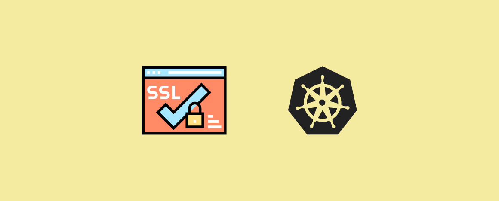
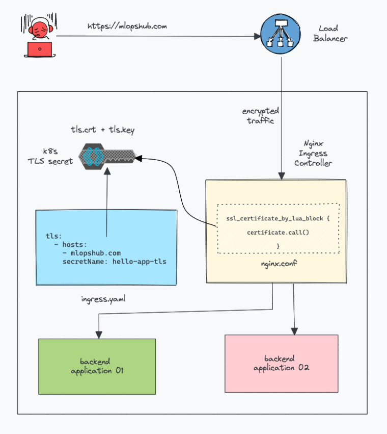
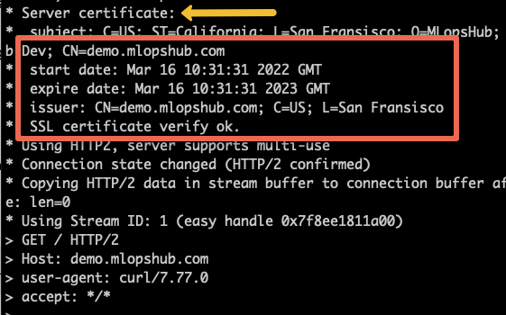
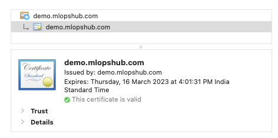
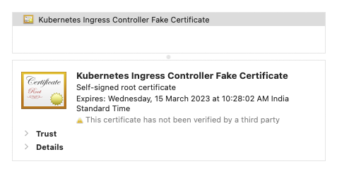
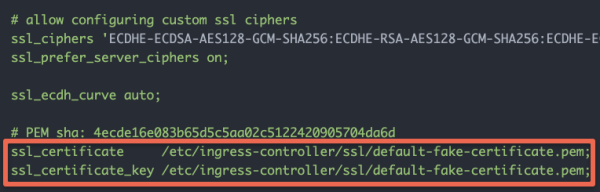

<small>【运维干货分享】如何在 Kubernetes 中配置入口 TLS/SSL 证书</small>



在此博客中，你将了解如何为 Kubernetes Ingress 资源配置入口 TLS 证书。

本博客基于使用公有 DNS 及其自签名证书完成的实际演示。如果你没有域名，则可以使用工作站主机文件进行 DNS 解析或 curl resolve 命令。demo.mlopshub.com

注意：SSL和TLS是相同的。SSL 是旧名称。TLS 是 SSL 的更新版本。不要混淆 🙂

## 先决条件和假设

对于本博客，假设你有一个有效的 Ingress 控制器设置，并且你想为 Ingress 资源配置 TLS。

此博客是 Kubernetes Ingress 系列的一部分。如果你没有设置 Ingress 控制器或想详细了解 Kubernetes Ingress 概念，请先阅读以下博客。

- Kubernetes Ingress 教程 – 涵盖所有 Ingress 概念
- 设置 Nginx Kubernetes Ingress 控制器 – 入口控制器详细指南
### 获取 Kubernetes 入口 SSL/TLS 证书

入口 TLS 的基本要求是 TLS/SSL 证书。你可以通过以下方式获取这些证书。

- 自签名证书：TLS 证书由我们自己的证书颁发机构创建和签名。对于开发环境来说，这是一个很好的选择，你可以在其中与团队共享 rootCA，以便浏览器可以信任该证书。查看创建自签名证书博客以创建自己的证书。
- 购买 SSL 证书：你需要从浏览器和操作系统信任的知名证书颁发机构购买SSL证书，用于生产用例。查看顶级 SSL 提供商了解更多信息。
- 使用 Letsencrpt 证书：Letsencrypt 是一个非营利性的受信任证书颁发机构，提供免费的 TLS 证书。

每个 SSL 证书都有一个到期日期。因此，你需要在证书过期之前轮换证书。例如，Letsecrypt 证书每三个月过期一次。我将在本文末尾讨论自动证书轮换。

此外，如果你正在处理内部应用程序，则大多数组织都有自己的 PKI 基础设施，用于为内部应用程序提供 SSL 证书。你可以请求网络/安全团队提供证书。

### 入口 TLS/SSL 如何工作？

将 TLS 添加到入口非常简单。你所要做的就是：

- 使用证书和私有密钥文件创建 Kubernetes 密钥server.key。server.crt
- 将 TLS 块添加到入口资源中，并使用用于生成与 TLS 证书匹配证书的证书的确切主机名。
- SSL 由 Ingress 控制器处理，而不是 Ingress 资源。这意味着，当你将 TLS 证书作为 kubernetes 密钥添加到入口资源时，入口控制器会访问它并将其作为其配置的一部分。

例如，在 Nginx 控制器中，SSL 证书由nginx.conf

```
ssl_certificate_by_lua_block {
            certificate.call()
        }
```

下图显示了高级入口 TLS 工作流程。



### 配置入口 TLS/SSL 证书

让我们看看在入口中配置 TLS 的步骤。

部署测试应用程序

让我们从部署一个示例应用程序开始。我们将使用此应用程序来测试我们的入口 TLS。

创建 dev 命名空间。
```
kubectl create -n dev
```
将以下 YAML 另存为 .它有一个 deployment 和 service 对象。hello-app.yaml

```
apiVersion: apps/v1
kind: Deployment
metadata:
  name: hello-app
  namespace: dev
spec:
  selector:
    matchLabels:
      app: hello
  replicas: 2
  template:
    metadata:
      labels:
        app: hello
    spec:
      containers:
      - name: hello
        ./ssl/image: "gcr.io/google-samples/hello-app:2.0"

---

apiVersion: v1
kind: Service
metadata:
  name: hello-service
  namespace: dev
  labels:
    app: hello
spec:
  type: ClusterIP
  selector:
    app: hello
  ports:
  - port: 80
    targetPort: 8080
    protocol: TCP

```

部署测试应用程序。
```
kubectl apply -f hello-app.yaml 
```
### 创建 Kubernetes TLS 密钥

注意：此处假设你拥有来自证书颁发机构或你的组织或自签名的 SSL 文件。server.crtserver.key

SSL 证书应添加为 Kubernetes 密钥。然后，它将被引用到入口资源 TLS 块。

让我们使用 and 文件（SSL 证书）创建一个 TLS 类型的 Kubernetes 密钥。我们正在 dev 命名空间中创建密钥，我们在其中部署了你好应用程序。server.crtserver.key

从你拥有 和 密钥文件的目录执行以下 kubectl 命令，或提供文件的绝对路径。 是任意名称。server.crthello-app-tls

```
kubectl create secret tls hello-app-tls \
    --namespace dev \
    --key server.key \
    --cert server.crt
```
以下是你必须在其中添加 crt 和密钥文件内容的等效文件。YAML

```
apiVersion: v1
kind: Secret
metadata:
  name: hello-app-tls
  namespace: dev
type: kubernetes.io/tls
data:
  server.crt: |
       <crt contents here>
  server.key: |
       <private key contents here>
```

### 向 Ingress 对象添加 TLS 块

使用 TLS 的入口资源必须在部署应用程序的同一命名空间中创建。因此，我们在 namespace 中创建示例入口 TLS 资源。dev

将以下ingress.yaml另存为 demo.mlopshub.com替换为你的主机名。

```
apiVersion: networking.k8s.io/v1
kind: Ingress
metadata:
  name: hello-app-ingress
  namespace: dev
spec:
  ingressClassName: nginx
  tls:
  - hosts:
    - demo.mlopshub.com
    secretName: hello-app-tls
  rules:
  - host: "demo.mlopshub.com"
    http:
      paths:
        - pathType: Prefix
          path: "/"
          backend:
            service:
              name: hello-service
              port:
                number: 80
```
如你所见，我添加了带有我们在上一步中创建的 hostname （） 和 tls secret 的 TLS 块。我已创建具有 domain 的自签名 TLS 证书。demo.mlopshub.comemo.mlopshub.com

```
tls:
  - hosts:
    - demo.mlopshub.com
    secretName: hello-app-tls
```

TLS 块和 rules 块中的主机应匹配。

🎉 恭喜，你已经使用 TLS 部署了 Ingress。

### 验证入口 TLS
你可以使用 curl 命令和浏览器验证入口 TLS。

在 CLI 中，使用你的域名运行 curl 命令，如下所示。

curl https://demo.mlopshub.com -kv

在输出中，在 server certificate （服务器证书） 下，你可以验证证书详细信息，如下所示。



在浏览器中，访问域并单击 Lock 图标以查看证书详细信息。如果你拥有有效的证书，你将看到如下所示的信息。



如果你没有有效的证书或入口 TLS 配置错误，你将看到 “Your connection is not private” 安全警告，如果你检查证书详细信息，你将看到证书名称为 “Kubernetes Ingress Controller Fake Certificate”。



Kubernetes Ingress Controller Fake Certificate 是 Nginx Ingress Controller 附带的默认 SSL 证书。如果检查控制器，你将看到配置的默认证书，如下所示。nginx.conf of the Nginx




### 入口 SSL 终止
默认情况下，SSL 在控制器的入口处终止

因此，从控制器到 Pod 的所有流量都将没有 TLS（解密流量）

如果你想要完整的 SSL，你可以通过你正在使用的 Ingress Controller 添加支持的注释。例如，在 Nginx 入口控制器中，要允许 SSL 流量到达应用程序，你可以使用注释。为此，你的应用程序应配置 SSL。 nginx.ingress.kubernetes.io/backend-protocol: "HTTPS"


## 结论
在这篇博客中，我们学习了如何使用 kubernetes 入口 TLS 示例配置入口 TLS 证书

此外，你还可以使用注释配置更多 TLS 参数。不同 Ingress 控制器之间的注释不同。

此外，如果你正在学习 Kubernetes，你可以查看我的 Kubernetes 初学者教程。