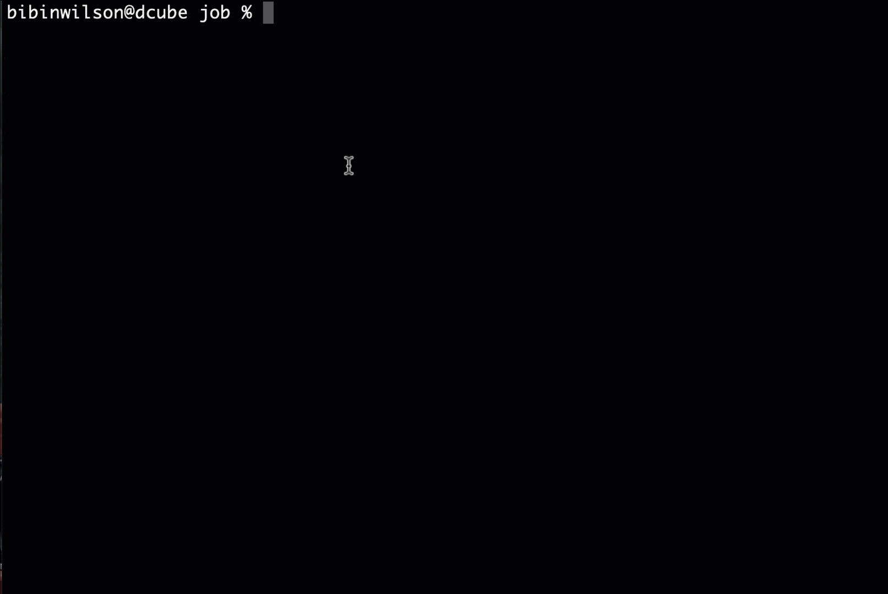
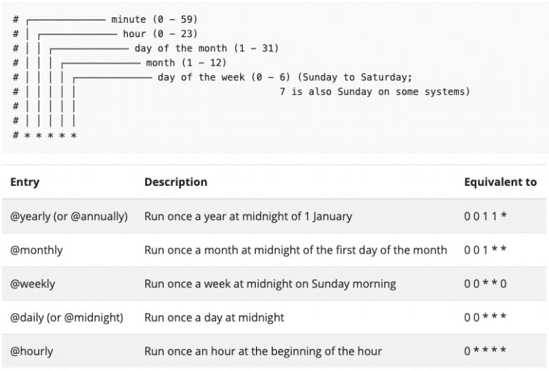

<small>【运维干货分享】如何创建kubernetes jobs和cronjobs入门指南</small>


此 kubernetes 教程介绍了如何创建 kubernetes 作业和 cronjobs，以及其基础知识、用例以及一些提示和技巧。

以下是你将从本教程中学到的内容。

## 什么是 Kubernetes 作业？
Kubernetes 作业和 cronjobs 是 Kubernetes 对象，主要用于短期和批处理工作负载。

Kubernetes Job 对象基本上部署了一个 Pod，但它是为完成而运行的，而不是像 deployment、replicasets、replication controllers 和 DaemonSets 这样的对象连续运行。

这意味着，作业会一直运行，直到作业中指定的任务完成，如果 Pod 提供退出代码0，则作业将退出。该任务可以是 shell 脚本执行、API 调用或执行数据转换并将其上传到云存储的 java python 执行。

而在正常的 Kubernetes 部署中，无论退出代码如何，部署对象都会在终止或引发错误时创建新的 Pod，以保持部署的所需状态。

在 Job 运行期间，如果托管 Pod 的节点发生故障，则 Job Pod 将自动重新调度到另一个节点。

## Kubernetes Jobs & CronJobs用例
Kubernetes 作业的最佳用例是：

- 批处理：假设你希望每天运行一次或按特定计划运行批处理任务。它可以是从存储或数据库中读取文件，并将它们提供给服务来处理文件。
- 操作/临时任务：假设你想运行一个脚本/代码来运行数据库清理活动，甚至备份 kubernetes 集群本身。
- 在我参与的一个项目中，我们广泛使用 Kubernetes 作业来处理 ETL 工作负载。

## 如何创建 Kubernetes 作业
在此示例中，我将使用一个 Ubuntu 容器，该容器运行一个 shell 脚本，该脚本具有一个 for 循环，该循环根据你传递给容器的参数回显消息。参数应该是一个数字，它决定循环运行以回显消息的次数。


例如，如果你将 100 作为参数传递，shell 脚本将回显消息 100 次，容器将退出。

你可以从这里查看 Dockerfile 和 shell 脚本

```
FROM ubuntu:latest
COPY script.sh /script.sh 
RUN chmod +x script.sh
ENTRYPOINT ["/script.sh"]
```

```
#! /bin/bash

LOOP_COUNT=$1
echo "This Job will echo message $1 times"

for ((i=1;i<=$LOOP_COUNT;i++)); 
do
   sleep 2
   echo $i] Hey I will run till the job completes.
done
```


让我们通过简单的设置开始 Job。

步骤1： 使用我们的自定义 Docker 镜像创建一个job.yaml文件，并将 100 作为命令参数。值 100 将作为参数传递给 docker ENTRYPOINT 脚本。

```
apiVersion: batch/v1 
kind: Job 
metadata:   
  name: kubernetes-job-example   
  labels:     
    jobgroup: jobexample 
spec:   
  template:     
    metadata:       
      name: kubejob       
      labels:         
        jobgroup: jobexample     
    spec:       
      containers:       
      - name: c         
        image: devopscube/kubernetes-job-demo:latest         
        args: ["100"]       
      restartPolicy: OnFailure
```
步骤2：让我们使用 kubectl 和该文件创建一个作业。作业将部署在命名空间中。job.yamldefault
```
kubectl apply -f job.yaml
```
步骤3：使用 kubectl 检查作业的状态。
```
kubectl get jobs
```
步骤4： 现在，使用 kubectl 的 Pod 列表。
```
kubectl get po
```
步骤5：你可以使用 kubectl 获取作业 Pod 日志。将 Pod 名称替换为你在输出中看到的 Pod 名称。
```
kubectl logs kubernetes-job-example-bc7s9 -f
```
你应该会看到如下所示的输出。



## 多个 Job Pod 和并行度
部署作业后，你可以使其在多个 Pod 上运行，并具有并行性。

例如，在作业中，如果要运行 6 个 Pod 并并行运行 2 个 Pod，则需要将以下两个参数添加到作业清单中。

```
completions: 6
parallelism: 2
```
该作业将并行运行 2 个 Pod 3 次，以实现 6 次完成。

下面是包含这些参数的清单文件。
```
apiVersion: batch/v1
kind: Job
metadata:
  name: kubernetes-parallel-job
  labels:
    jobgroup: jobexample
spec:
  completions: 6
  parallelism: 2
  template:
    metadata:
      name: kubernetes-parallel-job
      labels:
        jobgroup: jobexample
    spec:
      containers:
      - name: c
        image: devopscube/kubernetes-job-demo:latest
        args: ["100"]
      restartPolicy: OnFailure
```      
并行 Pod 处理的一个用例是对消息队列的批处理操作。假设你有一个消息队列，其中包含数千条消息，需要在一天的特定时间处理。

你可以将消息处理代码作为具有并行度的作业运行，以加快处理速度。即使所有 Pod 都使用相同的消息处理代码，每个 Pod 也会处理队列中的不同消息。

## 为 Kubernetes 作业生成随机名称
你不能拥有单个任务清单文件并从中创建多个任务。Kubernetes 将引发错误，指出存在同名的作业。

要避免此问题，可以将 name 参数添加到元数据中。generateName

例如
```
apiVersion: batch/v1
kind: Job
metadata:
  generateName: kube-job-
  labels:
    jobgroup: jobexample
```
在上面的示例中，每次运行清单时，都会创建一个作业，其前缀后跟一个随机字符串。kube-job-

## 如何创建 Kubernetes CronJob

如果你想按特定计划（例如，每 2 小时）运行批处理作业，该怎么办。你可以使用 cron 表达式创建 Kubernetes cronjob。该作业将按照你在作业中提到的计划自动启动。

以下是我们指定 cron 计划的方法。你可以使用 crontab 生成器生成自己的计划。
```
schedule: "0,15,30,45 * * * *"
```
下图显示了 kubernetes cronjob 调度语法。




如果我们每 15 分钟将上一个作业作为 cronjob 运行一次，则它看起来像下面给出的清单。

创建一个名为 的文件并复制以下清单。cron-job.yaml
```
apiVersion: batch/v1beta1
kind: CronJob
metadata:
    name: kubernetes-cron-job
spec:
  schedule: "0,15,30,45 * * * *"
  jobTemplate:
    spec:
      template:
        metadata:
          labels:
            app: cron-batch-job
        spec:
          restartPolicy: OnFailure
          containers:
          - name: kube-cron-job
            image: devopscube/kubernetes-job-demo:latest
            args: ["100"]
```            
让我们使用 kubectl 部署 cronjob。
```
kubectl create -f cron-job.yaml
```
列出 cronjob
```
kubectl get cronjobs
```
要检查 Cronjob 日志，你可以列出 cronjob Pod，并从处于运行状态的 Pod 或已完成的 Pod 中获取日志。

## 手动运行 Kubernetes CronJob
在某些情况下，你可能希望以临时方式执行 cronjob。你可以通过从现有 cronjob 创建 job 来执行此操作。

例如，如果你想手动触发一个 cronjob，这就是我们应该做的。
```
kubectl create job --from=cronjob/kubernetes-cron-job manual-cron-job
--from=cronjob/kubernetes-cron-job将复制 cronjob 模板并创建一个名为manual-cron-job
```
## 几个关键的 Kubernetes Job 参数
根据你的需要，你还可以将更多关键参数用于 kubernetes jobs/cronjobs。让我们来看看每一个。

- failedJobHistoryLimit & successfulJobsHistoryLimit：根据你提供的保留号删除失败和成功的作业历史记录。这对于在尝试列出作业时修剪所有失败的条目非常有用。例如
- failedJobHistoryLimit: 5  successfulJobsHistoryLimit: 10
backoffLimit：Pod 失败时的重试总数。
- activeDeadlineSeconds 的 如果要指定 cronjob 运行时间的硬性限制，则可以使用此参数。例如，如果你只想运行 cronjob 一分钟，则可以将其设置为 60。

## 监控 Kubernetes 作业和 Cronjobs

Kube 状态指标提供了一些指标来监控 kubernetes 作业和 cronjobs。默认情况下，它不随集群一起提供。你需要单独设置 Kube 状态指标。

有关支持的指标，请参阅 cronjob metrics 文档。

你可以通过 Prometheus 监控堆栈利用这些指标，并使用 Grafana 对其进行可视化。

如果要监控 Jobs 或 Cronjobs 生成的自定义指标，则需要使用 Prometheus 推送网关来获取 Prometheus 上的所有指标。