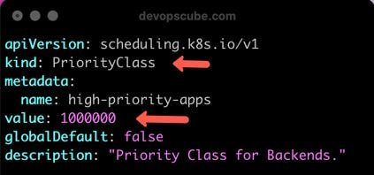
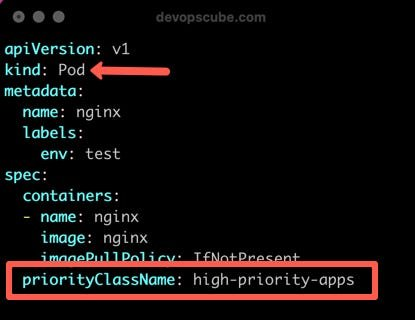

<small>【运维干货分享】Kubernetes Pod 优先级、PriorityClass 和抢占说明</small>


在本 Kubernetes 教程中，你将了解重要的 Kubernetes Pod 调度概念，例如 Pod 优先级、Preemption 和 Pod PriorityClass

Kubernetes 中的 Pod 优先级是什么？
Pod 优先级是 Kubernetes 的一项调度功能，它允许 Kubernetes 根据优先级编号比较其他 Pod 做出调度决策。让我们看看 pod priority 中的以下两个主要概念。

- Pod 抢占
- Pod  Priority Class
  
## Pod 抢占
Pod 抢占功能允许 Kubernetes 在调度队列中处于较高优先级的 Pod 且没有可用的节点资源时，从节点中抢占（驱逐）较低优先级的 Pod。

## Kubernetes Pod  Priority Class

要为 Pod 分配特定优先级，你需要一个 Priority Class。

你可以使用PriorityClass对象（非命名空间）和 Value 来设置 Pod 的优先级

该值确定优先级。它可以是 1,000,000,000（十亿）或更低。 数字越大，优先级越高。



priorityclass （priorityClassName） 的名称将在 Pod 规范中用于设置优先级。

>如果你不希望优先级抢占 Pod，可以设置PreemptionPolicy: Never 。默认情况下，优先级类使用PreemptLowerPriority策略。



## Pod PriorityClass 示例

以下示例具有一个 PriorityClass 对象和一个使用 PriorityClass 的 Pod。

```
apiVersion: scheduling.k8s.io/v1
kind: PriorityClass
metadata:
  name: high-priority-apps
value: 1000000
preemptionPolicy: PreemptLowerPriority
globalDefault: false
description: "Mission Critical apps."
---
apiVersion: v1
kind: Pod
metadata:
  name: nginx
  labels:
    env: dev
spec:
  containers:
  - name: web
    image: nginx:latest
    imagePullPolicy: IfNotPresent
  priorityClassName: high-priority-apps
```

## Kubernetes 系统 High PriorityClass

如何保护系统关键型 Pod 免遭抢占？

嗯，Kubernetes 设置了两个默认的高 Priority Class

- system-node-critical的 system-node-critical：此类的值为2000001000 。静态 Pod etcd、kube-apiserver、kube-scheduler 和 Controller manager 等 Pod 使用此 Priority Class。
- system-cluster-critical的此类的值为2000000000 。像 coredns、calico controller、metrics server 等插件 Pod 使用这个 Priority 类。
  
## Kubernetes Pod 优先级和抢占是如何工作的？

- 如果使用PriorityClassName部署 pod，则优先级准入控制器会使用 PriorityClassName 值获取优先级值。
- 如果调度队列中有很多 Pod，调度器会根据优先级排列调度顺序。这意味着，调度器将高优先级 Pod 置于低优先级 Pod 之前
- 现在，如果没有可用的节点资源来容纳更高优先级的 Pod，则抢占逻辑将启动。
- 调度程序从可以调度高优先级 Pod 的节点抢占（逐出）低优先级 Pod。被逐出的 Pod 会获得 30 秒的默认终止时间。如果 Pod 为preStop容器 Lifecycle Hooks设置了terminationGracePeriodSeconds ，它将覆盖默认的 30 秒。
- 但是，如果由于某种原因，调度要求未得到满足，则调度程序将继续调度优先级较低的 Pod。


现在我们知道了 kubernetes pod 调度优先级如何与 Priorityclass 和抢占一起工作。

## Pod 优先级常见问题解答
### 什么是 Kubernetes DaemonSet 优先级？
Daemonset 的优先级与任何其他 Pod 一样。因此，如果你希望你的 Daemonset 保持稳定，并且在节点资源紧缩期间不被驱逐，你需要为 Daemonset 设置更高的 Pod PriorityClass。

### Pod QoS与Pod优先级和抢占有何关系？
Kubelet 首先考虑 QoS 类，然后考虑 Pod 优先级值来驱逐 Pod。仅当节点上资源短缺时，才会发生这种情况。

但是，只有当高优先级 Pod 位于调度队列上时，抢占逻辑才会启动。调度器在 Pod 抢占期间忽略 Pod QoS。而基于 QoS 的逐出由于资源紧缩而在没有调度队列的情况下发生。

### Pod 优先级的意义是什么？
当你在生产环境中将应用程序部署到 Kubernetes 时，你不希望某些应用程序被杀死。例如，指标收集器 Daemonset、日志代理、支付服务等。

为了确保任务关键型 Pod 的可用性，你可以创建具有优先级的 Pod 层层次结构;当集群中出现资源紧缩时，kubelet 会尝试杀死低优先级的 Pod 以容纳具有更高 PriorityClass 的 Pod。

## 结论
作为 DevOps 工程师，在处理 Kubernetes 实现时，了解 kubernetes pod 优先级非常重要。

此外，它也是 Kubernetes 认证中的重要主题之一。