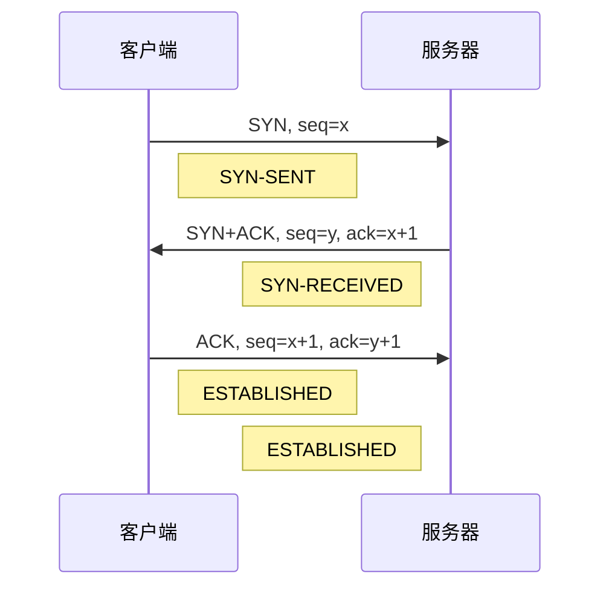
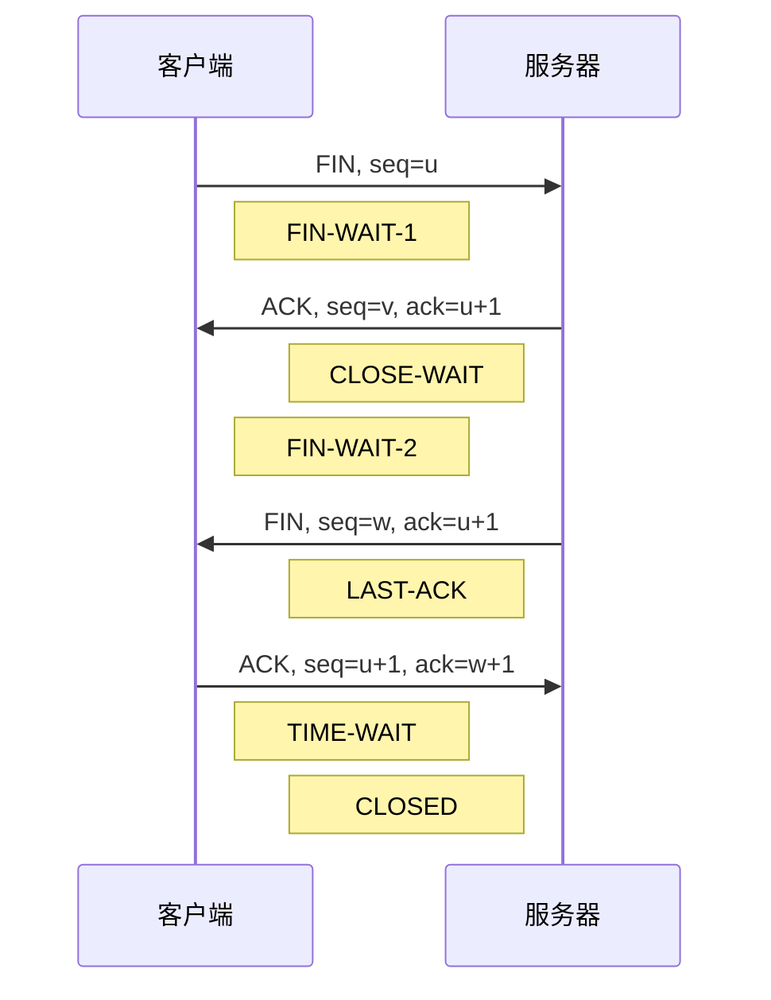

<small>一图看懂，当你在浏览器中输入一个URL时，会发生什么？</small>


图示：


# 当你在浏览器中输入一个URL时，会发生什么？

让我们一步一步地看看这个过程。

## 步骤1：用户在浏览器中输入一个URL（www. bytebytego. com）并按回车键。我们需要做的第一件事是将URL转换为IP地址。这个映射通常存储在缓存中，所以浏览器会在多层缓存中查找IP地址：浏览器缓存、操作系统缓存、本地缓存和ISP缓存。如果浏览器在缓存中找不到映射，它会向DNS（域名系统）解析器请求解析。

## 步骤2：如果在任何缓存中都找不到IP地址，浏览器就会去DNS服务器进行递归DNS查询，直到找到IP地址。

## 步骤3：现在我们已经得到了服务器的IP地址，浏览器就会向服务器发送一个HTTP请求。为了安全地访问服务器资源，我们应该始终使用HTTPS。它首先通过TCP三次握手与服务器建立TCP连接。然后它将公钥发送给客户端。客户端使用公钥加密会话密钥并发送给服务器。服务器使用私钥解密会话密钥。客户端和服务器现在可以使用会话密钥交换加密数据。

## 步骤4：服务器处理请求并发送回响应。对于成功的响应，状态码是200。响应中有3个部分：HTML、CSS和Javascript。浏览器解析HTML并生成DOM树。它还解析CSS并生成CSSOM树。它然后将DOM树和CSSOM树合并为渲染树。浏览器渲染内容并显示给用户。

下为具体介绍：

## 概述
当我们在浏览器中输入一个URL（统一资源定位符）时，我们其实是在请求访问一个网站或网络资源。但是，浏览器并不直接知道这个URL对应的是哪个服务器或哪个文件，它需要经过一系列的步骤，才能找到并显示我们想要的内容。

这个过程涉及到多个概念和技术，如IP地址、DNS、HTTP、HTTPS、TCP等。为了方便理解，我们可以将这个过程分为以下四个主要步骤：

- URL解析：将URL转换为服务器的IP地址。
- TCP连接：与服务器建立可靠的通信连接。
- HTTP请求：向服务器发送请求并获取响应。
- 浏览器渲染：解析响应内容并显示给用户。


## URL解析
URL（统一资源定位符）是一种用于标识网络资源位置和访问方式的字符串，它通常由以下几个部分组成：

- 协议：指定访问资源所使用的协议，如http、https、ftp等。
- 域名：指定访问资源所在的服务器的名称，如www. bytebytego. com。
- 端口：指定访问资源所在的服务器的端口号，如80、443等。如果省略，则使用默认端口号。
- 路径：指定访问资源所在的服务器的具体位置，如/index.html、/images/logo.png等。
- 查询字符串：指定访问资源时附加的一些参数，如?key=value&name=alice等。
- 片段标识符：指定访问资源时跳转到的特定部分，如#section1等。

例如，以下是一个完整的URL：

```
https://www.bytebytego.com:443/articles/what-happens-when-you-type-a-url?lang=en#summary
```

它包含了以下几个部分：

- 协议：https
- 域名：www. bytebytego. com
- 端口：443
- 路径：/articles/what-happens-when-you-type-a-url
- 查询字符串：lang=en
- 片段标识符：summary

## TCP连接


TCP（传输控制协议）是一种面向连接的、可靠的、基于字节流的通信协议，它在传输数据之前需要建立连接，传输完毕后需要释放连接¹。TCP连接是由两个端点（即两个套接字）唯一确定的，每个套接字由IP地址和端口号组成²。

TCP连接的建立需要经过三次握手（Three-way Handshake），目的是同步双方的序列号和确认号，并交换窗口大小信息³。三次握手的具体步骤如下：

- 第一次握手：客户端向服务器发送一个SYN报文段，指明客户端打算连接的服务器端口，以及初始序列号。客户端进入SYN-SENT状态，等待服务器确认。
- 第二次握手：服务器收到SYN报文段后，如果同意建立连接，则向客户端发送一个SYN+ACK报文段，确认收到客户端的SYN，并指明自己的初始序列号。服务器进入SYN-RECEIVED状态，等待客户端确认。
- 第三次握手：客户端收到SYN+ACK报文段后，向服务器发送一个ACK报文段，确认收到服务器的SYN+ACK，并告知服务器可以开始传输数据。客户端进入ESTABLISHED状态，服务器在收到ACK后也进入ESTABLISHED状态，此时连接建立成功。

下图是三次握手的示意图：



TCP连接的释放需要经过四次挥手（Four-way Handshake），目的是终止双方的数据传输，并回收资源⁴。四次挥手的具体步骤如下：

- 第一次挥手：当主动关闭方（通常是客户端）没有更多数据要发送时，向被动关闭方（通常是服务器）发送一个FIN报文段，表示自己已经结束数据传输。主动关闭方进入FIN-WAIT-1状态，等待被动关闭方确认。
- 第二次挥手：被动关闭方收到FIN报文段后，向主动关闭方发送一个ACK报文段，确认收到FIN，并告知主动关闭方可以等待被动关闭方结束数据传输。被动关闭方进入CLOSE-WAIT状态，主动关闭方收到ACK后进入FIN-WAIT-2状态。
- 第三次挥手：当被动关闭方没有更多数据要发送时，向主动关闭方发送一个FIN报文段，表示自己也已经结束数据传输。被动关闭方进入LAST-ACK状态，等待主动关闭方确认。
- 第四次挥手：主动关闭方收到FIN报文段后，向被动关闭方发送一个ACK报文段，确认收到FIN，并告知被动关闭方可以释放连接。主动关闭方进入TIME-WAIT状态，等待一段时间后释放连接。被动关闭方收到ACK后释放连接并进入CLOSED状态。

下图是四次挥手的示意图：



## http连接

HTTP（超文本传输协议）是一种用于在客户端和服务器端之间传输数据的应用层协议，它基于TCP/IP协议进行通信¹。HTTP请求是客户端向服务器端发送的一种消息，用于请求访问或操作某个资源²。

HTTP请求的过程可以分为以下几个步骤：

- URL解析：客户端（如浏览器）输入一个URL（统一资源定位符），并按回车键。URL包含了要访问的资源的协议、域名、端口、路径、查询字符串等信息³。客户端需要将域名转换为服务器的IP地址，这一步称为DNS（域名系统）解析。客户端会先在本地缓存中查找域名和IP地址的映射关系，如果没有找到，就会向DNS服务器发送查询请求，直到得到IP地址。
- TCP连接：客户端根据URL中的协议和端口号，与服务器建立一个TCP（传输控制协议）连接。TCP连接是一种面向连接的、可靠的、基于字节流的通信方式，它需要经过三次握手（Three-way Handshake）来初始化连接。三次握手的目的是同步双方的序列号和确认号，并交换窗口大小信息。
- HTTP请求：客户端通过TCP连接向服务器发送一个HTTP请求报文。HTTP请求报文由三部分组成：请求行、请求头和请求体。请求行包含了请求方法（如GET、POST等）、请求资源的路径和HTTP版本。请求头包含了一些与请求相关的信息，如Host、User-Agent、Accept等。请求体包含了一些与请求资源相关的数据，如表单数据、文件数据等。
- HTTP响应：服务器收到HTTP请求报文后，根据报文中的信息处理请求，并返回一个HTTP响应报文给客户端。HTTP响应报文也由三部分组成：状态行、响应头和响应体。状态行包含了HTTP版本、状态码和状态描述。状态码是一个三位数，用于表示服务器对请求的处理结果，如200表示成功，404表示未找到等。响应头包含了一些与响应相关的信息，如Content-Type、Content-Length、Server等。响应体包含了与响应资源相关的数据，如HTML、CSS、JavaScript等。
- TCP断开：客户端收到HTTP响应报文后，根据报文中的信息显示或处理响应数据，并关闭TCP连接。TCP连接的关闭需要经过四次挥手（Four-way Handshake）来终止连接。四次挥手的目的是终止双方的数据传输，并回收资源。

