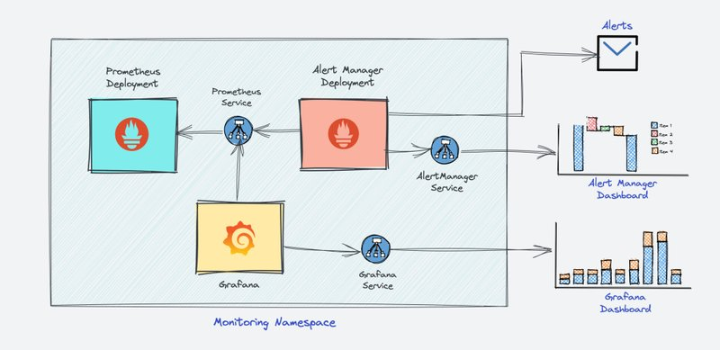
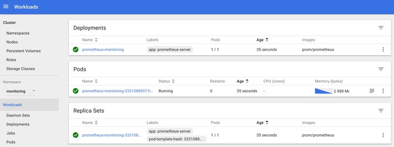
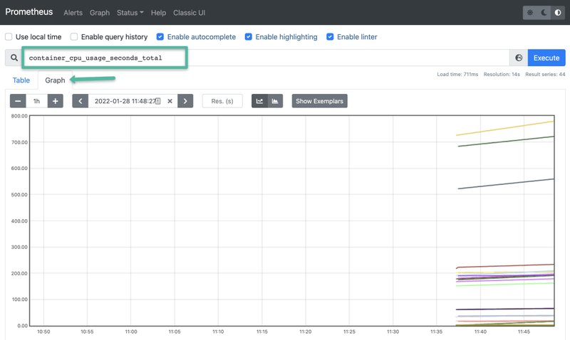

<small>【运维干货分享】如何在 Kubernetes 集群上设置 Prometheus 监控</small>


本 Prometheus kubernetes 教程将指导你在 Kubernetes 集群上设置 Prometheus 以监控 Kubernetes 集群。

此设置使用 Prometheus 服务发现配置自动收集节点、Pod 和服务指标。

## 关于 Prometheus
Prometheus 是一个高度可扩展的开源监控框架。它为 Kubernetes 容器编排平台提供了开箱即用的监控功能。此外，在可观测性领域，它越来越受欢迎，因为它有助于指标和警报。

解释 Prometheus 不在本文的讨论范围之内。但是，我想列出几个关键点供你参考。

- 指标收集： Prometheus 使用拉模型通过 HTTP 检索指标。对于 Prometheus 无法抓取指标的用例，可以选择使用Pushgateway将指标推送到 Prometheus。其中一个例子是从短期kubernetes 作业和 Cronjobs中收集自定义指标
- Metric Endpoint （指标终端节点）：要使用 Prometheus 监控的系统应在/metrics端点上公开指标。Prometheus 使用此终端节点定期提取指标。
- PromQL 的：Prometheus 附带PromQL ，这是一种非常灵活的查询语言，可用于查询 Prometheus 控制面板中的指标。此外，Prometheus UI 和 Grafana 将使用 PromQL 查询来可视化指标。
- Prometheus Exporter：Exporter是将第三方应用程序的现有指标转换为 Prometheus 指标格式的库。有许多官方和社区的 Prometheus Exporter。一个例子是 Prometheus node Exporter。它以 Prometheus 格式公开所有 Linux 系统级指标。
- TSDB（时间序列数据库）：Prometheus 使用 TSDB 来高效存储所有数据。默认情况下，所有数据都存储在本地。但是，为避免单点故障，可以选择为 Prometheus TSDB 集成远程存储。


## Prometheus 架构
以下是 Prometheus 的高级架构。


Kubernetes Prometheus 监控堆栈包含以下组件。

- Prometheus 服务器
- Alert Manager
- grafana
  
简而言之，下图描述了我们将要构建的高级 Prometheus kubernetes 架构。



## Kubernetes 上的 Prometheus 监控设置

我假设你在工作站上使用 kubectl setup 启动并运行了一个 Kubernetes 集群。


最新的 Prometheus 在其官方 docker hub 帐户中以 docker 镜像的形式提供。我们将使用该镜像进行设置。

### 连接到 Kubernetes 集群
连接到你的 Kubernetes 集群，并确保你具有创建集群角色的管理员权限。

### Prometheus Kubernetes 清单文件
我在本指南中提到的所有配置文件都托管在 Github 上。你可以使用以下命令克隆存储库。

```
git clone https://github.com/techiescamp/kubernetes-prometheus
```

让我们开始设置。

### 创建一个 Namespace & ClusterRole

首先，我们将为所有监控组件创建一个 Kubernetes 命名空间。如果你不创建专用命名空间，则所有 Prometheus kubernetes 部署对象都将部署在默认命名空间上。

执行以下命令以创建名为 monitoring 的新命名空间。

```
kubectl create namespace monitoring
```
Prometheus 使用 Kubernetes API 从节点、Pod、部署等读取所有可用指标。因此，我们需要创建一个对所需 API 组具有read access的 RBAC 策略，并将该策略绑定到monitoring空间。

步骤1：创建一个名为 并复制以下 RBAC 角色的文件。clusterRole.yaml

>注意：在下面给出的角色中，你可以看到我们已经为节点、服务端点、Pod 和入口添加了 、 和 权限。角色绑定绑定到监控命名空间。如果你有任何从任何其他对象检索指标的使用案例，则需要在此集群角色中添加该案例。getlistwatch

```
apiVersion: rbac.authorization.k8s.io/v1
kind: ClusterRole
metadata:
  name: prometheus
rules:
- apiGroups: [""]
  resources:
  - nodes
  - nodes/proxy
  - services
  - endpoints
  - pods
  verbs: ["get", "list", "watch"]
- apiGroups:
  - extensions
  resources:
  - ingresses
  verbs: ["get", "list", "watch"]
- nonResourceURLs: ["/metrics"]
  verbs: ["get"]
---
apiVersion: rbac.authorization.k8s.io/v1
kind: ClusterRoleBinding
metadata:
  name: prometheus
roleRef:
  apiGroup: rbac.authorization.k8s.io
  kind: ClusterRole
  name: prometheus
subjects:
- kind: ServiceAccount
  name: default
  namespace: monitoring
```  
步骤2：使用以下命令创建角色。

```
kubectl create -f clusterRole.yaml
```
### 创建 Config Map 以外部化 Prometheus 配置
Prometheus 的所有配置都是prometheus.yaml文件的一部分，Alertmanager 的所有警报规则都在prometheus.rules中配置。

- prometheus.yaml：这是主要的 Prometheus 配置，其中包含所有抓取配置、服务发现详细信息、存储位置、数据保留配置等）
- prometheus.rules：此文件包含所有 Prometheus 告警规则
  
通过将 Prometheus 配置外部化到 Kubernetes 配置映射，你不必在需要添加或删除配置时构建 Prometheus 镜像。你需要更新配置映射并重新启动 Prometheus Pod 才能应用新配置。

包含所有Prometheus 抓取配置和警报规则的配置映射作为prometheus.yaml和prometheus.rules文件安装到/etc/prometheus位置中的 Prometheus 容器。

- 步骤1： 创建一个名为 > Prometheus Config File 的文件并从此链接复制文件内容。
>https://raw.githubusercontent.com/bibinwilson/kubernetes-prometheus/master/config-map.yaml

- 步骤2： 执行以下命令以在 Kubernetes 中创建配置映射。

```
kubectl create -f config-map.yaml
```

它在容器内创建两个文件。

注意：在 Prometheus 术语中，用于从终端节点集合收集指标的配置称为 .job

prometheus.yaml包含动态发现 Kubernetes 集群中运行的 Pod 和服务的所有配置。我们的 Prometheus 抓取配置中有以下抓取作业。

- kubernetes-apiservers：它从 API 服务器获取所有指标。
- kubernetes-nodes：它收集所有 kubernetes 节点指标。
- kubernetes-pods：如果 Pod 元数据使用 and annotations 进行注释，则会发现所有 Pod 指标。prometheus.io/scrape prometheus.io/port
- kubernetes-cadvisor：收集所有 cAdvisor 量度。
- kubernetes-service-endpoints：如果服务元数据使用 prometheus.io/scrape 和 prometheus.io/port 注释进行批注，则所有服务端点都将被废弃。它可用于黑盒监控。
- prometheus.rules包含用于向 Alertmanager 发送警报的所有警报规则。

### 创建 Prometheus deployment
步骤 1：创建一个名为prometheus-deployment.yaml的文件，并将以下内容复制到该文件中。在此配置中，我们将 Prometheus 配置映射作为文件安装在/etc/prometheus内，如上一节所述。

注意：此部署使用来自 docker hub 的最新官方 Prometheus 镜像。此外，我们没有将任何持久存储卷用于 Prometheus 存储，因为它是一种基本设置。在为生产使用案例设置 Prometheus 时，请确保将持久性存储添加到部署中。

```
apiVersion: apps/v1
kind: Deployment
metadata:
  name: prometheus-deployment
  namespace: monitoring
  labels:
    app: prometheus-server
spec:
  replicas: 1
  selector:
    matchLabels:
      app: prometheus-server
  template:
    metadata:
      labels:
        app: prometheus-server
    spec:
      containers:
        - name: prometheus
          image: prom/prometheus
          args:
            - "--storage.tsdb.retention.time=12h"
            - "--config.file=/etc/prometheus/prometheus.yml"
            - "--storage.tsdb.path=/prometheus/"
          ports:
            - containerPort: 9090
          resources:
            requests:
              cpu: 500m
              memory: 500M
            limits:
              cpu: 1
              memory: 1Gi
          volumeMounts:
            - name: prometheus-config-volume
              mountPath: /etc/prometheus/
            - name: prometheus-storage-volume
              mountPath: /prometheus/
      volumes:
        - name: prometheus-config-volume
          configMap:
            defaultMode: 420
            name: prometheus-server-conf
  
        - name: prometheus-storage-volume
          emptyDir: {}
```          
步骤2：使用上述文件在监控命名空间上创建部署。
```
kubectl create  -f prometheus-deployment.yaml 
```
步骤3：你可以使用以下命令检查创建的部署。
```
kubectl get deployments --namespace=monitoring
```
你还可以从 kubernetes 仪表板获取详细信息，如下所示。



### 连接到 Prometheus Dashboard

你可以通过三种不同的方式查看已部署的 Prometheus 控制面板。

- 使用 Kubectl 端口转发
- 使用 NodePort 或 Load Balancer 将 Prometheus 部署作为服务公开。
- 如果部署了 Ingress 控制器，请添加 Ingress 对象。

让我们来看看所有三个选项。

#### 方法 1：使用 Kubectl 端口转发
使用 kubectl 端口转发，您可以使用localhost上选定的端口从本地工作站访问 pod。该方法主要用于调试目的。

步骤1：首先，获取 Prometheus Pod 名称。
```
kubectl get pods --namespace=monitoring
```
输出将如下所示。
```
➜  kubectl get pods --namespace=monitoring
NAME                                     READY     STATUS    RESTARTS   AGE
prometheus-monitoring-3331088907-hm5n1   1/1       Running   0          5m
```
步骤2：使用你的 Pod 名称执行以下命令，以从 localhost 端口 8080 访问 Prometheus。

注意： 将 prometheus-monitoring-3331088907-hm5n1 替换为你的 Pod 名称。
```
kubectl port-forward prometheus-monitoring-3331088907-hm5n1 8080:9090 -n monitoring
```
步骤3：现在，如果你在浏览器上访问，你将获得 Prometheus 主页。http://localhost:8080

#### 方法2：将Prometheus作为服务公开[NodePort & LoadBalancer]
要通过IP或DNS名称访问 Prometheus 仪表板，您需要将其公开为 Kubernetes 服务。

步骤1：创建一个名为prometheus-service.yaml的文件并复制以下内容。我们将在端口30000上的所有 kubernetes 节点 IP 上公开 Prometheus。

注意：如果你在 AWS、Azure 或 Google Cloud 上，则可以使用 Loadbalancer 类型，它将创建一个负载均衡器并自动将其指向 Kubernetes 服务终端节点。

```
apiVersion: v1
kind: Service
metadata:
  name: prometheus-service
  namespace: monitoring
  annotations:
      prometheus.io/scrape: 'true'
      prometheus.io/port:   '9090'
spec:
  selector: 
    app: prometheus-server
  type: NodePort  
  ports:
    - port: 8080
      targetPort: 9090 
      nodePort: 30000
```      
上述服务中的确保服务端点被 Prometheus 报废。这应该始终是服务 YAML 中提到的目标端口annotationsYAMLprometheus.io/port

步骤2：使用以下命令创建服务。
```
kubectl create -f prometheus-service.yaml --namespace=monitoring
```
步骤 3：创建后，您可以使用 Kubernetes 节点的任意 IP 在端口30000上访问 Prometheus 仪表板。如果您在云上，请确保您有正确的防火墙规则来从工作站访问端口30000 。


步骤 4：现在，如果您浏览到status --> Targets ，您将看到使用服务发现自动连接到 Prometheus 的所有 Kubernetes 端点，如下所示。


kube-state-metrics 下降是意料之中的，我稍后会讨论它。

第 5 步：您可以转到主页并从下拉列表中选择您需要的指标，并获取您提到的时间范围的图表。示例图 container_cpu_usage_seconds_total 如下所示。


#### 方法 3：使用 Ingress 暴露 Prometheus
如果你已有 Ingress Controller 设置，则可以创建一个 Ingress 对象以将 Prometheus DNS 路由到 Prometheus 后端服务。

此外，你还可以在入口层为 Prometheus 添加 SSL。有关更多详细信息，请参阅 Kubernetes 入口 TLS/SSL 证书指南。

下面是一个示例 Ingress 对象。有关使用 SSL 的示例入口对象，请参阅此 GitHub 链接
```
apiVersion: extensions/v1beta1
kind: Ingress
metadata:
  name: prometheus-ui
  namespace: monitoring
  annotations:
    kubernetes.io/ingress.class: nginx
spec:
  rules:
  # Use the host you used in your kubernetes Ingress Configurations
  - host: prometheus.example.com
    http:
      paths:
      - backend:
          serviceName: prometheus-service
          servicePort: 8080
```
### 设置 Kube 状态指标
Kube状态指标服务将提供许多默认情况下不可用的指标。请确保部署 Kube 状态指标来监控所有 kubernetes API 对象，例如deployments 、 pods 、 jobs 、 cronjobs等。


### 设置 Alertmanager

Alertmanager 处理 Prometheus 指标的所有警报机制。有许多集成可用于从 Alertmanager 接收告警（Slack、电子邮件、API 端点等）


### 设置 Grafana
使用 Grafana，你可以从 Prometheus 指标创建控制面板来监控 kubernetes 集群。

最棒的是，你不必为控制面板编写所有 PromQL 查询。有许多可用于 Kubernetes 的社区仪表板模板。你可以根据需要导入和修改它。


### 设置 Node Exporter
Node Exporter 将提供所有 Kubernetes 节点的所有 Linux 系统级指标。

node-exporter 的 scrape 配置是 Prometheus 配置映射的一部分。部署 node-exporter 后，你应该会在 Prometheus 中看到 node-exporter 目标和指标。

### Prometheus 生产设置注意事项

对于生产 Prometheus 设置，需要考虑更多配置和参数，以实现扩展、高可用性和存储。这完全取决于你的环境和数据量。

例如，Prometheus Operator 项目可以轻松实现 Prometheus 设置及其配置的自动化。

如果你有多个生产集群，则可以使用 CNCF 项目 Thanos 来聚合来自多个 Kubernetes Prometheus 源的指标。

Thanos 提供多租户、水平可扩展性和灾难恢复等功能，从而能够大规模运行 Prometheus 并具有高可用性。借助 Thanos，你可以在一个位置查询来自不同 kubernetes 集群中运行的多个 Prometheus 实例的数据，从而更轻松地聚合指标和运行复杂查询。

此外，Thanos 可以将 Prometheus 数据存储在对象存储后端，例如 Amazon S3 或 Google Cloud Storage，这提供了一种高效且经济高效的方式来保留长期指标数据。

### 结论
在这个全面的 Prometheus kubernetes 教程中，我介绍了重要监控组件的设置，以了解 Kubernetes 监控。

在下一篇博客中，我将介绍使用 helm charts 的 Prometheus 设置。我们将整个监控堆栈放在一个 helm 图表下