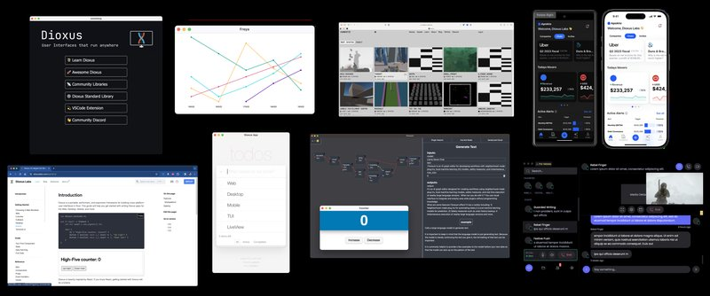

<small>20.9k star,开发人员必看的一个开源框架</small>


Dioxus 是一个由 DioxusLabs 开发的全栈应用框架，旨在简化跨平台应用的开发。


### Dioxus：跨平台应用开发框架

无论是 Web、桌面、移动端还是服务器应用，Dioxus 都能通过单一代码库进行构建。该框架基于 Rust 语言，利用其高性能和安全性特点，为开发者提供了一个强大且灵活的开发环境。

#### 功能特点

1. **跨平台支持**：Dioxus 支持多种平台，包括 Web、桌面（Windows、macOS、Linux）、移动端（iOS、Android）和服务器应用。这使得开发者可以使用同一套代码在不同平台上部署应用，极大地提高了开发效率。

2. **零配置设置**：Dioxus 提供了开箱即用的零配置设置，开发者无需进行复杂的环境配置即可开始开发。这对于初学者和希望快速上手的开发者来说尤为友好。

3. **热重载**：Dioxus 集成了热重载功能，开发者在修改代码后可以立即看到效果，而无需重新编译和启动应用。这大大提高了开发效率和调试速度。

4. **信号驱动的状态管理**：Dioxus 采用信号驱动的状态管理方式，结合了 React、Solid 和 Svelte 的优点，使得状态管理更加直观和高效。

5. **高性能**：得益于 Rust 语言的性能优势，Dioxus 能够构建出极其高效的应用。无论是 Web 应用还是桌面应用，Dioxus 都能提供卓越的性能表现。

6. **集成打包工具**：Dioxus 提供了集成的打包工具，开发者只需运行简单的命令即可将应用打包并部署到各个平台。该工具支持多种优化选项，如 .avif 生成、.wasm 压缩和代码最小化等。

7. **丰富的文档**：Dioxus 拥有详尽且易于阅读的文档，涵盖了从基础入门到高级使用的各个方面。文档中还包含了大量的示例代码和实用指南，帮助开发者快速掌握框架的使用。

8. **开发者体验**：Dioxus 非常注重开发者体验，提供了多种开发工具和插件，如 VSCode 扩展、自动格式化工具和强大的 CLI 工具。这些工具能够显著提升开发效率和代码质量。

#### 吸引用户的特点

Dioxus 之所以能够吸引众多开发者，主要得益于以下几个方面：

- **跨平台能力**：开发者可以使用同一套代码在多个平台上运行应用，极大地减少了开发和维护成本。
- **高性能**：Rust 语言的高性能特点使得 Dioxus 能够构建出响应迅速、资源占用低的应用。
- **易用性**：零配置设置和热重载功能使得 Dioxus 非常适合快速开发和迭代。
- **丰富的文档和社区支持**：详尽的文档和活跃的社区为开发者提供了强大的支持，帮助他们解决开发过程中遇到的问题。

#### 快速使用指南

1. **安装 CLI 工具**：首先，安装 Dioxus 提供的 CLI 工具。可以通过以下命令进行安装：
   ```bash
   cargo install dioxus-cli
   ```

2. **创建新项目**：使用 CLI 工具创建一个新的 Dioxus 项目：
   ```bash
   dioxus new my_project
   ```

3. **运行开发服务器**：进入项目目录并启动开发服务器：
   ```bash
   cd my_project
   dioxus serve
   ```

4. **编写代码**：在 `src` 目录下编写你的应用代码。Dioxus 使用类似 JSX 的语法，使得编写 UI 代码变得简单直观。

5. **打包和部署**：当应用开发完成后，可以使用以下命令进行打包和部署：
   ```bash
   dioxus bundle --release
   ```

通过以上步骤，你可以快速上手 Dioxus 并开始构建跨平台应用。Dioxus 的高性能、易用性和强大的功能使其成为现代应用开发的理想选择。

