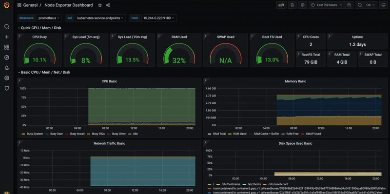

<small>【运维干货分享】如何在 Kubernetes 上设置 Prometheus Node Exporter</small>

本指南将引导你完成Kubernetes集群上的节点exporter设置，并集成 Prometheus 抓取配置来抓取节点指标。

## 什么是普罗米修斯节点exporter？

Node Exporter 是官方的Prometheus exporter，用于捕获所有与Linux系统相关的指标。

它收集内核公开的所有硬件和操作系统级别指标。

你可以使用节点exporter从所有 Linux 系统收集系统指标。

## 为什么我们需要 Kubernetes 上的 Node Exporter？

默认情况下，大多数Kubernetes 集群都会公开 metric server 指标（来自摘要 API 的集群级别指标）和 Cadvisor（容器级别指标）。它不提供详细的节点级指标。

要获取所有 kubernetes 节点级系统指标，你需要在所有 kubernetes 节点中运行节点exporter。它收集所有 Linux 系统指标并通过端口9100上的/metrics端点公开它们

同样，你需要安装 Kube statemetrics来获取与 kubernetes 对象相关的所有指标。

### Kubernetes Manifests Kubernetes 清单

```
git clone https://github.com/bibinwilson/kubernetes-node-exporter
```

## 在 Kubernetes 上设置节点exporter

这就是我们要做的事情。

- 在所有 Kubernetes 节点上将节点exporter部署为daemonset 。 Daemonset 确保节点exporter的一个实例在所有节点中运行。它公开/metrics端点上端口9100上的所有节点指标
- 创建一个侦听端口9100并指向所有 daemonset 节点exporter pod 的服务。我们将使用端点作业配置从 Prometheus 监控服务端点（节点exporter Pod）。 Prometheus 配置部分对此有更多解释。 

步骤1：创建一个文件名为daemonset.yaml并复制以下内容。

```
apiVersion: apps/v1
kind: DaemonSet
metadata:
  labels:
    app.kubernetes.io/component: exporter
    app.kubernetes.io/name: node-exporter
  name: node-exporter
  namespace: monitoring
spec:
  selector:
    matchLabels:
      app.kubernetes.io/component: exporter
      app.kubernetes.io/name: node-exporter
  template:
    metadata:
      labels:
        app.kubernetes.io/component: exporter
        app.kubernetes.io/name: node-exporter
    spec:
      containers:
      - args:
        - --path.sysfs=/host/sys
        - --path.rootfs=/host/root
        - --no-collector.wifi
        - --no-collector.hwmon
        - --collector.filesystem.ignored-mount-points=^/(dev|proc|sys|var/lib/docker/.+|var/lib/kubelet/pods/.+)($|/)
        - --collector.netclass.ignored-devices=^(veth.*)$
        name: node-exporter
        image: prom/node-exporter
        ports:
          - containerPort: 9100
            protocol: TCP
        resources:
          limits:
            cpu: 250m
            memory: 180Mi
          requests:
            cpu: 102m
            memory: 180Mi
        volumeMounts:
        - mountPath: /host/sys
          mountPropagation: HostToContainer
          name: sys
          readOnly: true
        - mountPath: /host/root
          mountPropagation: HostToContainer
          name: root
          readOnly: true
      volumes:
      - hostPath:
          path: /sys
        name: sys
      - hostPath:
          path: /
        name: root
```

步骤 2：使用 kubectl 命令部署 daemonset。

```
kubectl create -f daemonset.yaml
```
步骤3：列出监控命名空间中的daemonset并确保其处于可用状态。
```
kubectl get daemonset -n monitoring
```
步骤 4：创建文件名为service.yaml并复制以下内容。
```
---
kind: Service
apiVersion: v1
metadata:
  name: node-exporter
  namespace: monitoring
  annotations:
      prometheus.io/scrape: 'true'
      prometheus.io/port:   '9100'
spec:
  selector:
      app.kubernetes.io/component: exporter
      app.kubernetes.io/name: node-exporter
  ports:
  - name: node-exporter
    protocol: TCP
    port: 9100
    targetPort: 9100
```
步骤5：创建服务。
```
kubectl create -f service.yaml
```
第 6 步：现在，检查服务的端点并查看它是否指向所有 daemonset pod。
```
kubectl get endpoints -n monitoring 
```


从上面的输出中可以看到，节点exporter服务具有三个端点。意味着三个节点exporter Pod 作为 Daemonset 的一部分在三个节点上运行。

## 节点exporter Prometheus 配置

我们有在端口 9100 上运行的节点exporter守护程序集和指向所有节点exporter Pod 的服务。

你需要将抓取配置添加到 Prometheus 配置文件中才能发现所有节点exporter Pod。

让我们看一下抓取节点exporter指标所需的 Prometheus 抓取配置。

```
      - job_name: 'node-exporter'
        kubernetes_sd_configs:
          - role: endpoints
        relabel_configs:
        - source_labels: [__meta_kubernetes_endpoints_name]
          regex: 'node-exporter'
          action: keep
```
在此配置中，我们提到作为端点的角色来抓取名称为node-exporter的端点。

将抓取配置添加到 Prometheus 后，你将在 Prometheus 中看到节点exporter目标，如下所示。


## 在 Prometheus 中查询 Node-exporter 指标

在 Prometheus 中验证节点exporter目标状态后，你可以查询 Prometheus 仪表板的可用节点exporter指标。

来自节点exporter的所有指标均以node_为前缀

你可以使用不同的 PromQL 表达式查询指标。请参阅查询基础知识以了解 PromQL 查询。

如果你在 Prometheus 仪表板中输入node_ ，它将列出所有可用指标，


## 将 Prometheus Node Exporter 指标可视化为 Grafana 仪表板

在 Grafana 上可视化节点exporter指标并不像你想象的那么困难。

社区 Grafana 节点exporter仪表板模板具有预定义的仪表板，其中包含所有支持的节点exporter指标。

你可以根据你的项目要求修改模板。

