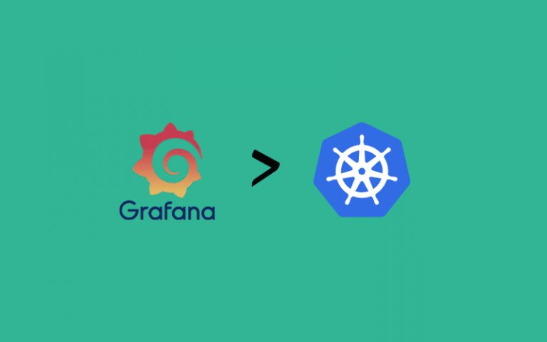
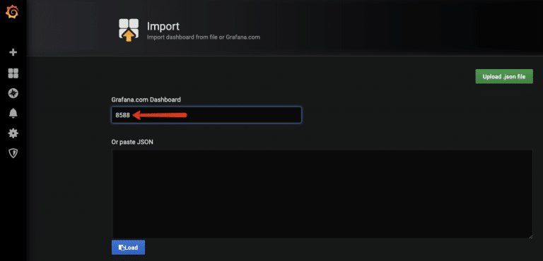
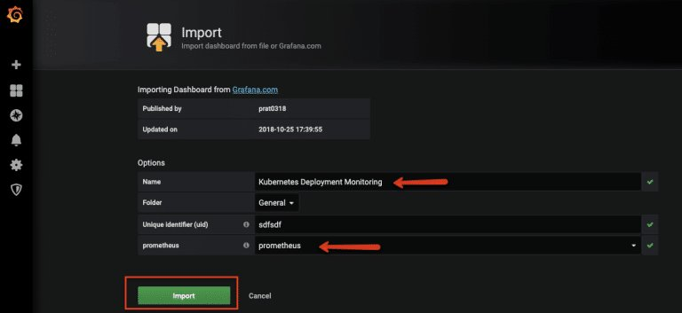
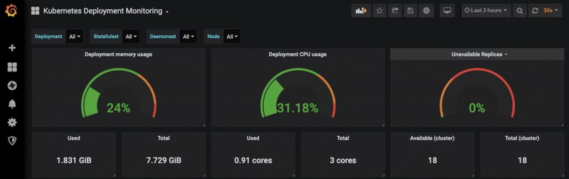

<small>【运维干货分享】如何在 Kubernetes 上设置 Grafana</small>


Grafana 是一个开源的轻量级仪表板工具。它可以与许多数据源集成，如 Prometheus、AWS Cloud Watch、Stackdriver 等。在 Kubernetes 上运行 Grafana

在我们之前的文章中，我们研究了以下内容。

[如何在 Kubernetes 集群上设置 Prometheus 监控](https://mp.weixin.qq.com/s?__biz=MzU4MjY3Mzc3OQ==&mid=2247494086&idx=2&sn=a94b6aeafdd3fa019a76ff2952ff9408&chksm=fdb61ddacac194ccb781f402580a92bd41f776637f0156473634320a49a25d5f4296a45f1fe1&token=1600392871&lang=zh_CN#rd)

[在 Kubernetes 上设置 Prometheus Node Exporter](https://mp.weixin.qq.com/s?__biz=MzU4MjY3Mzc3OQ==&mid=2247494112&idx=2&sn=f0fbde5c26803f824a7066256db6dd67&chksm=fdb61dfccac194eaf1e37eb7f77d943eab2c800a785872a99ff49a1a0cced4f788175032ac1d&token=1600392871&lang=zh_CN#rd)

[在 Kubernetes 上设置 Kube 状态指标](https://mp.weixin.qq.com/s?__biz=MzU4MjY3Mzc3OQ==&mid=2247494132&idx=2&sn=42b6a2d07617192c595b28be6539c3ca&chksm=fdb61de8cac194fe5a6075c7cb2f873b5c333c69e6be51310094b19045b01ac648710207f34d&token=1600392871&lang=zh_CN#rd)

[在 Kubernetes 上设置警报管理器](https://mp.weixin.qq.com/s?__biz=MzU4MjY3Mzc3OQ==&mid=2247494165&idx=2&sn=115d7541fb471a6ba25e1caf7d414ea1&chksm=fdb61e09cac1971f41c4ff35687e092da94427f3695ec798dffc37f975d61105f5780d49e661&token=1600392871&lang=zh_CN#rd)

本教程介绍如何在 Kubernetes 集群上运行 Grafana。使用 Grafana，你可以从 Prometheus 指标简化 Kubernetes 监控控制面板。

## Grafana Kubernetes 清单
本教程中使用的所有 Kubernetes 清单（YAML 文件）也托管在 Github 上。你可以克隆它并将其用于设置。
```
git clone https://github.com/bibinwilson/kubernetes-grafana.git
```
## 在 Kubernetes 上部署 Grafana
让我们详细看看 Grafana 设置。

步骤1：创建一个名为grafana-datasource-config.yaml

vi grafana-datasource-config.yaml
复制以下内容。

注意：以下数据源配置适用于 Prometheus。如果你有更多数据源，则可以在 data 部分下添加更多具有不同 YAML 的数据源。
```
apiVersion: v1
kind: ConfigMap
metadata:
  name: grafana-datasources
  namespace: monitoring
data:
  prometheus.yaml: |-
    {
        "apiVersion": 1,
        "datasources": [
            {
               "access":"proxy",
                "editable": true,
                "name": "prometheus",
                "orgId": 1,
                "type": "prometheus",
                "url": "http://prometheus-service.monitoring.svc:8080",
                "version": 1
            }
        ]
    }
```    
步骤2：使用以下命令创建 configmap。
```
kubectl create -f grafana-datasource-config.yaml
```
步骤3： 创建一个名为deployment.yaml
```
vi deployment.yaml
```
将以下内容复制到文件中。
```
apiVersion: apps/v1
kind: Deployment
metadata:
  name: grafana
  namespace: monitoring
spec:
  replicas: 1
  selector:
    matchLabels:
      app: grafana
  template:
    metadata:
      name: grafana
      labels:
        app: grafana
    spec:
      containers:
      - name: grafana
        image: grafana/grafana:latest
        ports:
        - name: grafana
          containerPort: 3000
        resources:
          limits:
            memory: "1Gi"
            cpu: "1000m"
          requests: 
            memory: 500M
            cpu: "500m"
        volumeMounts:
          - mountPath: /var/lib/grafana
            name: grafana-storage
          - mountPath: /etc/grafana/provisioning/datasources
            name: grafana-datasources
            readOnly: false
      volumes:
        - name: grafana-storage
          emptyDir: {}
        - name: grafana-datasources
          configMap:
              defaultMode: 420
              name: grafana-datasources
```

注意：此 Grafana 部署不使用持久卷。如果重启 Pod，则所有更改都将消失。如果你要根据项目要求部署 Grafana，请使用持久卷。它将保留 Grafana 使用的所有配置和数据。

步骤4：创建部署
```
kubectl create -f deployment.yaml
```
步骤5： 创建一个名为service.yaml
```
vi service.yaml
```
复制以下内容。这将在 32000 上暴露 Grafana。你还可以根据你的要求使用 ingress 或 Loadbalancer 公开它。NodePort
```
apiVersion: v1
kind: Service
metadata:
  name: grafana
  namespace: monitoring
  annotations:
      prometheus.io/scrape: 'true'
      prometheus.io/port:   '3000'
spec:
  selector: 
    app: grafana
  type: NodePort  
  ports:
    - port: 3000
      targetPort: 3000
      nodePort: 32000
```
步骤6：创建服务。
```
kubectl create -f service.yaml
```
现在，你应该能够使用端口上的任何节点 IP 访问 Grafana 仪表板。确保防火墙允许从工作站访问该端口。32000
```
http://<your-node-ip>:32000
```
你还可以使用以下命令使用端口转发。
```
kubectl port-forward -n monitoring <grafana-pod-name> 3000 &
```
例如
```
vagrant@dcubelab:~$ kubectl get po -n monitoring
NAME                       READY   STATUS    RESTARTS   AGE
grafana-64c89f57f7-kjqrb   1/1     Running   0          10m
vagrant@dcubelab:~$ kubectl port-forward -n monitoring grafana-64c89f57f7-kjqrb 3000 &
```
你将能够从以下位置访问 Grafanahttp://localhost:3000

使用以下默认用户名和密码登录。使用默认凭据登录后，它将提示你更改默认密码。
```
User: admin
Pass: admin
```

## Kubernetes 上的 Grafana 仪表板

从 Grafana 模板创建 Kubernetes 控制面板非常简单。有许多预构建的 Grafana 模板可用于 Kubernetes。你可以轻松地为入口控制器、卷、API 服务器、Prometheus 指标等预构建控制面板。

要了解更多信息，请参阅用于 Kubernetes 监控的 Grafana 模板

按照以下步骤设置 Grafana 仪表板来监控 kubernetes 部署。

步骤1：从 grafana 公共模板中获取模板 ID。如下所示。


步骤2： 前往 Grafana 仪表板并选择导入选项。


步骤3：输入你在步骤 1 中获得的控制面板 ID


步骤4：Grafana 将自动从 Grafana 网站获取模板。你可以更改下图所示的值，然后单击 Import。

注意：如果你位于公司防火墙后面，并且无法使用 ID 下载模板，则可以下载模板 JSON 并将 JSON 粘贴到文本框中以将其导入。


你应该会立即看到控制面板。


当 Grafana 与 Prometheus 一起使用时，它使用 PromQL 从 Prometheus 查询指标。你可以使用相同的 PromQL Prometheus 查询在 Grafana 上构建自定义控制面板。

## 结论
Grafana 是 Kubernetes 监控仪表板的一个非常强大的工具。