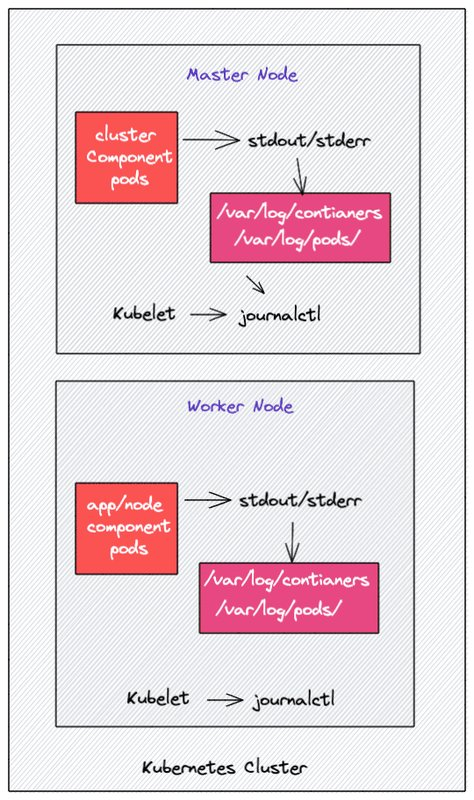
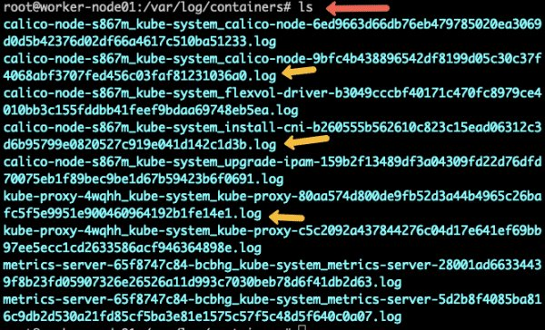
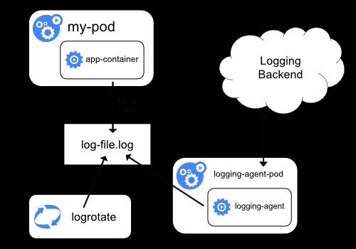
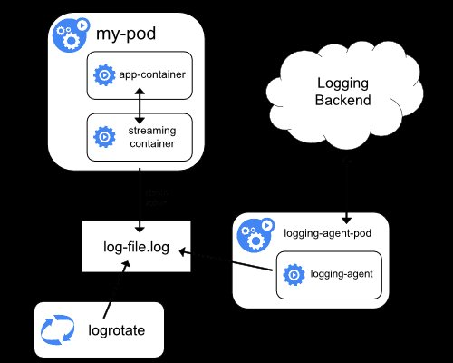
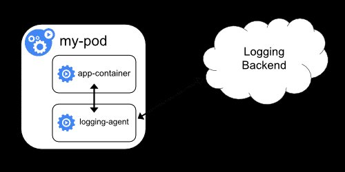

<small>【运维干货分享】Kubernetes 日志记录：初学者综合指南</small>

在本详细指南中，你将学习 Kubernetes 日志记录中涉及的关键概念、工作流、模式和工具。

在 Kubernetes 生产调试方面，日志记录起着至关重要的作用。它可以帮助你了解正在发生的事情、出了什么问题，甚至可能出什么问题。作为 DevOps 工程师，你应该清楚地了解 Kubernetes 日志记录，以解决集群和应用程序问题。


## Kubernetes 日志记录的工作原理

在 Kubernetes 中，大多数组件都作为容器运行。在 kubernetes 构造中，一个应用程序 Pod 可以包含多个容器。大多数 Kubernetes 集群组件，如 api-server、kube-scheduler、Etcd、kube 代理等，作为容器运行。但是，kubelet 组件作为本机 systemd 服务运行。

在本节中，我们将了解日志记录如何为 Kubernetes Pod 工作。它可以是应用程序 Pod 或 Kubernetes 组件 Pod。我们还将了解如何管理 kubelet systemd 日志。

通常，我们在 Kubernetes 上部署的任何 Pod 都会将日志写入 stdout 和 stderr 流，而不是将日志写入专用日志文件。但是，从每个容器流式传输到 stdout 和 stderr 的数据以纯文本格式存储在文件系统中。底层容器引擎执行此工作，它旨在处理日志记录。例如，Docker 容器引擎。



注意：所有 kubernetes 集群组件日志的处理方式与任何其他容器日志一样。

Kubelet 在所有节点上运行，以确保节点上的容器正常运行。它还负责运行静态 Pod。如果 kubelet 作为 systemd 服务运行，它会将日志写入 journald。

此外，如果容器没有将日志流式传输到 STDOUT 和 STDERR，你将无法使用 “kubectl logs” 命令获取日志，因为 kubelet 将无法访问日志文件。

## Kubernetes Pod 日志位置

你可以在每个 worker 节点的以下目录中找到 kubernetes pod 日志。

- /var/log/containers：所有容器日志都位于一个位置。
- /var/log/pods/：在此位置下，容器日志组织在单独的 Pod 文件夹中。.每个 Pod 文件夹都包含单个容器文件夹及其各自的日志文件。每个文件夹都有一个命名方案，该命名方案如下/var/log/pods/<namespace>_<pod_name>_<pod_id>/<container_name>/
此外，如果你的底层容器工程师是 docker，你将在文件夹中找到日志。/var/lib/docker/containers

如果你登录到任何 Kubernetes Worker 节点并转到该目录，你将找到该节点上运行的每个容器的日志文件。日志文件命名方案遵循 。下图显示了一个示例。/var/log/containers/var/log/pods/<namespace>_<pod_name>_<pod_id>/<container_name>/



此外，这些日志文件由 Kubelet 控制，因此当你运行 kubectl logs 命令时，kubelet 会在终端中显示这些日志。

## Kubelet 日志
对于 Kubelet，你可以使用 journalctl 从各个 worker 节点访问日志。例如，使用以下命令检查 Kubelet 日志。
```
journalctl -u kubelet
journalctl -u kubelet -o cat
```
如果 Kubelet 在没有 systemd 的情况下运行，你可以在 /var/log 目录中找到 Kubelet 日志。

## Kubernetes 容器日志格式
如前所述，所有日志数据都以纯文本格式存储。如果你打开任何日志文件，你将发现每个日志条目的以下内容。

- 日志级别：实际日志数据这表示日志条目的严重性，例如 INFO、WARN、ERROR 等。
- 日志消息：这是记录内容的实际描述
- 元数据：主机名、Pod 名称、IP 地址、标签等。
- 时间 – Timetamp
如果你打开任何日志文件，你将看到上述纯文本格式的信息。

## Kubernetes 日志的类型
对于 Kubernetes，以下是不同类型的日志。

- 应用程序日志：来自用户部署的应用程序的日志。应用程序日志有助于了解应用程序内部发生的情况。
- Kubernetes 集群组件：来自 api-server、kube-scheduler、etcd、kube-proxy 等的日志。这些日志可帮助你排查 Kubernetes 集群问题。
- Kubernetes 审计日志：与 API 服务器记录的 API 活动相关的所有日志。主要用于调查可疑的 API 活动。
- Kubernetes 日志记录架构


如果我们将 Kubernetes 集群作为一个整体来看待，则需要集中日志。没有默认的 Kubernetes 功能来集中日志。你需要设置一个集中式日志后端（例如：Elasticsearch）并将所有日志发送到日志后端。下图描述了高级 kubernetes 日志记录体系架构。


让我们了解日志记录的三个关键组成部分。

- 日志记录代理：一个日志代理，可以在所有 Kubernetes 节点中作为 daemonset 运行，将日志持续蒸煮到集中式日志记录后端。日志记录代理也可以作为 sidecar 容器运行。例如，Fluentbit。
- 日志后端：能够存储、搜索和分析日志数据的集中式系统。一个典型的例子是 Elasticsearch。
- 日志可视化：一种以控制面板形式可视化日志数据的工具。例如，Kibana。
- 日志告警：根据预定义的 KPI，可以为特定日志事件设置警报。组织使用 Xmatters 和 PagerDuty 等工具发送电子邮件或呼叫通知。

## Kubernetes 日志记录模式

本节将介绍一些 Kubernetes 日志记录模式，以将日志流式传输到日志记录后端。有三种关键的 Kubernetes 集群日志记录模式

- 节点级日志记录代理
- 流式处理 sidecar 容器
- Sidecar 日志记录代理
让我们详细看看每种方法。

1. 节点级日志记录代理



在这种方法中，节点级登录代理（例如：Fluentd）读取使用容器 STDOUT 和 STDERR 流创建的日志文件，然后将其发送到 Elasticsearch 等日志记录后端。这是一种常用的日志记录模式，运行良好，没有任何开销。

甚至 12 因素应用程序方法也建议将日志流式传输到 STDOUT。

2. 流式处理 sidecar 容器



当应用程序无法直接将日志写入 STDOUT 和 STDERR 流时，这种流式处理 sidecar 方法非常有用。

因此，应用程序容器将所有日志写入容器内的文件。然后，sidecar 容器从该日志文件中读取并将其流式传输到 STDOUT 和 STDERR。Rest 与第一种方法相同。

3. Sidecar 日志记录代理



在此方法中，日志不会流式传输到 STDOUT 和 STDERR。相反，带有日志记录代理的 sidecar 容器将与应用程序容器一起运行。然后，日志代理会将日志直接流式传输到日志后端。

这种方法有两个缺点。

- 将日志记录代理作为 sidecar 运行是资源密集型的。
- 你不会使用 command 获取日志，因为 Kubelet 不会处理日志。 kubectl logs

## Kubernetes 日志记录工具
Kubernetes 最常用的开源日志记录堆栈是 EFK（Elasticsearch、Flunentd/Fluent-but 和 Kibana）。

- Elasticsearch – 日志聚合器/搜索/分析
- Flunetd/Fluentbit – 日志代理（Fluentbit 是专为容器工作负载设计的轻量级代理）
- Kibana – 日志可视化和仪表板工具
- Grafana Loki – Kubernetes 日志记录


## EFK For Kubenretes Logging
Kubernetes 最好的开源日志记录设置之一是 EFK 堆栈。它包含 Elasticsearch、Fluentd 和 Kibana。

我们有一个关于 Kubernetes 上的 EFK 设置的详细博客。它涵盖了设置整个堆栈的分步指南。

查看 EFK Kubernetes 设置指南。

## Kubernetes 日志记录常见问题解答
让我们看看一些常见的 Kubernetes 日志记录问题。

### Kubernetes Pod 日志存储在哪里？
如果 Pod 使用 STDOUT 和 STDERR 流，则日志将存储在两个位置。/var/log/containers 和 /var/log/pods/ 中。但是，如果 Pod 使用 sidecar 日志代理模式，则日志将存储在 Pod 中。

### 如何找到 Kubernetes 审计日志？
在集群设置期间，你可以从 –audit-log-path 标志中指定的路径中找到审计日志。如果启用了审计策略但未设置此标志，则 api-server 会将审计日志流式传输到 STDOUT。在托管的 kubernetes 服务中，你可以选择启用审计日志，并且可以在相应托管的日志记录后端（如 Cloudwatch、Stackdriver 等）中检查日志。

### Kubernetes 如何轮换日志？
Kubernetes 不负责轮换容器日志。底层容器运行时可以使用特定参数处理日志轮换。例如，Docker 运行时有一个配置文件daemon.json用于配置日志轮换选项。

### 如何实时查看 Kubernetes 日志？
你可以使用 kubectl 实用程序实时查看日志和事件。

## 结论
在本指南中，我们了解了与 Kubernetes 日志记录相关的基本概念。
