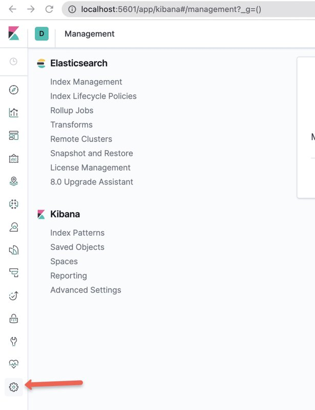
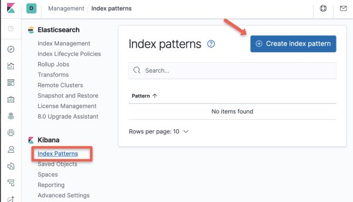
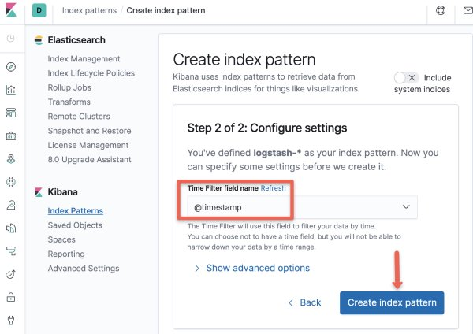

<small>【运维干货分享】如何在 Kubernetes 上设置 EFK Stack：分步指南</small>


在本 Kubernetes 教程中，你将学习如何在 Kubernetes 集群上设置 EFK Stack，以进行日志流式处理、日志分析和日志监控。

查看此 Kubernetes 日志记录系列的第 1 部分，其中我们为初学者介绍了 Kubernetes 日志记录基础知识和模式。

在 Kubernetes 集群上运行多个应用程序和服务时，将所有应用程序和 Kubernetes 集群日志流式传输到一个集中式日志记录基础设施以便于日志分析更有意义。

本初学者指南旨在引导你了解通过 EFK Stack进行 Kubernetes 日志记录的重要技术方面。


## 什么是 EFK Stack？
EFK 代表 Elasticsearch、Fluentd 和 Kibana。EFK 是 Kubernetes 日志聚合和分析的常用且最佳的开源选择。

- Elasticsearch 是一种分布式且可扩展的搜索引擎，通常用于筛选大量日志数据。它是一个基于 Lucene 搜索引擎（来自 Apache 的搜索库）的 NoSQL 数据库。它的主要工作是存储日志并从 fluentd 检索日志。
- Fluentd 是一家原木运输商。它是一个开源的日志收集代理，支持多种数据源和输出格式。此外，它还可以将日志转发到 Stackdriver、Cloudwatch、elasticsearch、Splunk、Bigquery 等解决方案。简而言之，它是生成日志数据的系统和存储日志数据的系统之间的统一层。
- Kibana 是用于查询、数据可视化和仪表板的 UI 工具。它是一个查询引擎，允许你通过 Web 界面浏览日志数据，为事件日志构建可视化效果，特定于查询以筛选信息以检测问题。你可以使用 Kibana 虚拟构建任何类型的仪表板。Kibana 查询语言 （KQL） 用于查询 Elasticsearch 数据。在这里，我们使用 Kibana 在 Elasticsearch 中查询索引数据。
  
此外，Elasticsearch 还有助于解决分离大量非结构化数据的问题，并被许多组织使用。Elasticsearch 通常与 Kibana 一起部署。

注意：对于 Kubernetes，Fluentd 是最好的选择，因为比 logstash 更重要，因为 FLuentd 无需任何额外配置即可解析容器日志。此外，它是一个 CNCF 项目。

## 在 Kubernetes 上设置 EFK Stack
我们将了解使用 Kubernetes 清单设置 EFK 的分步过程。你可以在 Kubernetes EFK Github 存储库中找到此博客中使用的所有清单。每个 EFK 组件的清单都分类在单独的文件夹中。

你可以克隆存储库并使用清单，同时按照本文进行操作。

```
git clone https://github.com/scriptcamp/kubernetes-efk
```
注： 所有 EFK 组件都部署在默认命名空间中。

## EFK 架构
下图显示了我们将要构建的 EFK Stack的高级体系结构。


EKF 组件的部署方式如下：

- Fluentd：- 部署为 daemonset，因为它需要从所有节点收集容器日志。它连接到 Elasticsearch 服务终端节点以转发日志。
- Elasticsearch：- 部署为 statefulset，因为它保存日志数据。我们还公开了 Fluentd 和 kibana 的服务终端节点以连接到它。
- Kibana：- 部署为部署并连接到 Elasticsearch 服务终端节点。

## 部署 Elasticsearch Statefulset

Elasticsearch 部署为 Statefulset，多个副本使用headless svc相互连接。headless svc 在 Pod 的 DNS 域中提供帮助。

将以下清单另存为es-svc.yaml

```
apiVersion: v1
kind: Service
metadata:
  name: elasticsearch
  labels:
    app: elasticsearch
spec:
  selector:
    app: elasticsearch
  clusterIP: None
  ports:
    - port: 9200
      name: rest
    - port: 9300
      name: inter-node
```

现在让我们创建它。
```
kubectl create -f es-svc.yaml
```
在我们开始为 Elastic Search 创建 statefulset 之前，让我们回顾一下，statefulset 需要预先定义一个存储类，它可以在需要时使用该存储类创建卷。

注意：虽然在生产环境中，我们需要使用 400-500Gbs 的卷进行弹性搜索，但在这里我们使用 3Gb PVC 进行部署以进行演示。

现在让我们创建 Elasticsearch statefulset。将以下清单另存为es-sts.yaml

注意：statefulset 使用默认的可用存储类别创建 PVC。如果您有 PVC 的自定义存储类，则可以通过取消注释storageClassName参数将其添加到volumeClaimTemplates中。

```
apiVersion: apps/v1
kind: StatefulSet
metadata:
  name: es-cluster
spec:
  serviceName: elasticsearch
  replicas: 3
  selector:
    matchLabels:
      app: elasticsearch
  template:
    metadata:
      labels:
        app: elasticsearch
    spec:
      containers:
      - name: elasticsearch
        image: docker.elastic.co/elasticsearch/elasticsearch:7.5.0
        resources:
            limits:
              cpu: 1000m
            requests:
              cpu: 100m
        ports:
        - containerPort: 9200
          name: rest
          protocol: TCP
        - containerPort: 9300
          name: inter-node
          protocol: TCP
        volumeMounts:
        - name: data
          mountPath: /usr/share/elasticsearch/data
        env:
          - name: cluster.name
            value: k8s-logs
          - name: node.name
            valueFrom:
              fieldRef:
                fieldPath: metadata.name
          - name: discovery.seed_hosts
            value: "es-cluster-0.elasticsearch,es-cluster-1.elasticsearch,es-cluster-2.elasticsearch"
          - name: cluster.initial_master_nodes
            value: "es-cluster-0,es-cluster-1,es-cluster-2"
          - name: ES_JAVA_OPTS
            value: "-Xms512m -Xmx512m"
      initContainers:
      - name: fix-permissions
        image: busybox
        command: ["sh", "-c", "chown -R 1000:1000 /usr/share/elasticsearch/data"]
        securityContext:
          privileged: true
        volumeMounts:
        - name: data
          mountPath: /usr/share/elasticsearch/data
      - name: increase-vm-max-map
        image: busybox
        command: ["sysctl", "-w", "vm.max_map_count=262144"]
        securityContext:
          privileged: true
      - name: increase-fd-ulimit
        image: busybox
        command: ["sh", "-c", "ulimit -n 65536"]
        securityContext:
          privileged: true
  volumeClaimTemplates:
  - metadata:
      name: data
      labels:
        app: elasticsearch
    spec:
      accessModes: [ "ReadWriteOnce" ]
      # storageClassName: ""
      resources:
        requests:
          storage: 3Gi
```
让我们创建 statefulset。
```
kubectl create -f es-sts.yaml
```
## 验证 Elasticsearch 部署
在 Elastisearch Pod 进入运行状态后，让我们尝试验证 Elasticsearch statefulset。最简单的方法是检查集群的状态。要检查状态，请端口转发 Elasticsearch pod 的 9200 端口。
```
kubectl port-forward es-cluster-0 9200:9200
```
要检查 Elasticsearch 集群的运行状况，请在终端中运行以下命令。
```
curl http://localhost:9200/_cluster/health/?pretty
```
输出将显示 Elasticsearch 集群的状态。如果正确执行了所有步骤，则状态应显示为 'green'。
```
{
  "cluster_name" : "k8s-logs",
  "status" : "green",
  "timed_out" : false,
  "number_of_nodes" : 3,
  "number_of_data_nodes" : 3,
  "active_primary_shards" : 8,
  "active_shards" : 16,
  "relocating_shards" : 0,
  "initializing_shards" : 0,
  "unassigned_shards" : 0,
  "delayed_unassigned_shards" : 0,
  "number_of_pending_tasks" : 0,
  "number_of_in_flight_fetch" : 0,
  "task_max_waiting_in_queue_millis" : 0,
  "active_shards_percent_as_number" : 100.0
}
```
## Elasticsearch Headless Service 提示
如你所知，Headless svc 不用作负载均衡器，而是用于一起处理一组 Pod。headless svc还有另一个用例。

我们可以使用它来获取单个 Pod 的地址。让我们以 e. 为例来理解这一点。

我们有 3 个 Pod 作为 Elastic 搜索 statefulset 的一部分运行。

|Pod 名称|	Pod 地址|
|--|--|
es-cluster-0|	172.20.20.134
es-cluster-1|	172.20.10.134
es-cluster-2|	172.20.30.89
Elasticsearch Pod 及其地址

并且一个headless svc – “ elasticsearch ” 指向这些 pod。

如果你从在集群的同一命名空间内运行的 pod 执行nslookup ，你将能够通过 headless svc 获取上述 pod 的地址。

```
nslookup es-cluster-0.elasticsearch.default.svc.cluster.local

Server:		10.100.0.10
Address:	10.100.0.10#53

Name:	es-cluster-0.elasticsearch.default.svc.cluster.local
Address: 172.20.20.134
```
上述概念在 Kubernetes 中使用得很普遍，所以应该理解清楚。事实上，有状态环境变量——“ discovery.seed_hosts ”和“ cluster.initial_master_nodes ”正在使用这个概念。

现在，我们已经有一个正在运行的 Ealsticsearch 集群，现在让我们转到 Kibana。

## 部署 Kibana 部署和服务
Kibana 可以创建为简单的Kubernetes 部署。如果您检查以下 Kibana 部署清单文件，我们会定义一个环境变量ELASTICSEARCH_URL来配置 Elasticsearch 集群端点。 Kibana 使用端点 URL 连接到 elasticsearch。

将 Kibana 部署清单创建为kibana-deployment.yaml

```
apiVersion: apps/v1
kind: Deployment
metadata:
  name: kibana
  labels:
    app: kibana
spec:
  replicas: 1
  selector:
    matchLabels:
      app: kibana
  template:
    metadata:
      labels:
        app: kibana
    spec:
      containers:
      - name: kibana
        image: docker.elastic.co/kibana/kibana:7.5.0
        resources:
          limits:
            cpu: 1000m
          requests:
            cpu: 100m
        env:
          - name: ELASTICSEARCH_URL
            value: http://elasticsearch:9200
        ports:
        - containerPort: 5601
```        
立即创建清单。
```
kubectl create -f kibana-deployment.yaml
```
让我们创建一个 NodePort 类型的服务，以通过节点 IP 地址访问 Kibana UI。我们使用 nodePort 进行演示。但是，理想情况下，带有 ClusterIP 服务的 kubernetes ingress 用于实际的项目实现。

将以下清单另存为kibana-svc.yaml
```
apiVersion: v1
kind: Service
metadata:
  name: kibana-np
spec:
  selector: 
    app: kibana
  type: NodePort  
  ports:
    - port: 8080
      targetPort: 5601 
      nodePort: 30000
```      
创建现在。kibana-svc
```
kubectl create -f kibana-svc.yaml
```
现在你将能够通过http://<node-ip>:3000

## 验证 Kibana 部署
在 Pod 进入 running 状态后，让我们尝试验证 Kibana 部署。执行此操作的最简单方法是通过集群的 UI 访问。

要检查状态，请端口转发 Kibana Pod 的端口。如果你已创建 nodePort 服务，也可以使用该服务。5601
```
kubectl port-forward <kibana-pod-name> 5601:5601
```
在此之后，通过 Web 浏览器访问 UI 或使用 curl 发出请求
```
curl http://localhost:5601/app/kibana
```
如果 Kibana UI 加载或出现有效的 curl 响应，那么我们可以得出结论，Kibana 运行正常。

现在让我们转到 fluentd 组件。

## 部署 Fluentd Kubernetes 清单
Fluentd 部署为 daemonset，因为它必须从集群中的所有节点流式传输日志。除此之外，它需要特殊权限才能在所有命名空间中列出和提取pod的元数据。

Kubernetes 服务帐户用于向 Kubernetes 中的组件提供权限，以及集群角色和集群角色绑定。让我们继续创建所需的服务账户和角色。

## 创建 Fluentd 群集角色
kubernetes 中的集群角色包含代表一组权限的规则。对于 fluentd，我们希望为 Pod 和命名空间授予权限。

创建清单fluentd-role.yaml
```
apiVersion: rbac.authorization.k8s.io/v1
kind: ClusterRole
metadata:
  name: fluentd
  labels:
    app: fluentd
rules:
- apiGroups:
  - ""
  resources:
  - pods
  - namespaces
  verbs:
  - get
  - list
  - watch
```
应用 manifest
```
kubectl create -f fluentd-role.yaml
```
## 创建 Fluentd 服务帐户
kubernetes 中的服务帐户是向 Pod 提供身份的实体。在这里，我们想要创建一个用于 fluentd pod 的服务账户。

创建清单fluentd-sa.yaml
```
apiVersion: v1
kind: ServiceAccount
metadata:
  name: fluentd
  labels:
    app: fluentd
```    
应用 manifest
```
kubectl create -f fluentd-sa.yaml
```
## Creste Fluentd 集群角色绑定
kubernetes 中的集群角色绑定将集群角色中定义的权限授予服务账户。我们希望在角色和上面创建的服务账户之间创建一个 rolebinding。

创建清单fluentd-rb.yaml
```
kind: ClusterRoleBinding
apiVersion: rbac.authorization.k8s.io/v1
metadata:
  name: fluentd
roleRef:
  kind: ClusterRole
  name: fluentd
  apiGroup: rbac.authorization.k8s.io
subjects:
- kind: ServiceAccount
  name: fluentd
  namespace: default
```  
应用 manifest
```
kubectl create -f fluentd-rb.yaml
```
## 部署 Fluentd DaemonSet
现在让我们部署 daemonset。

将以下内容另存为fluentd-ds.yaml
```
apiVersion: apps/v1
kind: DaemonSet
metadata:
  name: fluentd
  labels:
    app: fluentd
spec:
  selector:
    matchLabels:
      app: fluentd
  template:
    metadata:
      labels:
        app: fluentd
    spec:
      serviceAccount: fluentd
      serviceAccountName: fluentd
      containers:
      - name: fluentd
        image: fluent/fluentd-kubernetes-daemonset:v1.4.2-debian-elasticsearch-1.1
        env:
          - name:  FLUENT_ELASTICSEARCH_HOST
            value: "elasticsearch.default.svc.cluster.local"
          - name:  FLUENT_ELASTICSEARCH_PORT
            value: "9200"
          - name: FLUENT_ELASTICSEARCH_SCHEME
            value: "http"
          - name: FLUENTD_SYSTEMD_CONF
            value: disable
        resources:
          limits:
            memory: 512Mi
          requests:
            cpu: 100m
            memory: 200Mi
        volumeMounts:
        - name: varlog
          mountPath: /var/log
        - name: varlibdockercontainers
          mountPath: /var/lib/docker/containers
          readOnly: true
      terminationGracePeriodSeconds: 30
      volumes:
      - name: varlog
        hostPath:
          path: /var/log
      - name: varlibdockercontainers
        hostPath:
          path: /var/lib/docker/containers
```          
注意：如果你检查部署，我们会使用两个环境变量，& .Fluentd 使用这些 Elasticsearch 值来发送收集的日志。"FLUENT_ELASTICSEARCH_HOST""FLUENT_ELASTICSEARCH_PORT"

让我们应用 fluentd 清单
```
kubectl create -f fluentd-ds.yaml
```
## 验证 Fluentd 设置
为了验证 fluentd 安装，让我们启动一个持续创建日志的 pod。然后，我们将尝试在 Kibana 中查看这些日志。

将以下内容另存为test-pod.yaml
```
apiVersion: v1
kind: Pod
metadata:
  name: counter
spec:
  containers:
  - name: count
    image: busybox
    args: [/bin/sh, -c,'i=0; while true; do echo "Thanks for visiting devopscube! $i"; i=$((i+1)); sleep 1; done']
```    
应用 manifest
```
kubectl create -f test-pod.yaml
```
现在，让我们前往 Kibana，检查一下 fluentd 是否正在获取此 Pod 中的日志并将其存储在 elasticsearch 中。请按照以下步骤操作：

步骤1：使用代理或 nodeport 服务终端节点打开 kibana UI。前往其中的管理控制台。


步骤2：选择 Kibana 部分下的 “Index Patterns” 选项。


步骤3：使用模式 – “” 创建新的索引模式，并且logstash-*


步骤4：在时间戳选项中选择 “”。@timestamp


步骤5：现在索引模式已创建。前往 Discover Console。在这里，你将能够看到 fluentd 导出的所有日志，例如来自我们测试 Pod 的日志，如下图所示。


就是这样！

我们已经涵盖了 Kubernetes 中日志记录解决方案所需的所有组件，并分别验证了我们的每个组件。让我们来了解一下使用 EFK Stack的最佳实践。

## Kubernetes EFK 最佳实践
Elasticsearch 广泛使用堆内存进行筛选和缓存，以获得更好的查询性能，因此应该有足够的内存可用于 Elastic Search。

将总内存的一半以上分配给 elasticsearch 也可能为操作系统功能留下过少的内存，这反过来可能会阻碍 Elasticsearch 的功能。

所以要注意这一点！将总堆空间的 40-50% 分配给 Elasticsearch 就足够了。
弹性搜索索引可能会很快填满，因此定期清理旧索引非常重要。Kubernetes cron 作业可以帮助你以自动化方式定期执行此操作。
跨多个节点复制数据有助于灾难恢复，还可以提高查询性能。默认情况下，elasticsearch 中的复制因子设置为 1。

考虑根据你的用例调整这些值。至少有 2 个是一个很好的练习。
已知访问频率较高的数据可以放置在分配更多资源的不同节点中。这可以通过运行 cronjob 来实现，该作业定期将索引移动到不同的节点。

虽然这是一个高级用例 - 但对于初学者来说，至少知道可以做这样的事情是件好事。
在 Elastic Search 中，你可以将索引存档到低成本的云存储（如 aws-s3），并在需要这些索引中的数据时进行还原。

如果你需要保留日志以供审计和合规性，则这是一种最佳实践。
拥有多个节点（如主节点、数据节点和客户端节点）具有专用功能，有利于实现高可用性和容错能力。
## 超越 EFK – 进一步研究
本指南只是在 Kubernetes 上设置 Elastic Stack的一个小用例。Elastic Stack 还有许多其他功能，有助于记录和监控解决方案。

例如，它可以从各种云提供商的虚拟机和托管服务中传输日志。你甚至可以将日志从 Kafka 等数据工程工具发送到 Elastic Stack。

Elastic Stack 还有其他值得研究的强大组件，例如：

Elastic Metrics：在整个基础设施中传输来自多个来源的指标，并在 Elastic Search 和 Kibana 中提供这些指标。
APM：扩展了 Elastic Stack 功能，让你能够分析应用程序在哪些方面花费了时间快速修复生产中的问题。
正常运行时间：帮助监控和分析应用程序和服务中的可用性问题，以免它们开始出现在生产中。
探索和研究它们！

## 结论
在他的 Kubernetes EFK 设置指南中，我们学习了如何在 Kubernetes 上设置日志记录基础设施。

如果你想成为一名 DevOps 工程师，了解 Kubernetes 日志记录中涉及的所有概念非常重要。

在本系列的下一部分中，我们将探索 Kibana 仪表板和可视化选项。

在 Kibana 中，最好尽可能通过图表可视化数据，因为它可以更清晰地了解应用程序状态。所以别忘了查看本系列的下一部分。