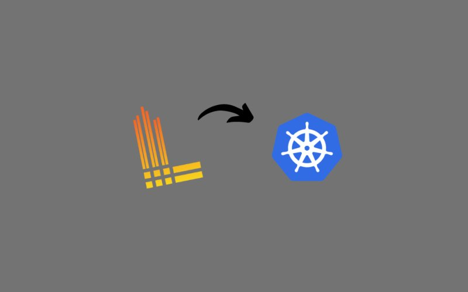
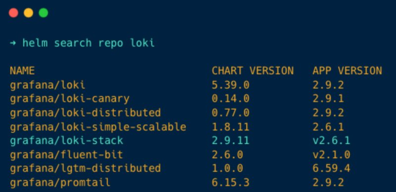
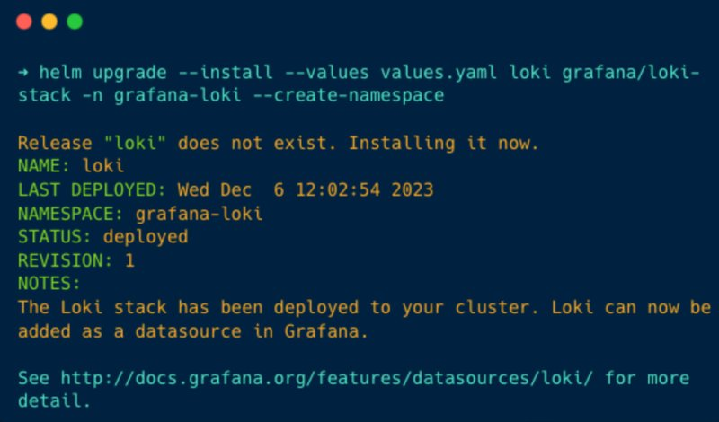
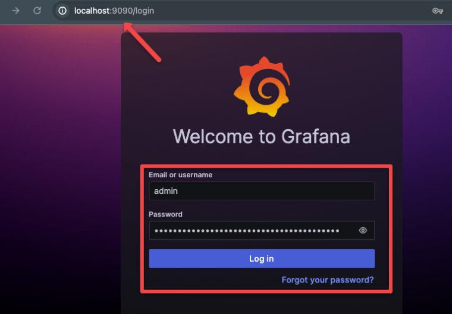
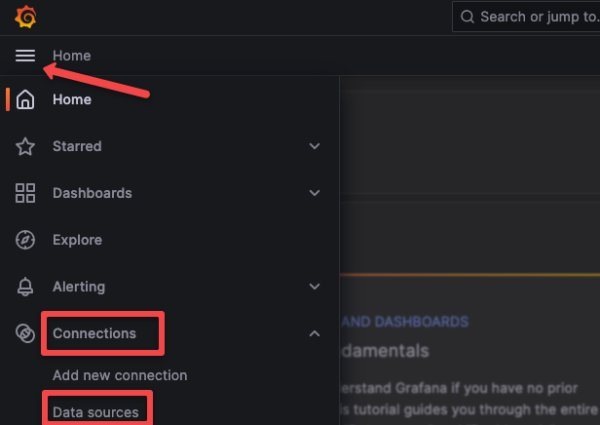
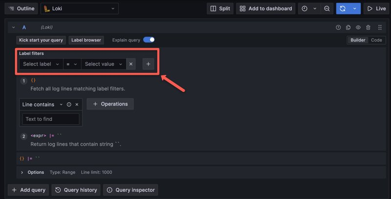
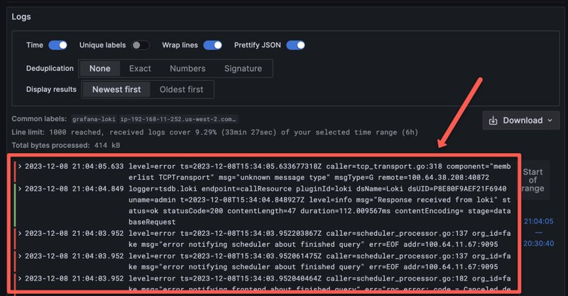

<small>【运维干货分享】如何在Kubernetes上设置Grafana Loki并查询日志</small>



在此博客中，我们将研究使用 Helm 在 Kubernetes 上设置 Grafana Loki 的分步指南。我们还将了解如何使用 promtail 查询聚合日志。

Grafana Loki 是一个开源日志聚合系统，支持大规模日志管理。它是组织可观测性堆栈广泛采用的工具。

如果你想详细了解 Grafana Loki 的架构，请阅读详细的 Grafana Loki 架构博客。

## Grafana Loki 工作流程
下图所示 Grafana Loki 的工作流程概述


让我解释一下图表

- 如图所示，Loki 从 Promtail 获取日志，Promtail 是 Loki 的日志收集代理。
- Promtail 收集日志并交给 Loki，Loki 压缩日志并将其保存为块。
- 要查看日志，请使用 Grafana 控制面板，Grafana 默认通过端口 3100 与 Loki 连接。
- 用户可以在浏览器上访问 Grafana 控制面板，并使用 Grafana 控制面板查询日志。
## 设置先决条件
以下是此设置的先决条件。

- Kubernetes 集群
- kubectl
- 系统中已安装的 Helm
## 在 Kubernetes 上设置 Grafana Loki 的步骤
如果你已准备好满足上述先决条件，请按照以下步骤使用 Helm 在 Kubernetes 上设置 Grafana Loki 日志记录。

### 第 1 步：添加 Grafana 存储库
将 Grafana 存储库添加到你的系统以下载 helm 图表以设置 Grafana Loki 日志记录。运行以下命令以添加存储库
```
helm repo add grafana https://grafana.github.io/helm-charts
```
添加存储库后，运行以下命令以更新存储库，以确保存储库是最新的
```
helm repo update
```
现在，使用命令列出每个带有单词 Loki 的存储库
```
helm search repo loki
```
你将获得带有单词 Loki 的存储库列表，如下所示

从这些存储库中，我们将使用具有 Helm 图表的grafana/loki-stack来部署 Promtail 和 Grafana，并将 Loki 配置到 Grafana。

### 步骤 2：自定义 Helm Chart 配置值
在部署之前，我们需要更新 helm chart 中的一些配置。

使用以下命令将 helm 图表的默认值保存在 YAML 文件中。
```
helm show values grafana/loki-stack > loki.yaml
```
现在，在 loki.yaml 中，更改 Grafana 配置块，因为默认情况下它设置为 false，并且不会安装 Grafana。


如上图所示，启用 Grafana 并将标签设置为最新版本，这将部署最新版本的 Grafana。你还可以根据需要更改其他值。

如果要将日志存储在 Persistent Volume 而不是文件系统中，请将 PVC 配置为 Loki。

由于 Grafana Loki 部署为 StatefulSet，因此即使 Grafana Loki Pod 被删除并再次部署，日志也会保存在同一个持久卷上。

以下是此 Helm 图表中使用的图像。

- grafana/loki 
- docker.io/grafana/promtail
  
### 第 3 步：部署 Loki
更改值后，使用以下命令使用 YAML 文件部署 Loki Helm 图表
```
helm upgrade --install --values loki.yaml loki grafana/loki-stack -n grafana-loki --create-namespace
```
这将创建一个命名空间 grafana-loki 并为 Kubernetes 上的 Grafana Loki 日志记录部署每个组件。

部署所有内容后，你将获得以下输出


### 第 4 步：登录 Grafana UI
首先，使用命令验证所有内容是否已部署并正常运行
```
kubectl get pod -n grafana-loki
```
你将获得以下输出


我正在使用 2 个 worker 节点，这就是 Promtail 在两个节点中运行的原因，因为 Promtail 部署为 DaemonSet。

现在，每个组件都已正确部署在 Kubernetes 集群上，端口转发 Grafana，以便我们可以在浏览器上访问 Grafana 仪表板，因为 Loki 使用 Grafana 仪表板来显示日志。

使用以下命令在端口 9090 上对 Grafana 进行端口转发。
```
kubectl port-forward pod/loki-grafana-7dd5f9d5c7-4d8jm -n grafana-loki 9090:3000
```
确保将 loki-grafana-7dd5f9d5c7-4d8jm 替换为你的 Grafana pod 名称，你可以使用命令 kubectl get pod -n grafana-loki 获取该名称，如下所示


你还可以将 Grafana 服务公开为 NodePort，并使用分配给你的服务的节点 IP 和节点端口访问它。

### 第 5 步：登录 Grafana
通过搜索 localhost：9090 在浏览器上访问你的 Grafana，你将获得以下窗口

Loki 的 Grafana UI
使用用户名和密码登录 Grafana。你的默认用户名将是 admin，要获取密码，请运行以下命令
```
kubectl get secret --namespace grafana-loki loki-grafana -o jsonpath="{.data.admin-password}" | base64 --decode ; echo
```
此命令将显示你的 Grafana 密码，使用密码并登录 Grafana。


登录后，你可以看到 Grafana 的主屏幕，按左上角的三行，你可以看到菜单，然后转到“连接”>“数据源”，如下图所示。



在 Data sources （数据源） 中，你可以看到 Loki 已配置，如下所示


### 步骤 6：查询日志
现在，检查你是否正在获取日志。

按 Explore 按钮转到 Explore。

要查询日志，请选择 Label 和 Value，Loki 将收集 Kubernetes 集群中的每个日志，并根据 Kubernetes 的容器、Pod、命名空间和其他对象对其进行标记。


选择 Label 和 Value 后，按右上角的蓝色按钮查询日志。你还可以设置查询日志的时间。

例如，如果你将时间设置为 5 秒，则它会每 5 秒查询一次日志。


按下蓝色按钮后，向下滚动以查看你选择的 Label （标签） 和 Value （值） 中的日志。


## 结论
我相信这可以帮助你通过简单的六个步骤设置 Grafana Loki。我们还学习了如何从 Grafana 控制面板使用 Loki 查询日志。