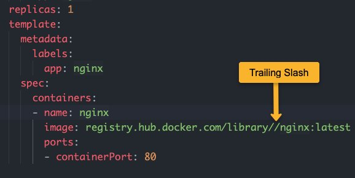

<small>【运维干货分享】如何对 Kubernetes Pod 进行故障排除：初学者指南</small>

在此博客中，你将学习如何对 kubernetes pod 进行故障排除，并调试与 pod 内的容器相关的问题。

如果你想成为具有 Kubernetes 技能的 DevOps 工程师，则必须了解 Pod 故障排除。

大多数情况下，你可以通过描述 Pod 事件来获取 Pod 错误详情。通过错误消息，你可以找出 Pod 故障的原因并进行纠正。


## 如何排查 Pod 错误？
对 Pod 进行故障排除的第一步是获取 Pod 的状态。
```
kubectl get pods
```
以下输出显示了 status.
```
➜  kubectl get pods
NAME                            READY   STATUS                       RESTARTS   AGE
config-service                  0/1     CreateContainerConfigError   0          20s
image-service-fdf74c785-9znfd   0/1     InvalidImageName             0          30s
secret-pod                      0/1     ContainerCreating            0          15s
```
现在，你已经知道了错误类型，下一步是描述单个 Pod 并浏览事件以查明导致 Pod 错误的原因。

例如
```
kubectl describe pod config-service
```
其中 是 Pod 名称。现在，让我们详细了解如何排查和调试不同类型的 Pod 错误。config-service


## Pod 错误的类型
在深入研究 Pod 调试之前，了解不同类型的 Pod 错误至关重要。

### 容器和镜像错误
所有这些错误状态都是kubernetes容器包和Kubernetes镜像包的一部分

以下是官方 Kubernetes Pod 错误列表以及错误描述。

|Pod 错误类型	|错误描述|
|-|-|
|ErrImagePull|如果 kubernetes 无法拉取清单中提到的镜像。
|ErrImagePullBackOff|容器镜像拉取失败，kubelet 正在回退镜像拉取
|ErrInvalidImageName|表示镜像名称错误。
|ErrImageInspect|无法检查镜像。
|ErrImageNeverPull|节点上不存在指定的 Image，并且 PullPolicy 设置为 NeverPullImage
|ErrRegistryUnavailable|尝试连接到registry.时出现 HTTP 错误
|ErrContainerNotFound|在声明的 Pod 中，指定的容器不存在或不受 kubelet 管理。
|ErrRunInitContainer|容器初始化失败。
|ErrRunContainer|由于配置错误，Pod 的容器无法成功启动。
|ErrKillContainer|Pod 的任何容器都没有成功杀死。
|ErrCrashLoopBackOff|容器已终止。kubelet 不会尝试重启它。
|ErrVerifyNonRoot|容器或镜像尝试使用 root 权限运行。
|ErrCreatePodSandbox|Pod 沙箱创建未成功。
|ErrConfigPodSandbox|未获取 Pod 沙箱配置。
|ErrKillPodSandbox|容器沙箱未成功停止。
|ErrSetupNetwork|网络初始化失败。
|ErrTeardownNetwork|

现在让我们看看一些最常见的 pod 错误以及如何调试它们。

### 排查 ErrImagePullBackOff 问题
```
➜  pods kubectl get pods
NAME                                READY   STATUS             RESTARTS   AGE
nginx-deployment-599d6bdb7d-lh7d9   0/1     ImagePullBackOff   0          7m17s
```
如果您在 Pod 状态中看到ErrImagePullBackOff ，很可能是由于以下原因。

- registry中不存在指定的镜像。
- 镜像名称或标记中的拼写错误。
- 由于凭证问题，来自给定registry的镜像提取访问被拒绝。
  
如果检查 pod 事件，将看到ErrImagePull错误，后跟ErrImagePullBackOff 。这意味着 kubelet 停止一次又一次尝试拉取镜像。
```
kubectl describe pod <pod-name>
```
错误参考
```
Warning  Failed     24m (x4 over 25m)    kubelet            Error: ErrImagePull
  Normal   BackOff    23m (x6 over 25m)    kubelet            Back-off pulling image "ngasdinx:latest"
  Warning  Failed     29s (x110 over 25m)  kubelet            Error: ImagePullBackOff
```

### 排查错误：InvalidImageName
```
➜  pods kubectl get pod
NAME                                READY   STATUS             RESTARTS   AGE
nginx-deployment-6f597fc4cd-j86mm   0/1     InvalidImageName   0          7m26s
```

如果你在清单中指定了错误的图片 URL，则会收到InvalidImageName错误。

例如，如果你有一个私有容器registry.，并且使用https提到镜像名称，则会引发InvalidImageNamehttps
错误。你需要指定镜像名称，但不指定https


如果图像名称中有尾部斜杠，您将收到InspectFailed和InvalidImageName错误。您可以通过描述 pod 来检查它。



错误参考
```
Warning  InspectFailed  4s (x6 over 42s)  kubelet            Failed to apply default image tag "registry.hub.docker.com/library//nginx:latest": couldn't parse image reference "registry.hub.docker.com/library//nginx:latest": invalid reference format
  Warning  Failed         4s (x6 over 42s)  kubelet            Error: InvalidImageName

```

### 排查 RunContainerError 问题
```
secret-pod     0/1     RunContainerError            0 (9s ago)   12s

```
Pod Configmap & Secret 错误 [CreateContainerConfigError]


CreateContainerConfigError是与 Pod 中的Configmaps和Secrets相关的常见错误之一。
这通常是由于两个原因造成的。

- 你有错误的 configmap 或作为环境变量引用的密钥
- 引用的 configmap 不可用

如果你describe pod，你将看到以下错误。
```
Warning  Failed     3s (x2 over 10s)  kubelet     Error: configmap "nginx-config" not found
```
如果键名称中有拼写错误，你将在 pod 事件中看到以下错误。
```
Warning  Failed     2s  kubelet  Error: couldn't find key service-names in ConfigMap default/nginx-config
```
为了纠正这个问题，

- 确保已创建configmap。
- 确保你已将正确的configmap名称和键名添加到env声明中。
  
让我们看一下正确的例子。这是一个 configmap，其中service-name是 pod 内需要作为 env 变量的键。
```
apiVersion: v1
kind: ConfigMap
metadata:
  name: nginx-config
  namespace: default
data:
  service-name: front-end-service
```
这是使用密钥 ( service-name ) 和 configmap 名称 ( nginx-config ) 的正确 pod 定义
```
apiVersion: v1
kind: Pod
metadata:
  name: config-service
spec:
  containers:
    - name: nginx
      image: nginx
      env:
        - name: SERVICE
          valueFrom:
            configMapKeyRef:
              name: nginx-config
              key: service-name
```

### Pod Pending错误

要排查 Pod Pending错误，你需要了解 Pod 生命周期阶段。在 Pod 的第一阶段 pending 意味着 Pod 已创建，但没有任何主容器正在运行。

要了解根本原因，你可以描述 Pod 并检查事件。

例如
```
kubectl describe pod <pod-name> -n <namespace>
```
下面是一个待处理 Pod 的输出，由于没有节点可用性，它显示 FailedScheduling。这可能是由于
```
Events:
  Type     Reason            Age                  From               Message
  ----     ------            ----                 ----               -------
  Warning  FailedScheduling  38s (x24 over 116m)  default-scheduler  no nodes available to schedule pods
```  
这可能是由于

- 节点 CPU 和内存资源较少
- 由于关联性/反关联性规则，没有合适的节点。
- 节点可能会因污点和容忍度而拒绝 Pod
- 节点可能尚未准备好调度 Pod。
- Pod 找不到要连接的卷。