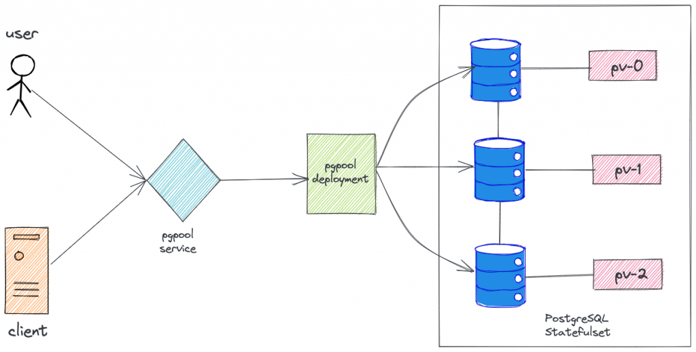

<small>【运维干货分享】如何在 Kubernetes 中部署具有高可用性的 PostgreSQL Statefulset</small>


本文旨在解释在 Kubernetes 上部署 PostgreSQL statefulset 集群所需的每个组件。我们还将讨论使用 pgpool 和 repmgr 的高可用性 PostgreSQL 集群设置。

在本文的结尾，我们添加了使用客户端 Pod 在 PostgreSQL 集群内执行基本操作的指南。
作为初学者，在了解相关步骤的同时逐个创建组件是了解 Kubernetes 和 Postgres 的好方法。

循序渐进确保你可以专注于理解“为什么”，同时学习“如何”。

## PostgreSQL 集群 Kubernetes 清单
本指南中使用的所有 Kubernetes YAML 清单都托管在 Github 上。克隆存储库以供参考和实施。
```
git clone https://github.com/scriptcamp/kubernetes-postgresql.git
```
我们已经解释了 Kubernetes 上的 PostgreSQL 所需的所有清单。如果你在从文章中复制清单时遇到问题，请直接克隆并参考清单。

我们将清单分为三个文件夹，分别是 client、pgpool 和 postgresql，如下所示。
```
├── client
│   ├── client-pod.yaml
│   └── psql-client.yaml
├── pgpool
│   ├── nginx.yaml
│   ├── pgpool-deployment.yaml
│   ├── pgpool-secret.yaml
│   ├── pgpool-svc-nodeport.yaml
│   └── pgpool-svc.yaml
└── postgresql
    ├── postgres-configmap.yaml
    ├── postgres-headless-svc.yaml
    ├── postgres-secrets.yaml
    └── postgres-statefulset.yaml
```    
如果你希望一次性部署组件，请 cd 进入每个目录并执行以下操作。从 postgresql 目录开始。

```
kubectl apply -f .
```

### Bitnami PostgreSQL Docker 镜像
本教程使用了 Bitnami docker 镜像，这是有意为之的。作为初学者，使用 Bitnami 镜像可以获得某些优势。

- Bitnami 镜像附带预装了必要的组件。这让我们保持专注，可以深入了解和熟悉 Kubernetes 方面的事情。
- Bitnami 镜像在发布之前已经过充分的测试和验证。这有助于我们节省时间并克服我们在使用新版本或补丁时可能遇到的任何问题。
- Bitnami 镜像有很好的文档记录，你将找到对 bitnami 镜像使用的每个环境变量的令人满意的解释。所以非常适合初学者。

最重要的是，作为初学者 - 我们应该专注于了解 kubernetes 组件，避免因为安装数十个包、查找文档等而偏离我们的目标。


### 高级架构



### 创建 Namespace
为了部署 PostgreSQL 集群，我们将创建一个名为 database 的专用命名空间。
```
kubectl create namespace database
```
清单文件没有添加命名空间。因此，我们将在部署每个组件时添加命名空间。如果你未指定命名空间，它将部署在默认命名空间中。

### 创建 Postgres 服务器 ConfigMap
Kubernetes 中的 ConfigMap 允许我们在容器上挂载文件，而无需更改 Dockerfile 或重新构建容器镜像。

在必须通过文件修改或创建配置的情况下，此功能非常有用。

Postgres 要求在即将停止时运行脚本 （pre-stop.sh）。我们将使用配置映射将此脚本挂载到 Pod 中。

将以下清单另存为pre-stop.shpostgres-configmap.yaml
```
apiVersion: v1
kind: ConfigMap
metadata:
  name: postgres-configmap
data:
  pre-stop.sh: |-
    #!/bin/bash
    set -o errexit
    set -o pipefail
    set -o nounset

    # Debug section
    exec 3>&1
    exec 4>&2

    # Load Libraries
    . /opt/bitnami/scripts/liblog.sh
    . /opt/bitnami/scripts/libpostgresql.sh
    . /opt/bitnami/scripts/librepmgr.sh

    # Auxiliary functions
    is_new_primary_ready() {
        return_value=1
        currenty_primary_node="$(repmgr_get_primary_node)"
        currenty_primary_host="$(echo $currenty_primary_node | awk '{print $1}')"

        info "$currenty_primary_host != $REPMGR_NODE_NETWORK_NAME"
        if [[ $(echo $currenty_primary_node | wc -w) -eq 2 ]] && [[ "$currenty_primary_host" != "$REPMGR_NODE_NETWORK_NAME" ]]; then
            info "New primary detected, leaving the cluster..."
            return_value=0
        else
            info "Waiting for a new primary to be available..."
        fi
        return $return_value
    }

    export MODULE="pre-stop-hook"

    if [[ "${BITNAMI_DEBUG}" == "true" ]]; then
        info "Bash debug is on"
    else
        info "Bash debug is off"
        exec 1>/dev/null
        exec 2>/dev/null
    fi

    # Load PostgreSQL & repmgr environment variables
    . /opt/bitnami/scripts/postgresql-env.sh

    postgresql_enable_nss_wrapper

    # Prepare env vars for managing roles
    primary_node="$(repmgr_get_primary_node)"
    primary_host="$(echo $primary_node | awk '{print $1}')"

    # Stop postgresql for graceful exit.
    postgresql_stop

    if [[ "$primary_host" == "$REPMGR_NODE_NETWORK_NAME" ]]; then
        info "Primary node need to wait for a new primary node before leaving the cluster"
        retry_while is_new_primary_ready 10 5
    else
        info "Standby node doesn't need to wait, leaving the cluster."
    fi
```
创建 configmap
```
kubectl apply -f postgres-configmap.yaml -n database
```
了解脚本试图做什么很重要。以下是概述：

- 脚本首先检查正在停止的组件类型，即 master 或 follower。
- 如果 master 被停止 – 脚本会延迟 pod 的停止，直到之前的 follower 被提升为 master。
- 这样做是为了确保高可用性，即至少应该存在一个具有写入能力的 master。

混乱？不用担心。请继续。阅读高可用性部分后，上述几点将变得清晰且更有意义。

请务必浏览脚本并重新审视要点。

### 部署 PostgreSQL 服务
Kubernetes 中的服务是 Pod 用来相互通信的对象。ClusterIP这种类型的服务通常用于 Pod 间通信。

有两种类型的 ClusterIP 服务

- 无头服务
- services 
  
普通的 Kubernetes 服务充当负载均衡器，并遵循循环逻辑来分配负载。Headless 服务的作用与负载均衡器不同。此外，普通服务由 Kubernetes 分配 IP，而 Headless 服务则不是。

对于 Postgres 服务器，我们需要无头服务，因为它是 PostgresSQL statefulset 的要求。

将以下清单另存为 postgres-headless-svc.yaml

```
apiVersion: v1
kind: Service
metadata:
  name: postgres-headless-svc
spec:
  type: ClusterIP
  clusterIP: None
  ports:
  - name: postgresql
    port: 5432
    targetPort: postgresql
    protocol: TCP 
  selector:
    app: postgres
```
创建服务。
```
kubectl apply -f postgres-headless-svc.yaml -n database
```
### 创建 PostgresSQL Server 密钥
Kubernetes 中的 Secret 是用于向容器提供敏感信息的对象。它们类似于 ConfigMap，不同之处在于数据以 base 64 编码格式存储。

为了 PostgreSQL 集群的安全，使用密码限制对数据库的访问是明智的。我们将使用 Secrets 将所需的密码挂载到容器中。

注意：在生产使用案例中，将使用 hashicorp vault 等密钥管理解决方案来存储和检索密钥。你可以参考 Kubernetes 上的 hashicorp vault 设置指南以了解更多信息。

将以下清单另存为 .请使用你自己的安全密码更改密码。postgres-secrets.yaml
```
apiVersion: v1
kind: Secret
metadata:
  name: postgres-secrets
data:
  postgresql-password: "V2JyVHBOM2c3cQ=="
  repmgr-password: "c1ZwYm90R2d4Nw=="
```  
创建 Secret。
```
kubectl apply -f postgres-secrets.yaml -n database
```
当集群初始化时，它会创建某些用户，就像我们的例子中是&。上述密码适用于这些用户。postgresrepmgr

### PostgreSQL StatefulSet
在 Kubernetes 上部署 PostgreSQL 时，应该使用什么对象类型，为什么？Deployment 还是 StatefulSets？

答案是 StatefulSet。让我们讨论一下！

StatefulSet 是用于管理有状态应用程序的 Kubernetes 对象。对于此用例，它比部署更可取，因为它为这些 Pod 的排序和唯一性提供了保证，即使用有状态集可以更好地管理卷。

本部分对于更深入地了解部署逻辑至关重要。所以要全神贯注地阅读吧！

作为初学者，理解为什么我们想要部署 Statefulset 而不是 Deployment 是很重要的。毕竟，我们的重点是理解 “为什么 ”以及学习 “如何”。

### 为什么我们需要 PostgreSQL Statefulset？
Postgres 将是一个有状态的应用程序，即它将数据（如表、用户）存储在卷中。如果数据存储在 Pod 临时存储中，则一旦 Pod 重新启动，数据将被擦除。

此外，在案件负载增加的情况下，Postgres 可能必须扩展到多个 pod。

所有这些操作都必须以这样一种方式完成，以便在所有 Pod 之间保持数据一致性，例如 0、、。postgres-postgres-1postgres-2

我们如何在 Kubernetes 中实现这一目标？请思考，然后提前阅读！

Postgres 在其所有 Pod 之间实现数据的连续复制。因此，当数据写入时，它会被复制到 . 从 复制数据。等等......postgres-0postgres-1postgres-2postgres-3

Postgres 能够使用名为 RepMgr 的开源工具执行此连续复制，该工具内置于 Postgres docker 镜像中。

这里要了解的是需要知道在哪里寻找 .否则，复制将如何进行？postgres-1postgres-0

- 它如何知道从何处获取数据以进行复制过程？
- postgres-1 如何知道在哪里查找 postgres-0？
- postgres-2 如何知道在哪里查找 postgres-1？

现在让我们尝试回答这些问题。

在部署和有状态集的情况下，Pod 总是被分配一个唯一的名称，可以用来查找 Pod。

在部署的情况下，Pod 总是被分配一个唯一的名称，但这个唯一的名称在删除并重新创建 Pod 后会发生变化。因此，识别任何 Pod 都没有用。
```
Case of deployments: name of pod initially: postgres-bcr25qd41c-skxpe  
name of pod after it gets deleted & recreated: vault-j545c6dfk4-56fcs 
Here, pod name got changed.
```
在有状态集的情况下 - 每个 Pod 都被分配了一个唯一的名称，即使 Pod 被删除并重新创建，这个唯一的名称也会保留。
```
Case of statefulsets: name of pod initially: postgres-0 
name of pod after it gets deleted & recreated: postgres-0 Here, pod name remained the same.
```
这就是为什么我们想在这里使用有状态的集合，即我们可以毫无差异地访问任何 pod。

此外，这种独特的顺序可确保每个 Pod 都分配相同的底层卷，而不管 Pod 是否重启。

这些状态集和部署的概念并不是Postgres部署所独有的，如果你探索 - 你会发现许多流行的Kubernetes工具都使用有状态集。

一些示例包括 Hashicorp 的 Vault、Elasticsearch 等等。由于相同的逻辑，它们都使用 Stateful Set 而不是 deployments。

### 部署 PostgreSQL StatefulSet
首先，让我们创建 Statefulset。在本节的末尾，我还添加了对 Postgres Statefulset 的解释。

将以下清单另存为postgres-statefulset.yaml
```
apiVersion: apps/v1
kind: StatefulSet
metadata:
  name: postgres-sts
spec:
  serviceName: postgres-headless-svc
  replicas: 3
  selector:
    matchLabels:
      app: postgres
  template:
    metadata:
      labels:
        app: postgres
    spec:
      securityContext:
        fsGroup: 1001
      containers:
        - name: postgresql
          lifecycle:
            preStop:
              exec:
                command:
                  - /pre-stop.sh
          image: docker.io/bitnami/postgresql-repmgr:11.12.0-debian-10-r44
          imagePullPolicy: "IfNotPresent"
          securityContext:
            runAsUser: 1001
          # Auxiliary vars to populate environment variables
          env:
            - name: BITNAMI_DEBUG
              value: "false"
            # PostgreSQL configuration
            - name: POSTGRESQL_VOLUME_DIR
              value: "/bitnami/postgresql"
            - name: PGDATA
              value: "/bitnami/postgresql/data"
            - name: POSTGRES_USER
              value: "postgres"
            - name: POSTGRES_PASSWORD
              valueFrom:
                secretKeyRef:
                  name: postgres-secrets
                  key: postgresql-password
            - name: POSTGRES_DB
              value: "postgres"
            - name: POSTGRESQL_LOG_HOSTNAME
              value: "true"
            - name: POSTGRESQL_LOG_CONNECTIONS
              value: "false"
            - name: POSTGRESQL_LOG_DISCONNECTIONS
              value: "false"
            - name: POSTGRESQL_PGAUDIT_LOG_CATALOG
              value: "off"
            - name: POSTGRESQL_CLIENT_MIN_MESSAGES
              value: "error"
            - name: POSTGRESQL_SHARED_PRELOAD_LIBRARIES
              value: "pgaudit, repmgr"
            - name: POSTGRESQL_ENABLE_TLS
              value: "no"
            # Repmgr configuration
            - name: MY_POD_NAME
              valueFrom:
                fieldRef:
                  fieldPath: metadata.name
            - name: REPMGR_UPGRADE_EXTENSION
              value: "no"
            - name: REPMGR_PGHBA_TRUST_ALL
              value: "no"
            - name: REPMGR_MOUNTED_CONF_DIR
              value: "/bitnami/repmgr/conf"
            - name: REPMGR_NAMESPACE
              valueFrom:
                fieldRef:
                  fieldPath: metadata.namespace
            - name: REPMGR_PARTNER_NODES
              value: postgres-sts-0.postgres-headless-svc.$(REPMGR_NAMESPACE).svc.cluster.local,postgres-sts-1.postgres-headless-svc.$(REPMGR_NAMESPACE).svc.cluster.local,postgres-sts-2.postgres-headless-svc.$(REPMGR_NAMESPACE).svc.cluster.local
            - name: REPMGR_PRIMARY_HOST
              value: "postgres-sts-0.postgres-headless-svc.$(REPMGR_NAMESPACE).svc.cluster.local"
            - name: REPMGR_NODE_NAME
              value: "$(MY_POD_NAME)"
            - name: REPMGR_NODE_NETWORK_NAME
              value: "$(MY_POD_NAME).postgres-headless-svc.$(REPMGR_NAMESPACE).svc.cluster.local"
            - name: REPMGR_LOG_LEVEL
              value: "NOTICE"
            - name: REPMGR_CONNECT_TIMEOUT
              value: "5"
            - name: REPMGR_RECONNECT_ATTEMPTS
              value: "3"
            - name: REPMGR_RECONNECT_INTERVAL
              value: "5"
            - name: REPMGR_USERNAME
              value: "repmgr"
            - name: REPMGR_PASSWORD
              valueFrom:
                secretKeyRef:
                  name: postgres-secrets
                  key: repmgr-password
            - name: REPMGR_DATABASE
              value: "repmgr"
          ports:
            - name: postgresql
              containerPort: 5432
              protocol: TCP
          livenessProbe:
            exec:
              command:
                - bash
                - -ec
                - 'PGPASSWORD=$POSTGRES_PASSWORD psql -w -U "postgres" -d "postgres"  -h 127.0.0.1 -c "SELECT 1"'
            initialDelaySeconds: 30
            periodSeconds: 10
            timeoutSeconds: 5
            successThreshold: 1
            failureThreshold: 6
          readinessProbe:
            exec:
              command:
                - bash
                - -ec
                - 'PGPASSWORD=$POSTGRES_PASSWORD psql -w -U "postgres" -d "postgres"  -h 127.0.0.1 -c "SELECT 1"'
            initialDelaySeconds: 5
            periodSeconds: 10
            timeoutSeconds: 5
            successThreshold: 1
            failureThreshold: 6
          volumeMounts:
            - name: data
              mountPath: /bitnami/postgresql
            - name: hooks-scripts
              mountPath: /pre-stop.sh
              subPath: pre-stop.sh
      volumes:
        - name: hooks-scripts
          configMap:
            name: postgres-configmap
            defaultMode: 0755
  volumeClaimTemplates:
    - metadata:
        name: data
      spec:
        accessModes:
          - "ReadWriteOnce"
        resources:
          requests:
            storage: "1Gi"
```
### 创建 Statefulset。
```
kubectl apply -f postgres-statefulset.yaml -n database
```
PostgreSQL 服务器的 Statefulset YAML 具有 configmap 挂载、安全上下文、探测等组件。让我们了解关键配置。

元数据作为 env vars：在 Kubernetes 中，Pod 的名称、Pod 的命名空间等信息可以用作 Pod 的环境变量。

当环境变量需要为 Pod 使用 Pod 元数据或某些 Kubernetes 定义的字段时，这非常有用。
```
- name: MY_POD_NAME
  valueFrom:
    fieldRef:
      fieldPath: metadata.name 
- name: REPMGR_PASSWORD
  valueFrom:
    secretKeyRef:
      name: postgres-secrets 
```
通过 secret 注入的环境变量：有时，容器需要知道敏感数据才能使用它。

例如，为了向 Postgres 数据库分配密码，必须将所需的密码安全地提供给 Postgres 容器。
```
 - name: POSTGRES_PASSWORD
   valueFrom:
     secretKeyRef:
       name: postgres-secrets
       key: postgresql-password
 - name: REPMGR_PASSWORD
   valueFrom:
     secretKeyRef:
       name: postgres-secrets
       key: repmgr-password 
```
探针：探针可确保 Vault 不会因任何错误而陷入循环，并且可以在出现意外错误时自动重新启动。
```
  livenessProbe:
    exec:
      command:
        - bash
        - -ec
        - 'PGPASSWORD=$POSTGRES_PASSWORD psql -w -U "postgres" -d "postgres"  -h 127.0.0.1 -c "SELECT 1"'
    initialDelaySeconds: 30
    periodSeconds: 10
    timeoutSeconds: 5
    successThreshold: 1
    failureThreshold: 6
  readinessProbe:
    exec:
      command:
        - bash
        - -ec
        - 'PGPASSWORD=$POSTGRES_PASSWORD psql -w -U "postgres" -d "postgres"  -h 127.0.0.1 -c "SELECT 1"'
    initialDelaySeconds: 5
    periodSeconds: 10
    timeoutSeconds: 5
    successThreshold: 1
    failureThreshold: 6
```
#### 上述探针的基本原理
这里使用的命令只是使用 “” 用户转到 “” 数据库并运行 “SELECT 1” 查询。

如果 Postgres 进程正常运行，则查询将具有成功的退出代码。否则不会。

这样我们就可以确保探测器可以告诉我们进程是否正在运行或容器是否需要重新启动！

VolumeClaimTemplates 的 VolumeClaimTemplates 中： 一个模板，有状态集可以通过该模板为副本创建卷。
```
  volumeClaimTemplates:
    - metadata:
        name: data
      spec:
        accessModes:
          - "ReadWriteOnce"
        resources:
          requests:
            storage: "1Gi"
```
现在，让我们来看看 Postgres 进程的重要环境变量。

- POSTGRESQL_VOLUME_DIR：Postgres 进程写入其配置文件和数据的目录。这是我们应该使用 PVC 挂载的目录。
- PGDATA：主 Postgres 目录中的目录，应在其中创建数据目录。
- POSTGRES_USER：应在 Postgres 进程启动时自动创建的用户。
- POSTGRES_PASSWORD：默认创建的用户的密码。
- POSTGRES_DB：应在 Postgres 进程启动时创建的数据库。

现在让我们讨论一下 RepMgr。

### PostgresSQL 服务器中的 RepMgr
RepMgr是Postgres附带的开源工具，它有两个目的：复制和故障转移。

- 复制：它将数据从主服务器复制到所有副本。这有助于通过分发读写查询来减轻服务器的负载。
- 故障转移：它可以处理集群中的故障转移，即它可以在需要时将只读服务器提升为主服务器。

你可以在此处阅读更多相关信息：https://repmgr.org/

让我们来看看 repmgr 设置的重要环境变量。

- REPMGR_PARTNER_NODES：这需要集群中所有 Postgres 服务器地址的逗号分隔列表。包括主服务器的地址。
- REPMGR_PRIMARY_HOST：这需要 Postgres 主服务器的地址。
- REPMGR_USERNAME：要为 repmgr 操作创建的用户。
- REPMGR_PASSWORD：要为 repmgr 操作创建的密码。
- REPMGR_DATABASE：要为 repmgr 操作创建的数据库。

### 有效使用 Headless svc 的提示
如你所知，Headless svc 不用作负载均衡器，而是用于一起处理一组 Pod。无头服务还有另一个用例。

我们可以使用它来获取单个 Pod 的地址。让我们以 e. 为例来理解这一点。我们有 3 个 Pod 作为 Postgres Statefulset 的一部分运行。

|Pod 名称|	Pod 地址|
|-|-|
|postgres-sts-0	|172.17.0.3
postgres-sts-1	|172.17.0.8
postgres-sts-2	|172.17.0.10
Pod 及其地址

并且无头 SVC “postgres-headless-svc” 指向这些 Pod。

如果你从集群的同一命名空间中运行的 Pod 执行 nslookup，你将能够通过无头 svc 获取上述 Pod 的地址。

```
nslookup postgres-sts-0.postgres-headless-svc.database.svc.cluster.local

Server:		10.96.0.10
Address:	10.96.0.10#53

Name:	postgres-sts-0.postgres-headless-svc.default.svc.cluster.local
Address: 172.17.0.3
```

上面的概念在 Kubernetes 中用得非常普遍，其实 env var REPMGR_PARTNER_NODES就是用这个。

### 用于 Postgres 的 pg-pool
Pg pool 是一个中间件组件，位于 Postgres 服务器前面，充当集群的守门人。

它主要有两个目的：负载平衡和限制请求。

- 负载均衡：Pg pool 接受连接请求和查询。它会分析查询以决定应将查询发送到何处。
- 只读查询可由只读副本处理。写入操作只能由主服务器处理。通过这种方式，它可以对集群进行负载均衡。
- 限制请求：与任何其他系统一样，Postgres 对 no 有限制。的并发连接数。
- pg-pool 限制了 no.它占用的连接数，并将剩余的连接排队。因此，优雅地处理过载。

### 创建 pg-pool 密钥
将以下清单另存为pgpool-secret.yaml
```
apiVersion: v1
kind: Secret
metadata:
  name: pgpool-secrets
data:
  admin-password: "SFRzaVZxYjdSZQ=="
```
### 创建 secret。
```
kubectl create -f pgpool-secret.yaml -n database
```
### 创建 pg-pool 服务
将以下清单另存为pgpool-svc.yaml
```
apiVersion: v1
kind: Service
metadata:
  name: pgpool-svc
spec:
  type: ClusterIP
  sessionAffinity: None
  ports:
    - name: postgresql
      port: 5432
      targetPort: postgresql
      protocol: TCP
      nodePort: null
  selector:
    app: pgpool
```
创建服务。
```
kubectl apply -f pgpool-svc.yaml -n database
```
如果你希望从 kubernetes 集群外部访问集群，你还需要部署 NodePort 服务。

将以下清单另存为pgpool-svc-nodeport.yaml
```
apiVersion: v1
kind: Service
metadata:
  name: pgpool-svc-nodeport
spec:
  type: NodePort
  sessionAffinity: None
  ports:
    - name: postgresql
      port: 5432
      nodePort: 32000
      targetPort: postgresql
      protocol: TCP
  selector:
    app: pgpool
```
创建服务。
```
kubectl apply -f pgpool-svc-nodeport.yaml -n database
```
### 部署 pgpool 部署
将以下清单另存为pgpool-deployment.yaml
```
apiVersion: apps/v1
kind: Deployment
metadata:
  name: pgpool-deployment
spec:
  replicas: 1
  selector:
    matchLabels: 
      app: pgpool
  template:
    metadata:
      labels: 
        app: pgpool
    spec:          
      securityContext:
        fsGroup: 1001
      containers:
        - name: pgpool
          image: docker.io/bitnami/pgpool:4.2.3-debian-10-r38
          imagePullPolicy: "IfNotPresent"
          securityContext:
            runAsUser: 1001
          env:
            - name: BITNAMI_DEBUG
              value: "false"
            - name: PGPOOL_BACKEND_NODES
              value: 0:postgres-sts-0.postgres-headless-svc:5432,1:postgres-sts-1.postgres-headless-svc:5432,2:postgres-sts-2.postgres-headless-svc:5432
            - name: PGPOOL_SR_CHECK_USER
              value: "repmgr"
            - name: PGPOOL_SR_CHECK_PASSWORD
              valueFrom:
                secretKeyRef:
                  name: postgres-secrets
                  key: repmgr-password
            - name: PGPOOL_SR_CHECK_DATABASE
              value: "postgres"
            - name: PGPOOL_ENABLE_LDAP
              value: "no"
            - name: PGPOOL_POSTGRES_USERNAME
              value: "postgres"
            - name: PGPOOL_POSTGRES_PASSWORD
              valueFrom:
                secretKeyRef:
                  name: postgres-secrets
                  key: postgresql-password
            - name: PGPOOL_ADMIN_USERNAME
              value: "admin"
            - name: PGPOOL_ADMIN_PASSWORD
              valueFrom:
                secretKeyRef:
                  name: pgpool-secrets
                  key: admin-password
            - name: PGPOOL_ENABLE_LOAD_BALANCING
              value: "yes"
            - name: PGPOOL_ENABLE_LOG_CONNECTIONS
              value: "no"
            - name: PGPOOL_ENABLE_LOG_HOSTNAME
              value: "yes"
            - name: PGPOOL_ENABLE_LOG_PER_NODE_STATEMENT
              value: "no"
            - name: PGPOOL_CHILD_LIFE_TIME
              value: ""
            - name: PGPOOL_ENABLE_TLS
              value: "no"
          ports:
            - name: postgresql
              containerPort: 5432
              protocol: TCP
          livenessProbe:
            exec:
              command:
                - /opt/bitnami/scripts/pgpool/healthcheck.sh
            initialDelaySeconds: 30
            periodSeconds: 10
            timeoutSeconds: 5
            successThreshold: 1
            failureThreshold: 5
          readinessProbe:
            exec:
              command:
                - bash
                - -ec
                - PGPASSWORD=${PGPOOL_POSTGRES_PASSWORD} psql -U "postgres" -d "postgres" -h /opt/bitnami/pgpool/tmp -tA -c "SELECT 1" >/dev/null
            initialDelaySeconds: 5
            periodSeconds: 5
            timeoutSeconds: 5
            successThreshold: 1
            failureThreshold: 5
```
### 创建部署。
```
kubectl apply -f pgpool-deployment.yaml -n database
```
### PostgreSQL 高可用性
RepMgr 提供的故障转移机制和 Pg-pool 提供的负载均衡保证了 Postgres 集群长时间保持运行状态。

这两种机制共同确保了 PostgreSQL 集群的高可用性。
通过 Pod 反亲和性配置，你可以指示 Kubernetes 将 Pod 部署在不同节点中。这可确保在 Kubernetes 节点宕机时不会出现单点故障。

Pod 反关联性要求 Kubernetes 节点使用适当的标签进行标记。你甚至可以通过标记数据库来将集群中的几个节点专用于数据库。使用节点关联性，所有 PostgreSQL Pod 都会被分配给具有特定标签的节点。

### 从客户端连接到 PostgreSQL 集群
让我们创建一个 psql 客户端 pod。我们将使用它来连接和验证集群。将清单内容复制为psql-client.yaml
```
---
apiVersion: v1
kind: Pod
metadata:
  name: pg-client
spec:
  containers:
    - image: bitnami/postgresql:11.12.0-debian-10-r13
      name: postgresql
      env:
      - name: ALLOW_EMPTY_PASSWORD
        value: "yes"
```
让我们部署客户端。
```
kubectl apply -f psql-client.yaml -n database
```
现在，让我们尝试连接到集群。

复制密码。
```
kubectl get secret postgres-secrets -n database -o jsonpath="{.data.postgresql-password}" | base64 --decode
```
执行和连接。
```
kubectl exec -it pg-client -n database -- /bin/bash
```
我们将使用密码和 pg-pool 服务端点连接到集群。pgpool-svc
```
PGPASSWORD=WbrTpN3g7q psql -h pgpool-svc -p 5432 -U postgres
```
用于从集群外部连接。

```
PGPASSWORD=WbrTpN3g7q psql -h <IP ADDR> -p <NODEPORT ADDR of pgpool-svc-nodeport> -U postgres

//For minikube, IP ADDR can be found out by executing "minikube ip"
```
例如

PGPASSWORD=WbrTpN3g7q psql -h 34.138.59.54 -p 32000 -U postgres
尝试一些基本的示例命令：
```
create database db1;

\c db1; //to connect to new database

create table test (id int primary key not null, value text not null);       
                
insert into test values (1, 'value1');       

select * from test;
```
### 验证 PostgreSQL 复制
用于验证是否正在进行复制的命令。
```
//after connecting to the cluster using psql client.
select * from pg_stat_replication;
```
不。你应该看到的条目数 = 否。运行的 Postgres 副本数减去 1。

“负 1”的原因：数据正在从 master 复制到 follower。从逻辑上讲，数据不可能从 master 复制到自身！

通过随机删除 Pod 并查看集群是否变得无响应来验证故障转移。我向你保证，它将继续工作而不会出现问题！

作为练习，请彻底验证！我总是按照 – 信任但验证的原则处理数据库。

当主 Pod 宕机时，follower pod 的日志示例：请注意消息如何通知用户正在发生故障转移！
```
NOTICE: promoting standby to primary
DETAIL: promoting server "postgres-sts-1" (ID: 1001) using "/opt/bitnami/postgresql/bin/pg_ctl -o "--config-file="/opt/bitnami/postgresql/conf/postgresql.conf" --external_pid_file="/opt/bitnami/postgresql/tmp/postgresql.pid" --hba_file="/opt/bitnami/postgresql/conf/pg_hba.conf"" -w -D '/bitnami/postgresql/data' promote"
2021-07-28 20:38:11.362 GMT [266] LOG:  received promote request
2021-07-28 20:38:11.370 GMT [266] LOG:  redo done at 0/8000028
2021-07-28 20:38:11.370 GMT [266] LOG:  last completed transaction was at log time 2021-07-28 20:36:57.642182+00
2021-07-28 20:38:11.698 GMT [266] LOG:  selected new timeline ID: 2
2021-07-28 20:38:12.494 GMT [266] LOG:  archive recovery complete
NOTICE: waiting up to 60 seconds (parameter "promote_check_timeout") for promotion to complete
DEBUG: get_recovery_type(): SELECT pg_catalog.pg_is_in_recovery()
INFO: standby promoted to primary after 0 second(s)
DEBUG: setting node 1001 as primary and marking existing primary as failed
DEBUG: begin_transaction()
DEBUG: commit_transaction()
2021-07-28 20:38:13.105 GMT [264] LOG:  database system is ready to accept connections
NOTICE: STANDBY PROMOTE successful
```
## 测量 PostgreSQL 性能
作为初学者，让我们讨论有关 Postgre 的性能和指标应牢记的事项。

- 微调配置： 性能主要取决于已设置的配置。例如，由于工作负载增加，性能可能会在某些时间点受到影响。确保你已遵循所有建议的性能优化。
- 优化查询： 影响性能的另一个因素是占主导地位的查询类型。如果在给定时间内执行了大量写入操作，则性能将下降。它还取决于查询的优化。查询越优化 – 预期性能就越好。
- 集群大小：资源也会影响性能。假设你的集群由 3 个 Pod 组成。对于某些用例 – 这可能就足够了。对许多人来说，这还不够。
监控你的数据库指标并分析日志：根据 CPU 峰值、连接数、磁盘空间等监控数据。如果你设置了 Prometheus，则可以使用 PostgreSQL Prometheus 导出器来获取所有指标。
- 其他因素： 工作负载本身取决于多种因素，例如备份计划、流量峰值等。

性能主要取决于你的使用案例和业务承诺。这应该根据你的用例进行更多探索！

## 结论
这就是全部，伙计们！我们已经介绍了在 Kubernetes 上部署 PostgreSQL statefulset 的详细指南。
我们还讨论了使用 pgpool 和 repmgr 的高可用性和复制。

在生产方面，必须仔细考虑持久性卷管理、备份、高可用性和性能。