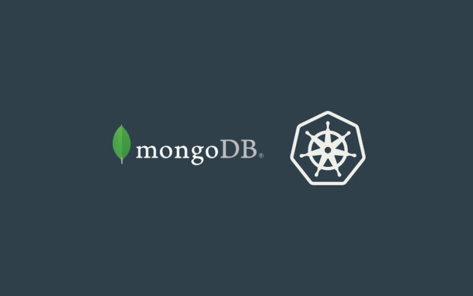
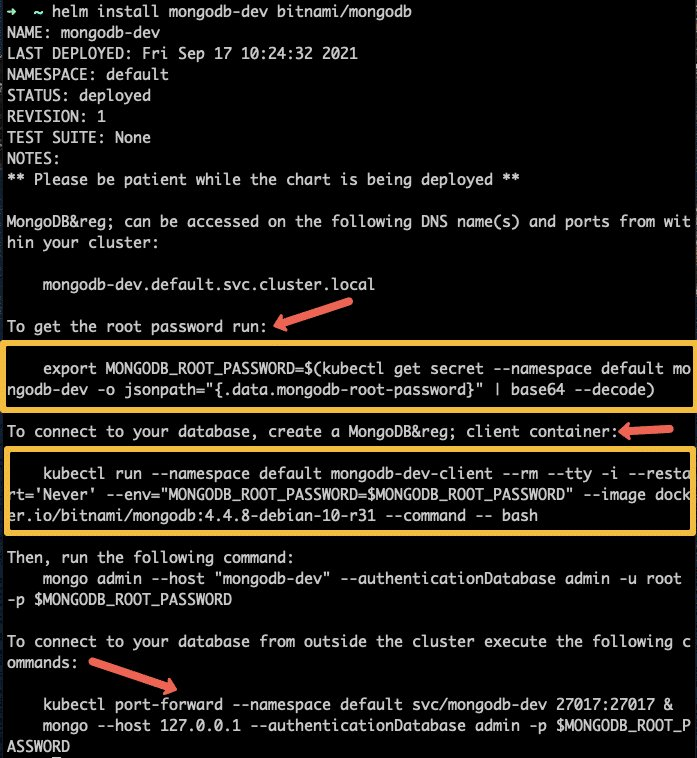

<small>【运维干货分享】如何在 Kubernetes 上部署 MongoDB – 初学者指南</small>



本文旨在解释在 Kubernetes 上部署 MongoDB 所需的每个组件。我们还将讨论如何使集群可从 Kubernetes 外部访问。

最后，我们将讨论如何在 MongoDB 中执行基本操作。作为初学者，在了解所涉及的步骤的同时逐个创建组件是了解 Kubernetes 和 MongoDB 的好方法。

循序渐进确保您可以专注于理解“为什么”，同时学习“如何”。

## MongoDB 集群 Kubernetes 清单
本指南中使用的所有 Kubernetes Mngdb YAML 清单都托管在 Github 上。克隆存储库以供参考和实施。
```
git clone https://github.com/techiescamp/kubernetes-mongodb
```

我们已经解释了所有 MongoDB Kubernetes YAML 文件。如果您不想创建每个清单，只需克隆存储库并从克隆的目录执行以下命令即可。
```
kubectl apply -f .
```
在 kubernetes 上部署 MongoDB 后，要清理部署对象，请执行以下命令。
```
kubectl delete -f .
```
让我们开始设置。

## 创建 MongoDB 密钥
Kubernetes 中的 Secret 是用于向容器提供敏感信息的对象。它们与 ConfigMap 类似，不同之处在于数据以编码格式存储。

为了 MongoDB 实例的安全，使用密码限制对数据库的访问是明智的。我们将使用 Secrets 将所需的密码挂载到容器中。

将以下清单另存为mongodb-secrets.yaml
```
apiVersion: v1
data:
  password: cGFzc3dvcmQxMjM= //password123
  username: YWRtaW51c2Vy //adminuser
kind: Secret
metadata:
  creationTimestamp: null
  name: mongo-creds
```  
创建 Secret。
```
kubectl apply -f mongodb-secrets.yaml
```
我们将使用这些凭证登录。

### 提示：解码 Secret 对象的内容
Kubernetes 以 base 64 编码格式存储所有密钥的内容。如果您想查看字符串以 base64 格式显示的方式，请执行以下命令。
```
echo "devopscube" | base64 
//after encoding it, this becomes ZGV2b3BzY3ViZQo=
```
如果要解码 base64 字符串。跑
```
echo "ZGV2b3BzY3ViZQo=" | base64 --decode
//after decoding it, this will give devopscube
```
## 创建 MongoDB 持久卷
我们需要卷来存储持久性数据。这样，即使我们的 Pod 出现故障，数据也不会丢失。

在 Kubernetes 中，创建卷需要两个对象。

- PersistentVolumes （PV）：是映射到存储位置的对象。它是集群中由管理员预置的一段存储。
- 持久卷声明 （PVC）：是充当存储请求的 Kubernetes 对象。Kubernetes 会查找可从中为 PVC 申请和分配空间的 PV。PVC 仅在 Kubernetes 集群中启用了动态卷配置时有效。
让我们为 MongoDB 实例创建一个 PVC。

将以下清单另存为 mongodb-pvc.yaml
```
apiVersion: v1
kind: PersistentVolumeClaim
metadata:
  name: pvc
spec:
  storageClassName: ""
  accessModes:
    - ReadWriteOnce 
  volumeName: pv
  resources:
    requests:
      storage: 1Gi
```
创建 PV。
```
kubectl create -f mongodb-pvc.yaml
```
注意：如果您没有使用 PVC 预置动态卷的选项，则可以将普通持久卷与以下清单一起使用，并将其映射到部署
```
apiVersion: v1
kind: PersistentVolume
metadata:
  name: mongo-data
spec:
  accessModes:
    - ReadWriteOnce
  capacity:
    storage: 1Gi
  hostPath:
    path: /data/mongo
```
## Deployment 与 StatefulSets
刚开始接触容器和 Kubernetes 的人经常对 Kubernetes Deployment 和 Statefulset 的用例感到困惑。让我们试着简要地理解一下。

部署是一个 Kubernetes 对象，当部署无状态应用程序或 Pod 的多个副本可以使用同一卷时，它是首选对象。

有状态集是一个 Kubernetes 对象，当我们要求每个 Pod 都有自己的独立状态并使用自己的单个卷时，它是首选对象。

它们之间的另一个主要区别是 Pod 的命名约定。在部署的情况下，Pod 总是被分配一个唯一的名称，但这个唯一的名称在删除并重新创建 Pod 后会发生变化。

在有状态集的情况下 - 每个 Pod 都被分配了一个唯一的名称，即使 Pod 被删除并重新创建，这个唯一的名称也会保留。
```
Let's take an example of mongodb to understand the difference better.

Case of deployments: name of pod initially: mongo-bcr25qd41c-skxpe  
name of pod after it gets deleted & recreated: mongo-j545c6dfk4-56fcs 
Here, pod name got changed.

Case of statefulsets: name of pod initially: mongo-0 
name of pod after it gets deleted & recreated: mongo-0 Here, pod name remained the same.
```
在此示例中，我们将部署一个独立的 MongoDB 实例，因此 – 我们可以使用部署对象。这是因为只有一个 Pod 会被启动。

## 部署 MongoDB 部署
现在让我们创建 Deployment。在本节的末尾，我还添加了对 MongoDB 部署文件的说明。

将以下清单另存为 .这里我们使用来自 docker hub 的官方 mongo 镜像。mongodb-deployment.yaml
```
apiVersion: apps/v1
kind: Deployment
metadata:
  creationTimestamp: null
  labels:
    app: mongo
  name: mongo
spec:
  replicas: 1
  selector:
    matchLabels:
      app: mongo
  strategy: {}
  template:
    metadata:
      creationTimestamp: null
      labels:
        app: mongo
    spec:
      containers:
      - image: mongo
        name: mongo
        args: ["--dbpath","/data/db"]
        livenessProbe:
          exec:
            command:
              - mongo
              - --disableImplicitSessions
              - --eval
              - "db.adminCommand('ping')"
          initialDelaySeconds: 30
          periodSeconds: 10
          timeoutSeconds: 5
          successThreshold: 1
          failureThreshold: 6
        readinessProbe:
          exec:
            command:
              - mongo
              - --disableImplicitSessions
              - --eval
              - "db.adminCommand('ping')"
          initialDelaySeconds: 30
          periodSeconds: 10
          timeoutSeconds: 5
          successThreshold: 1
          failureThreshold: 6
        env:
        - name: MONGO_INITDB_ROOT_USERNAME
          valueFrom:
            secretKeyRef:
              name: mongo-creds
              key: username
        - name: MONGO_INITDB_ROOT_PASSWORD
          valueFrom:
            secretKeyRef:
              name: mongo-creds
              key: password
        volumeMounts:
        - name: "mongo-data-dir"
          mountPath: "/data/db"
      volumes:
      - name: "mongo-data-dir"
        persistentVolumeClaim:
          claimName: "pvc"
```
创建部署。
```
kubectl apply -f mongodb-deployment.yaml
```
MongoDB 的 Deployment YAML 有很多组件，例如来自 secrets、probes 等的 env vars。让我们更深入地了解每个部分的作用。

### 通过 Secret 注入的环境变量
有时，容器需要知道敏感数据才能使用它。

例如，要为 MongoDB 数据库分配密码，必须将所需的密码安全地提供给 MongoDB 容器。
```
env:
 - name: MONGO_INITDB_ROOT_USERNAME
   valueFrom:
      secretKeyRef:
         name: mongo-creds
         key: username
 - name: MONGO_INITDB_ROOT_PASSWORD
   valueFrom:
      secretKeyRef:
         name: mongo-creds
         key: password
```             
探针：探针确保容器不会因任何错误而陷入循环，并且可以在出现意外错误时自动重启。
```
 livenessProbe:
          exec:
            command:
              - mongo
              - --disableImplicitSessions
              - --eval
              - "db.adminCommand('ping')"
          initialDelaySeconds: 30
          periodSeconds: 10
          timeoutSeconds: 5
          successThreshold: 1
          failureThreshold: 6

readinessProbe:
          exec:
            command:
              - mongo
              - --disableImplicitSessions
              - --eval
              - "db.adminCommand('ping')"
          initialDelaySeconds: 30
          periodSeconds: 10
          timeoutSeconds: 5
          successThreshold: 1
          failureThreshold: 6
```
### 上述探针的基本原理
在这里，我们正在运行一个 MongoDB 命令，该命令对数据库执行 ping 操作。

如果容器可以 ping —— 命令以退出代码 0 退出，即成功执行。如果容器无法 ping – 命令退出代码 1 即执行不成功。

这个概念对 Kubernetes 探针中的所有内容都有效。如果命令以代码 0 退出 – 则表示成功，代码 1 表示不成功，即探测可能会失败。

### 从外部连接到 MongoDB
让我们尝试从集群外部访问数据库。为此，我们必须创建另一个 Kubernetes 服务。

Kubernetes 中的服务是 Pod 用来相互通信的对象。 类型服务通常用于 Pod 间通信。ClusterIP

对于初学者来说，重要的是要知道有两种类型的 ClusterIP 服务

- 无头服务
- services


普通的 Kubernetes 服务充当负载均衡器，并遵循循环逻辑来分配负载。Headless 服务的作用与负载均衡器不同。此外，普通服务由 Kubernetes 分配 IP，而 Headless 服务则不是。无头服务主要用于部署 StatefulSet 应用程序。

在我们的 MongoDB 部署示例中，我们将使用带有 Nodeport 32000 的普通服务，因为我们使用的是类型部署。

让我们创建一个 NodePort 类型的服务。将以下 Kubernetes MongoDB 服务 YAML 另存为 .mongodb-nodeport-svc.yaml
```
apiVersion: v1
kind: Service
metadata:
  labels:
    app: mongo
  name: mongo-nodeport-svc
spec:
  ports:
  - port: 27017
    protocol: TCP
    targetPort: 27017
    nodePort: 32000
  selector:
    app: mongo
  type: NodePort
status:
  loadBalancer: {}
```
创建 svc。
```
kubectl create -f mongodb-nodeport-svc.yaml
```
要从 Kubernetes 集群外部进行连接，您必须使用 Kubernetes 集群的工作线程节点 IP 地址或负载均衡器地址。如果您正在关注 Minikube，则可以使用 minikube 的 IP 进行连接。

要查看 minikube IP 或服务 URL，请使用以下命令
```
minikube ip
minikube service --url mongo-nodeport-svc
```
连接命令：
```
mongo --host <ip> --port <port of nodeport svc> -u adminuser -p password123
```
## 探索 MongoDB shell
现在，我们已经创建了 MongoDB 实例，让我们尝试在其中运行一些基本命令。

让我们创建一个专用的 mongo 客户端，我们将从中访问 MongoDB 数据库。

将以下清单另存为mongodb-client.yaml
```
apiVersion: apps/v1
kind: Deployment
metadata:
  creationTimestamp: null
  labels:
    app: mongo-client
  name: mongo-client
spec:
  replicas: 1
  selector:
    matchLabels:
      app: mongo-client
  strategy: {}
  template:
    metadata:
      creationTimestamp: null
      labels:
        app: mongo-client
    spec:
      containers:
      - image: mongo
        name: mongo-client
        env:
        - name: mongo-client_INITDB_ROOT_USERNAME
          value: 'dummy'
        - name: mongo-client_INITDB_ROOT_PASSWORD
          value: 'dummy'
```
部署客户端。
```
kubectl create -f mongodb-client.yaml
```
创建客户端后。请按照以下步骤访问 MongoDB。

执行到客户端。
```
kubectl exec deployment/mongo-client -it -- /bin/bash
```
登录到 MongoDB shell
```
mongo --host mongo-nodeport-svc --port 27017 -u adminuser -p password123
```
显示 DB 列表
```
show dbs
```
进入特定的数据库。
```
use db1
```
显示 'db1' 数据库中的集合列表。
```
show collections
```
将数据插入数据库。

假设我们想要输入有关 DevOps 博客的数据。db1
```
db.blogs.insert({name: "devopscube" })
```
显示数据库中的数据。

假设我们想查看博客集合中的数据。db1
```
db.blogs.find()
```

## 使用 Helm 在 Kubernetes 上部署 MongoDB
现在，您知道如何使用单个清单部署 MongoDB，您可以使用 helm 来部署 MongoDB。

如果您尚未安装 helm，请按照此 helm 教程开始使用。

我们将使用 Bitnami helm chart 来安装 MongoDB。它使用具有持久性卷的部署，因为它是单个 Pod 设置。

首先，添加 bitnami helm 存储库。
```
helm repo add bitnami https://charts.bitnami.com/bitnami
```
使用版本名称为mongodb-dev
```
helm install mongodb-dev bitnami/mongodb

```
安装后，您将在输出中看到连接到 MongoDb 部署的所有详细信息，如下所示。


此图表不随客户端和 NodePort 服务一起提供。您可以使用我们的客户端和 Nodeport svc yamls 连接到已部署的 MongoDB。

要删除 helm 部署，请使用以下命令。
```
helm delete mongodb-dev
```
## MongoDb 性能指标
MongoDB 提供了在需要时显示每个查询的性能特征的功能。执行成功/失败、总执行时间和否等信息。的密钥检查是可访问的。

让我们试试：
```
use db1
db.blogs.find().explain("executionStats")
```
它将提供以下信息作为性能指标。
```
"executionStats" : {
		"executionSuccess" : true,
		"nReturned" : 1,
		"executionTimeMillis" : 0,
		"totalKeysExamined" : 0,
		"totalDocsExamined" : 1,
		"executionStages" : {
			"stage" : "COLLSCAN",
			"nReturned" : 1,
			"executionTimeMillisEstimate" : 0,
			"works" : 3,
			"advanced" : 1,
			"needTime" : 1,
			"needYield" : 0,
			"saveState" : 0,
			"restoreState" : 0,
			"isEOF" : 1,
			"direction" : "forward",
			"docsExamined" : 1
		}
	},
```
可以在官方文档中探索获取性能指标的其他方法。

## 进一步研究
现在，您已经了解了基础知识，请随时探索有关 MongoDB 的其他内容，例如仲裁程序、故障转移和副本集。这些通常是在部署到生产环境时派上用场的事情。

在生产实现方面，由于管理数据的复杂性，使用 Kubernetes 自定义资源和运算符来部署和管理 MongoDB statefulset 集群。请查看以下资源。

- MongoDB community Operator
- MongoDB Enterprise Operator
- MongoDB Database Architecture in Kubernetes
## 结论
在本 Kubernetes 教程中，我们学习了如何创建 MongoDB 部署实例、与其连接的客户端、运行输入数据等基本操作，还探索了从 Kubernetes 集群外部进行连接。