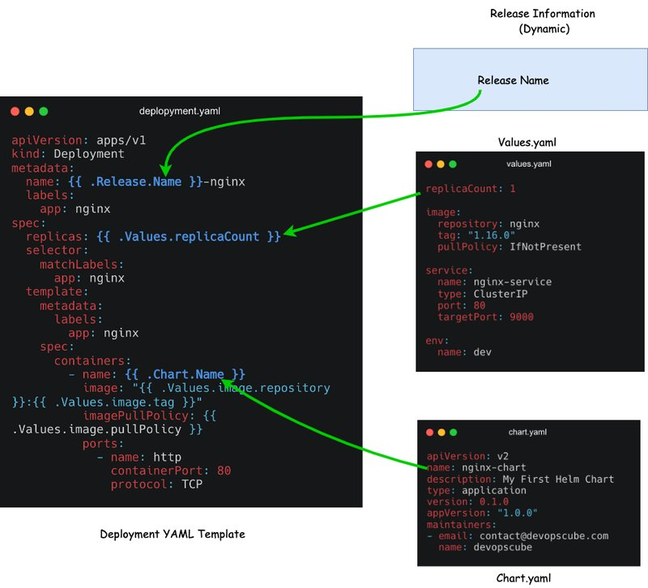

<small>【运维干货分享】Helm chart教程：初学者的简单指南</small>


通过我们简单易懂的 Helm chart教程了解如何创建 Helm chart。本指南涵盖架构、组件和最佳实践。

因此，如果你想学习 helm chart 基础知识并动手实践 helm chart，你一定会喜欢本指南。

## 先决条件
要开始使用 helm chart，你需要具备以下条件。

- 一个正在运行的 Kubernetes 集群
- 安装在工作站上的 Helm
- 用于连接到集群的有效 kubeconfig
- Kubernetes 和 YAML 的工作知识。
## 什么是 Helm Chart？
为了解释，我选择了一个非常基本的示例，即在 Kubernetes 上使用 Nginx 进行网站前端部署

假设你的项目中有四个不同的环境。 dev、QA、stg和prod。每个环境都有不同的 Nginx 部署参数。例如

- 在 Dev 和 QA 中，你可能只需要一个副本。
- 在stg和prd中，你将拥有更多具有 Pod 自动扩展的副本。
- 每个环境中的入口路由规则都不同。
- 每个环境的 config 和 secret 都不同。

由于每个环境的配置和部署参数都发生了变化，因此你需要为每个环境维护不同的 Nginx 部署文件。或者，你将有一个部署文件，并且需要编写自定义 shell 或 python 脚本来根据环境替换值。但是，它不是一种可扩展的方法。这就是 helm chart 的用武之地。


Helm chart是 Kubernetes YAML 清单模板和 helm 特定文件的组合。你可以将其称为 helm 包。由于 Kubernetes YAML 清单可以模板化，因此你不必维护不同环境的多个 helm chart。Helm 使用 go 模板引擎来实现模板功能。

你只需要有一个 helm chart，并且只需更改单个值文件即可修改每个环境的部署参数。Helm 将负责将值应用于模板。在接下来的部分中，我们将实际了解有关它的更多信息。

在高层次上，Helm Charts 降低了复杂性，并且 kubernetes 只用一个模板就体现了每个环境(dev, uat, cug, prod)的冗余。

## Helm Chart 结构

为了理解 Helm chart，我们以 Nginx 部署为例。要在 Kubernetes 上部署 Nginx，通常你有以下 YAML 文件。

```
nginx-deployment
    ├── configmap.yaml
    ├── deployment.yaml
    ├── ingress.yaml
    └── service.yaml
```
现在，如果我们为上述 Nginx 部署创建一个 Helm Chart，它将具有以下目录结构。
```
nginx-chart/
|-- Chart.yaml
|-- charts
|-- templates
|   |-- NOTES.txt
|   |-- _helpers.tpl
|   |-- deployment.yaml
|   |-- configmap.yaml
|   |-- ingress.yaml
|   |-- service.yaml
|   `-- tests
|       `-- test-connection.yaml
`-- values.yaml
```
如你所见，部署 YAML 文件是模板目录（以粗体突出显示）的一部分，并且有特定于 helm 的文件和文件夹。让我们看看 helm chart 中的每个文件和目录，并了解它的重要性。

- .helmignore 的它用于定义我们不想包含在 helm chart 中的所有文件。它的工作方式与文件类似。.gitignore
- Chart.yaml 中：它包含有关 helm chart的信息，如版本、名称、描述等。
- values.yaml：在此文件中，我们定义了 YAML 模板的值。例如，映像名称、副本计数、HPA 值等。正如我们之前解释的，只有文件在每个环境中会发生变化。此外，你可以动态覆盖这些值，或在安装chart时使用 or 命令覆盖这些值。values.yaml --values--set
- chart：如果我们的主chart对其他chart有一定的依赖性，我们可以在这个目录中添加另一个chart的结构。默认情况下，此目录为空。
- 模板： 此目录包含构成应用程序的所有 Kubernetes 清单文件。这些清单文件可以模板化以访问 values.yaml 文件中的值。Helm 为 Kubernetes 对象创建了一些默认模板，如 deployment.yaml、service.yaml 等，我们可以直接使用、修改或覆盖我们的文件。
- templates/NOTES.txt 中：这是一个纯文本文件，在成功部署 Chart 后打印出来。
- templates/_helpers.tpl 的该文件包含多个方法和子模板。这些文件不会呈现为 Kubernetes 对象定义，但可以在其他chart模板中的任何位置使用。
- templates/tests/ 的我们可以在 Chart 中定义测试，以验证你的 Chart 在安装后是否按预期工作。
## Helm Chart 教程 GitHub Repo
本 Helm Chart 教程中使用的示例 helm chart和清单托管在 Helm Chart Github 存储库中。你可以克隆它并使用它来遵循指南。
```
git clone https://github.com/techiescamp/helm-tutorial.git
```
## 从头开始创建 Helm Chart
要动手创建 helm chart，让我们从头开始创建一个 Nginx helm chart。

执行以下命令以创建chart样板。它会创建一个名称为默认文件和文件夹的chart。nginx-chart
```
helm create nginx-chart
```
如果检查创建的chart，它将包含以下文件和目录。
```
nginx-chart
│   ├── Chart.yaml
│   ├── charts
│   ├── templates
│   │   ├── NOTES.txt
│   │   ├── _helpers.tpl
│   │   ├── deployment.yaml
│   │   ├── hpa.yaml
│   │   ├── ingress.yaml
│   │   ├── service.yaml
│   │   ├── serviceaccount.yaml
│   │   └── tests
│   │       └── test-connection.yaml
│   └── values.yaml
```
让我们 cd 到生成的 chart 目录中。
```
cd nginx-chart
```
我们将根据部署要求逐个编辑文件。

### chart.yaml

如上所述，我们将chart的详细信息放入文件中。将 的默认内容替换为以下内容。Chart.yamlchart.yaml
```
apiVersion: v2
name: nginx-chart
description: My First Helm Chart
type: application
version: 0.1.0
appVersion: "1.0.0"
maintainers:
- email: contact@devopscube.com
  name: devopscube
```
- apiVersion：这表示chart API 版本。v2 适用于 Helm 3，v1 适用于以前的版本。
- name： 表示chart的名称。
- description： 表示 helm chart 的描述。
- type：chart类型可以是 'application' 或 'library'。应用程序chart是你在 Kubernetes 上部署的内容。库chart是可重复使用的chart，可以与其他chart一起使用。编程中类似的库概念。
- version：这表示chart版本。
- appVersion：这表示我们的应用程序 （Nginx） 的版本号。
- maintainers：有关chart所有者的信息。

每次对应用程序进行更改时，我们都应该递增 version 和 appVersion。还有一些其他字段，如依赖项、图标等。

### templates

Helm 创建的 templates 目录中有多个文件。在我们的例子中，我们将进行简单的 Kubernetes Nginx 部署。

让我们从 template 目录中删除所有默认文件。
```
rm -rf templates/*
```
我们将添加我们的 Nginx YAML 文件并将它们更改为模板，以便更好地理解。

创建文件并复制以下内容。deployment.yaml
```
apiVersion: apps/v1
kind: Deployment
metadata:
  name: release-name-nginx
  labels:
    app: nginx
spec:
  replicas: 1
  selector:
    matchLabels:
      app: nginx
  template:
    metadata:
      labels:
        app: nginx
    spec:
      containers:
        - name: nginx-chart
          image: "nginx:1.16.0"
          imagePullPolicy: IfNotPresent
          ports:
            - name: http
              containerPort: 80
              protocol: TCP
          volumeMounts:
            - name: nginx-index-file
              mountPath: /usr/share/nginx/html/
      volumes:
        - name: nginx-index-file
          configMap:
            name: index-html-configmap
```
如果你看到上述 YAML 文件，则这些值是静态的。helm chart 的理念是模板化 YAML 文件，以便我们可以通过动态地为它们分配值来在多个环境中重用它们。

要对值进行模板化，你需要做的就是在大括号内添加 object 参数，如下所示。它被称为模板指令，语法特定于 Go 模板
```
{{ .Object.Parameter }}
```
首先，让我们了解什么是 Object。以下是我们将在此示例中使用的 3 个 Object。

- Release：每个 helm chart 都将使用版本名称进行部署。如果要在模板中使用发布名称或访问与发布相关的动态值，则可以使用 release 对象。
- Chart：如果你想使用你在 chart.yaml 中提到的任何值，则可以使用 chart 对象。
- Values：values.yaml 文件中的所有参数都可以使用 Values 对象进行访问。

要了解有关支持的对象的更多信息，请查看 Helm 内置对象文档。

下图显示了如何在模板中替换内置对象。


首先，您需要弄清楚哪些值可能会更改或您想要模板化什么。我正在选择名称、副本、容器名称、镜像、imagePullPolicy 和 configMap 名称，我在 YAML 文件中以粗体突出显示了它们。

- name： name: {{ .Release.Name }}-nginx ： 我们每次都需要更改部署名称，因为 Helm 不允许我们安装同名的版本。因此，我们将使用版本名称模板化部署的名称，并随其一起插入 -nginx。现在，如果我们使用名称 frontend 创建发布，则部署名称将为 frontend-nginx。这样，我们将保证名称唯一。
- 容器名称：{{ .Chart.Name }}：对于容器名称，我们将使用 Chart 对象，并使用 chart.yaml 中的图表名称作为容器名称。
- 副本： {{ .Values.replicaCount }} 我们将从 values.yaml 文件中访问副本值。
- image： "{{ .Values.image.repository }}:{{ .Values.image.tag }}" 在这里，我们在一行中使用多个模板指令，并从 Values 文件中访问 image 键下的存储库和标签信息。
- configMap 名称： {{ .Release.Name }}-index-html-configmap. 这里我们将发布名称添加到 configmap 中。
同样，你可以在 YAML 文件中模板化所需的值。

这是我们应用模板后的最终 deployment.yaml 文件。模板化零件以粗体突出显示。将部署文件内容替换为以下内容。
```
apiVersion: apps/v1
kind: Deployment
metadata:
  name: {{ .Release.Name }}-nginx
  labels:
    app: nginx
spec:
  replicas: {{ .Values.replicaCount }}
  selector:
    matchLabels:
      app: nginx
  template:
    metadata:
      labels:
        app: nginx
    spec:
      containers:
        - name: {{ .Chart.Name }}
          image: "{{ .Values.image.repository }}:{{ .Values.image.tag }}"
          imagePullPolicy: {{ .Values.image.pullPolicy }}
          ports:
            - name: http
              containerPort: 80
              protocol: TCP
          volumeMounts:
            - name: nginx-index-file
              mountPath: /usr/share/nginx/html/
      volumes:
        - name: nginx-index-file
          configMap:
            name: {{ .Release.Name }}-index-html-configmap
```
```            
apiVersion: v1
kind: Service
metadata:
  name: {{ .Release.Name }}-service
spec:
  selector:
    app.kubernetes.io/instance: {{ .Release.Name }}
  type: {{ .Values.service.type }}
  ports:
    - protocol: {{ .Values.service.protocol | default "TCP" }}
      port: {{ .Values.service.port }}
      targetPort: {{ .Values.service.targetPort }}
```
在 protocol template 指令中，你可以看到一个 pipe .它用于将协议的默认值定义为 TCP。这意味着，如果我们不在 values.yaml 文件中定义 protocol 值，或者如果它是空的，它将 TCP 作为 protocol 的默认值。( | )

创建一个 configmap.yaml 并向其添加以下内容。在这里，我们将默认的 Nginx index.html 页面替换为自定义 HTML 页面。此外，我们还添加了一个 template 指令来替换 HTML 中的环境名称。
```
apiVersion: v1
kind: ConfigMap
metadata:
  name: {{ .Release.Name }}-index-html-configmap
  namespace: default
data:
  index.html: |
    <html>
    <h1>Welcome</h1>
    </br>
    <h1>Hi! I got deployed in {{ .Values.env.name }} Environment using Helm Chart </h1>
    </html
```
### values.yaml
values.yaml 文件包含我们在模板中使用的模板指令中需要替换的所有值。例如，deployment.yaml 模板包含一个 template 指令，用于从 values.yaml 文件中获取镜像存储库、标签和 pullPolicy。如果您检查以下 values.yaml 文件，则 image 键下嵌套了 repository、tag 和 pullPolicy 键值对。这就是我们使用 Values.image.repository 的原因

现在，将默认值 .yaml 内容替换为以下内容。
```
replicaCount: 2

image:
  repository: nginx
  tag: "1.16.0"
  pullPolicy: IfNotPresent

service:
  name: nginx-service
  type: ClusterIP
  port: 80
  targetPort: 9000

env:
  name: dev
```
现在我们已经准备好了 Nginx helm chart，最终的 helm chart 结构如下所示。
```
nginx-chart
├── Chart.yaml
├── charts
├── templates
│   ├── configmap.yaml
│   ├── deployment.yaml
│   └── service.yaml
└── values.yaml
```
## 验证 Helm Chart
现在为了确保我们的chart有效并且所有缩进都正常，我们可以运行以下命令。确保你在 chart 目录中。
```
helm lint .
```
如果你从 nginx-chart 目录外部执行它，请提供 nginx-chart 的完整路径
```
helm lint /path/to/nginx-chart
```
如果没有错误或问题，它将显示此结果
```
==> Linting ./nginx
[INFO] Chart.yaml: icon is recommended

1 chart(s) linted, 0 chart(s) failed
```
要验证模板中是否替换了这些值，你可以使用以下命令使用值呈现模板化的 YAML 文件。它将生成并显示所有带有替换值的清单文件。
```
helm template .
```
我们也可以使用 command 来检查。这将假装将 chart 安装到集群中，如果出现问题，它将显示错误。--dry-run
```
helm install --dry-run my-release nginx-chart
```
如果一切正常，你将看到将部署到集群中的清单输出。

## 部署 Helm Chart
部署 chart 时，Helm 将从文件中读取 chart 和配置值，并生成清单文件。然后，它会将这些文件发送到 Kubernetes API 服务器，Kubernetes 将在集群中创建请求的资源。values.yaml

现在我们准备好安装 chart。

确保从文件夹外的目录运行 Helm 命令。helm-chart

执行以下命令，其中 frontend 是 release name 和 chart 名称。它将 nginx-chart 安装在默认命名空间中nginx-chart
```
helm install frontend nginx-chart
```
```
NAME: frontend
LAST DEPLOYED: Wed Jun 19 11:12:20 2024
NAMESPACE: default
STATUS: deployed
REVISION: 1
TEST SUITE: None
```
现在你可以使用此命令检查发布列表：你还可以使用 instead oflslist
```
helm list
```
执行 kubectl 命令检查 Deployment、Services 和 Pod。
```
kubectl get deployment
kubectl get services
kubectl get configmap
kubectl get pods
```
我们可以看到部署 frontend-nginx、nginx-service 和 pod 已启动并运行，如下所示。

## 验证 Helm Chart 部署
我们讨论了如何使用不同的 values.yaml 文件将单个 helm chart 用于多个环境。要使用外部文件安装 helm chart，你可以使用以下命令以及 values 文件的标志和路径。values.yaml--values
```
helm install frontend nginx-chart --values env/prod-values.yaml
```
当你将 Helm 作为 CI/CD 管道的一部分时，你可以编写自定义逻辑来传递所需的值文件，具体取决于环境。

## Helm 升级和回滚
现在假设你想修改chart并安装更新版本，我们可以使用以下命令：
```
helm upgrade frontend nginx-chart
```
例如，我们已将副本从 2 更改为 1。你可以看到修订号是 2，只有 1 个 Pod 在运行。

## helm chart 升级
现在，如果我们想回滚刚刚完成的更改并再次部署前一个更改，我们可以使用 rollback 命令来执行此操作。
```
helm rollback frontend
```
上面的命令会将 helm 版本回滚到上一个版本。

## helm chart 回滚
回滚后，我们可以看到 2 个 Pod 再次运行。请注意，Helm 将回滚作为新版本，这就是我们将修订版本作为 3 的原因。

如果我们想回滚到特定版本，我们可以像这样放置修订号。
```
helm rollback <release-name> <revision-number>
```
例如
```
helm rollback frontend 2
```
## 卸载 Helm 版本
要卸载 helm release，请使用 uninstall 命令。它将删除与chart的最新版本关联的所有资源。
```
helm uninstall frontend
```
如果你已在特定命名空间中部署了版本，则可以使用 uninstall 命令传递命名空间标志，如下所示。
```
helm uninstall <release-name> --namespace <namespace>
```
## 打包 Helm Chart
我们可以打包chart并将其部署到 Github、S3 或任何chart存储库。

执行以下命令以打包 .nginx-chart
```
helm package chart-name/
```
例如
```
helm package nginx-chart

Successfully packaged chart and saved it to: /home/vagrant/helm-tutorial/nginx-chart-0.1.0.tgz
```
打包时，它遵循 semver 2 版本准则。

## 调试 Helm Chart
我们可以使用以下命令来调试 helm chart和模板。
```
helm lint：此命令采用chart的路径，并运行一系列测试以验证chart的格式是否正确。
helm get 值：此命令将输出安装到集群的 release 值。
helm install --dry-run 命令：使用此功能，我们可以检查所有资源清单并确保所有模板都正常工作。
helm get manifest 中：此命令将输出集群中运行的清单。
helm diff 中：它将输出两个修订版之间的差异。
helm diff revision nginx-chart 1 2
```
## Helm chart可能的错误
如果你尝试安装现有的 Helm 软件包，你将收到以下错误。
```
Error: INSTALLATION FAILED: cannot re-use a name that is still in use
```
要更新或升级版本，你需要运行 upgrade 命令。

如果你尝试从其他位置安装 chart，而不提供 chart 的绝对路径，你将收到以下错误。
```
Error: non-absolute URLs should be in form of repo_name/path_to_chart
```
要纠正此问题，你应该从你拥有chart的目录执行 helm 命令，或提供chart目录的绝对路径或相对路径。

## Helm Charts 最佳实践
以下是开发 helm chart 时要遵循的一些最佳实践。

- 通过添加注释和 README 文件来记录你的 chart，因为文档对于确保 Helm chart的可维护性至关重要。
- 我们应该以对象 Kind 命名 Kubernetes 清单文件，即 deployment、service、secret、ingress 等。
- 将chart名称仅小写，如果它包含多个单词，则用连字符 （-） 分隔
- 在 values.yaml 文件中，字段名称应为小写。
- 始终将字符串值括在引号之间。
- 使用 Helm 版本 3 实现更简单、更安全的发布。查看此文档了解更多详情
## 结论

总而言之，

我们详细讨论了 Helm Chart 及其结构。
我们从头开始创建了一个 helm chart并进行了部署。
还学习了如何升级、回滚和卸载它。
Helm 是一个非常有用的 Kubernetes 包管理器。当你有不同的环境具有自定义部署要求时，helm 提供了一种很好的方法来根据我们的需求模板化 kubernetes 清单。

特定于 Helm 的功能（如 chart 依赖项和 chart 可重用性）使其成为优秀的 kubernetes 工具之一。

此外，如果你正在准备 CKAD 认证，Helm 是考试的重要主题。

Helm 的替代方案是 Kustomize。它不使用模板，而是使用叠加的概念。请参阅 Kustomize 教程以了解更多信息。

此外，如果你查看我们的 Kubernetes 学习指南，我们提到 helm 是 Kubernetes 包管理的必学工具。