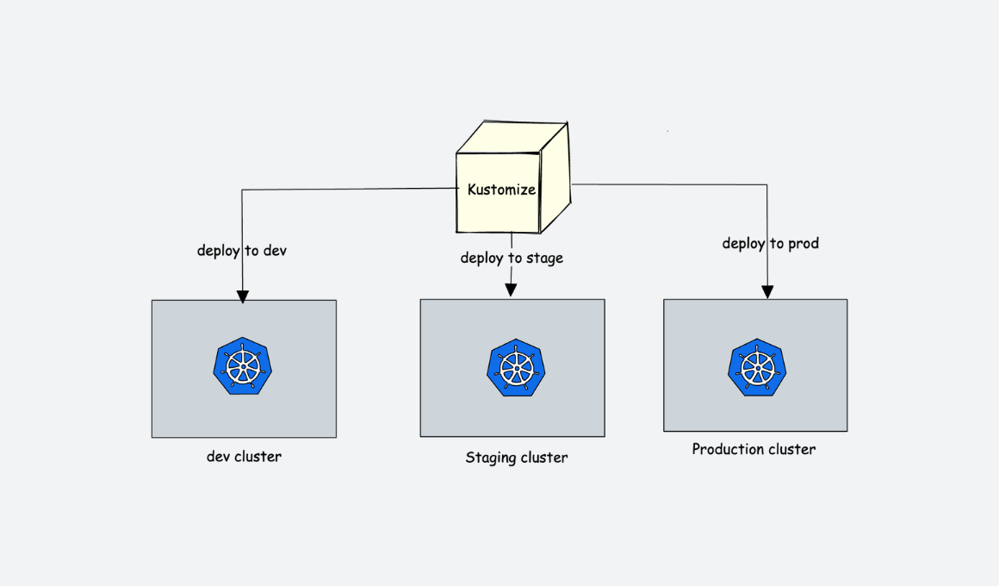

<small>【运维干货分享】Kustomize 教程：初学者综合指南</small>

在本 Kustomize 教程中，你将学习所有 Kustomize 概念，并在 Kubernetes 集群上使用 Kustomize 部署应用程序。

目录  显示 
Kustomize 用例
在深入研究 Kustomize 之前，我们先了解一下使用 Kubernetes 清单部署应用程序的问题。

假设你想将应用程序部署到 Kubernetes，并且你有多个环境，即 dev、uat、prod 等。在每个环境中，你可能具有不同的部署配置。

例如，在 dev 和 uat 中，你可能不需要滚动更新，但在 prod 中，你可能需要它。此外，你可能希望每个环境中的副本不同，CPU和内存资源不同，注释等不同。不仅如此，应用程序还可以通过 Configmap 和 Secret 使用属性，这些属性会随着每个环境的变化而变化。

因此，你需要自定义部署以适应相应环境的要求。

这个问题的简单解决方案是创建三个单独的目录，每个环境一个，并将所有 Kubernetes 清单添加到相应的文件夹中。

但它不是一个可扩展的解决方案。因为当载入新应用程序或添加新的配置文件时，很难手动管理文件夹中的所有 YAML 文件。这也可能导致配置偏差问题。

你可以创建脚本来替换 YAML 中的配置，但当你拥有许多服务时，这不是一个好的方法。

所有这些问题都可以使用 Kustomize 解决。此外，它与其他配置工具不同的一个功能是它与 kubectl（用于管理 Kubernetes 集群的命令行界面）的紧密集成。

在以下主题中，我们将详细介绍 Kustomize 概念及其优势。我们还将查看 Kustomize 使用 Nginx 部署的实际示例，向你展示它如何简化 Kubernetes 部署。

什么是 Kustomize？
Kustomize 是 Kubernetes 的开源配置管理工具。

它允许你以声明方式定义和管理多个环境的 Kubernetes 对象，例如 deployment、Daemonsets、服务、configMaps 等，而无需修改原始 YAML 文件。简而言之，你有一个 YAML 的单一事实来源，并且你可以根据环境要求在基本 YAML 之上修补所需的配置。

以下是官方文档所说的

kustomize 允许你出于多种目的自定义原始的、无模板的 YAML 文件，使原始 YAML 保持不变并按原样使用。

Kustomize 有两个关键概念：Base 和 Overlays。借助 Kustomize，我们可以在所有环境中重复使用基本文件（常见 YAML），并为每个环境重复使用覆盖（补丁）规范。

叠加是创建清单文件的自定义版本的过程（基本清单 + 叠加清单 = 自定义清单文件）。

所有自定义规范都包含在一个文件中。kustomization.yaml

Kustomize 功能
以下是 Kustomize 的主要功能

充当配置工具，具有与 Kubernetes YAML 相同的声明式配置。
它可以在不更改原始文件的情况下修改资源。
它可以向所有资源添加通用标签和注释。
它可以根据部署环境修改容器镜像。
Kustomize 还附带了 和 使用环境文件或键值对来创建密钥和 configMap。secretGeneratorconfigMapGenerator
所有这些概念和功能在我实际向你展示如何使用 nginx 部署使用 Kustomize 的部分中将更有意义。

安装 Kustomize
注意：在安装 Kustomize 之前，你必须启动并运行 Kubernetes 集群，并在我们的本地计算机上安装 kubectl 并连接到该集群。

Kustomize 是一个开源工具，可以作为独立的二进制文件或作为 kubectl 的插件使用。Kustomize 的安装非常简单。

Kubectl Kustomize
kustomize 模块内置于 kubectl 中。你可以通过 kubectl 直接使用 customize。你可以使用以下命令进行验证。

kubectl kustomize --help
独立 Kustomize
下面提到的脚本会自动检测操作系统并安装 Kustomize。

curl -s "https://raw.githubusercontent.com/kubernetes-sigs/kustomize/master/hack/install_kustomize.sh"  | bash
安装后，通过运行以下命令进行验证。它将向你显示 Kustomize 的最新适当版本。如果它没有显示版本，请关闭你的终端并通过打开新终端来运行命令。

kustomize version
如果你仍然获得，请运行以下命令并再次检查。这将设置路径。bash: kustomize: command not found error

sudo install -o root -g root -m 0755 kustomize /usr/local/bin/kustomize
我们还可以分别使用 和 在 MAC 和 Windows 上安装 Kustomize。brewchocolatey

对于 MAC 用户：

brew install kustomize
对于 Windows 用户：

choco install kustomize
了解 Kustomize
首先，你需要了解以下 Key Kustomize 概念。

kustomization.yaml文件
基础和叠加层
变形金刚
补丁
让我们来看看每个概念。

Kustomization.yaml 文件
该文件是 Kustomize 工具使用的主文件。kustomization.yaml

当你执行 Kustomize 时，它会查找名为 .此文件包含应由 Kustomize 管理的所有 Kubernetes 资源（YAML 文件）的列表。它还包含我们要应用于生成自定义清单的所有自定义项。kustomization.yaml

下面是一个示例文件。不用担心所有配置。我们将在以下部分中了解所有字段。kustomization.yaml

示例 Kustomization.yaml 文件。
基础和叠加层
Base 文件夹表示在所有环境中都相同的配置。我们将所有 Kubernetes 清单都放在 Base 中。它有一个我们可以覆盖的默认值。

另一方面，Overlays 文件夹允许我们基于每个环境自定义行为。我们可以为每个环境创建一个 Overlay。我们指定了我们想要覆盖和更改的所有属性和参数。

基本上，Kustomize 使用 patch 指令在现有的 Base 标准 k8s 配置文件上引入特定于环境的更改，而不会干扰它们。我们稍后会看看补丁。

变形金刚
顾名思义，transformers 是将一个配置转换为另一个配置的东西。使用 Transformers，我们可以转换基本的 Kubernetes YAML 配置。Kustomize 有几个内置变压器。让我们看看一些常见的变压器：

commonLabel – 它为所有 Kubernetes 资源添加标签
namePrefix – 它为所有资源
名称添加一个通用前缀
nameSuffix– 它为所有资源
名称添加了一个通用后缀
Namespace– 它为所有资源添加了一个通用命名空间
commonAnnotations– 它为所有资源添加了注释
让我们看一个例子。在下图中，我们使用了 where label 被添加到自定义的commonLabelskustomization.yaml env: devdeployment.yaml.

Kustomize 变压器
图像转换器
它允许我们修改特定部署将使用的映像。

在以下示例中，图像转换器会检查上述图像名称，并将其更改为文件中的新名称。我们也可以更改标签。nginxdeployment.yamlubuntukustomization.yaml

Kustomize 图像转换器
补丁 （覆盖）
补丁或覆盖提供了另一种修改 Kubernetes 配置的方法。它提供了更具体的部分来更改配置。我们需要提供 3 个参数：

Operation Type:添加或删除或替换
Target:我们要修改的资源名称
Value:将添加或替换的值名称。对于 remove 操作类型，不会有任何值。
有两种方法可以定义补丁：

JSON 6902 和
Stragetic Merge Patching.
JSON 6902 修补
这样，我们必须提供两个详细信息，目标和补丁详细信息，即操作、路径和新值。

patches:
  - target:
      kind: Deployment
      name: web-deployment
    patch: |-
      - op: replace
        path: /spec/replicas
        value: 5
下图显示了 JSON 修补工作流程。

Kustomize JSON 修补
策略合并修补
这样，所有补丁细节都类似于标准的 k8s 配置。它将是原始清单文件，我们只需添加需要修改的字段。

下面是一个内联 Stragetic Merge Patch 的示例。

patches:
  - patch: |-
      apiVersion: apps/v1
      kind: Deployment
      metadata:
        name: web-deployment
      spec:
        replicas: 5
Kustomize Stragetic 合并修补
从文件修补
对于这两种类型的修补，我们可以使用单独的 file 方法，而不是内联配置。在 YAML 文件中指定所有补丁详细信息，并将其引用 patches 指令下的文件。kustomization.yaml

例如，你需要按如下方式提及 patch 文件。你需要指定 YAML 文件的相对路径。kustomization.yaml

patches:
- path: replicas.yaml
我们可以按如下所示进行更改。replicas.yaml

apiVersion: apps/v1
kind: Deployment
metadata:
  name: web-deployment
spec:
  replicas: 5
现在我们已经很好地了解了所有底层 Kustomize 概念，让我们将所学知识付诸实践实现。

使用 Kustomize 部署应用程序
让我们看看 Kustomize 如何使用涉及不同环境的实际部署方案来工作。

注意：出于演示目的，我们给出了一个简单的 YAML 文件，其中只有两个环境。在实际项目中，YAML 可能会更复杂，具有不同的对象和更多的部署环境。

让我们假设以下场景。

Nginx Web 服务器需要部署在 dev 和 prod 中
在 dev 中，我们只需要一个具有 2 个副本、一个 Nodeport 服务以及较少内存和 CPU 资源的部署。
在 prod 中，我们需要一个具有 4 个副本、不同 CPU 和内存限制的部署、滚动更新策略以及一个没有 NodePort 的服务。
让我们看看如何使用 Kustomize 实现这一点。

Github 存储库：本指南中使用的所有清单都托管在 Kustomize Github 存储库中。

下面是使用 Kustomize 的目录结构。

├── kustomize
  ├── base
    │   ├── deployment.yaml
    │   ├── service.yaml
    │   ├── kustomization.yaml
    └ overlays
        ├── dev
        │   ├── deployment-dev.yaml
        |   ├── service-dev.yaml
        │   └── kustomization.yaml
        └── prod
            ├── deployment-prod.yaml
            ├── service-prod.yaml
            └── kustomization.yaml
你可以使用 GitHub 存储库文件作为参考，也可以使用以下命令创建相应的文件夹和文件：

mkdir -p kustomize/base && 
    touch kustomize/base/deployment.yaml \
         kustomize/base/service.yaml \
         kustomize/base/kustomization.yaml && 
    mkdir -p kustomize/overlays/dev && 
    touch kustomize/overlays/dev/deployment-dev.yaml \
         kustomize/overlays/dev/service-dev.yaml \
         kustomize/overlays/dev/kustomization.yaml && 
    mkdir -p kustomize/overlays/prod && 
    touch kustomize/overlays/prod/deployment-prod.yaml \
         kustomize/overlays/prod/service-prod.yaml \
         kustomize/overlays/prod/kustomization.yaml
让我们从基本文件夹开始。

Base Folder
base 文件夹包含 deployment、service 和 kustomization 文件。在此基本文件夹中，我们添加了部署和服务 YAML 以及所有环境通用的所有配置。

base/deployment.yaml

apiVersion: apps/v1
kind: Deployment
metadata:
  name: web-deployment
spec:
  replicas: 1
  selector:
    matchLabels:
      app: web
  template:
    metadata:
      labels:
        app: web
    spec:
      containers:
      - name: nginx
        image: nginx:1.14.2
        ports:
        - containerPort: 80
base/service.yaml

apiVersion: v1
  kind: Service
  metadata:
    name: web-service
  spec:
    selector:
      app: web
    ports:
    - name: http
      port: 80
base/kustomization.yaml

在下面的文件中，我们引用 和 作为 resources。deployment.yamlservice.yaml

apiVersion: kustomize.config.k8s.io/v1beta1
kind: Kustomization
  
resources:
- deployment.yaml
- service.yaml
Dev Overlay 文件夹
让我们定义 Dev 覆盖文件。我们只想改变它，所以我们只定义它。deployment.yaml

deployment-dev.yaml

在开发部署中，我们只想将副本从 1 增加到 2。你可以看到我们只定义更改，而不定义其他内容。Kustomize 将检查基本部署文件并进行比较，并相应地修补更改。这就是 Kustomize 的美妙之处。

apiVersion: apps/v1
kind: Deployment
metadata:
  name: web-deployment
spec:
  replicas: 3 # Update the replica count to 3
  template:
    spec:
      containers:
      - name: nginx
        resources:
          limits:
            cpu: "200" # Lower CPU limit to 200m (0.2 CPU cores)
            memory: "256Mi" # Lower memory limit to 256 MiB
          requests:
            cpu: "100" # Lower CPU request to 100m (0.1 CPU cores)
            memory: "128Mi"
service-dev.yaml

在 dev 中，我们需要具有 nodeport 的服务。因此，我们将创建一个类型为 Nodeport 的覆盖层。

apiVersion: v1
kind: Service
metadata:
  name: web-service
spec:
  type: NodePort
kustomization.yaml

正如我们之前在博客中讨论的那样，我们正在使用单独的文件方法使用战略性合并补丁。你还可以注意到，我们在这里也定义了 resources，这就是为什么 Kustomize 需要知道基本文件的路径。

请注意，在较旧的 Kustomize 版本中，可以使用 bases 代替此处的资源。

apiVersion: kustomize.config.k8s.io/v1beta1
kind: Kustomization

resources:
- ../../base

patches:
- path: deployment-dev.yaml
- path: service-dev.yaml
审查并应用补丁
让我们回顾一下补丁。我们可以使用以下命令查看补丁并检查是否一切正确。

kustomize build overlays/dev
它将呈现以下 Kubernetes 清单，如下所示。

如你所见，部署中的副本数增加到 2 个，不同的 CPU 和内存资源以及服务类型更改为 NodePort。现在，这是开发环境所需的配置。

我们可以使用以下命令部署自定义清单。

kustomize build overlays/dev | kubectl apply -f -
你还可以使用以下 kubectl 命令。

kubectl apply -k overlays/dev
Prod Overlay 文件夹
deployment-prod.yaml

在 prod 部署中，我们将添加 RollingUpdate 策略，该策略具有 4 个部署副本以及不同的内存和 CPU 资源。

apiVersion: apps/v1
kind: Deployment
metadata:
  name: web-deployment
spec:
  template:
    replicas: 4 # Update the replica count to 3
    spec:
      containers:
      - name: nginx
        resources:
          limits:
            cpu: "1" # Lower CPU limit to 200m (0.2 CPU cores)
            memory: "1Gi" # Lower memory limit to 256 MiB
          requests:
            cpu: "500" # Lower CPU request to 100m (0.1 CPU cores)
            memory: "512Mi" # Lower memory request to 128 MiB
  strategy:
    type: RollingUpdate
    rollingUpdate:
      maxSurge: 1
      maxUnavailable: 1
service-prod.yaml

我们将服务类型更改为 NodePort。

apiVersion: v1
kind: Service
metadata:
  name: web-service
spec:
  type: NodePort
kustomization.yaml

在 kustomization.yaml 中，我添加了两个文件的绝对路径以进行修补，因为我们想在 prod 中进行一些更改。

apiVersion: kustomize.config.k8s.io/v1beta1
kind: Kustomization

resources:
- ../../base

patches:
- path: deployment-prod.yaml
- path: service-prod.yaml
再次运行以下命令以查看配置和补丁。

kustomize build overlays/prod
或者，你也可以将 Kustomize 与 kubectl 命令结合使用，如下所示。

kubectl kustomize overlays/prod
审查并应用补丁
如果一切正常，我们现在可以通过运行以下命令来部署它。

kustomize build overlays/prod | kubectl apply -f -
或者，你也可以按如下方式使用 kubectl 命令。

kubectl apply -k overlays/prod
部署后，我们可以通过运行以下命令来检查对象。

kubectl get deployments
kubectl get services
kubectl get pods
使用以下命令一次查看所有对象。

kubectl get all
由 Kustomize 创建的对象
Kustomize Configmap 和 Secret 生成器
Kustomize 具有生成 Configmap 和 Secret 的功能。

在 Kustomization YAML 中，有两个受支持的字段

configMapGenerator 和
secret生成器
查看 Kuztomize Configmap 生成器指南，其中实际解释了用例和工作流程。

Kustomize 故障排除 – 常见问题
Kustomize 版本应与 Kubernetes 集群的版本兼容，因为 Kustomize 可能会引入旧版 Kubernetes 不支持的功能或更改。
如果你使用叠加来应用自定义设置，请检查是否已在文件中正确指定叠加。每个叠加都必须列在具有正确路径的字段下。确保你正在运行或生成包含应用更改的最终配置。kustomization.yamlresourceskustomize buildkustomize build <overlay-path>
如果你遇到错误消息，例如确保 Kustomize 已安装并在系统的 PATH 中可用。"kustomize: command not found"
Kustomize 使用 YAML 文件来定义配置和自定义。确保你的 YAML 文件格式正确、缩进正确且语法有效
使用 Kustomize 的好处
以下是 Kustomize 的好处

简化的配置管理：Kustomize 易于使用，使你能够以结构化和模块化的方式定义配置，从而更轻松地管理和自定义 Kubernetes 配置。
可 重用：借助 Kustomize，我们可以在所有环境中重复使用其中一个基本文件，并为每个环境覆盖规范。这可以允许你重复使用通用配置，而不必为每个新部署从头开始创建它们，从而节省你的时间和精力。
版本控制：Kustomize 允许你对 Kubernetes 配置进行版本控制，从而更轻松地跟踪更改并在必要时回滚到以前的配置。
无模板：Kustomize 是无模板的。它表达了 Kubernetes API 的全部功能，与 Helm 相比，无需参数化每一行。
Kustomize 可以从 Kubernetes 命令行界面原生运行。
Kustomize 内置了修改资源的 transformers，可以通过插件机制进行扩展。
Kustomize 没有任何模板语言，因此我们可以使用通常的 YAML 来快速说明我们的配置。
Kustomize 作为独立的 Golang 包和 cli 工具提供，因此很容易与用户的工具和工作流程集成。
如果我们有 kubectl 1.14+ 版本，我们可以在不安装它的情况下使用 Kustomize。kubectl 允许我们对配置进行声明性更改，而无需接触模板。
Kustomize 最佳实践
以下是一些 Kustomize 最佳实践：

将基本资源、覆盖和补丁保存在单独的目录中有助于我们保持不同配置之间的清晰度和分离性。
在使用 Kustomize 时，必须遵守一般的 Kubernetes 最佳实践
尝试在基本文件中保留 namespace 和 common metadata 等通用值。
在开发过程中或推送到 git 之前，运行 command 来格式化文件并设置缩进权限。kubectl kustomize cfg fmt file_name
在部署 Kustomize 配置之前，请对其进行验证并执行全面测试，以确保你的配置按预期工作。
将 Kustomize 集成到你的 CI/CD（持续集成/持续部署）管道中，以自动执行部署过程。
Kustomize 提供了使用 edit 子命令以命令方式更新文件的功能。因此，使用 edit 命令添加标签、命名空间等，并修改镜像和副本。kustomization.yaml
Kustomize 与 Helm
以下是一些差异：

Helm 提供了更高级的功能，如 hook 和 release management，使其适用于复杂的部署。Kustomize 更简单、更直接。
Helm 具有复杂的模板，而 Kustomize 没有模板。
Kustomize 不需要单独的设置。另一方面，我们需要设置 Helm。
Helm 拥有大量可以轻松共享和重复使用的预构建 chart，而 Kustomize 允许你共享配置，但缺少集中式存储库。
Kustomize 的学习曲线很容易，而 Helm 则很困难，因为它引入了图表和模板等其他概念。
Kustomize 使用覆盖和补丁来修改现有配置，而 Helm 使用 chart 来打包和管理应用程序。
Kustomize 常见问题
让我们看看一些常见的 Kutomize 问题。

Kustomize 与 Helm 有何不同？
虽然 Kustomize 和 Helm 都是 Kubernetes 的配置管理工具，但它们有不同的方法。Kustomize 专注于提供一种原生的声明式方式来管理配置，而无需使用模板。另一方面，Helm 使用 Chart 和模板来打包和部署应用程序。

如何安装 Kustomize？
Kustomize 作为独立二进制文件分发，可以轻松安装在各种平台上。

curl -s "https://raw.githubusercontent.com/kubernetes-sigs/kustomize/master/hack/install_kustomize.sh"  | bash
你可以从官方 GitHub 存储库下载二进制文件，也可以使用 Homebrew（适用于 macOS/Linux）或 Chocolatey（适用于 Windows）等包管理器。

brew install kustomize    //mac
choco install kustomize   //windows
Kustomize 可以与现有的 Kubernetes 配置一起使用吗？
Kustomize 可用于管理现有的 Kubernetes 配置。你可以先在包含现有 YAML 文件的目录中创建 Kustomization 文件，然后定义覆盖以根据需要自定义配置。

Kustomize 可以处理机密管理吗？
Kustomize 支持管理密钥。你可以在 Kustomization 文件中定义密钥生成器，该文件可以根据指定的规则动态创建密钥。这允许你将敏感信息与配置文件分开。

Kustomize 与 GitOps 工作流兼容吗？
Kustomize 与 GitOps 工作流兼容。你可以对基本配置、叠加层和 Kustomization 文件进行版本控制，并使用 Git 和 CI/CD 管道等工具来管理和部署 Kubernetes 配置。

Kubernetes 是否正式支持 Kustomize？
Kustomize 是 Kubernetes 的官方子项目，由 Kubernetes SIG-CLI（特别兴趣小组 - 命令行界面）社区维护。它已经广受欢迎，并被广泛用于 Kubernetes 生态系统。

结论
在本 Kustomize 教程中，我们讨论了 Kustomize 解决了什么问题及其好处。此外，我们还检查了 Kustomize 的安装部分和一些关键概念。

我们还学习了如何使用 Kustomize 在 Kubernetes 上部署应用程序。然后我们讨论了 Secret/Config Map 生成器，并将其与 Helm 进行了比较。

Kustomize 的主要优点是它很容易开始使用，因为它也集成了它。kubectl