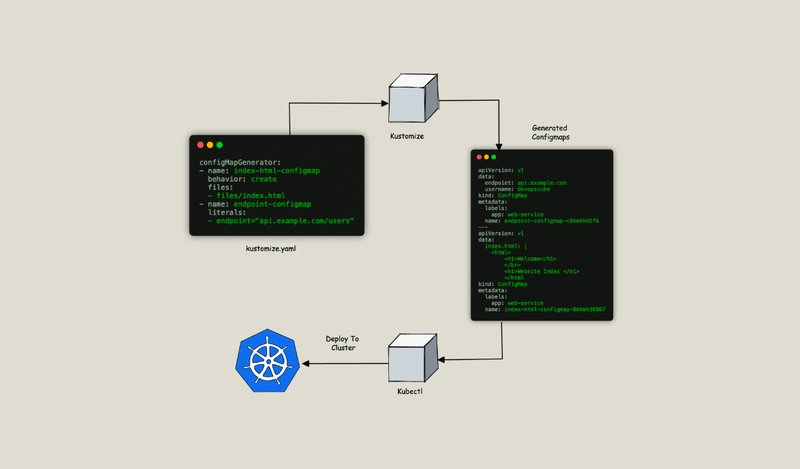
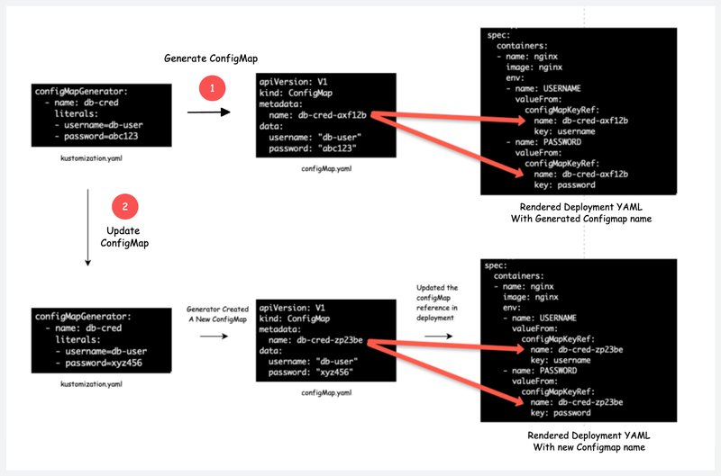

<small></small>
kustomize管理Secret & Configmap


在本指南中，我们将了解如何使用 Kustomize 生成 Kubernetes Configmap 和 Secrets。

如果你是 Kustomize 的新手，请查看 Kustomize 教程以学习基础知识。


## Configmap & Secret Generator 用例
在研究 secret/config 生成器的工作原理之前，让我们先了解一下它解决了什么问题。

当你将附加到 Pod 的 configmap 更新为卷时，configmap 数据会自动传播到 Pod。但是，在以下情况下，Pod 不会在 configmap 中获取最新数据。

- 如果 Pod 从 configmap 获取环境变量。
- 如果使用子路径将 configmap 挂载为卷。

在上述情况下，Pod 将继续使用旧的 configmap 数据，直到我们重新启动 Pod。因为 Pod 不知道 configMap 中发生了什么变化。

本质上，来自 ConfigMap 的数据（例如属性、环境变量等）在应用程序启动期间被使用。因此，即使更新的 configmap 数据被投影到 Pod，如果在 Pod 中运行的应用程序没有任何热重载机制，你也必须重新启动 Pod 才能进行更改。

我们有哪些选项来解决这个问题？

- 你可以使用 Reloader Controller。
- 使用 Kustomize ConfigMap 生成器

如果你已经使用 Kustomize 进行 Kubernetes 部署或计划使用它，则无需任何额外的控制器来处理 Configmap 的推出。

## Kustomize Configmap & Secret 生成器
以下是 Kustoimize Configmap/Secret 生成器的工作原理。

- Kustomize 生成器会创建一个 configMap 和 Secret，并在末尾使用唯一的名称 （hash）。例如，如果 configmap 的名称为 app-configmap，则生成的 configmap 的名称为 app-configmap-7b58b6ct6d。这里 7b58b6ct6d 是附加的哈希值。
- 如果你更新 configmap/Secret，它将创建一个同名的新 configMap/Secret，但末尾具有不同的哈希值（随机字符集）。
- Kustomize 将使用新的 configmap 名称自动更新 Deployment。
- 当 Kustomize 更新 Deployment 时，将触发推出，应用程序在 Pod 上运行并获取更新的 configmap/secret 数据。这样，我们就不需要重新部署或重新启动部署。

下图显示了 Configmap 创建和更新工作流，其中在创建和更新阶段的哈希发生了变化。


以下是你应该了解的有关 Kustomize 生成器的要点。

- 由于 Kustomize 在每次更新时都会创建一个新的 configmap，因此你需要对旧的孤立 Configmap 进行垃圾回收。如果你为命名空间设置了资源配额限制，则孤立的 Configmap 可能是一个问题。或者，你应该在 kubectl apply 命令中使用带有标签的 –prune 标志。此外，ArgoCD 等 GitOps 工具提供了孤立资源监控机制。
- 你可以使用该标志来禁用在每次更新时创建新的 Configmap，但它不会触发 Pod 推出。你需要手动触发 Pod 的推出才能获取最新的 configmap 数据。或者，在 Pod 中运行的应用程序应该具有热重载机制。disableNameSuffixHash: true

现在让我们看看如何使用 Configmap 和 Secret Generators。

## 使用 Kustomize 生成 Configmap
我们将看一个 Nginx 示例，其中它使用 configmap 内容作为其index.html

注意：base YAML 和 overlay YAML 是 Kustomize Github 存储库的一部分。克隆存储库以按照本教程进行操作

下面是存储库的文件结构。为了了解生成器，我们将使用 generators overlay 文件夹。
```
├── base
│   ├── deployment.yaml
│   ├── kustomization.yaml
│   └── service.yaml
└── overlays
    ├── dev
    │   ├── deployment-dev.yaml
    │   ├── kustomization.yaml
    │   └── service-dev.yaml
    ├── generators
    │   ├── deployment.yaml
    │   ├── files
    │   │   └── index.html
    │   ├── kustomization.yaml
    │   └── service.yaml
    └── prod
        ├── deployment-prod.yaml
        ├── kustomization.yaml
        └── service-prod.yaml
```
generators/deployment.yaml

下面是覆盖 nginx deployment.yaml，它使用名为 index-html-configmap 的 configmap，该 configmap 挂载为卷和 env 变量，该变量派生自名为 endpoint-configmap 的 configmap。我以粗体突出显示了配置。
```
apiVersion: apps/v1
kind: Deployment
metadata:
  name: web-deployment
spec:
  replicas: 3
  template:
    spec:
      containers:
      - name: nginx
        resources:
          limits:
            cpu: "200m"
            memory: "256Mi"
          requests:
            cpu: "100m"
            memory: "128Mi"
        env:
        - name: ENDPOINT
          valueFrom:
            configMapKeyRef:
              name: endpoint-configmap
              key: endpoint
        volumeMounts:
        - name: nginx-index-file
          mountPath: /usr/share/nginx/html/
      volumes:
      - name: nginx-index-file
        configMap:
          name: index-html-configmap
```
files/index.html

我们在 files 目录下的 index.html 文件中有 configmap 文件内容
```
<html>
    <h1>Welcome</h1>
    </br>
    <h1>Hi! This is the Configmap Index file </h1>
    </html
```
generators/kustomization.yaml

configmap 生成选项应添加到 configMapGenerator 字段下的 kustomization.yaml 文件中。

在此示例中，我们将生成两种类型的 Configmap。

- Configmap 来自将挂载到 nginx /usr/share/nginx/html/ 目录的文件 （index.html）。
- Configmap 的 Configmap 中，它将设置一个名为 ENDPOINTS 的环境变量

在 generatorOptions 字段下，可以添加需要添加到 Configmap 中的常用标签。
```
apiVersion: kustomize.config.k8s.io/v1beta1
kind: Kustomization

resources:
- ../../base

patches:
- path: deployment.yaml
- path: service.yaml

generatorOptions:
  labels:
    app: web-service

configMapGenerator:
- name: index-html-configmap
  behavior: create
  files:
  - files/index.html
- name: endpoint-configmap
  literals:
  - endpoint="api.example.com/users"
```
让我们使用 Kustomize 运行部署。
```
kustomize build overlays/generators | k apply  -f -
```
现在，如果你列出 Configmap，则可以看到两个 Configmap 创建时，它们的名称后附加了一个哈希值，如下所示。
```
kubectl get cm 
```
由于部署具有 NodePort 服务，因此你可以访问 Nginx 网页，该网页显示了 Configmap 中的内容，如下所示。


此外，如果你登录到 Pod 并回显 ENDPOINT 环境变量，你将看到 configmap 中的数据，如下所示。


现在，要通过生成器测试 configmap 更新，让我们将 index.html 数据更新为以下内容。
```
<html>
    <h1>Welcome</h1>
    </br>
    <h1>Hi! This is the Updated Configmap Index file </h1>
</html
```
让我们使用以下命令更新部署。
```
kustomize build overlays/generators | k apply  -f -
```
现在，如果你列出 Configmap，你将看到两个索引 Configmap，如下所示。这是因为，对于每个 configmap 更新，Kustomize 都会创建一个新的 configmap。


如果要修剪孤立的 Configmap，请使用带有 configmap 标签的 –prune 标志，如下所示。该标志指示 Kustomize 从最终输出中删除不再引用或不需要的任何资源。--prune
```
kustomize build overlays/generators | kubectl apply --prune -l app=web-service  -f -
```
现在，由于 Kustomize 创建了新的 configmap，部署会触发推出，nginx 将使用更新的 configmap。如果你检查 Nginx NodePort 服务，你将看到更新的索引页面。


接下来，我们将看看如何禁用 Hashed configmap。

### 禁用 Hashed ConfigMap
如果你不想使用 ConfigMap 生成器创建哈希 Configmap，可以通过在 generatorOptions 下将 disableNameSuffixHash 标志设置为 true 来禁用它。它将禁用 kustomization.yaml 文件中提到的所有 Configmap 的哈希值。

下面是一个示例。
```
generatorOptions:
  labels:
    app: web-service
  disableNameSuffixHash: true
```
注意：如果禁用 Configmap 哈希，则需要手动重启 Pod，以便应用程序使用 configmap 数据。

## 使用 Kustomize 生成密钥
你可以像生成 Configmap 一样生成密钥。

要生成密钥，你需要使用 secretGenerator 字段。

以下是从文件生成 secret 对象的示例。
```
secretGenerator:
- name: nginx-secret
  files:
  - files/secret.txt
```
如果要从文本生成密钥，请使用以下格式。
```
secretGenerator:
- name: nginx-api-password
  literals:
  - password="myS3cret"
```
你可以根据需要将密钥挂载为卷或将其作为环境变量传播。

## 结论
在这篇博客中，我们研究了，

- 使用 Kustomize 生成器生成 Configmap 和 secret。
- 与孤立的 Configmap 相关的 Configmap 生成器注意事项。
- 实现 Kustomize Configmap 生成器的实际示例。