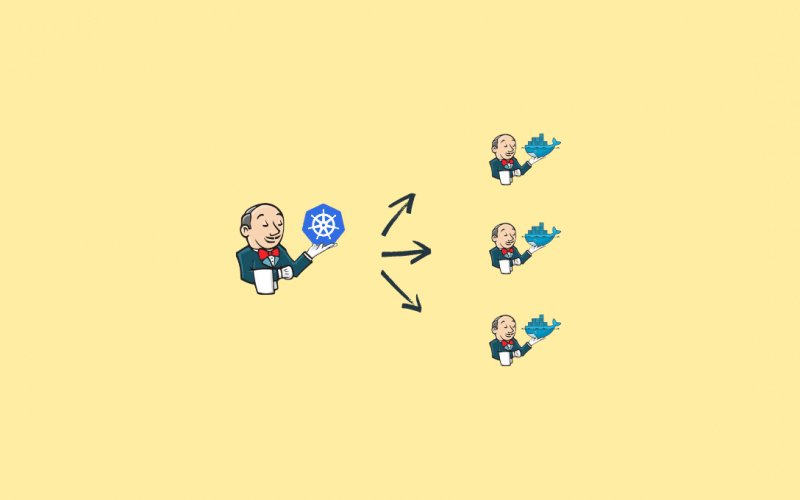
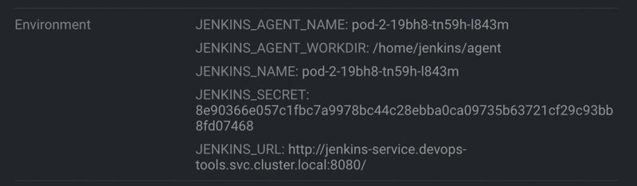
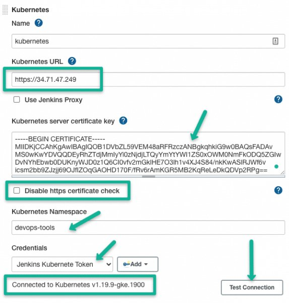
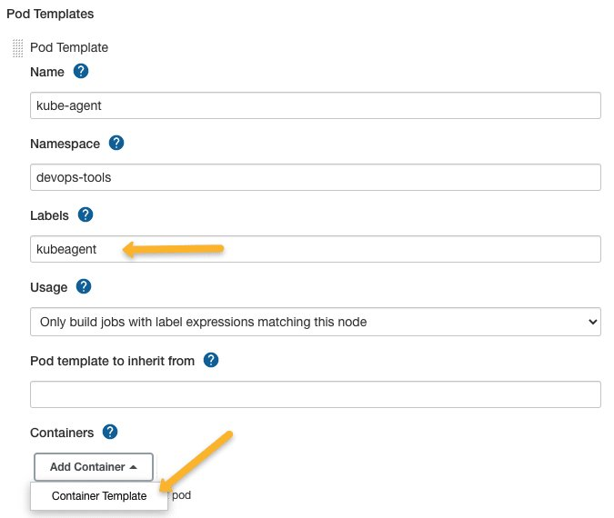
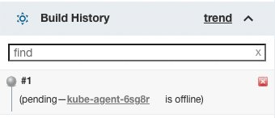
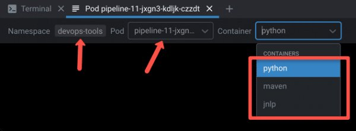

<small>【运维干货分享】如何在 Kubernetes Pod 上设置 Jenkins 构建代理</small>



在此 Jenkins 教程中，我介绍了使用 Jenkins Kubernetes 插件在 Kubernetes Pod 上设置 Jenkins 控制器和扩展 Jenkins 构建代理的详细步骤

在另一篇文章中，我解释了如何设置基于 Docker 的 Jenkins 代理。

如果你的环境中有 Kubernetes 集群，则在 Kubernetes Pod 上运行 Jenkins 代理将为不同的应用程序版本提供良好的构建隔离。

此外，基于 Kubernetes Pod 的临时 Jenkins 代理是降低 CI 环境成本的好方法，因为只有在有构建请求时，才会启动 Jenkins 代理。

## Jenkins Kubernetes Pod 代理如何工作？
在开始实施之前，让我们了解一下此设置的工作原理。

下图显示了高级工作流。


- 每当你触发 Jenkins 作业时，Jenkins Kubernetes 插件都会进行 API 调用以创建 Kubernetes 代理 Pod。
- 然后，在 Kubernetes 中部署 Jenkins 代理 Pod，其中包含一些包含 Jenkins 服务器详细信息和密钥的环境变量。
- 当代理 Pod 启动时，它会使用其环境变量中的详细信息，并使用 JNLP 方法与 Jenkins 进行对话。下图显示了代理 Pod 的环境变量。



Jenkinsfile 中的所有构建步骤都在该 Pod 上运行。构建完成后，Pod 将自动终止。但是，也有一些选项可以保留 build Pod。

Jenkins Kubernetes 插件处理从 Jenkins 到 Kubernetes 集群的所有通信。

此外，只要你的 Kubernetes 集群可以扩展，你就可以毫无问题地扩展 Jenkins 构建代理。

## 在 Kubernetes 上设置 Jenkins 构建 Pod
要进行此设置，我们需要以下内容。

- 一个正在运行的 Kubernetes 集群。
- 用于创建 Kubernetes 部署和服务账户的 Kubernetes 管理员用户
- 正在运行的 Jenkins 控制器

此外，我在这里考虑了两种情况。

- 在 Kubernetes 集群内运行的 Jenkins 控制器。
- 在 Kubernetes 集群外部运行的 Jenkins 控制器。
我们将研究这两种情况及其配置。

Overfall，这就是我们要做的事情。

- 创建命名空间devops-tools
- 创建一个 Kubernetes 服务帐户，该帐户具有管理命名空间中 Pod 的权限。Jenkins 将使用此服务帐户来部署代理 Pod。（内部和外部Jenkins均可）jenkins-admindevops-tools
- 使用服务帐户在命名空间中部署 Jenkins。（如果你没有现有的 Jenkins）devops-tools jenkins-admin
- 配置 Kubernetes Jenkins 插件，以便 Jenkins 可以与 Kubernetes 集互并部署构建代理。
## 设置 Kubernetes Namespace & Service Account
让我们开始设置。

步骤1： 创建一个名为devops-tools
```
kubectl create namespace devops-tools
```
步骤2： 将以下清单另存为 .它包含服务帐户的角色和角色绑定，该帐户具有管理命名空间中 Pod 的所有权限。service-account.yamldevops-tools
```
apiVersion: v1
kind: ServiceAccount
metadata:
  name: jenkins-admin
  namespace: devops-tools
---
apiVersion: rbac.authorization.k8s.io/v1
kind: Role
metadata:
  name: jenkins
  namespace: devops-tools
  labels:
    "app.kubernetes.io/name": 'jenkins'
rules:
- apiGroups: [""]
  resources: ["pods"]
  verbs: ["create","delete","get","list","patch","update","watch"]
- apiGroups: [""]
  resources: ["pods/exec"]
  verbs: ["create","delete","get","list","patch","update","watch"]
- apiGroups: [""]
  resources: ["pods/log"]
  verbs: ["get","list","watch"]
- apiGroups: [""]
  resources: ["secrets"]
  verbs: ["get"]
---
apiVersion: rbac.authorization.k8s.io/v1
kind: RoleBinding
metadata:
  name: jenkins-role-binding
  namespace: devops-tools
roleRef:
  apiGroup: rbac.authorization.k8s.io
  kind: Role
  name: jenkins
subjects:
- kind: ServiceAccount
  name: jenkins-admin
  namespace: devops-tools
```
创建服务帐户。
```
kubectl apply -f service-account.yaml
```
下一步是创建一个 Secret，这将为服务账户创建一个令牌。

创建一个 YAML 文件 secret.yaml 并将以下内容复制到其中
```
apiVersion: v1
kind: Secret
metadata:
  name: sa-token-secret
  namespace: devops-tools
  annotations:
    kubernetes.io/service-account.name: jenkins-admin
type: kubernetes.io/service-account-token
```
创建密钥
```
kubectl apply -f secret.yaml
```
这将创建一个密钥，并使用注释将其与服务账户链接。

## Kubernetes 中的 Jenkins 控制器设置
在此设置中，我们将 Jenkins 控制器和代理部署在同一个 Kubernetes 集群中。

我们将在 Kubernetes 集群上设置 Jenkins 控制器服务器。

注意：如果你有现有设置，也可以使用该设置。确保它有一个服务帐户，该帐户有权在部署 Jenkins 的命名空间中部署 Pod。

将以下清单另存为 .此清单包含持久性卷、部署和服务定义。deployment.yaml

注意：确保你的 Kubernetes 集群设置支持持久性卷。如果你在没有持久卷的情况下部署 Jenkins，则每次重启或删除 Pod 时都会丢失 Jenkins 数据。
```
# Persistent Volume Claim
apiVersion: v1
kind: PersistentVolumeClaim
metadata:
  name: jenkins-pv-claim
spec:
  accessModes:
    - ReadWriteOnce
  resources:
    requests:
      storage: 50Gi

# Deployment Config
---
apiVersion: apps/v1
kind: Deployment
metadata:
  name: jenkins-deployment
spec:
  replicas: 1
  selector:
    matchLabels:
      app: jenkins
  template:
    metadata:
      labels:
        app: jenkins
    spec:
      serviceAccountName: jenkins-admin
      securityContext:
            fsGroup: 1000 
            runAsUser: 1000
      containers:
        - name: jenkins
          image: jenkins/jenkins:lts
          resources:
            limits:
              memory: "2Gi"
              cpu: "1000m"
            requests:
              memory: "500Mi"
              cpu: "500m"
          ports:
            - name: httpport
              containerPort: 8080
            - name: jnlpport
              containerPort: 50000
          livenessProbe:
            httpGet:
              path: "/login"
              port: 8080
            initialDelaySeconds: 90
            periodSeconds: 10
            timeoutSeconds: 5
            failureThreshold: 5
          readinessProbe:
            httpGet:
              path: "/login"
              port: 8080
            initialDelaySeconds: 60
            periodSeconds: 10
            timeoutSeconds: 5
            failureThreshold: 3
          volumeMounts:
            - name: jenkins-data
              mountPath: /var/jenkins_home         
      volumes:
        - name: jenkins-data
          persistentVolumeClaim:
              claimName: jenkins-pv-claim

# Service Config
---
apiVersion: v1
kind: Service
metadata:
  name: jenkins-service
  annotations:
      prometheus.io/scrape: 'true'
      prometheus.io/path:   /
      prometheus.io/port:   '8080'
spec:
  selector: 
    app: jenkins
  type: NodePort  
  ports:
    - name: httpport
      port: 8080
      targetPort: 8080
      nodePort: 32000
    - name: jnlpport
      port: 50000
      targetPort: 50000
  
```
创建部署。
```
kubectl apply -f deployment.yaml
```
几分钟后，Jenkins 部署将启动，你将能够访问该端口上的任何 Kubernetes 节点32000

步骤4： 通过节点端口访问 Jenkins 控制面板，并使用 Pod 日志中的密码将其解锁。安装建议的插件并创建 Jenkins 用户。

如果你有任何疑问，请关注 Kubernetes 上的 Jenkins 博客。

## Jenkins Kubernetes 插件配置
需要 Jenkins Kubernetes 插件才能设置基于 Kubernetes 的构建代理。让我们配置插件。

第 1 步：安装 Jenkins Kubernetes 插件
转到 –> ，在可用选项卡中搜索 Kubernetes 插件，然后安装它。以下 Gif 视频显示了插件安装过程。Manage Jenkins Manage Plugins


步骤2： 创建 Kubernetes 云配置
安装后，转到 –> Manage JenkinsClouds


单击 New Cloud

命名并选择 Kubernetes。

创建 Jenkins 云
单击 Create 并继续下一步

第 3 步：配置 Jenkins Kubernetes Cloud
这里我们有两个场景。

- 在同一 Kubernetes 集群中运行的 Jenkins 服务器
- Jenkins 服务器在 Kubernetes 集群外部运行。
让我们看看这两种情况的配置。

### 在同一 Kubernetes 集群中运行的 Jenkins 服务器
由于我们在 Kubernetes 集群中有 Jenkins，并且有一个服务帐户来部署代理 Pod，因此我们不必提及 Kubernetes URL 或证书密钥。

但是，要使用服务帐户验证连接，请使用 Test Connection （测试连接） 按钮，如下所示。如果 Jenkins Pod 可以连接到 Kubernetes API Server，它应该会显示一条 connected 消息。


### 在 Kubernetes 集群外部运行的 Jenkins 服务器
如果你的 Jenkins 服务器在 Kubernetes 集群外部运行，则需要指定以下内容。

- Kubernetes 网址：这是 Kubernetes API 服务器终端节点。如果启用了 https，请使用 https URL。
- Kubernetes （简体中文）服务器证书密钥：如果你有 Kubernetes 集群 CA 证书，则可以添加该证书以实现安全连接。你可以从 pod 位置获取证书。如果你没有证书，则可以启用 “” 选项。/var/run/secrets/kubernetes.io/serviceaccount/ca.crtdisable https certificate check
- 凭据：为了让 Jenkins 与 Kubernetes 集群通信，我们需要一个有权在命名空间中部署 Pod 的服务帐户令牌。devops-tools


我们已经创建了服务帐户并为命名空间分配了一个 secret 令牌。我们需要从 secret 中获取 token。devops-tools

执行以下命令以从服务账户中检索密钥名称。
```
kubectl get secret sa-token-secret -n devops-tools -o jsonpath='{.data.token}' | base64 --decode
```
现在单击 credentials 下的按钮并创建凭证类型 “”。在密钥框中输入服务帐户令牌并添加其他详细信息，如下所示。最后，保存凭证。AddSecret text

Kubernetes 云配置将如下所示。


填写所有详细信息后，你可以测试连接以验证 Kubernetes 集群连接。

第 4 步：配置 Jenkins URL 详细信息
对于在集群内运行的 Jenkins Controller，你可以使用 Kubernetes 集群的服务终端节点作为 Jenkins URL，因为代理 Pod 可以通过内部服务 DNS 连接到集群。

URL 是使用以下语法派生的。
```
http://<service-name>.<namespace>.svc.cluster.local:8080
```
在我们的例子中，服务 DNS 将是
```
http://jenkins-service.devops-tools.svc.cluster.local:8080
```
此外，添加 POD 标签，该标签可用于对可用于计费或自定义构建控制面板的容器进行分组。

注意：如果 Jenkins 控制器位于 Kubernetes 集群之外，请在 Jenkins URL 配置中使用 Jenkins IP 或 DNS。


第 5 步：创建 POD 和容器模板
接下来，你必须添加包含详细信息的 POD 模板，如下图所示。标签 kubeagent 将用作标识符，以选择此 pod 作为构建代理。接下来，我们必须添加包含 Docker 映像详细信息的容器模板。


下一个配置是容器模板。如果你不添加容器模板，Jenkins Kubernetes 插件将使用 Docker Hub 中的默认 JNLP 镜像来启动代理。即 jenkins/inbound-agent

如果你在公司网络上并且无法访问 Docker Hub，则必须构建自己的镜像，并使用如下所示的相同名称覆盖默认镜像，假设是自定义 jnlp 镜像。jnlpjenkins/inbound-agent:latest

确保从容器模板中删除 and default 参数。sleep9999999


我们可以将多个容器模板添加到 POD 模板中，并在管道中使用它们。我已经在下一节中通过示例解释了这一点。Jenkinsfile

这是代理工作所需的基本最低配置。在管道示例的后面部分，我将解释卷和其他选项的一些使用案例。

现在保存所有配置，让我们测试一下是否可以使用 Pod 代理构建作业。

步骤6： 转到 Jenkins 主页 – > New Item 并创建一个 freestyle 项目。

在任务描述中，添加标签 kubeagent，如下所示。这是我们分配给 Pod 模板的标签。这样，Jenkins 就知道要为代理容器使用哪个 Pod 模板。


使用 Kubernetes Jenkins 插件验证 Docker 代理构建
添加带有 echo 命令的 shell 构建步骤以验证作业，如下所示。


现在，保存作业配置并单击 “Build Now”

你应该会在下面的作业构建历史记录中看到一个待处理的代理。


你将在几分钟内看到成功的构建。如果检查日志，将显示执行的 shell。

## 带有 Pod 模板的 Jenkinsfile
到目前为止，我们所看到的都是理解和验证 Kubernetes Jenkins 插件设置。

当涉及到实际的项目管道时，最好将 POD 模板放在Jenkinsfile

以下是你应该了解的有关 POD 模板的信息。

- 默认情况下，该插件使用 JNLP 容器镜像连接到 Jenkins 服务器。你可以使用自定义 JNLP 映像进行覆盖，前提是你在容器模板中提供名称。jnlp
- 你可以在单个 Pod 模板中包含多个容器模板。然后，每个容器都可以在不同的管道阶段使用。
- POD_LABEL将在触发 build 时为 pod 分配一个随机的 build 标签。你不能给出任何其他名称，只能POD_LABEL

以下是 POD 模板的示例。Jenkinsfile
```
podTemplate {
    node(POD_LABEL) {
        stage('Run shell') {
            sh 'echo hello world'
        }
    }
}
```
在管道作业中构建上述 Jenkinsfile 将使用默认的 JNLP 映像，并执行“Run Shell”阶段的命令。当我说 default 时，如果你未指定任何 JNLP 镜像，插件将使用来自 docker hub 的 JNLP 镜像。

现在，你可以通过 containerTemplate 和所有必要的构建工具使用自己的 jnlp 映像，并在管道中使用它们，如下所示。

在这里，你将拥有自己的图像，而不是 jenkins/inbound-agent:latest
```
podTemplate(containers: [
    containerTemplate(
        name: 'jnlp', 
        image: 'jenkins/inbound-agent:latest'
        )
  ]) {

    node(POD_LABEL) {
        stage('Get a Maven project') {
            container('jnlp') {
                stage('Shell Execution') {
                    sh '''
                    echo "Hello! I am executing shell"
                    '''
                }
            }
        }

    }
}
```
## 多容器 Pod 模板
你可以在单个 POD 模板中使用多个容器模板。

以下是此设置的用例。

假设你要设置一个同时构建 Java 和 Python 项目的构建管道。在这种情况下，你可以在构建阶段使用两个容器模板。


在以下示例中，在两个单独的阶段中，我们将调用 Pod 模板中指定的两个不同的容器。

一个容器包含 Java 构建的所有 maven 依赖项，另一个容器包含 Python 构建依赖项。
```
podTemplate(containers: [
    containerTemplate(
        name: 'maven', 
        image: 'maven:3.8.1-jdk-8', 
        command: 'sleep', 
        args: '30d'
        ),
    containerTemplate(
        name: 'python', 
        image: 'python:latest', 
        command: 'sleep', 
        args: '30d')
  ]) {

    node(POD_LABEL) {
        stage('Get a Maven project') {
            git 'https://github.com/spring-projects/spring-petclinic.git'
            container('maven') {
                stage('Build a Maven project') {
                    sh '''
                    echo "maven build"
                    '''
                }
            }
        }

        stage('Get a Python Project') {
            git url: 'https://github.com/hashicorp/terraform.git', branch: 'main'
            container('python') {
                stage('Build a Go project') {
                    sh '''
                    echo "Go Build"
                    '''
                }
            }
        }

    }
}
```
你可以尝试使用 pipeline job 构建上述 Jenkinsfile。

在构建上述管道时，如果检查 Kubernetes Pod，你将在构建代理 Pod 中看到三个容器，如下所示。



注意：由于实际项目中的安全合规性问题，你不能直接使用 Docker Hub 镜像。因此，你必须构建自己的 Docker 镜像，并将其托管在组织批准的容器注册表中。

## 将共享持久卷与 Jenkins Docker 代理 Pod 结合使用
最好将共享的持久卷附加到构建容器，以加快构建过程。

例如，如果你以 Java 应用程序为例，它具有许多 Maven 包依赖项。

当你构建 Java 应用程序时，它会首次从远程 maven 存储库下载pom.xml中添加的依赖项，并创建一个本地 .m2 缓存目录，用于缓存依赖包。

.m2 缓存在基于 Docker 代理的构建中是不可能的，因为它在构建后会被销毁

要解决此问题，我们可以为 maven 缓存创建一个持久卷，并通过容器模板将其附加到代理 pod。

为了演示这一点，首先，让我们创建一个 PVC
```
apiVersion: v1
kind: PersistentVolumeClaim
metadata:
  name: maven-repo-storage
  namespace: devops-tools
spec:
  accessModes:
    - ReadWriteOnce
  resources:
    requests:
      storage: 50Gi
```    
以下是使用持久卷的 POD 模板的示例。Jenkinsfilemaven-repo-storage
```
podTemplate(containers: [
  containerTemplate(
      name: 'maven', 
      image: 'maven:latest', 
      command: 'sleep', 
      args: '99d'
      )
  ], 
  
  volumes: [
  persistentVolumeClaim(
      mountPath: '/root/.m2/repository', 
      claimName: 'maven-repo-storage', 
      readOnly: false
      )
  ]) 

{
  node(POD_LABEL) {
    stage('Build Petclinic Java App') {
      git url: 'https://github.com/spring-projects/spring-petclinic.git', branch: 'main'
      container('maven') {
        sh 'mvn -B -ntp clean package -DskipTests'
      }
    }
  }
}
```
## 在 Kubernetes 集群上构建 Docker 镜像
如果你使用 Docker 部署应用程序，则可以将 CI Docker 构建管道与 Kubernetes 代理集成。

有几种方法可以在 Docker 上运行 Docker 以用于构建用例。但是，由于 Kubernetes 删除了 Docker 运行时，因此最好使用替代解决方案。

目前，在 Kubernetes 集群上构建 docker 镜像的最佳方法是使用 Kaniko

请参阅使用 kaniko 构建 docker 镜像，了解有关使用 Jenkins 管道构建 kaniko 构建管道的更多信息。

## 结论
如果你正在使用Jenkins和Kubernetes，你绝对应该尝试一下基于容器的代理。

在 Kubernetes 上扩展 Jenkins 代理有助于避免与静态构建 VM 相关的管理开销。即使动态 VM 构建选项可用，与动态容器代理相比，每次构建也可能需要很长时间。

你不必担心 Jenkins 构建的资源会用完。