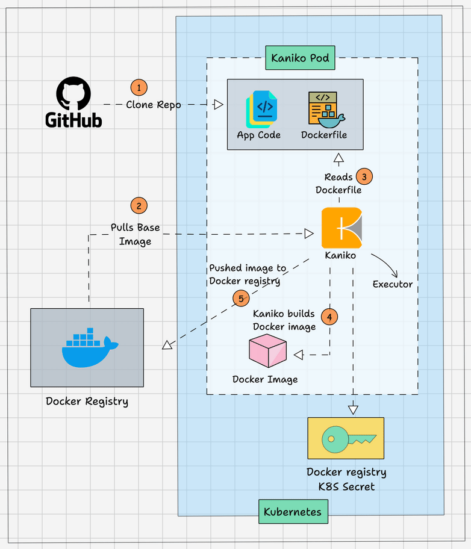
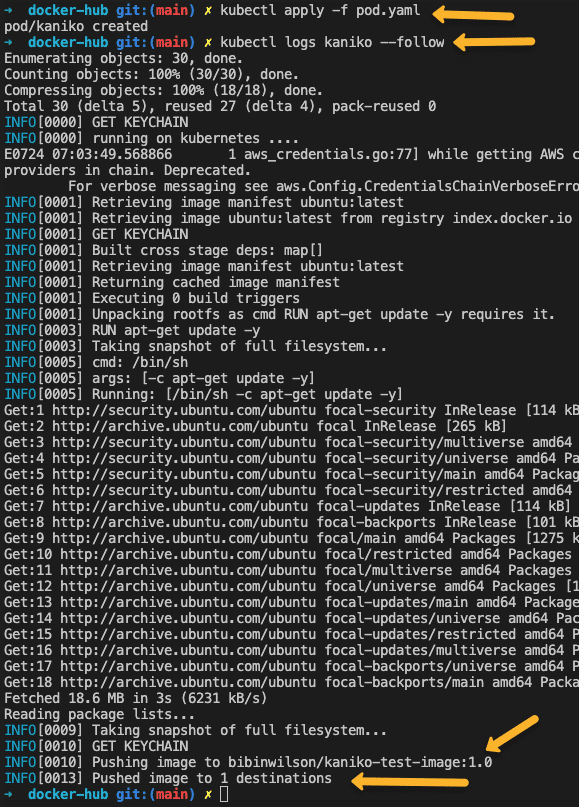

<small>【运维干货分享】如何在 Kubernetes Pod 中构建 Docker 镜像</small>


本初学者指南重点介绍使用 Kaniko 镜像生成器在 Kubernetes pod 中设置 Docker 镜像构建的分步过程。

当涉及到CI/CD，可能会有基于VM和容器的应用程序。理想情况下，人们会使用现有的 VM 基础设施来构建 Docker 镜像。但是，如果你拥有容器化基础设施，最好将其用于 CI/CD 工作流。

在 Docker 中构建 Docker
在 CI 中，主要阶段之一是构建 Docker 镜像。在容器化构建中，你可以在 Docker 工作流程中使用 Docker。

但这种方法有以下缺点。

- Docker 构建容器在特权模式下运行。这是一个很大的安全问题，它为恶意攻击敞开了大门。
- Kubernetes 从其核心中删除了 Docker。因此，除非你向所有 Kubernetes 节点添加 docker，否则将来将无法挂载到主机。docker.sock

这些问题可以使用 Kaniko 解决。

还有一个名为 podman 的实用程序，它可以在没有 root 权限的情况下运行和创建容器。你可以查看 podman 教程以了解更多信息。

- 使用 Kaniko 在 Kubernetes 中构建 Docker 镜像
- Kaniko 是由 Google 创建的开源容器镜像构建工具。

它不需要对主机的特权访问来构建容器镜像。

这是 Kaniko 的工作原理，

- 有一个专用的 Kaniko 执行器镜像，用于构建容器镜像。建议使用 gcr.io/kaniko-project/executor 镜像以避免任何可能的问题。因为此镜像仅包含静态 go 二进制文件和从镜像仓库推送/拉取镜像/向镜像仓库推送/拉取镜像的逻辑。
- Kaniko 接受三个参数。一个 Dockerfile、构建上下文和一个远程 Docker registry。
- 当你部署 kaniko 镜像时，它会读取 Dockerfile 并使用 FROM 指令提取基本镜像文件系统。
- 然后，它执行来自 Dockerfile 的每条指令，并在用户空间中拍摄快照。
- 每次快照后，kaniko 仅将更改的图像图层附加到基础图像并更新图像元数据。Dockerfile 中的所有指令都会发生这种情况。
- 最后，它将镜像推送到给定的registry。
- 如你所见，所有镜像构建操作都发生在 Kaniko 容器的用户空间内，它不需要对主机的任何特权访问。 

Kaniko 支持以下类型的构建上下文。

- GCS 存储桶
- S3 存储桶
- Azure Blob 存储
- 本地目录
- 本地 Tar
- 标准输入
- Git 存储库
对于此博客，我将使用 Github 存储库作为上下文。

此外，你还可以推送到任何容器registry。

## 使用Kaniko、Github、Docker Registry和Kubernetes构建Docker镜像
为了演示 Kaniko 工作流程，我将使用公开可用的工具，使用 Kaniko 在 kubernetes 上构建 Docker 镜像。

这是你需要的

- 带有 Dockerfile： kaniko 的有效 Github 存储库将使用存储库 URL 路径作为 Dockerfile 上下文
- 有效的 docker hub 帐户：用于 kaniko pod 进行身份验证并推送构建的 Docker 镜像。
- 访问 Kubernetes 集群：部署 kaniko pod 并创建 docker registry secret。

下图显示了我们将要构建的工作流。



###  创建 Dockerhub Kubernetes Secret
我们必须为 kaniko pod 创建一个 kubernetes secret 类型，以验证 Docker hub registry并推送镜像。docker-registry

使用以下命令格式创建 docker registry密钥。替换以粗体标记的参数。
```
kubectl create secret docker-registry dockercred \
    --docker-server=https://index.docker.io/v1/ \
    --docker-username=<dockerhub-username> \
    --docker-password=<dockerhub-password>\
    --docker-email=<dockerhub-email>
```    
此密钥被挂载到 kaniko pod 上，以便它对 Docker registry进行身份验证以推送构建的镜像。

注意：如果你有自托管的 docker registry，则可以将服务器 URL 替换为你的 docker registry API 端点。

### 部署 Kaniko Pod 以构建 Docker 镜像
现在，让我们使用 Pod 部署来测试 kaniko 镜像生成器。

我已将清单和 Dockerfile 托管在公共 GitHub 存储库中。这是一个带有说明的简单 Dockerfile。update

我将使用该存储库进行演示。你可以 fork 它或使用类似配置创建自己的存储库。
```
https://github.com/scriptcamp/kubernetes-kaniko
```
将以下清单另存为pod.yaml
```
apiVersion: v1
kind: Pod
metadata:
  name: kaniko
spec:
  containers:
  - name: kaniko
    image: gcr.io/kaniko-project/executor:latest
    args:
    - "--context=git://github.com/scriptcamp/kubernetes-kaniko"
    - "--destination=<dockerhub-username>/kaniko-demo-image:1.0"
    volumeMounts:
    - name: kaniko-secret
      mountPath: /kaniko/.docker
  restartPolicy: Never
  volumes:
  - name: kaniko-secret
    secret:
      secretName: dockercred
      items:
        - key: .dockerconfigjson
          path: config.json
```
- –上下文：这是 Dockerfile 的位置。在我们的例子中，Dockerfile 位于存储库的根目录中。所以我给出了仓库的 git URL。如果您使用的是私有 git 存储库，则可以使用 GIT_USERNAME 和 GIT_PASSWORD（API 令牌）变量来验证 git 存储库。
- –目的地：在这里，您需要将 <dockerhub-username> 替换为您的 docker hub 用户名，以便 kaniko 将镜像推送到 dockerhub 注册表。例如，在我的情况下， bibinwilson/kaniko-test-image:1.0
所有其他配置保持不变。

现在部署 Pod。
```
kubectl apply -f pod.yaml
```
要验证 docker 镜像构建和推送，请检查 Pod 日志。
```
kubectl logs kaniko --follow

```

注意：这里我们使用了静态 pod 名称。所以再次部署;首先，你必须删除 Kaniko Pod。当你将 kaniko 用于 CI/CD 管道时，Pod 会根据你使用的 CI 工具获得一个随机名称，并负责删除 Pod。

## 在Kubernetes上使用Jenkins和kaniko的Docker构建管道
如果你使用 Kubernetes 来扩展 Jenkins 构建代理，则可以使用 Kaniko docker 构建 Pod 在 CI 管道中构建 docker 镜像。

你可以查看我在 Kubernetes 上的 Jenkins 构建代理设置，其中 Jenkins 主节点和代理在 kubernetes 集群上运行。

要将 Kaniko 用于你的构建管道，你应该拥有 Dockerfile 和应用程序。

此外，你应该将多容器 pod 模板与构建和 kaniko 容器一起使用。例如，用于 Java 构建的 maven 容器和 kaniko 容器采用 jar 并使用存储库中的 Dockerfile 构建 docker 镜像。

这是一个基于多容器 pod 模板的 Jenkinsfile，你可以在其中构建应用程序并使用 kaniko 容器使用应用程序构建 docker 镜像，并将其推送到 Docker registry。

重要提示： 你应该在 pod 模板中使用带有 debug 标签的 kaniko 镜像，因为我们将使用 bash 显式运行 kaniko 执行程序。最新的标记图像没有 bash。
```
podTemplate(yaml: '''
    apiVersion: v1
    kind: Pod
    spec:
      containers:
      - name: maven
        image: maven:3.8.1-jdk-8
        command:
        - sleep
        args:
        - 60
      - name: kaniko
        image: gcr.io/kaniko-project/executor:debug
        command:
        - sleep
        args:
        - 60
        volumeMounts:
        - name: kaniko-secret
          mountPath: /kaniko/.docker
      restartPolicy: Never
      volumes:
      - name: kaniko-secret
        secret:
            secretName: dockercred
            items:
            - key: .dockerconfigjson
              path: config.json
''') {
  node(POD_LABEL) {
    stage('Get a Maven project') {
      git url: 'https://github.com/scriptcamp/kubernetes-kaniko.git', branch: 'main'
      container('maven') {
        stage('Build a Maven project') {
          sh '''
          echo pwd
          '''
        }
      }
    }

    stage('Build Java Image') {
      container('kaniko') {
        stage('Build a Go project') {
          sh '''
            /kaniko/executor --context `pwd` --destination bibinwilson/hello-kaniko:1.0
          '''
        }
      }
    }

  }
}
```
你可以直接在流水线作业上使用上述 Jenkinsfile 并对其进行测试。它只是一个入门模板。你需要将存储库替换为代码存储库，并根据应用程序的需要编写构建逻辑。

## 结论
使用 kaniko 构建 Docker 镜像是容器化 Docker 构建的一种安全方式。

你可以尝试将 kaniko 与你的管道相结合，而不会影响安全性。