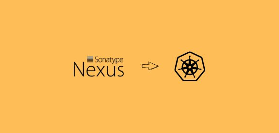

<small>【运维干货分享】如何在Kubernetes 上设置最新的 Nexus OSS</small>



Nexus 是开源的工件存储和管理系统。它是一种广泛使用的工具，可以在大多数 CI/CD 工作流程中看到。作为 DevOps 工程师，了解工件管理工具至关重要。

本指南将引导你完成在 Kubernetes 集群上部署 Sonatype Nexus OSS 的分步过程。

重要说明
以下是有关 nexus 设置需要注意的关键事项。

- Nexus 部署和服务是在 devops-tools 命名空间中创建的。确保你已创建命名空间，或者你可以编辑 YAML 以部署到其他命名空间中。此外，我们为Nexus 2和Nexus 3版本提供了不同的部署文件。
- 在本指南中，我们将对 nexus 数据使用主机卷挂载。本指南旨在用于 POC 或测试目的。你需要将主机卷挂载替换为持久卷，并调整其他 nexus 参数，以满足生产工作负载的生产要求。
- 在我们的 Kubernetes 清单中，nexus Service 被公开为 NodePort。你还可以使用类型 LoadBalancer 或使用 ingress 对象来公开 nexus 终端节点。
- 运行 Nexus 至少需要 2 GB RAM 和 1 个 VCPU。请查看官方系统要求了解更多详情。


## Kubernetes Nexus 清单
本指南中使用的所有 Kubernetes 清单都托管在 Github 存储库中。将存储库克隆到本地工作站以直接执行它。
```
git clone https://github.com/bibinwilson/kubernetes-nexus.git
```
在 Kubernetes 上设置 Nexus OSS
让我们开始在 Kubernetes 上设置 nexus。

步骤1：创建一个名为devops-tools
```
kubectl create namespace devops-tools
```
步骤2：创建文件。nexus 2.x 和 3.x 的情况有所不同。我们两者都给了。根据你需要的 Nexus 版本创建 YAML。deployment.yaml

注意： 此部署中使用的镜像来自公共官方 Sonatype docker 存储库。（Nexus2 镜像和 Dockerfile）（nexus 3 镜像和 Dockerfile)

适用于 Nexus 2.x 的部署 YAML：如果要部署 nexus 2，可以使用以下部署文件。如前所述，nexus 数据目录将作为卷添加到主机服务器中。
```
apiVersion: apps/v1
kind: Deployment
metadata:
  name: nexus
  namespace: devops-tools
spec:
  replicas: 1
  selector:
    matchLabels:
      app: nexus-server
  template:
    metadata:
      labels:
        app: nexus-server
    spec:
      containers:
        - name: nexus
          image: sonatype/nexus:latest
          env:
          - name: MAX_HEAP
            value: "800m"
          - name: MIN_HEAP
            value: "300m"
          resources:
            limits:
              memory: "4Gi"
              cpu: "1000m"
            requests:
              memory: "2Gi"
              cpu: "500m"
          ports:
            - containerPort: 8081
          volumeMounts:
            - name: nexus-data
              mountPath: /sonatype-work
      volumes:
        - name: nexus-data
          emptyDir: {}
```
适用于 Nexus 3.x 的部署 YAML： 以下部署适用于 Sonatype nexus 3。它还具有 nexus 数据的主机数据卷。
```
apiVersion: apps/v1
kind: Deployment
metadata:
  name: nexus
  namespace: devops-tools
spec:
  replicas: 1
  selector:
    matchLabels:
      app: nexus-server
  template:
    metadata:
      labels:
        app: nexus-server
    spec:
      containers:
        - name: nexus
          image: sonatype/nexus3:latest
          resources:
            limits:
              memory: "4Gi"
              cpu: "1000m"
            requests:
              memory: "2Gi"
              cpu: "500m"
          ports:
            - containerPort: 8081
          volumeMounts:
            - name: nexus-data
              mountPath: /nexus-data
      volumes:
        - name: nexus-data
          emptyDir: {}
```
步骤3：使用 kubectl 命令创建部署。
```
kubectl create -f deployment.yaml
```
检查 Deployment Pod 状态
```
kubectl get po -n devops-tools
```
步骤4：创建包含以下内容的文件，以使用 NodePort 公开 nexus 端点。service.yaml

注意：如果你在云上，则可以使用服务类型 Loadbalancer 使用负载均衡器公开服务。此外，Prometheus 注解将有助于 Prometheus 对服务端点进行监控。
```
apiVersion: v1
kind: Service
metadata:
  name: nexus-service
  namespace: devops-tools
  annotations:
      prometheus.io/scrape: 'true'
      prometheus.io/path:   /
      prometheus.io/port:   '8081'
spec:
  selector: 
    app: nexus-server
  type: NodePort  
  ports:
    - port: 8081
      targetPort: 8081
      nodePort: 32000
```
使用 kubectl 检查服务配置。
```
kubectl describe service nexus-service -n devops-tools
```
步骤5： 现在，你将能够访问端口上任何 Kubernetes 节点 IP 上的 nexus，因为我们已经公开了节点端口。例如32000

对于 Nexus 2，

http://35.144.130.153:32000/nexus
对于Nexus 2，默认用户名和密码将为 和adminadmin123

对于 Nexus 3，

http://35.144.130.153:32000
nexus 3 的默认用户名是 admin，默认密码存储在 Pod 中。

首先列出 Pod 并获取 nexus Pod 名称。
```
kubectl get pods -n devops-tools
```
使用如下所示的 kubectl 命令获取存储在 location 中的密码。替换为你的 Pod 名称。/nexus-data/admin.passwordnexus-55976bf6fd-cvhxb
```

kubectl exec nexus-55976bf6fd-cvhxb -n devops-tools cat /nexus-data/admin.password
```