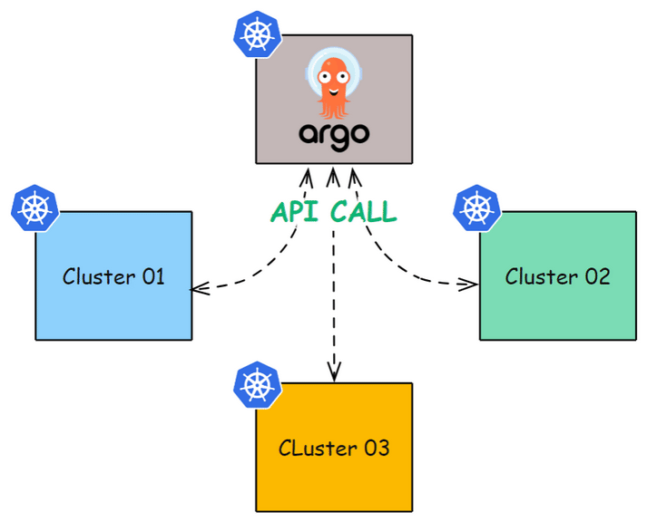
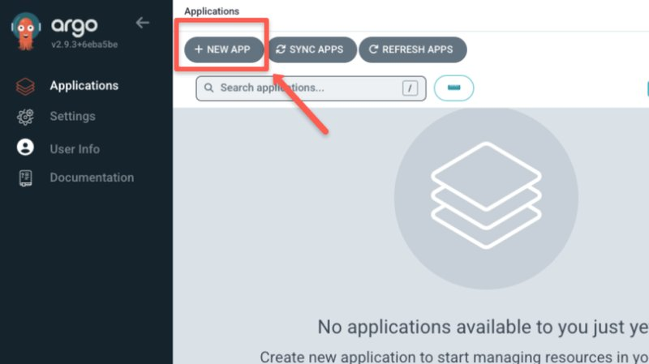
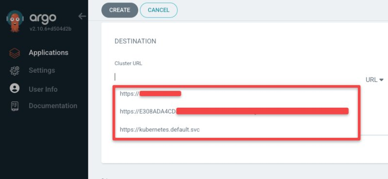
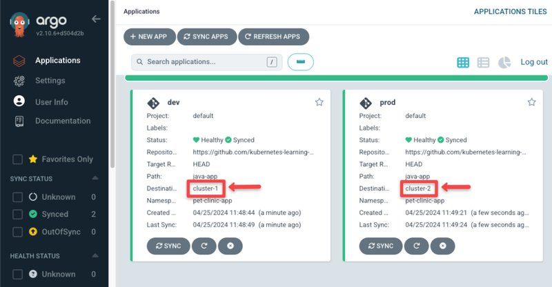

<small>【运维干货分享】如何在 Argo CD 上配置多个 Kubernetes 集群</small>


在此博客中，你将了解如何使用 Argo CD 配置和管理多个 Kubernetes 集群，并提供分步说明。

Argo CD 是一种 CD 工具，它有一个惊人的功能，称为多集群支持，这意味着你不仅可以在安装了 Argo CD 的集群中部署和管理应用程序，还可以在其他外部集群中部署和管理应用程序。

Argo CD 将充当每个集群的中心枢纽，Argo CD 会持续向每个可用集群发送 API 调用，以保持它们同步并检查它们的健康状况。

将集群添加到 Argo CD 没有特定限制。但是，部署 Argo CD 的集群应具有所需的资源，以处理从配置的其他集群发送和接收的 API 调用。

下图给出了三个集群如何连接到具有 Argo CD 的集群的示例



## 设置先决条件
以下是设置的先决条件。

- 正在运行的 Argo CD 设置
- 有权创建 ClusterRole 的 Kubernetes 集群
- Argo CD 命令行界面
- Kubectl 在你的工作站上配置。

## 将多个集群配置到 Argo CD

要在 Argo CD 中配置多个集群，主要有两种方法。他们是

- 使用 Argo CD 自定义资源定义 （CRD）
- 将 Argo CD CLI 与 Kubecofig 文件一起使用
让我们详细看看每种方法。

### 方法 1：Argo CD CRD 方法
让我们看看如何使用 CRD 方法将多个 Kubernetes 集群添加到 Argo CD。

对于设置，我使用了三个 Kubernetes 集群。一个集群安装了 Argo CD，另外两个集群将使用 CRD 方法添加到 Argo CD。

按照以下步骤使用 CRD 方法将多个集群添加到 Argo CD。

在以下步骤中，在要添加到 Argo CD 的集群上执行步骤 1 和步骤 2，在 Argo CD 集群中执行步骤 3。

第 1 步：创建服务帐户
首先，登录需要添加到 Argo CD 的 Cluster 并启动 RBAC 配置，创建一个 YAML 文件，并复制以下内容
```
apiVersion: v1
kind: ServiceAccount
metadata:
  name: argocd-manager
  namespace: kube-system
---
apiVersion: rbac.authorization.k8s.io/v1
kind: ClusterRole
metadata:
  name: argocd-manager-role
rules:
- apiGroups:
  - '*'
  resources:
  - '*'
  verbs:
  - '*'
- nonResourceURLs:
  - '*'
  verbs:
  - '*'
---
apiVersion: rbac.authorization.k8s.io/v1
kind: ClusterRoleBinding
metadata:
  name: argocd-manager-role-binding
roleRef:
  apiGroup: rbac.authorization.k8s.io
  kind: ClusterRole
  name: argocd-manager-role
subjects:
- kind: ServiceAccount
  name: argocd-manager
  namespace: kube-system
```
此文件将创建一个 serviceaccount，一个具有完整集群权限的 clusterrole，并将 clusterrole 绑定到 serviceaccount。

我们之所以提供完全集群权限，是因为 Argo CD 需要集群的完全权限才能在具有所需资源的任何命名空间上创建、删除和管理应用程序。

第 2 步：创建 Secret
下一步是创建 Bearer Token 并将其配置为我们在第 1 步中创建的服务账户。

运行以下命令，使用 Bearer Token 创建 secret 并将其配置到服务账户。
```
cat <<EOF | kubectl apply -n kube-system  -f -
apiVersion: v1
kind: Secret
metadata:
  name: Argo CD-manager-token
  namespace: kube-system
  annotations:
    kubernetes.io/service-account.name: Argo CD-manager
type: kubernetes.io/service-account-token
EOF
```
创建密钥后，将令牌和 CA 证书保存为变量，以便我们可以在下一步中使用它们。

运行以下命令，将 bearer token 和 CA certificate 保存为变量
```
ca=$(kubectl get -n kube-system secret/argocd-manager-token -o jsonpath='{.data.ca\.crt}')

token=$(kubectl get -n kube-system secret/argocd-manager-token -o jsonpath='{.data.token}' | base64 --decode)
```
第 3 步：在 Argo CD 集群中创建密钥
要完成 RBAC 配置，请登录 Argo CD 集群并使用 Argo CD 连接其他集群所需的数据创建一个 Secret。

运行以下命令以创建密钥
```
cat <<EOF | kubectl apply --context arn:aws:eks:us-west-2:814200988517:cluster/test-cluster -n Argo CD -f -
apiVersion: v1
kind: Secret
metadata:
  name: cluster1-secret
  labels:
    Argo CD.argoproj.io/secret-type: cluster
type: Opaque
stringData:
  name: cluster-1
  server: https://B66A3A2BB2.**************
  config: |
    {
      "bearerToken": "${token}",
      "tlsClientConfig": {
        "serverName": "B66A3A2BB2.************",
        "caData": "${ca}"
      }
    }
EOF
```
在此命令中，请确保使用需要添加的集群终端节点更新黑色字母。

此外，你还可以看到它从我们在步骤 2 中创建的变量中获取不记名令牌和 CA 证书。

对需要添加到 Argo CD 的集群重复相同的步骤，并在配置其他集群时更改密钥名称和集群名称。

运行上述命令后，如果在 Argo CD UI 上选中 Setting->Clusters 选项，则可以看到一个新集群，如下所示

如果要在新集群上部署应用程序，你可以在添加新 APP 的同时在集群之间进行选择，如下所示


选择 NEW APP 按钮后，将打开一个新页面，向下滚动到 DESTINATION 标签，你可以在其中选择可用集群，如下所示


使用 DESTINATION 选项卡，你可以使用 Argo CD 选择要在其中部署应用程序的集群。

在上图中可以看到，这两个应用程序部署在两个不同的集群中。

### 方法 2：将 Argo CD CLI 与 Kubeconfig 文件一起使用
你还可以从工作站上的 Kubeconfig 文件配置多个集群，前提是你的系统上配置了 Argo CD CLI。

Argo CD CLI 可以从 Kubeconfig 文件中读取上下文，并使用 Kubeconfig 中的凭证。

对于设置，我使用来自同一账户的两个 AWS EKS 集群，你可以使用任何云平台的集群。

第 1 步：登录 Argo CD
确保你已将集群详细信息更新到 kubeconfig 文件并使用 Argo CD CLI 登录 Argo CD，如果没有，请运行以下命令登录 Argo CD。
```
argocd login <url>:<port> --username <username> --password <password>
```
使用此命令，你可以使用用户名和密码登录 Argo CD。

步骤 2：获取群集的上下文
登录到 Argo CD 后，你需要找到需要添加到 Argo CD 的集群的上下文。

运行以下命令，从 kubeconfig 文件中获取上下文
```
kubectl config get-contexts -o name
```
你将获得在 kubeconfig 文件中配置的集群上下文的列表。

步骤 3：添加集群
要将集群添加到 Argo CD，请在以下命令中使用你从上一步中获得的正在运行的集群的上下文
```
argocd cluster add --kubeconfig <path-of-kubeconfig-file> --kube-context string <cluster-context> --name <cluster-name>
```
确保在上述命令中添加集群上下文。

此命令将在你在上述命令中指定的集群上创建一个具有完整集群权限的服务帐户 Argo CD-manager，因此请确保你对集群具有所需的权限。

如果成功将集群添加到 Argo CD，你将得到以下输出


获取上述输出后，你可以在 UI 中看到一个新集群已添加到 Argo CD。

## 结论
在这篇博客中，你学习了向 Argo CD 添加多个集群的两种方法，一种是使用 Argo CD CRD 方法，另一种是使用 Argo CD CLI。

我希望你发现此博客对于使用简单的步骤将多个集群添加到 Argo CD 有用。