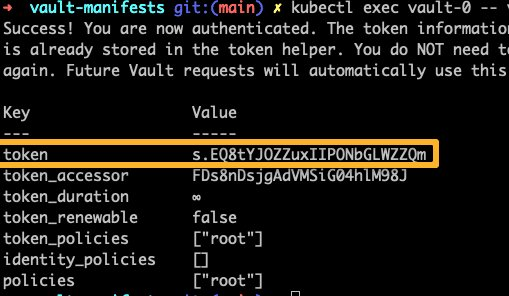
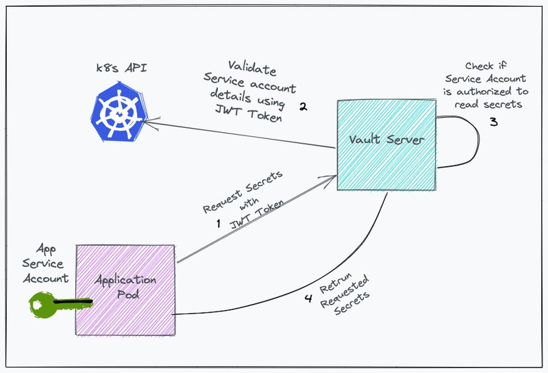

<small>【运维干货分享】如何在kubernetes中设置vault，初学者指南</small>


本文旨在解释每个 Kubernetes Vault 组件，并在 Kubernetes 中设置 Vault 服务器的分步指南。在本文的最后，我们还将通过一个简单的演示来讨论应用程序如何利用 vault。

作为初学者，在了解所涉及的步骤的同时逐个创建组件是了解 Kubernetes 和 Vault 的好方法。循序渐进确保你可以专注于理解“为什么”，同时学习“如何”。

## 在 Kubernetes 中创建 Vault Server 
如你所知，Kubernetes 默认 secret 对象只是 base64 编码的。你需要一个好的密钥管理工具和工作流来管理生产使用案例的密钥存储和检索。

Hashicorp Vault 是最好的开源秘密管理工具之一，它与 Kubernetes 具有良好的集成来存储和检索秘密。


## Vault Kubernetes 清单
本指南中使用的所有 Kubernetes YAML 清单都托管在 Github 上。克隆存储库以供参考和实施。
```
git clone https://github.com/scriptcamp/kubernetes-vault.git
```
## Vault RBAC 设置
在开始设置之前，我想先了解一下我们将在此 Vault 设置中使用的一些基本 Kubernetes 对象。

- ClusterRoles 中：Kubernetes ClusterRole 是已分配某些特殊权限的实体。
- ServiceAccount：Kubernetes ServiceAccounts 是分配给 Pod 等实体的身份，以便它们能够使用角色的权限与 Kubernetes API 进行交互。
- ClusterRoleBindings：ClusterRoleBindings 是向账户提供角色的实体，即它们向服务账户授予权限。

Vault 服务器需要某些额外的 Kubernetes 权限才能执行其操作。因此，需要通过 ClusterRoleBinding 将 ClusterRole（具有适当的权限）分配给 ServiceAccount。

默认情况下，Kubernetes 有一个使用所需权限创建的 ClusterRole，即“ system:auth-delegator ”，因此在这种情况下不需要再次创建它。需要创建服务帐户和角色绑定

让我们为 Vault 创建所需的 RBAC。

将以下清单另存为rbac.yaml
```
---
apiVersion: v1
kind: ServiceAccount
metadata:
  name: vault
  namespace: default

---
apiVersion: rbac.authorization.k8s.io/v1
kind: ClusterRoleBinding
metadata:
  name: vault-server-binding
roleRef:
  apiGroup: rbac.authorization.k8s.io
  kind: ClusterRole
  name: system:auth-delegator
subjects:
- kind: ServiceAccount
  name: vault
  namespace: default
```
创建服务账户和 ClusterRolebinding。
```
kubectl apply -f rbac.yaml
```
## 创建 Vault ConfigMap
Kubernetes 中的 ConfigMap 允许我们在容器上挂载文件，而无需更改 Dockerfile 或重新构建容器镜像。

在必须通过文件修改或创建配置的情况下，此功能非常有用。

Vault 需要一个具有适当参数的配置文件来启动其服务器。

将以下清单另存为configmap.yaml
```
apiVersion: v1
kind: ConfigMap
metadata:
  name: vault-config
  namespace: default
data:
  extraconfig-from-values.hcl: |-
    disable_mlock = true
    ui = true
    
    listener "tcp" {
      tls_disable = 1
      address = "[::]:8200"
      cluster_address = "[::]:8201"
    }
    storage "file" {
      path = "/vault/data"
    }
```
创建 configmap
```
kubectl apply -f configmap.yaml
```
了解 config map 中参数背后的想法很重要。下面将对其中一些进行解释。有关更详尽的选项列表： – 请参阅官方vault文档。

- disable_mlock：执行 mlock syscall 可防止内存交换到
- disk： 此选项将禁止服务器执行 mlock 系统调用。
- 用户界面： 启用内置 Web UI。
- listener： 配置 Vault 监听 API 请求的方式。
- storage： 配置存储 Vault 数据的存储后端。
## 部署 Vault 服务
Kubernetes 中的服务是 Pod 用来相互通信的对象。 类型服务通常用于 Pod 间通信。

有两种类型的 ClusterIP 服务ClusterIP

- headless services
- services
普通的 Kubernetes 服务充当负载均衡器，并遵循循环逻辑来分配负载。Headless 服务的作用与负载均衡器不同。

此外，普通服务由 Kubernetes 分配 IP，而 Headless 服务则不是。

对于 Vault 服务器，我们将创建一个供内部使用的 Headless 服务。当我们将文件库扩展到多个副本时，这将非常有用。

将为 UI 创建一个非 Headless 服务，因为我们希望在访问 UI 时对副本的请求进行负载均衡。

Vault 在端口 8200 上公开其 UI。我们将使用 NodePort 类型的非无头服务，因为我们希望从 Kubernetes 集群外部访问此终端节点。

将以下清单保存为services.yaml 。它具有服务和无头服务定义。
```
---
# Service for Vault Server
apiVersion: v1
kind: Service
metadata:
  name: vault
  namespace: default
  labels:
    app.kubernetes.io/name: vault
    app.kubernetes.io/instance: vault
  annotations:
spec:
  type: NodePort  
  publishNotReadyAddresses: true
  ports:
    - name: http
      port: 8200
      targetPort: 8200
      nodePort: 32000
    - name: https-internal
      port: 8201
      targetPort: 8201
  selector:
    app.kubernetes.io/name: vault
    app.kubernetes.io/instance: vault
    component: server

---
# Headless Service
apiVersion: v1
kind: Service
metadata:
  name: vault-internal
  namespace: default
  labels:
    app.kubernetes.io/name: vault
    app.kubernetes.io/instance: vault
  annotations:
spec:
  clusterIP: None
  publishNotReadyAddresses: true
  ports:
    - name: "http"
      port: 8200
      targetPort: 8200
    - name: https-internal
      port: 8201
      targetPort: 8201
  selector:
    app.kubernetes.io/name: vault
    app.kubernetes.io/instance: vault
    component: server
```
创建服务。
```
kubectl apply -f services.yaml
```
### 了解 publishNotReadyAddresses：
它是 Headless 服务清单文件中的配置选项。

默认情况下，仅当 Pod 处于“就绪”状态时，Kubernetes 才会在服务下包含 Pod。

“ publishNotReadyAddresses ”选项通过包含可能处于或未处于就绪状态的 Pod 来更改此行为。您可以通过执行“kubectl get pods”查看处于就绪状态的 pod 列表。

## 需要 Vault StatefulSet
StatefulSet 是用于管理有状态应用程序的 Kubernetes 对象。

对于此用例，它比部署更可取，因为它为这些 Pod 的排序和唯一性提供了保证，即使用有状态集可以更好地管理卷。

本部分对于更深入地了解文件库至关重要。

作为初学者，理解为什么我们想要部署 Statefulset 而不是 Deployment 是很重要的。毕竟，我们的重点是理解 “为什么 ”以及学习 “如何”。

### 为什么我们需要 Statefulset？
Vault 是一个有状态的应用程序，即它将数据（如配置、密钥、Vault 操作的元数据）存储在卷中。如果数据存储在内存中，则 Pod 重启后数据将被擦除。

此外，在案件量增加的情况下，Vault 可能必须扩展到多个 pod。

所有这些操作都必须以这样一种方式完成，以便在 Vault Pod 之间保持数据一致性，例如 、 、 。vault-0vault-1vault-2

我们如何在 Kubernetes 中实现这一目标？请思考，然后提前阅读！

Vault 在其所有 Pod 之间实现数据的连续复制。因此，当数据写入时，它会被复制到 . 从 复制数据。等等......

这里要了解的是需要知道在哪里寻找 . 否则，复制将如何进行？vault-0vault-1vault-2vault-3vault-1vault-0

- 它如何知道从何处获取数据以进行复制过程？
- vault-1 如何知道在何处查找 vault-0？
- vault-2 如何知道在哪里查找 vault-1？

现在让我们尝试回答这些问题。

在部署和有状态集的情况下，Pod 总是被分配一个唯一的名称，可以用来查找 Pod。

在部署的情况下，Pod 总是被分配一个唯一的名称，但这个唯一的名称在删除并重新创建 Pod 后会发生变化。因此，识别任何 Pod 都没有用。
```
Case of deployments:
name of pod initially: vault-7c6c5fd47c-fkvpf 
name of pod after it gets deleted & recreated: vault-c5f7c6dfk4-7pfcv 
Here, pod name got changed.
```
在有状态集的情况下 - 每个 Pod 都被分配了一个唯一的名称，即使 Pod 被删除并重新创建，这个唯一的名称也会保留。
```
Case of statefulsets:
name of pod initially: vault-0
name of pod after it gets deleted & recreated: vault-0
Here, pod name remained the same.
```
这就是为什么我们想在这里使用有状态的集合，即我们可以毫无差异地访问任何 pod。

### 超越vault
如果你探索一下，这些状态集和部署的概念并不是Vault独有的 - 你会发现许多流行的Kubernetes工具，如Elasticsearch、Postgresql，由于相同的逻辑，使用有状态集而不是部署。

## 部署 Vault StatefulSet
首先，让我们创建 Statefulset。我还添加了对 vault Statefulset 的解释。

将以下清单另存为statefulset.yaml
```
apiVersion: apps/v1
kind: StatefulSet
metadata:
  name: vault
  namespace: default
  labels:
    app.kubernetes.io/name: vault
    app.kubernetes.io/instance: vault
spec:
  serviceName: vault-internal
  replicas: 1
  selector:
    matchLabels:
      app.kubernetes.io/name: vault
      app.kubernetes.io/instance: vault
      component: server
  template:
    metadata:
      labels:
        app.kubernetes.io/name: vault
        app.kubernetes.io/instance: vault
        component: server
    spec:
      serviceAccountName: vault
      securityContext:
        runAsNonRoot: true
        runAsGroup: 1000
        runAsUser: 100
        fsGroup: 1000
      volumes:
        - name: config
          configMap:
            name: vault-config
        - name: home
          emptyDir: {}
      containers:
        - name: vault          
          image: hashicorp/vault:1.8.0
          imagePullPolicy: IfNotPresent
          command:
          - "/bin/sh"
          - "-ec"
          args: 
          - |
            cp /vault/config/extraconfig-from-values.hcl /tmp/storageconfig.hcl;
            [ -n "${HOST_IP}" ] && sed -Ei "s|HOST_IP|${HOST_IP?}|g" /tmp/storageconfig.hcl;
            [ -n "${POD_IP}" ] && sed -Ei "s|POD_IP|${POD_IP?}|g" /tmp/storageconfig.hcl;
            [ -n "${HOSTNAME}" ] && sed -Ei "s|HOSTNAME|${HOSTNAME?}|g" /tmp/storageconfig.hcl;
            [ -n "${API_ADDR}" ] && sed -Ei "s|API_ADDR|${API_ADDR?}|g" /tmp/storageconfig.hcl;
            [ -n "${TRANSIT_ADDR}" ] && sed -Ei "s|TRANSIT_ADDR|${TRANSIT_ADDR?}|g" /tmp/storageconfig.hcl;
            [ -n "${RAFT_ADDR}" ] && sed -Ei "s|RAFT_ADDR|${RAFT_ADDR?}|g" /tmp/storageconfig.hcl;
            /usr/local/bin/docker-entrypoint.sh vault server -config=/tmp/storageconfig.hcl     
          securityContext:
            allowPrivilegeEscalation: false
          env:
            - name: HOSTNAME
              valueFrom:
                fieldRef:
                  fieldPath: metadata.name
            - name: VAULT_ADDR
              value: "http://127.0.0.1:8200"
            - name: VAULT_API_ADDR
              value: "http://$(POD_IP):8200"
            - name: SKIP_CHOWN
              value: "true"
            - name: SKIP_SETCAP
              value: "true"
            - name: VAULT_CLUSTER_ADDR
              value: "https://$(HOSTNAME).vault-internal:8201"
            - name: HOME
              value: "/home/vault"
          volumeMounts:
            - name: data
              mountPath: /vault/data  
            - name: config
              mountPath: /vault/config
            - name: home
              mountPath: /home/vault
          ports:
            - containerPort: 8200
              name: http
            - containerPort: 8201
              name: https-internal
            - containerPort: 8202
              name: http-rep
          readinessProbe:
            exec:
              command: ["/bin/sh", "-ec", "vault status -tls-skip-verify"]
            failureThreshold: 2
            initialDelaySeconds: 5
            periodSeconds: 5
            successThreshold: 1
            timeoutSeconds: 3
  volumeClaimTemplates:
    - metadata:
        name: data
      spec:
        accessModes:
          - ReadWriteOnce
        resources:
          requests:
             storage: 1Gi
```
创建 Statefulset。
```
kubectl apply -f statefulset.yaml
```
Vault 的 Statefulset YAML 有很多组件，比如 configmap 挂载、安全上下文、探针等。

注意：Vault 目前仍处于 non ready 状态。它需要解封才能进入就绪状态。随意跳到下一部分来解封 vault。对于生产用例，应使用 Auto Unseal 选项。

让我们更深入地了解每个部分的作用。

配置： Vault 的额外配置文件正在挂载，然后被复制到进程启动时使用它的位置。/vault/config/extraconfig-from-values.hcl/tmp/storageconfig.hcl
```
cp /vault/config/extraconfig-from-values.hcl /tmp/storageconfig.hcl;
/usr/local/bin/docker-entrypoint.sh vault server -config=/tmp/storageconfig.hcl  
```  
ServiceAccount 的 ServiceAccount 中： 由于我们希望 Vault 服务器具有所需的 'system：auth-delegator' 权限。已为容器组分配服务帐户。
```
 serviceAccountName: vault
```
SecurityContext 的使用特权进程运行 Pod 会带来安全风险。这是因为在 Pod 上运行具有 root 的进程与在主机节点上运行具有 root 的进程相同。

理想情况下，Pod 的运行应牢记容器和主机节点之间的隔离。因此，此处已指示 Pod 以非 root 用户身份运行。
```
securityContext:
    runAsNonRoot: true
    runAsGroup: 1000
    runAsUser: 100
    fsGroup: 1000
```
探针：探针可确保 Vault 不会因任何错误而陷入循环，并且可以在出现意外错误时自动重新启动。
```
readinessProbe:
    exec:
        command: ["/bin/sh", "-ec", "vault status -tls-skip-verify"]
    failureThreshold: 2
    initialDelaySeconds: 5
    periodSeconds: 5
    successThreshold: 1
    timeoutSeconds: 3
```
VolumeClaimTemplates 的 VolumeClaimTemplates 中： 一个模板，有状态集可以通过该模板为副本创建卷。
```
volumeClaimTemplates:
    - metadata:
        name: data
      spec:
        accessModes:
          - ReadWriteOnce
        resources:
          requests:
             storage: 1Gi
```
Vault 设置已完成。下一步是解封并初始化文件库。

## 解封并初始化vault
初始化是 Vault 的存储开始准备接收数据的过程。

Vault 生成一个内存中的主密钥，并应用 Shamir 的秘密共享算法将该主密钥分解为多个密钥。这些密钥称为 “解封密钥”。

因此，要初始化 vault，首先，我们需要使用 unseal keys 解封 vault。

步骤1：首先，我们正在创建令牌和密钥以开始使用vault。

注意：如果你的系统上没有安装 jq，请安装 jq。
```
kubectl exec vault-0 -- vault operator init -key-shares=1 -key-threshold=1 -format=json > keys.json

VAULT_UNSEAL_KEY=$(cat keys.json | jq -r ".unseal_keys_b64[]")
echo $VAULT_UNSEAL_KEY

VAULT_ROOT_KEY=$(cat keys.json | jq -r ".root_token")
echo $VAULT_ROOT_KEY
```
步骤2： Unseal 是文件库可以构造解密存储在其中的数据所需的密钥的状态。
```
kubectl exec vault-0 -- vault operator unseal $VAULT_UNSEAL_KEY
```
重要提示：如果 Vault Pod 重新启动，它会自动被密封。你需要使用上述 unseal 命令再次解封 vault。此外，如果你运行多个 replicaset，则需要登录所有 Pod 并执行 unseal 命令。对于生产使用案例，有可用的自动解封选项。

## 登录和访问Vault UI
你可以使用 UI 和 CLI 登录到 Vault。

注意：在生产设置中，Vault UI 和登录将使用 LDAP、okta 或其他遵循标准安全准则的安全机制进行保护。

以下命令将远程执行 vault log 命令，因为我们在环境变量中本地设置了该命令。VAULT_ROOT_KEY

kubectl exec vault-0 -- vault login $VAULT_ROOT_KEY
上述命令将显示一个令牌。保存令牌，因为你需要它来登录保管库 UI。


由于我们在 nodeport 上创建了服务，因此我们将能够使用端口 32000 上的任何节点 IP 访问保管库 UI。你可以使用保存的 Token 登录 UI。32000

例如
```
http://33.143.55.228:32000
```
## 创建文件库密钥

我们可以使用 CLI 和 UI 创建 secret。我们将使用 CLI 创建密钥。

要使用 Vault CLI，我们需要 exec 进入 Vault Pod。
```
kubectl exec -it vault-0 -- /bin/sh
```
## 创建密钥
有多个秘密引擎（数据库、Consul、AWS 等）。请参阅官方文档以了解有关支持的 Secret Engine 的更多信息。

在这里，我们使用的是键值引擎 v2。它具有保留相同密钥的多个版本的高级功能。v1 一次只能管理一个版本。

让我们启用 Key value engine。
```
vault secrets enable -version=2 -path="demo-app" kv
```
以键值格式创建 secret 并将其列出。id（键）为 ，secret（值） 为 。path 为namedevopscube demo-app/user01
```
vault kv put demo-app/user01 name=devopscube
vault kv get demo-app/user01 
Kubernetes vault create secret 作为键值对。
```
## 创建策略
默认情况下，密钥路径启用了拒绝策略。我们需要显式添加一个策略来读/写/删除 secret。

以下策略规定允许实体对存储在 “” 下的密钥执行读取操作。执行它以创建策略demo-app
```
vault policy write demo-policy - <<EOH
path "demo-app/*" {
  capabilities = ["read"]
}
EOH
```
你可以列出并验证策略。
```
vault policy list

```
## 启用 Vault Kubernetes 身份验证方法
要使 Kubernetes Pod 与 Vault 交互并获取密钥，它需要一个 Vault 令牌。使用 Pod 服务帐户的 kubernetes auth 方法使 Pod 可以轻松地从保管库中检索密钥。

这样，任何被分配了 “” 作为服务账户的 Pod 都将能够读取这些 secret，而无需任何 Vault 令牌。vault

让我们启用 kubernetes auth 方法。
```
vault auth enable kubernetes
```
你也可以从 Vault UI 查看和启用身份验证方法。


我们已将具有 ClusterRole 的服务帐户附加到文件库 Statefulset。以下命令配置服务账户令牌，使 Vault 服务器能够使用令牌、Kubernetes URL 和集群 API CA 证书对 Kubernetes 进行 API 调用。 是 Pod 内部返回内部 API 端点的 env 变量。KUBERNETES_PORT_443_TCP_ADDR
```
vault write auth/kubernetes/config token_reviewer_jwt="$(cat /var/run/secrets/kubernetes.io/serviceaccount/token)" kubernetes_host="https://$KUBERNETES_PORT_443_TCP_ADDR:443" kubernetes_ca_cert=@/var/run/secrets/kubernetes.io/serviceaccount/ca.crt
```
现在，我们必须创建一个 vault approle，用于绑定 Kubernetes 服务账户、命名空间和文件库策略。这样，Vault Server 就知道特定服务帐户是否有权读取存储的 secret。

让我们创建一个服务帐户，应用程序 Pod 可以使用该帐户从文件库中检索密钥。
```
kubectl create serviceaccount vault-auth
```
让我们创建一个名为 vault 的 vault 并绑定一个命名空间中名为 的服务帐户。此外，我们还附加了我们创建的具有密钥读取访问权限的 Secret。approlewebappvault-auth defaultdemo-policy
```
vault write auth/kubernetes/role/webapp \
        bound_service_account_names=vault-auth \
        bound_service_account_namespaces=default \
        policies=demo-policy \
        ttl=72h
```
现在，默认命名空间中任何具有服务帐户的 Pod 都可以在 demo-policy 下请求 Secret。vault-auth

## 使用服务账户获取存储在 Vault 中的 Secret
目标是 Pod 应该能够从 Vault 中获取 Secret，而无需向其提供任何 Vault Token，即它应该使用 service account token 向 Vault 发出请求。



以下是它的工作原理。

- 来自 Pod 的 JWT 令牌（服务帐户令牌）将传递到 Vault 服务器。
- Vault 服务器请求 Kubernetes API 服务器获取附加到 JWT 令牌的服务帐户和命名空间。
- Kubernetes API 服务器返回命名空间和服务帐户详细信息。
- Vault 服务器验证服务账户是否有权使用附加的策略读取密钥。
- 验证后，Vault 服务器将返回 Vault 令牌。
- 在另一个 API 调用中，文件库令牌使用密钥路径传递以检索密钥。
为了演示这一点，首先，我们将在命名空间中部署一个名为 service account 的 pod。vault-clientvault-authdefault

将清单另存为pod.yaml
```
---
apiVersion: v1
kind: Pod
metadata:
  name: vault-client
  namespace: default
spec:
  containers:
  - image: nginx:latest
    name: nginx
  serviceAccountName: vault-auth
```
部署 Pod。
```
kubectl apply -f pod.yaml
```
现在，获取 Pod 的 exec 会话，以便我们可以发出 API 请求，并查看它是否能够向 Vault 服务器进行身份验证并检索所需的密钥。
```
kubectl exec -it vault-client /bin/bash
```
请按照以下步骤操作。

步骤1：使用服务帐户令牌 （JWT） 向 Vault 服务器发出 API 请求以获取客户端令牌。

将服务帐户令牌保存到变量jwt_token
```
jwt_token=$(cat /var/run/secrets/kubernetes.io/serviceaccount/token)
```
使用 curl 进行 API 调用。替换为你的保管库 URL。http://35.193.55.248:32000
```
curl --request POST \
    --data '{"jwt": "'$jwt_token'", "role": "webapp"}' \
    http://35.193.55.248:32000/v1/auth/kubernetes/login
```
上述 API 请求将返回一个包含 .使用此令牌，可以读取 secret。client_token

JSON （美化） 输出示例：
```
{
  "request_id": "87440e92-cbe9-8357-059d-c4ecdfd58e84",
  "lease_id": "",
  "renewable": false,
  "lease_duration": 0,
  "data": null,
  "wrap_info": null,
  "warnings": null,
  "auth": {
    "client_token": "s.r2kKKaYnGR48CR9aWvoV8skx",
    "accessor": "bqqCCmrxS58TiTyafH9udHm7",
    "policies": [
      "default",
      "demo-policy"
    ],
    "token_policies": [
      "default",
      "demo-policy"
    ]
  }
}
```
现在，我们将使用 client_token 进行 API 调用并获取 下存储的密钥。将 token 和 vault URL 替换为相关值。demo-app
```
curl -H "X-Vault-Token: s.bSRl7TNajYxWvA7WiLdTQS7Z" \
     -H "X-Vault-Namespace: vault" \
     -X GET http://35.193.55.248:32000/v1/demo-app/data/user01?version=1
```
上述 API 请求将返回一个 JSON，其中包含 'data' 下的密钥。

样本输出（美化）
```
{
  "request_id": "d2a2fc9c-6eca-9a12-a4a8-8799230e9449",
  "lease_id": "",
  "renewable": false,
  "lease_duration": 0,
  "data": {
    "data": {
      "name": "devopscube"
    }
  }
}
```


## 可能的错误和故障排除
如果你删除有状态集并再次重新部署文件库，请不要再次运行 init 命令。它可能会引发以下错误。
```
Error initializing: Error making API request.

URL: PUT http://127.0.0.1:8200/v1/sys/init
Code: 400. Errors:
```
发生这种情况是因为，根据设计，当你删除 Statefulset 时，附加到 Pod 的卷不会被删除。这样你就有机会复制数据。

因此，PVC 将具有初始化的配置。因此，你只需使用现有 key.json并使用 secret 令牌解封文件库，而无需初始化。或者，你可以完全删除 PVC 并使用新的 PVC 重新部署文件库。

## 结论
到目前为止，你已经学会了在 Kubernetes 中设置、配置和使用 vault。这是一个很好的起点，你可以探索更多概念和工作流程。

在实施 Vault 生产时，需要遵循许多注意事项和标准安全实践。