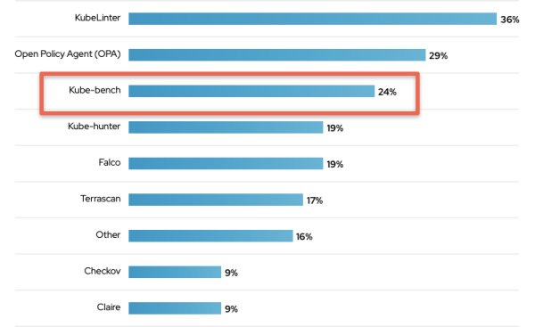
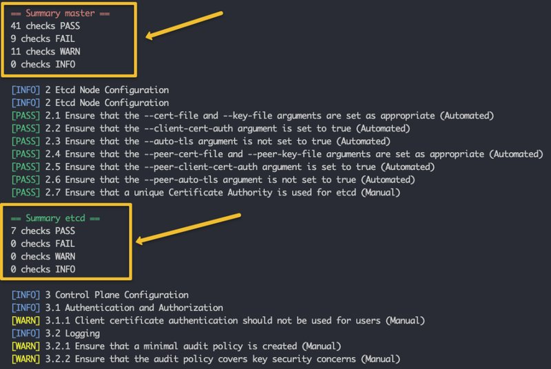

<small>【运维干货分享】Kube-Bench：Kubernetes CIS 基准测试工具</small>


在本博客中，你将了解 kube-bench 以及如何使用 kube-bench 对集群运行 Kubernetes CIS 基准测试。

在为生产使用案例管理 Kubernetes 集群时，安全性和合规性是需要考虑的关键因素。需要安全地配置集群，以最大限度地减少攻击面。此外，每个组织都可能对系统有审计要求，以符合安全标准。

## 什么是 CIS Kubernetes 基准测试？

CIS Benchmark 是社区共识过程的产物，包含为 Kubernetes 开发的安全配置准则


Kubernetes CIS基准测试涵盖了以下安全指南和建议。

- 控制平面组件：控制平面节点配置和组件推荐。
- Worker 节点：Worker 节点配置和 Kubelet。
- 策略： RBAC、服务帐户、Pod 安全标准、CNI 和网络策略、Secret 管理等。
  
下图显示了 Kubernetes API 服务器的 CIS 准则示例列表。


## 什么是 Kube-bench？
Kube-bench 是一个开源工具，通过根据互联网安全中心 （CIS） Kubernetes 基准测试运行检查来评估 Kubernetes 集群的安全性。它是由云原生安全解决方案提供商 Aqua Security 在 GoLang 中开发的。

Kube-bench 可以帮助解决以下问题。

- 集群强化：Kube-bench 根据 CIS 基准测试中概述的安全准则自动执行检查集群配置的过程。
- 策略实施：Kube-bech 检查 RBAC 配置，以确保将必要的最低权限应用于服务帐户、用户等。它还检查 Pod 安全标准和 secret 管理。
- 网络分段：Kube-bench 检查 CNI 及其对网络策略的支持，以确保为所有命名空间定义了网络策略。

当谈到组织对 kube-bench 的使用时，Red Hat 进行的一项安全调查发现，24% 的受访者使用它。



你可以通过两种方式对集群运行 kube-bench 检查。

- 从命令行使用 kube-bench CLI
- 在 Pod 内运行

让我们看看这两个选项。

## 从命令行运行 kube-bench

如果你正在准备 CKS 认证，从命令行运行 kube-bench 是重要任务之一。

注意：此方法仅在你有权访问 control plane 节点时有效。如果你使用的是托管的 Kubernetes 服务，则可以将 kube-bench 作为 Pod 运行，如以下部分所述。

步骤1：登录到 control plane（master） 节点并创建一个 kube-bench 目录
```
sudo mkdir -p /opt/kube-bench
```
步骤2： 转到 kube-bench 版本页面，然后选择最新的 Linux 二进制链接。
```
curl -L https://github.com/aquasecurity/kube-bench/releases/download/v0.6.11/kube-bench_0.6.11_linux_amd64.tar.gz -o /opt/kube-bench.tar.gz
```
步骤3：将二进制文件解压到 /opt/kube-bench 文件夹
```
tar -xvf kube-bench.tar.gz -C /opt/kube-bench
```
如果你检查 /opt/kube-bench 目录，你将看到 kube-bench 可执行文件和 cfg 文件夹，其中包含不同版本和托管 Kubernetes 服务 GKE、EKS、AKS 等版本的基准测试变体，如以下树状结构所示。
```
vagrant@master-node:~$ tree
.
├── cfg
│   ├── ack-1.0
│   │   ├── config.yaml
│   │   ├── controlplane.yaml
│   │   ├── etcd.yaml
│   │   ├── managedservices.yaml
│   │   ├── master.yaml
│   │   ├── node.yaml
│   │   └── policies.yaml
│   ├── aks-1.0
│   │   ├── config.yaml
│   │   ├── controlplane.yaml
│   │   ├── managedservices.yaml
│   │   ├── master.yaml
│   │   ├── node.yaml
│   │   └── policies.yaml
│   ├── cis-1.6-k3s
│   │   ├── config.yaml
│   │   ├── controlplane.yaml
│   │   ├── etcd.yaml
│   │   ├── master.yaml
│   │   ├── node.yaml
│   │   └── policies.yaml
│   ├── config.yaml
│   ├── eks-stig-kubernetes-v1r6
│   │   ├── config.yaml
│   │   ├── controlplane.yaml
│   │   ├── managedservices.yaml
│   │   ├── master.yaml
│   │   ├── node.yaml
│   │   └── policies.yaml
│   ├── gke-1.2.0
│   │   ├── config.yaml
│   │   ├── controlplane.yaml
│   │   ├── managedservices.yaml
│   │   ├── master.yaml
│   │   ├── node.yaml
│   │   └── policies.yaml
│   └── rh-1.0
│       ├── config.yaml
│       ├── controlplane.yaml
│       ├── etcd.yaml
│       ├── master.yaml
│       ├── node.yaml
│       └── policies.yaml
├── kube-bench
```
步骤4：将 kube-bench 可执行文件移动到属于系统 PATH 的目录中/usr/local/bin
```
sudo mv /opt/kube-bench/kube-bench /usr/local/bin/
```
现在，你可以从任何系统位置执行。kube-bench

步骤4：让我们使用 kube-bench 可执行文件运行基准测试检查。我们将使用以下命令使用通用的 config.yaml 来运行基准测试。你必须以 sudo 身份运行命令。
```
sudo kube-bench --config-dir /opt/kube-bench/cfg --config /opt/kube-bench/cfg/config.yaml
```
上述命令将运行基准测试检查并创建检查、补救和摘要摘要，如下所示。
```
# Checks Example
[INFO] 1 Control Plane Security Configuration
[INFO] 1.1 Control Plane Node Configuration Files
[PASS] 1.1.1 Ensure that the API server pod specification file permissions are set to 644 or more restrictive (Automated)
[PASS] 1.1.2 Ensure that the API server pod specification file ownership is set to root:root (Automated)

# Remediations Example
== Remediations master ==
1.1.9 Run the below command (based on the file location on your system) on the control plane node.
For example, chmod 600 <path/to/cni/files>
1.1.12 On the etcd server node, get the etcd data directory, passed as an argument --data-dir,
from the command 'ps -ef | grep etcd'.

# Summary Example
== Summary master ==
41 checks PASS
9 checks FAIL
11 checks WARN
0 checks INFO
```
如果你希望将报表放在单独的文件中，则可以将输出定向到文件，如下所示。
```
sudo kube-bench --config-dir /opt/kube-bench/cfg --config /opt/kube-bench/cfg/config.yaml > kube-bench.report
```


### 从软件包安装 kube-bench

你还可以使用 Linux 软件包安装和运行 kube-bench。在 releases 页面上，你将找到 .deb 和 .rpm 包。

例如，要在 Debian/Ubuntu 系统上安装，你可以执行以下命令。
```
curl -L  https://github.com/aquasecurity/kube-bench/releases/download/v0.6.11/kube-bench_0.6.11_linux_amd64.deb -o kube-bench.deb

sudo dpkg -i  kube-bench.deb
```
安装完成后，你可以在目录下找到 kube-bench cfg 文件夹。/etc/kube-bench/

此外，你可以运行 kube-bench 检查，而无需提供配置目录参数，就像我们在二进制安装中所做的那样。默认情况下，kube-bench 引用 /etc/kube-bench/cfg 目录。

要运行检查，请执行以下命令。
```
sudo kube-bench
```
### 在 Pod 中运行 kube-bench
运行 kube-bench 的另一种方法是将其部署为 Kubernetes 作业 pod。此方法对于在无法获得 control plane 或 worker 节点的 root 访问权限的托管 Kubernetes 集群上运行 CIS 基准测试特别有用。
```
kubectl apply -f https://raw.githubusercontent.com/aquasecurity/kube-bench/main/job.yaml
```
或者，如果要修改 YAML，可以将其下载到文件中，然后应用
```
curl https://raw.githubusercontent.com/aquasecurity/kube-bench/main/job.yaml > job.yaml
kubectl apply -f job.yaml
```
然后 kube-bench report 将在 pod 日志中提供。首先列出 Pod

```
kubectl get pods
```
现在使用 Pod 名称获取日志。替换为你的 Pod 名称。kube-bench-4j2bs
```
kubectl logs kube-bench-4j2bs
```
你也可以将 kube-bench 日志导出到一个文件中
```
kubectl logs kube-bench-4j2bs > kube-bench.report
```
## kube-bench 可能的错误
```
unable to determine benchmark version: config file is missing 'version_mapping' sectio
```
如果你在运行 kube-bench 命令时没有提供 --config-dir 和 --config 参数，你将收到上述错误。


## kube-bench 替代方案
如果你正在寻找 kube-bench 的开源替代方案来运行 CIS 基准测试，你可以看看以下两个工具。

- Checkov
- KubeScape 
## 总结
Kube-bench 有助于验证你的 Kubernetes 集群是否根据互联网安全中心 （CIS） 的建议进行了配置。

为了符合组织的安全策略和审计要求，你可以运行 kube-bench 来检查和修复集群中的安全问题。