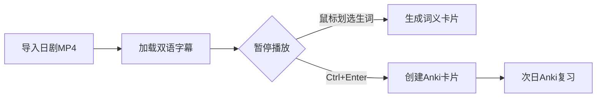

<small>有趣！边看视频边学日语的视频播放器</small>


### **Memento - 日语学习专用视频播放器深度解析**

---

#### **1. 软件简介**  
Memento 是一款基于 **mpv 播放器**构建的开源工具，专为日语学习者设计。该项目巧妙融合视频播放与语言学习功能，支持通过影视内容进行**语法分析**、**生词捕捉**和**记忆卡片制作**，已获 Arch Linux AUR 和 Flathub 官方仓库收录。

---

#### **2. 核心功能亮点**  
**▎智能化学习工具**  
- **语法感知字幕搜索**：自动识别字幕中的语法结构，支持正则表达式高级检索  
- **Yomichan式汉字卡片**：鼠标悬停即时生成汉字解析卡片（含笔顺动画）  
- **Anki无缝集成**：通过 AnkiConnect 一键生成记忆卡片，支持音频/截图嵌入  

**▎多语言支持**  
- 内置 **9 国语言词典**：  
  - JMdict（日英/日法/日德等）  
  - KANJIDIC（汉字多语种解析）  
  - 日本姓名库（JMnedict）  
  - 俚语词典（KireiCake）  

**▎高级扩展能力**  
- **OCR图像识别**：通过 manga-ocr 实现屏幕文字提取（需 Python 环境）  
- **mpv 生态兼容**：支持 4K 增强滤镜、自定义脚本（如 autosub 自动下载字幕）  
- **云端视频流播放**：集成 yt-dlp 引擎，可直接播放 YouTube/Bilibili 等平台内容  

---

#### **3. 快速入门指南**  
**▎跨平台安装方案**  
| 平台       | 推荐方式                          | 命令/操作                             |
|------------|-----------------------------------|---------------------------------------|
| **Linux**  | Flathub 一键安装                  | `flatpak install flathub io.github.ripose_jp.Memento` |
| **Windows**| 官方便携版                        | [下载最新Release](https://github.com/ripose-jp/Memento/releases) |
| **macOS**  | Homebrew 编译                     | `brew install qt6 mpv mecab && make` |

**▎必备组件配置**  
1. **词典安装**：  
   - 下载 [JMdict英语版](https://github.com/themoeway/jmdict-yomitan/releases)  
   - 拖放 .zip 文件至软件词典管理界面  

2. **Anki联动**：  
   - 安装 [AnkiConnect 插件](https://ankiweb.net/shared/info/2055492159)  
   - 在 Memento 设置中填入 Anki 端口（默认 8765）  

**▎基础工作流演示**  


---

#### **4. 高级技巧**  
**▎硬件加速配置**  
修改 `~/.config/memento/mpv.conf`：  
```properties
vo=gpu
gpu-api=vulkan
hwdec=vaapi-copy
```

**▎笔顺动画激活**  
1. 下载 [Kanji Stroke Order 字体](https://drive.google.com/uc?export=download&id=1oyQoTB531tbhlYaOW7ugvutXZ7HSlJfW)  
2. 在界面设置中指定字体路径  

**▎跨平台同步方案**  
```bash
# 使用符号链接同步配置
ln -s /cloud/memento ~/.config/memento
```

---

#### **5. 故障排查锦囊**  
| 现象                     | 解决方案                          |
|--------------------------|-----------------------------------|
| 字幕重叠显示异常         | 禁用 "Hide mpv subtitles" 选项    |
| Anki卡片无图片           | Flatpak用户需通过 Flatseal 授权/tmp目录访问 |
| macOS提示MeCab初始化失败 | 将App移动到无空格的路径（如/Applications） |

---

**项目优势**：开源生态整合度高（mpv+Anki+Yomichan），适合通过**沉浸式观影**提升日语能力的学习者。支持 Windows/macOS/Linux 全平台，日均开发活跃度保持 3+ commits，社区响应迅速。