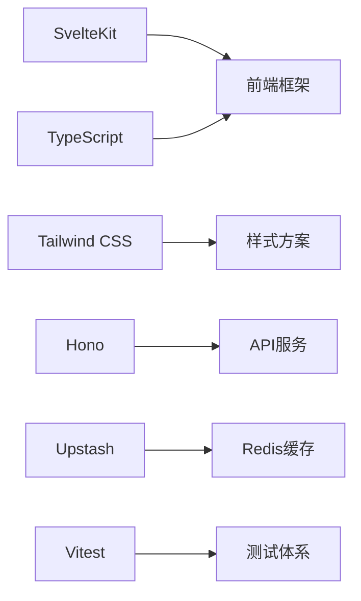

<small>3.5K star，开源SVG图标库，设计师与开发者的高效利器</small>


🌟 **SVGL：**  

---

### **一、项目简介**  
SVGL 是一个开源的SVG图标集合项目，专注于为开发者与设计师提供**高质量、可定制、多场景适用**的品牌Logo资源。通过简洁的API和丰富的扩展生态，SVGL已成为构建现代Web应用的图标解决方案新宠。  

🔗 官网体验：[https://svgl.app](https://svgl.app)  
🚀 GitHub仓库：[https://github.com/pheralb/svgl](https://github.com/pheralb/svgl)  

---

### **二、核心功能亮点**  

#### **1. 全场景图标支持**  
- **多形态适配**：单图标、文字组合、暗黑模式多版本  
- **品牌规范集成**：直接跳转品牌官方设计指南  
- **快速检索**：50+分类标签精准过滤（科技、设计、社交等）  

#### **2. 开发者友好设计**  
```javascript
// 直接调用API获取图标
fetch('https://svgl.app/api/logo/svelte')
  .then(res => res.text())
  .then(svg => document.body.innerHTML = svg)
```
- **CDN直链**：无需下载即时调用  
- **动态配色**：CSS变量控制图标颜色  
- **轻量化设计**：单图标体积<20KB  

#### **3. 生态扩展丰富**  
| 插件平台      | 功能描述                     | 使用场景               |
|---------------|------------------------------|------------------------|
| Figma插件     | 直接在设计中插入SVG图标      | UI设计稿制作           |
| VS Code扩展   | 代码编辑器中快速搜索图标     | 前端开发               |
| Raycast插件   | 系统级快速调用               | 日常办公效率工具       |
| CLI工具       | 终端一键下载图标             | 自动化脚本集成         |

---

### **三、5分钟快速入门**  

#### **1. 提交新图标**  
```bash
# 克隆项目
git clone https://github.com/your_username/svgl.git
cd svgl

# 安装依赖
pnpm install

# 添加SVG文件至 static/library/
cp ~/Downloads/logo.svg static/library/

# 更新图标索引文件
vim src/data/svgs.ts  # 按规范添加图标元数据
```

#### **2. 本地开发调试**  
```bash
pnpm dev  # 启动本地服务
# 访问 http://localhost:5173 预览
```

#### **3. 图标使用示例**  
```html
<!-- 直接引用CDN -->


<!-- 暗黑模式自适应 -->

```

---

### **四、技术栈亮点**  


- **构建速度**：冷启动<800ms  
- **包体积**：gzip后<150KB  
- **测试覆盖**：核心功能100%用例覆盖  

---

### **五、贡献与生态**  
- **图标提交规范**：  
  ✅ 必须优化SVG（推荐使用SVGOMG）  
  ✅ 包含viewBox属性  
  ✅ 通过PNP提交Pull Request  

- **明星扩展推荐**：  
  🔌 [Figma插件](https://www.figma.com/community/plugin/1320306989350693206/svgl) 设计稿直插图标  
  ⌨️ [Raycast扩展](https://www.raycast.com/1weiho/svgl) 全局快速搜索  


让SVGL成为您的创意加速器！🚀