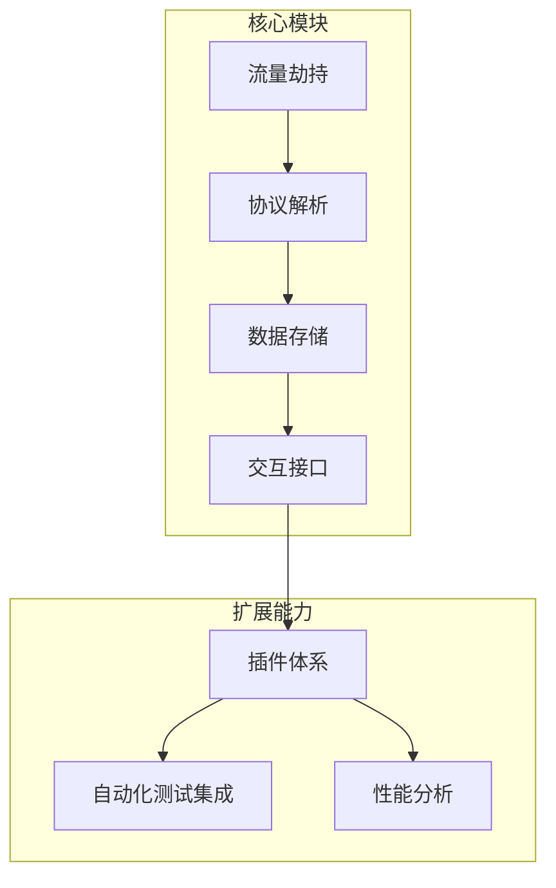

<small>很强！小工具推荐，http调试利器</small>


🔍 **HTTP调试新利器：揭秘httpdbg的高效调试哲学**  

---

### **一、工具定位：重新定义HTTP调试体验**  
在API经济主导的今天，开发者在接口调试中常面临三大痛点：**抓包配置复杂**、**数据解析低效**、**环境依赖冗余**。httpdbg作为一款Python HTTP调试库，以「**零配置、全链路、可编程**」为核心设计理念，为开发者提供开箱即用的调试解决方案。  

🔗 GitHub地址：[https://github.com/cle-b/httpdbg](https://github.com/cle-b/httpdbg)  

---

### **二、核心功能亮点**  

#### **1. 全协议透明化监控**  
- 支持HTTP/HTTPS全流量捕获（无需SSL证书导入）  
- 自动解码application/json、multipart/form-data等格式  
- 实时显示请求头、响应体、状态码的关联关系  

#### **2. 多框架无缝集成**  
```python
# 示例：一键监听FastAPI请求
from httpdbg import init_hooks, WebInterface
init_hooks()
web = WebInterface()
web.start()

from fastapi import FastAPI
app = FastAPI()

@app.get("/")
def read_root():
    return {"Hello": "World"}
```
- 兼容Requests、aiohttp、FastAPI等主流库  
- 非侵入式设计，三行代码完成接入  

#### **3. 交互式调试控制台**  
```bash
# 启动Web控制台
httpdbg-web
```
- 可视化展示请求时序图  
- 支持请求重放与Mock响应配置  
- 提供curl命令快速导出功能  

---

### **三、技术架构解析**  


- **Hook机制**：通过猴子补丁动态注入监控逻辑  
- **异步处理**：基于asyncio实现高并发流量处理  
- **存储优化**：环形缓冲区管理，防止内存溢出  

---

### **四、对比传统方案**  
| **能力维度**      | **Charles/Fiddler** | **mitmproxy** | **httpdbg**          |  
|-------------------|---------------------|---------------|----------------------|  
| **环境依赖**      | 独立代理服务        | Python环境    | 纯Python依赖         |  
| **HTTPS支持**     | 需安装证书          | 需配置CA      | 自动TLS解密          |  
| **自动化集成**    | 有限                | 中等          | 原生支持pytest       |  
| **资源消耗**      | 100MB+内存          | 50MB+内存     | <10MB内存            |  

---

### **五、典型应用场景**  

#### **场景1：微服务链路追踪**  
```python
# 在分布式系统中标记请求ID
with httpdbg.record(trace_id="req_123") as records:
    service_a.call()
    service_b.call()
print(records.to_dict())  # 输出完整调用链
```

#### **场景2：爬虫逆向工程**  
- 自动解析AJAX动态加载数据  
- 批量导出请求签名供Scrapy使用  

#### **场景3：CI/CD自动化验证**  
```yaml
# GitLab CI示例
test:
  script:
    - pip install httpdbg
    - pytest --httpdbg-save=report.json
  artifacts:
    paths:
      - report.json
```

---

### **六、进阶使用技巧**  
1. **智能过滤**：通过正则表达式聚焦关键请求  
   ```python
   httpdbg.init_hooks(filters=[r"/api/v1/.*"])
   ```  
2. **性能分析**：统计接口响应时间百分位  
3. **插件开发**：自定义数据持久化模块（支持MongoDB/Elasticsearch）  

---

### **七、生态与未来**  
- **企业版计划**：集群监控、流量回放等高级功能  
- **社区贡献**：新增gRPC/WebSocket协议支持（开发中）  
- **IDE插件**：VSCode/ PyCharm扩展开发路线图  

---

**立即体验**：  
```bash
pip install httpdbg
httpdbg-web --port 8080
```  
打开浏览器访问`http://localhost:8080`，开启高效调试之旅。无论是API开发还是爬虫编写，httpdbg让HTTP调试变得**简单、透明、强大**。